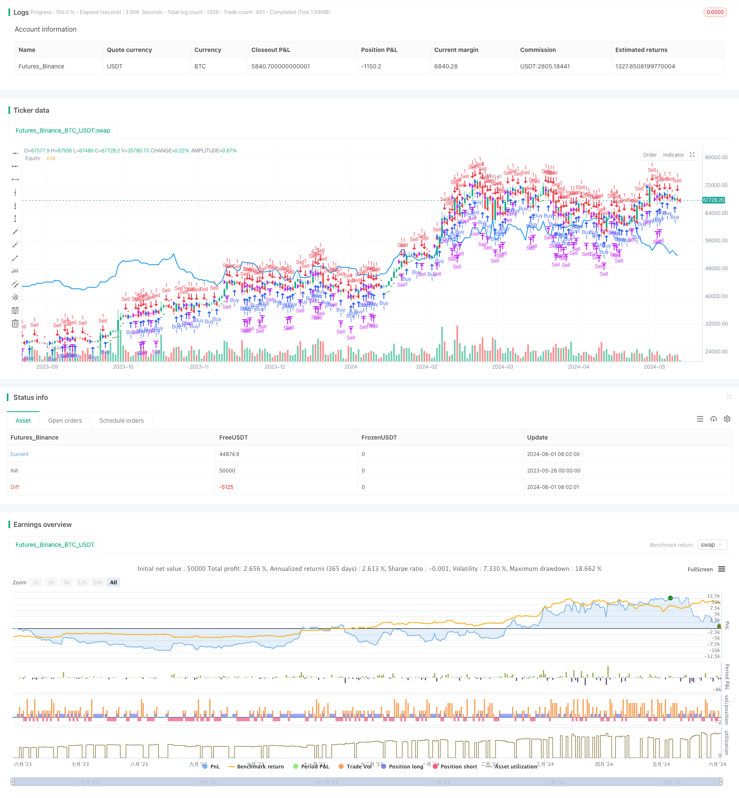

> Name

Percentage-Threshold-Quantitative-Trading-Strategy
> Author

ChaoZhang

> Strategy Description


[trans]
#### Overview
This article introduces a quantitative trading strategy based on percentage thresholds. This strategy determines when to buy and sell by setting a percentage threshold and selecting an appropriate time period. A buy or sell signal is triggered when the price rises or falls by more than a specified percentage threshold relative to the previous close. This strategy can be flexibly adjusted according to the user's risk preference and market conditions, and is suitable for trading in various financial instruments.
#### Strategy Principle
The core of this strategy is to generate trading signals based on the percentage of price movement. First, the user needs to set a percentage threshold that represents the extent of the price change relative to the previous closing price. At the same time, the user also needs to select a time period, such as 1 minute, 1 hour, 1 day, etc., to calculate the highest price, lowest price and closing price within that time period. The strategy will monitor market prices in real time. When the highest price in the current time period exceeds the previous closing price plus the threshold, a buy signal will be triggered; when the lowest price in the current time period is lower than the previous closing price minus the threshold, a sell signal will be triggered. If a sell signal is triggered while a long position is held, the strategy will close the long position; if a buy signal is triggered while a short position is held, the strategy will close the short position. In this way, the strategy can make timely trades during large price fluctuations for potential profits.
#### Strategic Advantages
1. Simple and easy to use: This strategy only needs to set two parameters, namely the percentage threshold and the time period, to automatically generate trading signals and is simple to operate.
2. High flexibility: Users can adjust the percentage threshold and time period according to their own risk preferences and market characteristics to adapt to different trading environments.
3. Wide scope of application: This strategy can be applied to various financial instruments, such as stocks, futures, foreign exchange, etc., and can be traded as long as price data is available.
4. Intuitive and clear: The strategy will directly mark the buy and sell signals on the chart and draw the capital curve, allowing traders to intuitively evaluate the performance of the strategy.
#### Strategy Risk
1. Market fluctuation risk: When market prices fluctuate violently, frequent transactions may lead to higher transaction costs and slippage, affecting the returns of the strategy.
2. Parameter setting risk: Improper percentage threshold and time period settings may lead to poor strategy performance, so adjustments need to be made based on market characteristics and personal experience.
3. Overfitting risk: If the strategy parameters are too optimized, it may cause the strategy to perform poorly in future market environments, so sufficient backtesting and forward-looking analysis are required.
#### Strategy optimization direction
1. Add stop-loss and take-profit mechanisms: In order to control risks, you can add stop-loss and take-profit functions to the strategy. When the price reaches the preset stop-loss or take-profit price, the position will be automatically closed to protect the safety of funds.
2. Dynamically adjust parameters: The percentage threshold and time period can be dynamically adjusted according to changes in market volatility to adapt to different market conditions. For example, when market volatility intensifies, the threshold can be appropriately raised to reduce the frequency of transactions.
3. Combine with other technical indicators: Combine this strategy with other technical indicators (such as moving averages, relative strength indicators, etc.) to form a more robust trading system and improve the reliability of the strategy.
#### Summary
This article introduces a quantitative trading strategy based on percentage thresholds, which automatically generates buy and sell signals by setting the percentage threshold and time period of price changes. This strategy is simple to operate, highly flexible, and has a wide range of applications, but it also faces risks such as market fluctuations, parameter settings, and over-fitting. By adding stop-loss and take-profit mechanisms, dynamically adjusting parameters, and combining other technical indicators, the performance of this strategy can be further optimized and its effectiveness in actual transactions improved.
|| 

#### Overview
This article introduces a quantitative trading strategy based on a percentage threshold. The strategy determines the timing of buying and selling by setting a percentage threshold and selecting an appropriate time period. When the price rises or falls above or below the specified percentage threshold relative to the previous closing price, it triggers a buy or sell signal. This strategy can be flexibly adjusted according to the user's risk preferences and market conditions, and is suitable for trading various financial instruments.

#### Strategy Principle
The core of this strategy is to generate trading signals based on the percentage change in price. First, the user needs to set a percentage threshold, which represents the magnitude of price change relative to the previous closing price. At the same time, the user also needs to choose a time period, such as 1 minute, 1 hour, 1 day, etc., to calculate the high, low, and closing prices within that time frame. The strategy monitors market prices in real-time. When the highest price of the current time period exceeds the previous closing price plus the threshold, it triggers a buy signal; when the lowest price of the current time period falls below the previous closing price minus the threshold, it triggers a sell signal. If a sell signal is triggered while holding a long position, the strategy closes the long position; if a buy signal is triggered while holding a short position, the strategy closes the short position. In this way, the strategy can make timely trades when price fluctuations are large to capture potential profits.

#### Strategy Advantages
1. Simple and easy to use: The strategy only requires setting two parameters, the percentage threshold and time period, to automatically generate trading signals, making it easy to operate.
2. High flexibility: Users can adjust the percentage threshold and time period according to their risk preferences and market characteristics to adapt to different trading environments.
3. Wide applicability: The strategy can be applied to various financial instruments, such as stocks, futures, and foreign exchange, as long as price data is available for trading.
4. Intuitive and clear: The strategy directly marks buy and sell signals on the chart and plots the equity curve, allowing traders to visually assess the strategy's performance.

#### Strategy Risks
1. Market volatility risk: When market prices fluctuate dramatically, frequent trading may lead to high transaction costs and slippage, affecting the strategy's profitability.
2. Parameter setting risk: Improper settings of the percentage threshold and time period may result in poor strategy performance, requiring adjustments based on market characteristics and personal experience.
3. Overfitting risk: If the strategy parameters are overly optimized, it may lead to poor performance in future market environments, requiring thorough backtesting and forward-looking analysis.

#### Strategy Optimization Directions
1. Incorporate stop-loss and take-profit mechanisms: To control risk, stop-loss and take-profit functions can be added to the strategy, automatically closing positions when prices reach preset stop-loss or take-profit levels to protect capital safety.
2. Dynamically adjust parameters: The percentage threshold and time period can be dynamically adjusted based on changes in market volatility to adapt to different market states. For example, appropriately raising the threshold when market volatility intensifies to reduce trading frequency.
3. Combine with other technical indicators: Combining this strategy with other technical indicators (such as moving averages, relative strength index, etc.) to form a more robust trading system and improve the strategy's reliability.

#### Summary
This article introduces a quantitative trading strategy based on a percentage threshold, which automatically generates buy and sell signals by setting a percentage threshold for price changes and a time period. The strategy is simple to operate, highly flexible, and widely applicable, but also faces risks such as market volatility, parameter settings, and overfitting. By incorporating stop-loss and take-profit mechanisms, dynamically adjusting parameters, and combining with other technical indicators, the strategy's performance can be further optimized to enhance its effectiveness in actual trading.
[/trans]


> Source (PineScript)

``` pinescript
/*backtest
start: 2023-05-28 00:00:00
end: 2024-06-02 00:00:00
period: 1d
basePeriod: 1h
exchanges: [{"eid":"Futures_Binance","currency":"BTC_USDT"}]
*/

//@version=5
strategy("GBS Percentage", overlay=true)

// Define input options for percentage settings and timeframe
percentage = input.float(1.04, title="Percentage Threshold", minval=0.01, step=0.01) / 100
timeframe = input.timeframe("D", title="Timeframe", options=["1", "3", "5", "15", "30", "60", "240", "D", "W", "M"])

// Calculate high, low, and close of the selected timeframe
high_timeframe = request.security(syminfo.tickerid, timeframe, high)
low_timeframe = request.security(syminfo.tickerid, timeframe, low)
close_timeframe = request.security(syminfo.tickerid, timeframe, close)

// Calculate the percentage threshold based on the previous close
threshold = close_timeframe[1] * percentage

// Define conditions for Buy and Sell
buyCondition = high_timeframe > (close_timeframe[1] + threshold)
sellCondition = low_timeframe < (close_timeframe[1] - threshold)

// Entry and exit rules
if (buyCondition)
    strategy.entry("Buy", strategy.long)

if (sellCondition)
    strategy.entry("Sell", strategy.short)

// Close the positions based on the conditions
if (sellCondition)
    strategy.close("Buy")

if (buyCondition)
    strategy.close("Sell")

// Plot Buy and Sell signals on the chart
plotshape(series=buyCondition, title="Buy Entry", color=color.green, style=shape.triangleup, location=location.belowbar)
plotshape(series=sellCondition, title="Sell Entry", color=color.red, style=shape.triangledown, location=location.abovebar)

// Plot the equity curve of the strategy
plot(strategy.equity, title="Equity", color=color.blue, linewidth=2)

```

> Detail

https://www.fmz.com/strategy/453276

> Last Modified

2024-06-03 16:41:59
