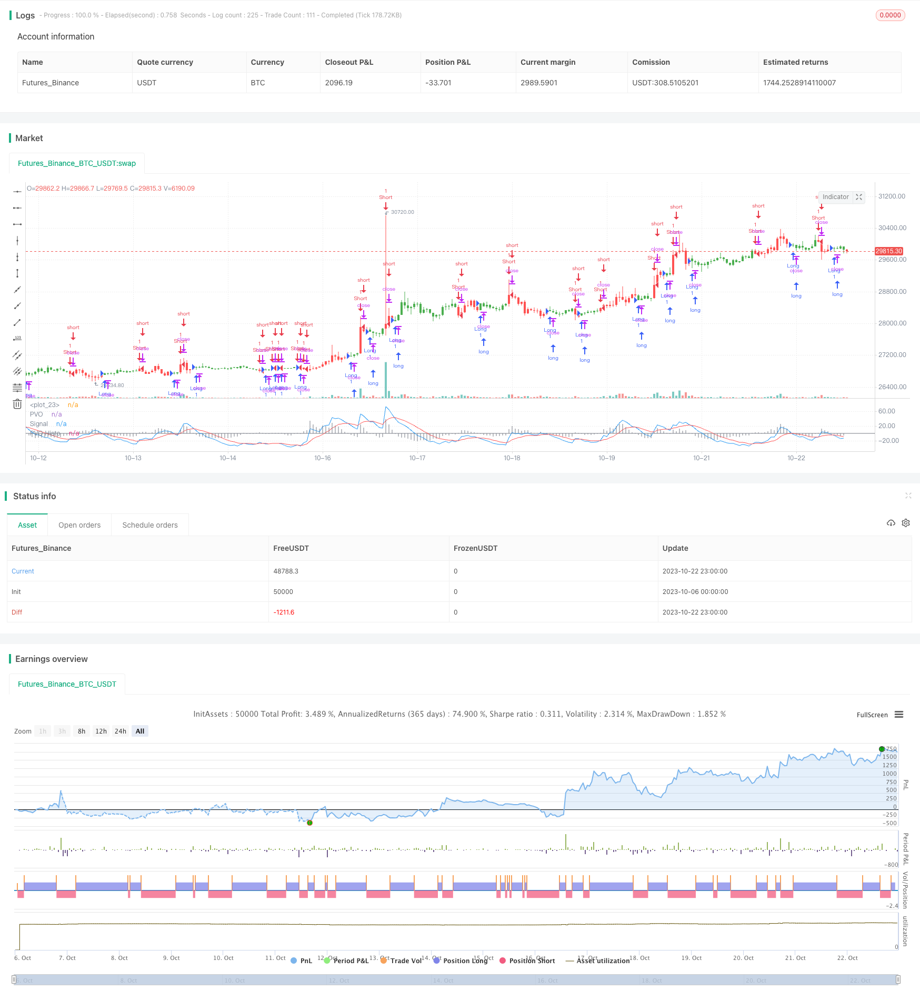

> Name

Percentage-Volume-Oscillator-Strategy
> Author

ChaoZhang

> Strategy Description



[trans]

Overview:
The Percent Volume Oscillator (PVO) is a momentum oscillator for trading volume. PVO measures changes in volume trends by calculating the percentage difference between the volume exponential moving averages for two different periods. This strategy uses the PVO indicator to discover trends in trading volume to confirm or deny price movements. Typically, breakouts or support breakdowns are more effective when PVO is positive or rising.
Strategy principle:
1. Calculate short-term trading volume EMA (default 12 days)
2. Calculate long-term trading volume EMA (default 26 days)
3. Calculate the percentage difference between the short-term EMA and the long-term EMA as PVO
4. Calculate PVO’s signal line EMA (default 9 days)
5. Calculate the difference between PVO and signal line as a histogram
6. Go short when the signal line crosses the PVO line, and go long when it crosses below.
7. Optional reverse transaction
8. Draw different colors for K lines that match the trading signal
This strategy uses a combination of double EMA to form a PVO indicator, and then combines it with the signal line to discover the trend of trading volume and guide the price trading direction. Different from ordinary double EMA, PVO focuses more on the difference percentage of trading volume and can more clearly judge the increase or decrease in trading volume.
Advantage analysis:
1. Using changes in trading volume to judge future price trends has a certain blocking effect
2. The double EMA structure is simple and practical, and the parameter adjustment is flexible
3. Visualize the K-line color to intuitively judge the trend, easy to operate
4. Combined with signal lines to reduce false signals and improve stability
5. You can choose reverse trading to enrich the application of strategies.
6. Suitable for medium and long-term trends and short-term operations
This strategy makes full use of the prompting effect of changes in trading volume on price trends. Compared with a single indicator, the PVO structure is more stable, and a combination of parameters can be customized to judge changes in trading volume trends, thereby detecting the possible direction of price changes in advance. The intuitive K-line color distinction strengthens trend judgment, and reverse trading can be selected as needed. It is a universal and practical trading volume strategy.
Risk analysis:
1. The trading volume indicator lags behind the price signal, and divergence may occur.
2. Improper setting of EMA parameters may misjudge the market status.
3. You need to be cautious when doing reverse trading, as losses may increase
4. It is impossible to determine the specific entry point based on changes in trading volume.
5. Trading volume may not necessarily predict price 100% and needs to be combined with other indicators.
Changes in trading volume often lag behind price trends. When prices enter the end of a trend, PVO may send out wrong signals. Improper parameter settings will also affect the judgment effect. Be cautious when trading in the opposite direction as the trend may continue. It is difficult to judge the specific entry timing based on trading volume, and other indicators need to be assisted for precise operation. Trading volume indicators cannot predict prices 100%, so you still need to follow orders carefully.
Strategy optimization direction:
1. Optimize EMA cycle parameters to adapt to different varieties and cycles
2. Add filter conditions to avoid invalid signals
3. Combine with other indicators to confirm entry timing
4. Add stop loss bar
You can test and optimize EMA parameter combinations to find the best period to determine the buying and selling trend. You can set trading volume fluctuation range conditions and filter out invalid signals. MACD, KD and other indicators can be introduced to further confirm the specific entry point. You can also set a stop loss line to control a single loss. This will greatly improve the practicality of the strategy.
Summarize:
The volume percentage oscillator strategy determines the trend of trading volume by calculating the percentage difference from the moving average of the volume index to discover possible future price trends. This strategy uses a simple and effective double EMA structure to measure trading volume fluctuations, and uses intuitive K-line colors to enhance the visual effect. You can choose reverse trading according to your needs, and the parameter settings are flexible. It is suitable for both medium and long-term as well as short-term. It is a very practical strategy tool based on trading volume. However, the trading volume indicator has a certain lag to the price signal and cannot determine the timing of entry. Therefore, it is necessary to optimize parameter settings and assist other indicators to improve the strategy effect.
||

Overview:

The Percentage Volume Oscillator (PVO) is a momentum oscillator for volume. PVO measures the difference between two volume-based moving averages as a percentage of the larger moving average to gauge shifts in volume trends. This strategy uses PVO to identify volume trends to confirm or refute price action. Typically, a breakout or support break is validated when PVO is rising or positive.

Strategy Logic:

1. Calculate short period volume EMA (default 12 days)  
2. Calculate long period volume EMA (default 26 days)
3. Calculate PVO as the percentage difference between short and long EMA
4. Calculate signal line EMA on PVO (default 9 days) 
5. Calculate histogram as difference between PVO and signal line
6. Go short when signal line crosses above PVO, go long when crosses below
7. Option to reverse trade direction
8. Color bars based on signal

The strategy forms PVO indicator through double EMA composition and uses signal line to identify volume trend changes to anticipate potential price direction. Unlike regular double EMA, PVO focuses more on volume percentage difference for clearer judgement of volume increase/decrease.

Advantages:

1. Utilize volume changes to determine future price trends as early warning
2. Simple and practical double EMA structure with flexible parameter tuning
3. Visualized color bars for intuitive trend judgement and easy operation
4. Signal line reduces false signals and improves stability
5. Optional reverse trading enriches strategy usage
6. Applicable for mid-to-long term trends and short term trading

The strategy fully utilizes the indicative effect of volume changes on price action. Compared to single indicator, the PVO structure is more stable with customizable parameters to judge volume trend changes and detect potential price direction in advance. The intuitive color differentiation strengthens trend decision and reverse trading option makes it a versatile volume based strategy.

Risks:

1. Volume indicator lags price signal and may diverge 
2. Improper EMA parameter setting may misjudge market state
3. Reverse trading needs caution, can increase loss
4. Volume change alone cannot determine specific entry point 
5. Volume does not fully predict price, needs combining with other indicators

Volume change often lags price action and PVO may give wrong signal when price approaches trend end. Wrong parameter settings can also affect judgement accuracy. Caution is needed when reverse trading, as trend may extend. Volume alone cannot determine precise entry point and needs aid of other indicators for timing. Volume does not fully predict price and needs prudent following.

Optimization:

1. Optimize EMA periods for different products and timeframes
2. Add filter conditions to avoid invalid signals
3. Combine other indicators to confirm entry timing  
4. Add stop loss

Testing and optimizing EMA combinations to find best periods for trend detection. Adding volume fluctuation threshold to filter ineffective signals. Incorporating MACD, KD for further entry confirmation. Setting stop loss to control single trade loss. These will greatly improve strategy applicability.

Conclusion:

The Percentage Volume Oscillator strategy judges volume trend changes by calculating the percentage difference between volume EMAs to anticipate potential price direction. It adopts simple and effective double EMA structure to measure volume fluctuations and uses intuitive color coding to enhance visual effect. The flexible reverse trading option and parameter settings make it suitable for both mid-to-long term and short term trading. But as volume indicator lags price signal and cannot determine precise entry timing, parameters and incorporation of other indicators need optimization to improve strategy performance.

[/trans]

> Strategy Arguments


|Argument|Default|Description|
|----|----|----|
|v_input_1|12|LengthShortEMA|
|v_input_2|26|LengthLongEMA|
|v_input_3|9|LengthSignalEMA|
|v_input_4|false|Trade reverse|


> Source (PineScript)

``` pinescript
/*backtest
start: 2023-10-06 00:00:00
end: 2023-10-23 00:00:00
period: 1h
basePeriod: 15m
exchanges: [{"eid":"Futures_Binance","currency":"BTC_USDT"}]
*/

//@version=2
////////////////////////////////////////////////////////////
//  Copyright by HPotter v1.0 27/09/2017
// The Percentage Volume Oscillator (PVO) is a momentum oscillator for volume. 
// PVO measures the difference between two volume-based moving averages as a 
// percentage of the larger moving average. As with MACD and the Percentage Price 
// Oscillator (PPO), it is shown with a signal line, a histogram and a centerline. 
// PVO is positive when the shorter volume EMA is above the longer volume EMA and 
// negative when the shorter volume EMA is below. This indicator can be used to define 
// the ups and downs for volume, which can then be use to confirm or refute other signals. 
// Typically, a breakout or support break is validated when PVO is rising or positive. 
//
// You can change long to short in the Input Settings
// WARNING:
// - For purpose educate only
// - This script to change bars colors.
////////////////////////////////////////////////////////////
strategy(title="Percentage Volume Oscillator (PVO)", shorttitle="PVO")
LengthShortEMA = input(12, minval=1)
LengthLongEMA = input(26, minval=1)
LengthSignalEMA = input(9, minval=1)
reverse = input(false, title="Trade reverse")
hline(0, color=gray, linestyle=line)
xShortEMA = ema(volume , LengthShortEMA)
xLongEMA = ema(volume , LengthLongEMA)
xPVO = ((xShortEMA - xLongEMA) / xLongEMA) * 100
xSignalEMA = ema(xPVO , LengthSignalEMA)
xPVOHisto = xPVO - xSignalEMA
pos = iff(xSignalEMA < xPVO, -1,
	   iff(xSignalEMA > xPVO, 1, nz(pos[1], 0))) 
possig = iff(reverse and pos == 1, -1,
          iff(reverse and pos == -1, 1, pos))	   
if (possig == 1) 
    strategy.entry("Long", strategy.long)
if (possig == -1)
    strategy.entry("Short", strategy.short)	   	    
barcolor(possig == -1 ? red: possig == 1 ? green : blue ) 
plot(xPVO, color=blue, title="PVO")
plot(xSignalEMA, color=red, title="Signal")
plot(xPVOHisto, color=gray, title="PVO Histo", style=histogram)
```

> Detail

https://www.fmz.com/strategy/431266

> Last Modified

2023-11-06 15:45:02
