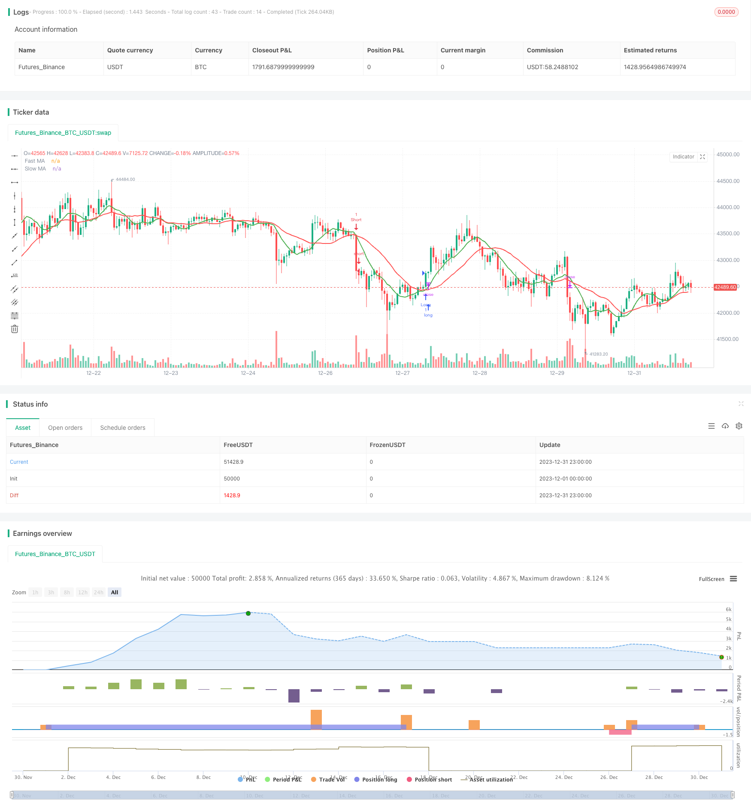

> Name

Pete-Wave-Trading-System-Strategy
> Author

ChaoZhang

> Strategy Description


 [trans]

Pete Wave Trading System Strategy Overview
The Pete Wave Trading System strategy uses fast and slow moving averages of price to construct trading signals, combined with additional filters and stop-loss mechanisms for further optimization. This strategy aims to capture short- to medium-term trends and generate buy and sell signals through price average crossovers. The code also includes mechanisms such as breakthrough confirmation filters, K-line entity filters, ATR filters, callback filters, etc. to avoid false breakthroughs. Overall, this strategy combines the advantages of trend following and breakout trading, and can effectively capture the trend direction after consolidation.

Pete Wave Trading System Strategy Principles
This strategy uses the fast moving average (length 9) and the slow moving average (length 22) to construct trading signals of golden cross (fast line crossing the slow line) and dead cross (fast line crossing the slow line below). When the fast line crosses the slow line from below, a buy signal is generated; when the fast line crosses the slow line from above, a sell signal is generated.
In order to avoid false breakthroughs caused by price shocks, an additional filtering mechanism is added to the code. This includes the K-line entity filter, which requires the K-line entity percentage fluctuation to be greater than 0.5% to generate a signal; the callback filter, which determines whether the price has a certain degree of correction when the fast line and the price line cross to confirm the trend; the ATR value filter, which requires the ATR to be greater than 0.5 to prove that the fluctuation is enough to generate a signal.
After the signal is generated, if the breakthrough confirmation filter is turned on, it will also be judged whether the current closing price breaks through the highest price or lowest price of the previous N K lines to confirm the breakthrough. Finally, this strategy uses a slippage stop-loss mechanism to lock in profits, and the stop-loss position will be moved based on a certain percentage of the average position price.

Analysis of the strategic advantages of Pete’s Wave Trading System
This strategy integrates the advantages of moving average trading and trend following, and can effectively identify the direction of short- and medium-term price trends. Compared with a single moving average crossover system, combining additional filters can significantly reduce the probability of false signals. The specific advantages are as follows:
1. Combine moving average crossovers with trend tracking to avoid being trapped by volatile market conditions.
2. The callback filter and breakthrough confirmation mechanism can avoid false breakthroughs.
3. ATR value and K-line entity filter help identify real fluctuations.
4. The slippage stop loss mechanism can effectively control single losses.

Pitt Wave Trading System Strategy Risk Analysis
This strategy mainly faces the following risks:
1. Market emergencies cause stop loss to be hit. The stop loss distance can be appropriately relaxed.
2. The position was held for too long and the profit was not taken in time. The moving average period can be shortened.
3. During the period of calm market conditions, trading signals are reduced. The filtering standard can be appropriately lowered.
4. Improper parameter optimization, resulting in too frequent or infrequent transactions. Parameters need to be tested repeatedly.

Pete Wave Trading System Strategy Optimization Direction
This strategy can be optimized from the following directions:
1. Test parameters separately according to different trading varieties, and optimize parameters such as the moving average cycle.
2. Try to add more indicators, such as Bollinger Bands, RSI, etc. to determine the trend direction.
3. Test the parameters of the stop loss mechanism and find the optimal stop loss ratio.
4. Try methods such as machine learning to automatically generate buy and sell signals.
5. Optimize the signal filtering logic and reduce the probability of false signals.
6. Combine judgment with different time periods to discover more trading opportunities.

Pete Wave Trading System Strategy Summary
The Pete Wave trading system strategy comprehensively uses moving average crossover, trend following, additional filters and other methods to build a relatively stable and reliable medium and short-term trading strategy. Compared with a single technical indicator, this strategy can significantly reduce noise trading caused by price shocks. The added filtering mechanism also avoids the risk of false breakthroughs. Through parameter testing and rule optimization, this strategy can become a powerful tool for short-term intraday trading. Generally speaking, the Pitt Wave trading system strategy has high stability and is suitable for capturing clear mid- and short-term price trends. It is a quantitative strategy worthy of real-time verification.
|| 


Pete Wave Trading System Strategy Overview

The Pete Wave trading system strategy uses fast and slow moving average lines of price to construct trading signals, together with additional filters and stop loss mechanisms to further optimize. The strategy aims to capture medium-term trends by generating buy and sell signals from price average line crossovers. The code also contains breakout confirmation filters, candle body filters, ATR filters, pullback filters and other mechanisms to avoid false breakouts. Overall, the strategy combines the advantages of trend following and breakout trading to effectively capture the trend direction after consolidation.


Pete Wave Trading System Strategy Principles 

The strategy uses a fast moving average line (length 9) and a slow moving average line (length 22) to construct golden crossovers (fast line breaking through slow line from below) and death crossovers (fast line breaking through slow line from above) trading signals. A buy signal is generated when the fast line crosses above the slow line, and a sell signal is generated when the fast line crosses below the slow line.

To avoid false breakouts caused by price fluctuations, additional filter mechanisms are added to the code. These include candle body filters that require candle body percentage fluctuations to be greater than 0.5% before generating a signal; pullback filters that check if the price has pulled back a certain amplitude when the fast line and price line crossover to confirm the trend; ATR value filters that require ATRs greater than 0.5 to prove sufficient fluctuation to generate signals.

After the signal is generated, if the breakout confirmation filter is enabled, it will also determine whether the current closing price breaks through the highest or lowest price of the previous N candlesticks to confirm the breakout. Finally, the strategy locks in profits through a trailing stop loss mechanism, which moves the stop loss position based on a certain percentage of the average holding price.


Pete Wave Trading System Strategy Advantages Analysis  

The strategy integrates the advantages of moving average trading and trend tracking, and can effectively identify the direction of medium-term price trends. Compared to a single moving average crossover system, combining additional filters can greatly reduce the probability of false signals. Specific advantages are as follows:

1. The combination of moving average crossovers and trend tracking avoids getting caught in volatile markets.

2. Pullback filters and breakout confirmation mechanisms avoid false breakouts.  

3. ATR values and candle body filters help identify real fluctuations.

4. The trailing stop loss mechanism can effectively control single trade losses.


Pete Wave Trading System Strategy Risk Analysis

The main risks faced by this strategy are:

1. Sudden market events may trigger stop loss exits. The stop loss distance can be appropriately relaxed.

2. Holding positions for too long without timely profit taking. Shorten the moving average cycle.  

3. Quiet market conditions lead to reduced trading signals. Filter standards can be appropriately lowered. 

4. Improper parameter optimization results in too frequent or too few trades. Parameters need repeated testing.


Pete Wave Trading System Strategy Optimization Directions

The strategy can be optimized in the following directions:

1. Test parameters separately for different trading varieties, optimize moving average periods and other parameters.  

2. Try adding more indicators such as Bollinger Bands, RSI to determine trend direction.

3. Test stop loss mechanism parameters to find the optimal stop loss ratio.  

4. Try machine learning methods to automatically generate buy and sell signals.

5. Optimize signal filtering logic to reduce false signal probabilities.

6. Identify more trading opportunities by combining different time frame judgments.


Pete Wave Trading System Strategy Summary  

The Pete Wave trading system strategy combines moving average crossovers, trend tracking, additional filters and other methods to build a relatively stable and reliable medium-term trading strategy. Compared to a single technical indicator, this strategy can significantly reduce the noise trades caused by price fluctuations. The added filter mechanisms also avoid the risk of false breakouts. Through parameter testing and rule optimization, this strategy can become a powerful tool for intraday trading. Overall, the Pete Wave trading system strategy has high stability, is suitable for capturing relatively clear medium-term price trends, and is a quantitative strategy worth live trading verification.

[/trans]

> Strategy Arguments


|Argument|Default|Description|
|----|----|----|
|v_input_1|9|Fast MA Length|
|v_input_2|22|Slow MA Length|
|v_input_3|14|ATR Length|
|v_input_4|0.5|ATR Filter|
|v_input_5|1.5|Trailing Stop Percentage|
|v_input_6|0.5|Pullback Threshold|
|v_input_7|0.5|Minimum Candle Body Percentage|
|v_input_8|true|Use Breakout Confirmation|


> Source (PineScript)

``` pinescript
/*backtest
start: 2023-12-01 00:00:00
end: 2023-12-31 23:59:59
period: 1h
basePeriod: 15m
exchanges: [{"eid":"Futures_Binance","currency":"BTC_USDT"}]
*/

//@version=5
strategy("9:22 5 MIN 15 MIN BANKNIFTY", overlay=true)

fastLength = input(9, title="Fast MA Length")
slowLength = input(22, title="Slow MA Length")
atrLength = input(14, title="ATR Length")
atrFilter = input(0.5, title="ATR Filter")
trailingStop = input(1.5, title="Trailing Stop Percentage")
pullbackThreshold = input(0.5, title="Pullback Threshold")
minCandleBody = input(0.5, title="Minimum Candle Body Percentage")
breakoutConfirmation = input(true, title="Use Breakout Confirmation")

price = close
mafast = ta.sma(price, fastLength)
maslow = ta.sma(price, slowLength)

atrValue = ta.atr(atrLength)

long_entry = ta.crossover(mafast, maslow) and atrValue > atrFilter
short_entry = ta.crossunder(mafast, maslow) and atrValue > atrFilter

// Pullback Filter
pullbackLong = ta.crossover(price, mafast) and ta.change(price) <= -pullbackThreshold
pullbackShort = ta.crossunder(price, mafast) and ta.change(price) >= pullbackThreshold

// Include pullback condition only if a valid entry signal is present
long_entry := long_entry and (pullbackLong or not ta.crossover(price, mafast))
short_entry := short_entry and (pullbackShort or not ta.crossunder(price, mafast))

// Filter based on candle body size
validLongEntry = long_entry and ta.change(price) > 0 and ta.change(price) >= minCandleBody
validShortEntry = short_entry and ta.change(price) < 0 and ta.change(price) <= -minCandleBody

// Breakout confirmation filter
breakoutLong = breakoutConfirmation ? (close > ta.highest(high, fastLength)[1]) : true
breakoutShort = breakoutConfirmation ? (close < ta.lowest(low, fastLength)[1]) : true

long_entry := validLongEntry and breakoutLong
short_entry := validShortEntry and breakoutShort

if (long_entry)
    strategy.entry("Long", strategy.long)
    strategy.close("Short")
    alert("Long trade iniated")
    
if (short_entry)
    strategy.entry("Short", strategy.short)
    strategy.close("Long")
    alert("Short trade initated")

// Trailing Stop-Loss
long_stop = strategy.position_avg_price * (1 - trailingStop / 100)
short_stop = strategy.position_avg_price * (1 + trailingStop / 100)
strategy.exit("Exit Long", "Long", stop = long_stop)
strategy.exit("Exit Short", "Short", stop = short_stop)

plot(mafast, color=color.green, linewidth=2, title="Fast MA")
plot(maslow, color=color.red, linewidth=2, title="Slow MA")

```

> Detail

https://www.fmz.com/strategy/439988

> Last Modified

2024-01-25 15:36:16
