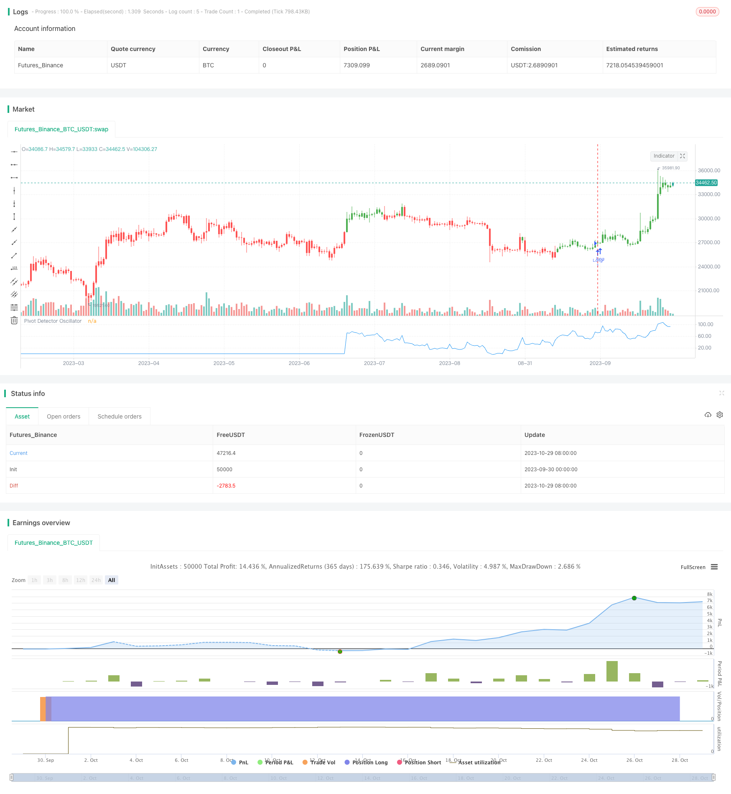

> Name

Trend manipulation strategy based on pivot indicator Pivot-Detector-Oscillator-Trend-Trading-Strategy
> Author

ChaoZhang

> Strategy Description


[trans]

## Overview
This strategy is based on the pivot indicator. It uses the pivot indicator to determine the current trend direction and combines it with the RSI indicator for reverse manipulation to achieve the purpose of tracking the trend.
## Strategy Principle
This strategy uses the SMA moving average and the RSI relative strength indicator to construct a pivot indicator. The specific calculation method is as follows:
1. Calculate N-day SMA moving average
2. Calculate M-day RSI indicator
3. When the closing price is above SMA, pivot indicator = (RSI-35) / (85-35)
4. When the closing price is below the SMA, the pivot indicator = (RSI-20) / (70-20)
5. Determine the trend direction based on the pivot indicator value
   - Pivot indicator >50 is bullish
   - Pivot indicator <50 is bearish
According to the pivot indicator signal, reverse manipulation is performed, that is, shorting when bullish and long when bearish to track the trend direction.
The key to this strategy is to use pivot indicators to determine the direction of the trend and perform reverse manipulation to track the market trend.
## Advantage Analysis
This strategy mainly has the following advantages:
1. Use pivot indicators to determine the trend direction accurately. The pivot indicator comprehensively considers the moving average and RSI indicators, and can more accurately determine the turning point of the trend.
2. Use reverse manipulation strategies to effectively track trends. When a trend reversal occurs, reverse operations should be carried out in a timely manner and follow the trend.
3. RSI parameter settings can adjust strategy sensitivity. The smaller the RSI parameter, the more sensitive it is to market changes, and the parameters can be adjusted for different markets.
4. The SMA cycle can be flexibly adjusted to adapt to trend analysis in different cycles.
5. The long and short directions can be switched to adapt to different market directions.
6. The capital utilization efficiency is high, and you can obtain better returns without requiring a large amount of capital.
## Risk Analysis
This strategy also has certain risks:
1. There is a risk of misjudgment in pivot indicators, and deviations may occur, leading to errors in judgment.
2. The reverse manipulation strategy has a greater risk of loss and requires strict control of stop loss.
3. When the trend is strong, the operation cannot be reversed in time and the trend may be missed.
4. Improper parameter settings may result in over sensitivity or slowness.
5. Transactions are frequent and transaction fees are a big burden.
Corresponding risk management measures:
1. Set the moving average period reasonably to avoid misjudgment.
2. Strictly stop losses and control single losses.
3. Use batches to build positions to reduce risks.
4. Parameter optimization test, select the parameter combination suitable for this strategy.
5. Optimize the stop loss strategy and reduce losses.
## Optimization direction
This strategy can be optimized from the following aspects:
1. Optimize indicator parameters and select the optimal parameter combination. Optimum parameters can be determined through iterative backtesting.
2. Optimize stop loss strategy. You can set up dynamic stop loss schemes such as cosine fluctuation stop loss and trailing stop loss.
3. Filter signals in combination with other indicators. Indicators such as MACD and KDJ can be added to avoid false signals.
4. Use machine learning methods to automatically optimize. Use methods such as evolutionary algorithms and reinforcement learning to automatically find optimal parameters.
5. Choose timing based on the relationship between volume and price. Only consider entering the market if the trading volume suddenly increases.
6. Use model-based stops. Establish a stock price fluctuation model and perform dynamic stop loss.
7. Use high-frequency data for stop loss optimization.
## Summarize
This strategy determines the trend direction based on the pivot indicator and uses the reverse manipulation mode to track the trend, which can effectively track the market trend. The advantages are accurate and flexible judgment and high capital utilization efficiency, but there is also a certain risk of misjudgment and loss. Through parameter optimization, stop loss optimization and other means, the profitability and stability of the strategy can be further improved. This strategy is a relatively typical quantitative trading strategy, with a clear overall idea and worthy of in-depth study.
||


## Overview

This strategy is based on the Pivot Detector Oscillator to determine the current trend direction and manipulate the trend reversely using RSI to follow the trend.

## Strategy Logic

This strategy uses SMA and RSI to construct the Pivot Detector Oscillator. The calculation method is as follows:

1. Calculate N-day SMA 
2. Calculate M-day RSI
3. When close price is above SMA, Pivot Detector Oscillator = (RSI - 35) / (85 - 35)
4. When close price is below SMA, Pivot Detector Oscillator = (RSI - 20) / (70 - 20)
5. Determine trend direction based on Pivot Detector Oscillator value
   - >50 means bullish
   - <50 means bearish

According to the Pivot Detector Oscillator signal, reverse manipulate the trend, i.e. go short when bullish and go long when bearish, to follow the trend direction. 

The key of this strategy is using the Pivot Detector Oscillator to determine the trend direction and reverse manipulate to track the market trend.

## Advantage Analysis

The main advantages of this strategy are:

1. The Pivot Detector Oscillator can accurately determine the trend direction. It comprehensively considers SMA and RSI, and can accurately identify trend reversal points.

2. The reverse manipulation strategy can effectively follow the trend. It can reverse operation in time when trend reversal happens to follow the trend.

3. The RSI parameter setting can adjust the sensitivity. Smaller RSI parameter makes it more sensitive to market changes.

4. The SMA period can be flexibly adjusted for trend analysis over different timeframes. 

5. The long/short direction can be switched to adapt to different market conditions.

6. High capital utilization efficiency without requiring large capital.

## Risk Analysis

There are also some risks:

1. Risk of misjudgment of the Pivot Detector Oscillator. Divergence may cause wrong judgments.

2. High risk of loss in reverse manipulation strategies. Strict stop loss is required. 

3. Unable to reverse operation in time in strong trend conditions, potentially missing the trend.

4. Improper parameter settings may cause over-sensitivity or sluggishness. 

5. Frequent trading leads to high transaction costs.

Risk management measures:

1. Set reasonable SMA period to avoid misjudgment.

2. Strict stop loss to control single loss.  

3. Using partial position to reduce risk.

4. Parameter optimization to find optimal parameters.

5. Optimize stop loss strategy to reduce loss.

## Improvement Directions

This strategy can be improved from the following aspects:

1. Optimize indicator parameters to find the optimal combination.

2. Optimize stop loss strategies such as trailing stop loss. 

3. Add other indicators like MACD, KDJ to filter signals.

4. Use machine learning methods to automatically optimize, like evolutionary algorithms, reinforcement learning.

5. Combine volume analysis for timing.

6. Model-based stop loss based on price fluctuation models. 

7. Optimize stop loss using high frequency data.

## Summary

This strategy uses the Pivot Detector Oscillator to determine the trend direction and reverse manipulation to follow the trend. The advantages are accuracy, flexibility, high capital utilization efficiency, but there are also risks of misjudgment and loss. Further improvements on parameter optimization and stop loss can enhance profitability and stability. Overall this is a typical quantitative trading strategy with clear logic and worth in-depth researching.

[/trans]

> Strategy Arguments


|Argument|Default|Description|
|----|----|----|
|v_input_1|200|Length_MA|
|v_input_2|14|Length_RSI|
|v_input_3|100|UpBand|
|v_input_4|false|DownBand|
|v_input_5|50|MidlleBand|
|v_input_6|false|Trade reverse|


> Source (PineScript)

``` pinescript
/*backtest
start: 2023-09-30 00:00:00
end: 2023-10-30 00:00:00
period: 1d
basePeriod: 1h
exchanges: [{"eid":"Futures_Binance","currency":"BTC_USDT"}]
*/

//@version=2
////////////////////////////////////////////////////////////
//  Copyright by HPotter v1.0 03/10/2017
// The Pivot Detector Oscillator, by Giorgos E. Siligardos
// The related article is copyrighted material from Stocks & Commodities 2009 Sep
//
// You can change long to short in the Input Settings
// WARNING:
// - For purpose educate only
// - This script to change bars colors.
////////////////////////////////////////////////////////////
strategy(title="The Pivot Detector Oscillator, by Giorgos E. Siligardos")
Length_MA = input(200, minval=1)
Length_RSI = input(14, minval=1)
UpBand = input(100, minval=1)
DownBand = input(0)
MidlleBand = input(50)
reverse = input(false, title="Trade reverse")
// hline(MidlleBand, color=black, linestyle=dashed)
// hline(UpBand, color=red, linestyle=line)
// hline(DownBand, color=green, linestyle=line)
xMA = sma(close, Length_MA)
xRSI = rsi(close, Length_RSI)
nRes = iff(close > xMA, (xRSI - 35) / (85-35), 
         iff(close <= xMA, (xRSI - 20) / (70 - 20), 0))
pos = iff(nRes * 100 > 50, 1,
	   iff(nRes * 100 < 50, -1, nz(pos[1], 0))) 
possig = iff(reverse and pos == 1, -1,
          iff(reverse and pos == -1, 1, pos))	   
if (possig == 1) 
    strategy.entry("Long", strategy.long)
if (possig == -1)
    strategy.entry("Short", strategy.short)	   	    
barcolor(possig == -1 ? red: possig == 1 ? green : blue )       
plot(nRes * 100, color=blue, title="Pivot Detector Oscillator")
```

> Detail

https://www.fmz.com/strategy/430669

> Last Modified

2023-10-31 14:47:05
