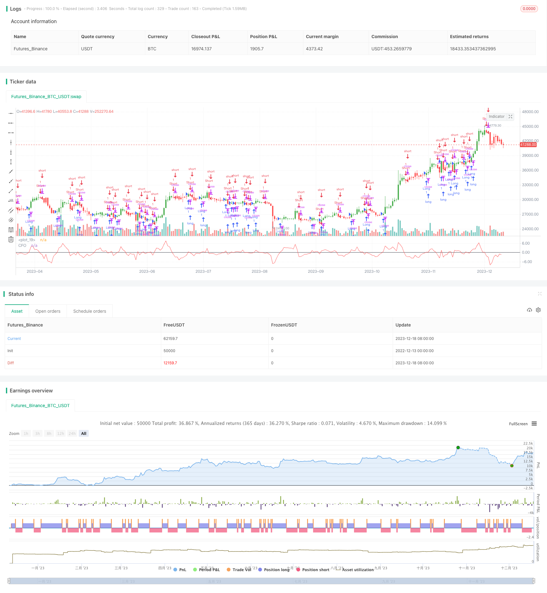

> Name

Pivot-Point-Forecast-Oscillator-Backtesting-Strategy
> Author

ChaoZhang

> Strategy Description


 [trans]

## Overview
This strategy is back-tested based on the Pivot Point Forecast Oscillator developed by Tushar Chande. This indicator calculates the percentage difference between the closing price and the price predicted by n-period linear regression. When the predicted price is higher than the closing price, the indicator crosses 0 upwards; when the predicted price is lower than the closing price, the indicator crosses downwards 0. This can be used to identify turning points in the market.
## Strategy Principle
This strategy uses pivot point forecast oscillators to determine whether the market is long or short. Specifically, it calculates the linear regression predicted price for n periods and calculates the difference percentage from the actual closing price. When the balance percentage crosses 0, go long; when the balance goes below 0, go short. The complete transaction logic is as follows:
1. Calculate n-period linear regression predicted price xLG
2. Calculate the percentage difference between the closing price and the forecast price xCFO
3. Determine the relationship between the difference percentage xCFO and 0, and output the long and short signal possig
   1. xCFO > 0 and long position is allowed, possig = 1
   2. xCFO < 0 and short selling is allowed, possig = -1
   3. Otherwise, possig = 0
4. Go long or short based on possig signal
This strategy is simple and straightforward. By comparing the actual price with the predicted price, it determines whether the market is overvalued or undervalued, thereby generating trading signals.
## Advantage Analysis
This strategy has the following advantages:
1. The logic is clear and easy to understand and implement.
2. Few parameters, easy to adjust.
3. The cycle can be flexibly selected to adapt to different markets.
4. You can easily switch between long and short directions.
5. Visualize indicators to form clear trading signals.
## Risk Analysis
There are also some risks with this strategy:
1. Linear regression predictions are time-sensitive and cannot be continuously effective.
2. Improper selection of parameters may lead to too frequent transactions. 
3. Unexpected events may cause indicators to generate false signals.
Countermeasures:
1. Combine with other indicators to ensure the effectiveness of linear regression prediction.
2. Optimize parameters and reduce transaction frequency.
3. Add a stop-loss strategy to control single losses.
## Optimization direction
This strategy can be optimized from the following aspects:
1. Combine with indicators such as moving averages to enrich trading signals.
2. Add a stop-loss strategy to avoid huge losses.
3. Optimize parameters and obtain the best parameter combination.
4. Add automatic profit-taking strategy.
5. Consider the transaction rate and set a reasonable stop-profit and stop-loss range.
## Summarize
The Pivot Point Prediction Oscillator is a quantitative trading strategy that uses linear regression to predict price. This strategy has simple logic, flexible parameter settings, and can generate clear trading signals. There is room for further improvement in this strategy in terms of optimizing stop loss strategies, parameter selection, and combining other indicator signals to achieve better trading results.
||


## Overview  

This strategy backtests the Pivot Point Forecast Oscillator developed by Tushar Chande. The oscillator calculates the percentage difference between the closing price and the n-period linear regression forecasted price. It crosses above 0 when the forecast price is greater than the closing price and crosses below 0 when less than. This can be used to identify turning points in the market.

## Strategy Logic

The strategy utilizes the Pivot Point Forecast Oscillator to determine market direction. Specifically, it calculates the percentage difference between the n-period linear regression forecasted price and the actual closing price. When the percentage difference crosses above 0, it goes long. When the percentage difference crosses below 0, it goes short. The complete trading logic is as follows:

1. Calculate n-period linear regression forecast price xLG  
2. Calculate percentage difference between closing price and forecast price xCFO
3. Determine relationship between xCFO and 0 to output signal possig
   1. xCFO > 0 and long is allowed, possig = 1 
   2. xCFO < 0 and short is allowed, possig = -1  
   3. Otherwise, possig = 0
4. Go long or short based on possig signal

The strategy is simple and straight-forward, comparing actual price with forecast price to determine if the market is overestimated or underestimated, thus generating trading signals.  

## Advantage Analysis 

The strategy has the following advantages:

1. Clear logic, easy to understand and implement.  
2. Few parameters, easy to tune.
3. Flexible in choosing timeframes, adaptable to different markets.
4. Convenient to switch between long and short.
5. Visual indicator forms clear trading signals.

## Risk Analysis   

The strategy also has some risks:  

1. Linear regression prediction has timeliness, may not sustain effectiveness.
2. Improper parameter selection may cause over-trading.  
3. Black swan events may cause incorrect signals.

Counter measures:

1. Combine with other indicators to ensure validity of linear regression prediction.  
2. Optimize parameters to lower trading frequency. 
3. Add stop loss to control single trade loss.

## Optimization Directions  

The strategy can be improved in the following aspects:

1. Combine with MA and other indicators to enrich trading signals. 
2. Add stop loss to avoid huge losses.
3. Optimize parameters to find best combination.
4. Add automatic take profit.
5. Consider trading costs, set reasonable stop loss and take profit.

## Conclusion  

The Pivot Point Forecast Oscillator is a quant trading strategy utilizing linear regression forecast prices. The strategy has simple logic and flexible parameters, generating clear trading signals. There is room for further improvement in optimizing stop loss, parameter selection, combining other indicator signals etc, to achieve better trading performance.

[/trans]

> Strategy Arguments


|Argument|Default|Description|
|----|----|----|
|v_input_1|14|Length|
|v_input_2|false|Offset|
|v_input_3|false|Trade reverse|


> Source (PineScript)

``` pinescript
/*backtest
start: 2022-12-13 00:00:00
end: 2023-12-19 00:00:00
period: 1d
basePeriod: 1h
exchanges: [{"eid":"Futures_Binance","currency":"BTC_USDT"}]
*/

//@version=2
////////////////////////////////////////////////////////////
//  Copyright by HPotter v1.0 19/03/2018
// The Chande Forecast Oscillator developed by Tushar Chande The Forecast 
// Oscillator plots the percentage difference between the closing price and 
// the n-period linear regression forecasted price. The oscillator is above 
// zero when the forecast price is greater than the closing price and less 
// than zero if it is below.
//
// You can change long to short in the Input Settings
// WARNING:
//  - For purpose educate only
//  - This script to change bars colors.
////////////////////////////////////////////////////////////
strategy(title="Chande Forecast Oscillator Backtest", shorttitle="CFO")
Length = input(14, minval=1)
Offset = input(0)
reverse = input(false, title="Trade reverse")
hline(0, color=black, linestyle=line)
xLG = linreg(close, Length, Offset)
xCFO = ((close -xLG) * 100) / close
pos = iff(xCFO > 0, 1,
       iff(xCFO < 0, -1, nz(pos[1], 0))) 
possig = iff(reverse and pos == 1, -1,
          iff(reverse and pos == -1, 1, pos))	   
if (possig == 1) 
    strategy.entry("Long", strategy.long)
if (possig == -1)
    strategy.entry("Short", strategy.short)	   	    
barcolor(possig == -1 ? red: possig == 1 ? green : blue ) 
plot(xCFO, color=red, title="CFO")
```

> Detail

https://www.fmz.com/strategy/435951

> Last Modified

2023-12-20 13:44:26
