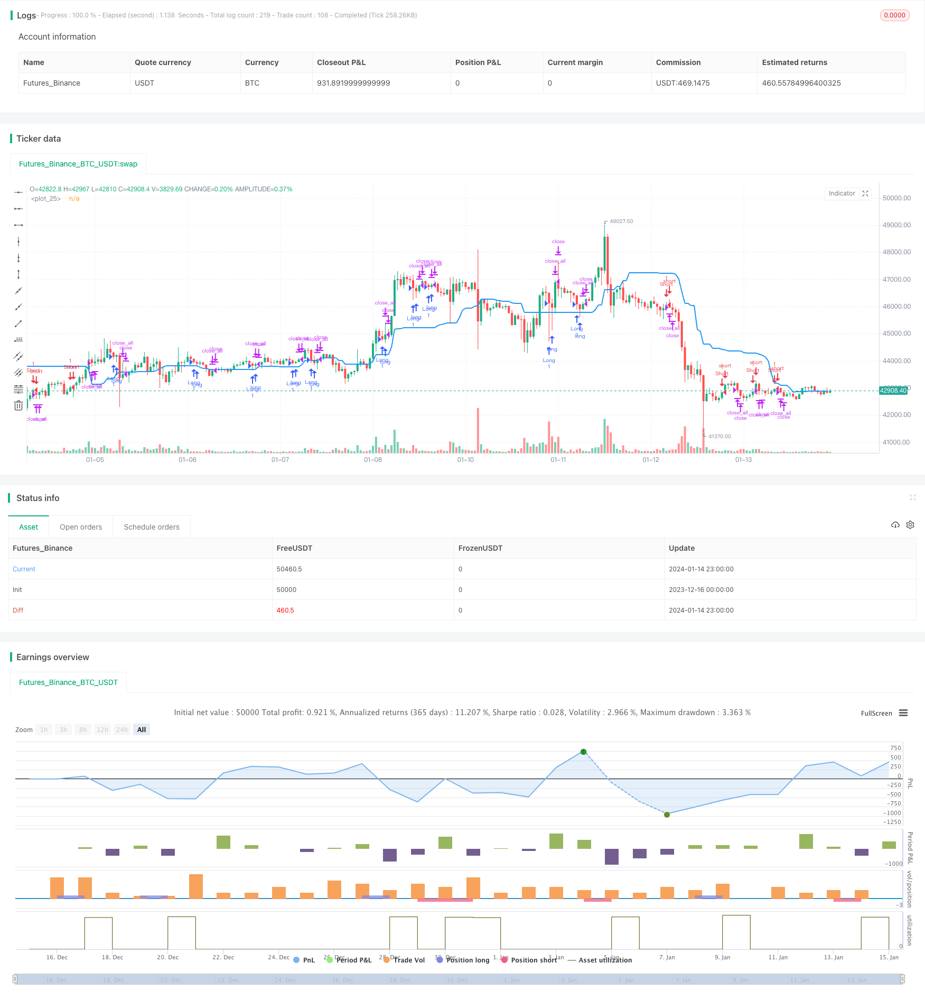

> Name

Price-Channel-Breakout-Strategy based on price channel
> Author

ChaoZhang

> Strategy Description


 [trans]

## Overview
This strategy is named "Breakout Strategy Based on Price Channel". Its main idea is to use the price channel to determine the market trend and direction, and establish a position when the price breaks through the channel. It will first draw the price channel range, and then determine whether there are two consecutive red or green K lines on the K line. If the last K line breaks through more than half of the channel and closes outside the channel, a buy or sell signal will be generated.
## Strategy Principle
This strategy uses the highest() and lowest() functions to calculate the highest and lowest prices in a certain period in the past to determine the upper and lower rails of the price channel. The centerline of a channel is defined as the average of the upper and lower rails. Then calculate the size of the K-line entity and use SMA smoothing to determine whether the last K-line entity is larger than half of the average entity. In addition, it is also judged whether the last two K lines are in the same direction (two consecutive red or two green lines). When these conditions are met, a buy/sell signal is generated and the position is closed when the price falls back to the direction of the channel.
## Advantage Analysis
This is a breakout strategy that uses price channels to determine trends. It has the following advantages:
1. Using price channels to determine the overall trend direction can effectively filter market noise.
2. Two consecutive K lines break through the channel in the same direction, indicating that the momentum is strong and the breakthrough success rate is high.
3. Judging that the K-line entity is more than half of the average entity can avoid being deceived by false breakthroughs.
4. The strategy logic is simple, easy to understand and easy to implement.
5. Customizable parameters such as channel cycle, transaction type, transaction time, etc., with strong adaptability.
## Risk Analysis
There are also some potential risks with this strategy:
1. The probability of breakthrough failure still exists and may result in losses.
2. When the market fluctuates violently, channel judgment may fail.
3. Lack of stop-loss mechanism and inability to effectively control losses.
4. Simple trading rules have the risk of over-fitting.
5. Unable to adapt to a more complex market environment.
The corresponding solutions are as follows:
1. Optimize parameters and improve breakthrough success rate.
2. Add volatility indicators to avoid volatile market conditions.
3. Add trailing stop loss setting.
4. Conduct complexity testing to check overfitting.
5. Add machine learning algorithms to improve the adaptability of the strategy.
## Optimization direction
The main optimization directions of this strategy are:
1. Add a stop-loss mechanism to better control risks. You can set a price drop stop loss, or you can use indicators such as ATR to set a trailing stop loss.
2. Optimize parameters, such as channel cycle, breakthrough amplitude parameters, etc. Optimal parameters can be found through methods such as genetic algorithms and grid search.
3. Add filtering conditions to improve the certainty of breakthroughs. For example, trading volume can be combined to confirm breakouts.
4. Add machine learning models to use more data to improve the prediction ability and adaptability of the strategy. Deep learning such as LSTM can capture more complex market patterns.
5. Carry out combinatorial optimization and combine different types of breakthrough strategies to achieve orthogonality and reduce similarity.
## Summarize
Generally speaking, this strategy is a quantitative strategy that determines trends based on price channels and discovers breakthrough signals. It has the advantages of judging trends and confirming breakthroughs, but there is also a certain risk of false breakthroughs. We can improve the strategy and reduce risks through parameter optimization, stop loss setting, adding conditional filtering and other methods. At the same time, adding a machine learning model can also further enhance the prediction ability of the strategy. Overall, this is a promising quantitative strategy idea that deserves our in-depth study and improvement.
||

This strategy is named "Price Channel Breakout Strategy". Its main idea is to use price channel to determine market trend and direction and establish positions when price breaks out of the channel. It will first draw the price channel range, then judge if there are two consecutive red or green K-lines. If the last K-line breaks through half of the channel width and closes outside the channel, it will generate buy or sell signals.

## Strategy Logic

The strategy calculates the highest high and lowest low over a certain period in the past using highest() and lowest() functions to determine the upper and lower rails of the price channel. The midpoint of the channel is defined as the average of the upper and lower rails. It then calculates the K-line body size and smoothes it using SMA to determine if the last K-line body is larger than half of the average body. It also judges if the last two K-lines are in the same direction (two consecutive red or green). When these conditions are met, it generates buy/sell signals and closes positions when price falls back into the channel direction.

## Advantage Analysis 

This is a breakout strategy that uses price channel to judge the overall trend. It has the following advantages:

1. Using price channel to determine the overall trend direction can effectively filter market noise.

2. Consecutive two K-lines breaking through the channel in the same direction indicates stronger momentum and higher success rate of breakout.   

3. Judging K-line body larger than half of average body can avoid being misled by false breakout.

4. The strategy logic is simple and easy to implement.

5. Customizable parameters such as channel period, trading products, trading hours etc. make it highly adaptable.

## Risk Analysis

The strategy also has some potential risks:

1. There is still probability of failed breakout, which may lead to losses. 

2. Price channel may fail when market fluctuates violently.

3. Lack of stop loss mechanism fails to effectively control losses.

4. Simple trading rules have overfitting risks.  

5. Unable to adapt to more complex market environments.

The corresponding solutions are:

1. Optimize parameters to improve success rate of breakout.

2. Add volatility index to avoid choppy market.  

3. Add mobile stop loss.

4. Conduct complexity test to check overfitting.  

5. Increase machine learning models to improve adaptability.

## Optimization Directions   

The main optimization directions are:  

1. Add stop loss mechanism to better control risks. Set price retracement stop loss or mobile stop loss based on ATR.

2. Optimize parameters like channel period, breakout threshold etc. Find optimal parameters through genetic algorithm, grid search etc.

3. Add filtering conditions to improve certainty of breakout. For example, combine trading volume to confirm breakout.  

4. Add machine learning models like LSTM to improve prediction capability and adaptability by utilizing more data.

5. Conduct portfolio optimization, combine different types of breakout strategies to achieve orthogonality and reduce similarities.

## Conclusion   

In conclusion, this is a quantitative strategy based on price channel to determine trend and discover breakout signals. It has the advantage of judging trend and confirming breakout, but also has certain risks of false breakout. We can improve the strategy by parameter optimization, stop loss, adding filters etc. to reduce risks. Meanwhile, introducing machine learning models can further enhance the predictive capability. Overall, this is a promising quantitative strategy approach worth researching and improving.
[/trans]

> Strategy Arguments


|Argument|Default|Description|
|----|----|----|
|v_input_1|true|Long|
|v_input_2|true|Short|
|v_input_3|30|Price Channel|
|v_input_4|true|Show center-line|
|v_input_5|1900|From Year|
|v_input_6|2100|To Year|
|v_input_7|true|From Month|
|v_input_8|12|To Month|
|v_input_9|true|From day|
|v_input_10|31|To day|


> Source (PineScript)

``` pinescript
/*backtest
start: 2023-12-16 00:00:00
end: 2024-01-15 00:00:00
period: 1h
basePeriod: 15m
exchanges: [{"eid":"Futures_Binance","currency":"BTC_USDT"}]
*/

//Noro
//2018

//@version=2
strategy(title = "Noro's Price Channel Strategy v1.0", shorttitle = "Price Channel str 1.0", overlay=true, default_qty_type = strategy.percent_of_equity, default_qty_value = 100, pyramiding = 0)

//Settings
needlong = input(true, defval = true, title = "Long")
needshort = input(true, defval = true, title = "Short")
pch = input(30, defval = 30, minval = 2, maxval = 200, title = "Price Channel")
showcl = input(true, defval = true, title = "Show center-line")
fromyear = input(1900, defval = 1900, minval = 1900, maxval = 2100, title = "From Year")
toyear = input(2100, defval = 2100, minval = 1900, maxval = 2100, title = "To Year")
frommonth = input(01, defval = 01, minval = 01, maxval = 12, title = "From Month")
tomonth = input(12, defval = 12, minval = 01, maxval = 12, title = "To Month")
fromday = input(01, defval = 01, minval = 01, maxval = 31, title = "From day")
today = input(31, defval = 31, minval = 01, maxval = 31, title = "To day")
src = close

//Price channel
lasthigh = highest(src, pch)
lastlow = lowest(src, pch)
center = (lasthigh + lastlow) / 2
col = showcl ? blue : na
plot(center, color = col, linewidth = 2)

//Bars
bar = close > open ? 1 : close < open ? -1 : 0
rbars = sma(bar, 2) == -1
gbars = sma(bar, 2) == 1

//Signals
body = abs(close - open)
abody = sma(body, 10)
up = rbars and close > center and body > abody / 2
dn = gbars and close < center and body > abody / 2
exit = ((strategy.position_size > 0 and close > open) or (strategy.position_size < 0 and close < open)) and body > abody / 2

//Trading
if up
    if strategy.position_size < 0
        strategy.close_all()
        
    strategy.entry("Long", strategy.long, needlong == false ? 0 : na)

if dn
    if strategy.position_size > 0
        strategy.close_all()
        
    strategy.entry("Short", strategy.short, needshort == false ? 0 : na)
    
if exit
    strategy.close_all()
```

> Detail

https://www.fmz.com/strategy/438933

> Last Modified

2024-01-16 14:22:57
