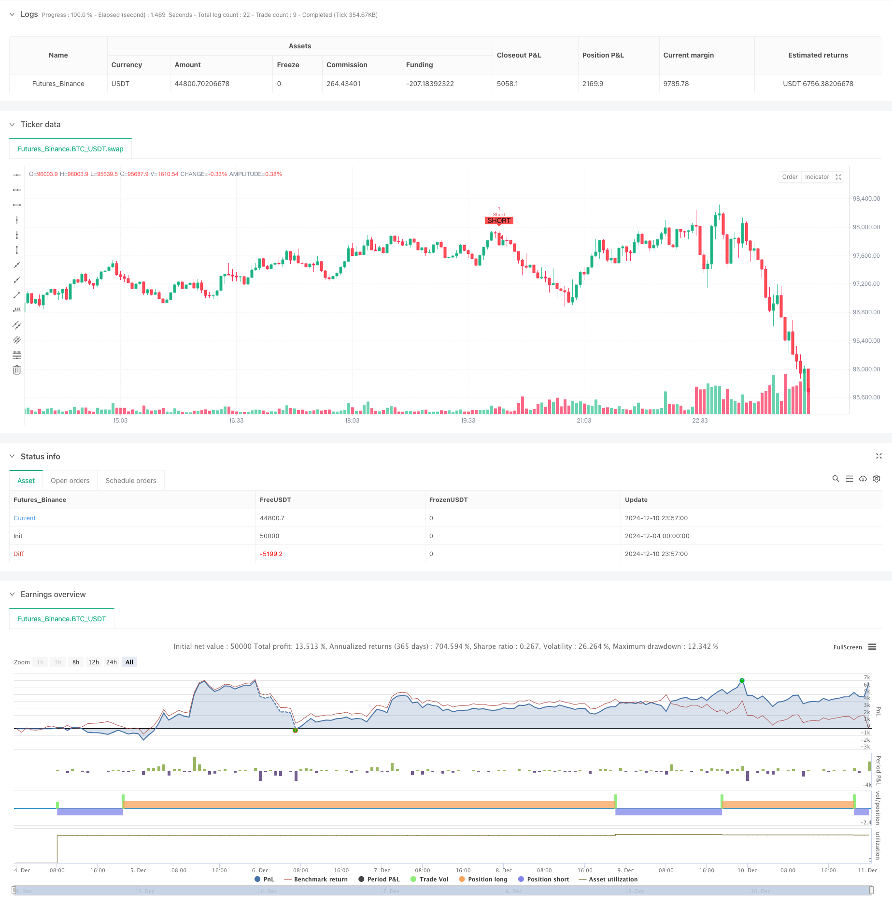

> Name

Double bottom and double top automatic trading strategy based on price pattern-Price-Pattern-Based-Double-Bottom-and-Top-Automated-Trading-Strategy
> Author

ChaoZhang

> Strategy Description



[trans]
#### Overview
This is an automated trading strategy based on chart price pattern recognition. This strategy mainly makes trading decisions by identifying double bottom and double top patterns in the market, monitors price trends by setting a specific time period, and automatically executes trading instructions when qualified patterns appear. The strategy uses the zigzag indicator to visually display these key price patterns, helping traders intuitively understand market trends.
#### Strategy Principle
The core logic of the strategy is to identify double bottom and double top patterns in the market through technical analysis methods. The specific implementation includes the following key steps:
1. Set the monitoring period (default 100 periods) and lookback period (default 100 periods) through parameters
2. Use technical analysis functions to calculate the highest and lowest prices within the period
3. Determine whether a double bottom or double top pattern is formed by comparing the current price with historical prices.
4. After confirming the form, the system will automatically execute the corresponding trading instructions.
5. Set up closing conditions based on price breakthroughs to ensure timely stop loss or profit taking
#### Strategic Advantages
1. High degree of automation: The strategy can automatically identify market patterns and execute transactions, reducing human intervention.
2. Good visualization effect: the market shape is clearly displayed through zigzag lines, which facilitates analysis and verification.
3. Flexible and adjustable parameters: the monitoring cycle and lookback period can be adjusted according to different market conditions
4. Perfect risk control: includes clear entry and exit conditions, which helps control risks
5. Strong adaptability: especially suitable for operating in short-cycle (1 minute, 3 minutes, 5 minutes) markets
#### Strategy Risk
1. False breakthrough risk: The market may have a false double bottom and double top pattern, leading to false trading signals.
2. Slippage risk: You may face larger slippage losses in fast markets
3. Parameter dependence: Strategy performance heavily depends on the rationality of parameter settings.
4. Market environment dependence: performs better in volatile markets, but may produce frequent false signals in trending markets
5. Technical limitations: Limited by the lag of technical indicators, the best entry opportunity may be missed.
#### Strategy optimization direction
1. Introduce additional technical indicators: You can combine RSI, MACD and other indicators to filter out false signals
2. Optimize parameter selection: It is recommended to optimize the monitoring cycle and parameter settings during the backtest period through backtest data
3. Improve the risk control mechanism: add dynamic stop loss and moving take profit functions to improve fund management capabilities
4. Add market environment recognition: add trend recognition function and adjust strategy parameters under different market environments
5. Optimize transaction volume management: dynamically adjust transaction size according to market volatility
#### Summary
This is a well-designed and practical automated trading strategy. By accurately identifying the double bottom and double top patterns in the market, combined with flexible parameter settings and a complete risk control mechanism, we can effectively capture short-term market reversal opportunities. Although there are certain risks, through continuous optimization and improvement, this strategy is expected to become a reliable trading tool. ||
#### Overview
This is an automated trading strategy based on chart pattern recognition. The strategy primarily makes trading decisions by identifying double bottom and double top formations in the market, monitoring price movements over specific time periods, and automatically executing trade orders when qualifying patterns emerge. The strategy utilizes the zigzag indicator to visualize these key price patterns, helping traders understand market trends intuitively.

#### Strategy Principle
The core logic of the strategy is to identify double bottom and double top patterns through technical analysis. The specific implementation includes the following key steps:
1. Setting monitoring period (default 100 periods) and lookback period (default 100 periods)
2. Using technical analysis functions to calculate period highs and lows
3. Comparing current prices with historical prices to determine formation of double bottoms or tops
4. Automatically executing corresponding trade orders upon pattern confirmation
5. Setting price breakthrough-based exit conditions for timely stop-loss or profit-taking

#### Strategy Advantages
1. High automation: Strategy automatically identifies market patterns and executes trades, reducing manual intervention
2. Good visualization: Clearly displays market patterns through zigzag lines for analysis and verification
3. Flexible parameters: Monitoring period and lookback period can be adjusted for different market conditions
4. Comprehensive risk control: Includes clear entry and exit conditions for risk management
5. Strong adaptability: Particularly suitable for short-term markets (1-minute, 3-minute, 5-minute)

#### Strategy Risks
1. False breakout risk: Market may exhibit false double bottom/top patterns leading to incorrect signals
2. Slippage risk: May face significant slippage losses in fast-moving markets
3. Parameter dependency: Strategy performance heavily relies on parameter settings
4. Market environment dependency: Performs well in ranging markets but may generate frequent false signals in trending markets
5. Technical limitations: May miss optimal entry points due to indicator lag

#### Strategy Optimization Directions
1. Introduce additional technical indicators: Combine with RSI, MACD etc. to filter false signals
2. Optimize parameter selection: Recommend optimizing monitoring and lookback periods through backtesting
3. Enhance risk control: Add dynamic stop-loss and trailing stop-profit functions
4. Add market environment recognition: Include trend identification to adjust parameters in different markets
5. Optimize position management: Dynamically adjust trading size based on market volatility

#### Summary
This is a well-designed and practical automated trading strategy. Through accurate identification of double bottom and top patterns, combined with flexible parameter settings and comprehensive risk control, it effectively captures short-term market reversal opportunities. While certain risks exist, through continuous optimization and improvement, this strategy has the potential to become a reliable trading tool.[/trans]


> Source (PineScript)

``` pinescript
/*backtest
start: 2024-12-04 00:00:00
end: 2024-12-11 00:00:00
period: 3m
basePeriod: 3m
exchanges: [{"eid":"Futures_Binance","currency":"BTC_USDT"}]
*/

//@version=5
strategy("Double Bottom and Top Hunter", overlay=true)

// Parametreler
length = input.int(100, title="Dönem Uzunluğu", defval=100)
lookback = input.int(100, title="Geriye Dönük Kontrol Süresi", defval=100)

// İkili Dip ve Tepe Bulma
low1 = ta.lowest(low, length)
high1 = ta.highest(high, length)

low2 = ta.valuewhen(low == low1, low, 1)
high2 = ta.valuewhen(high == high1, high, 1)

doubleBottom = (low == low1 and ta.lowest(low, lookback) == low1 and low == low2)
doubleTop = (high == high1 and ta.highest(high, lookback) == high1 and high == high2)

// İşlem Açma Koşulları
longCondition = doubleBottom
shortCondition = doubleTop

// İşlem Kapatma Koşulları
closeLongCondition = ta.highest(high, length) > high1 and low < low1
closeShortCondition = ta.lowest(low, length) < low1 and high > high1

// İşlem Açma
if (longCondition)
    strategy.entry("Long", strategy.long, qty=1)

if (shortCondition)
    strategy.entry("Short", strategy.short, qty=1)

// İşlem Kapatma
if (closeLongCondition)
    strategy.close("Long")

if (closeShortCondition)
    strategy.close("Short")

// Grafik Üzerinde Göstergeler ve ZigZag Çizimi
plotshape(series=longCondition, title="İkili Dip Bulundu", location=location.belowbar, color=color.green, style=shape.labelup, text="LONG")
plotshape(series=shortCondition, title="İkili Tepe Bulundu", location=location.abovebar, color=color.red, style=shape.labeldown, text="SHORT")

// var line zigzagLine = na
// if (doubleBottom or doubleTop)
//     zigzagLine := line.new(x1=bar_index[1], y1=na, x2=bar_index, y2=doubleBottom ? low : high, color=doubleBottom ? color.green : color.red, width=2)

// Zigzag çizgisini sürekli güncelleme
// line.set_xy1(zigzagLine, bar_index[1], na)
// line.set_xy2(zigzagLine, bar_index, doubleBottom ? low : high)
```

> Detail

https://www.fmz.com/strategy/474885

> Last Modified

2024-12-12 17:29:41
