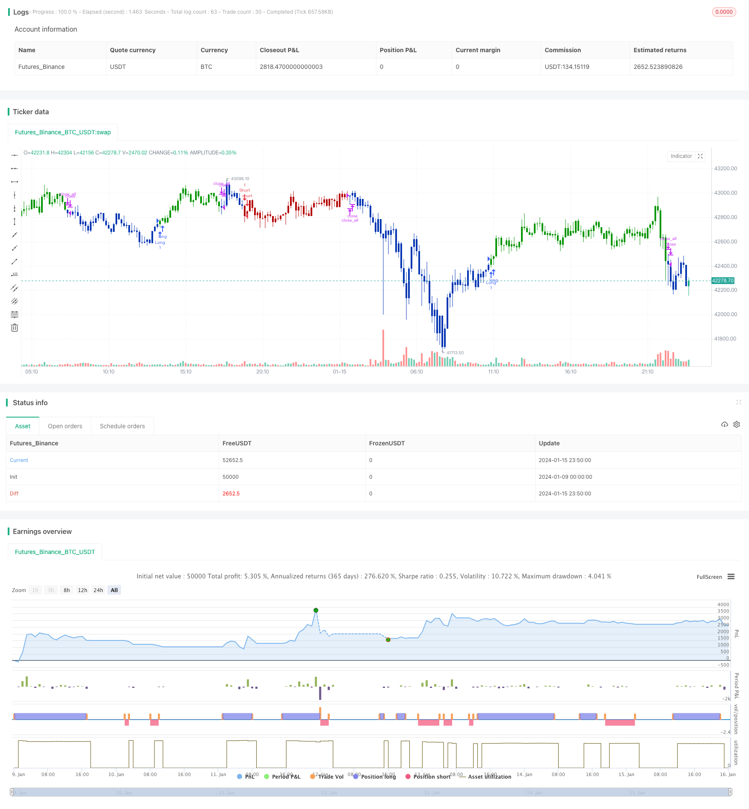

> Name

Price-Reversal-with-Crossover-Capturing-Strategy
> Author

ChaoZhang

> Strategy Description


 [trans]

## Overview
The reversal crossover capture strategy is a compound strategy that combines reversal trading and indicator crossovers. It first uses the price reversal pattern to generate trading signals, and then combines the long and short crosses of the stochastic indicator for filtering to capture short-term market reversal opportunities.
## Strategy Principle
This strategy consists of two sub-strategies:
1. 123 reversal strategy
  - When the closing price changes from high to low within two days, if the 9-day stochastic indicator is low (below a certain value), a buy signal is generated
  - When the closing price changes from a low to a high within two days, if the 9-day stochastic indicator reaches a high level (above a certain value), a sell signal is generated  
2. Stochastic indicator golden cross and dead cross strategy
  - When the %K line falls below the %D line from top to bottom, and both the %K line and the %D line are in the overbought area, a sell signal is generated.
  - When the %K line breaks through the %D line from bottom to top, and both the %K line and the %D line are in the oversold area, a buy signal is generated.
This composite strategy judges the signals of two sub-strategies, and when the trading signals of the two sub-strategies are consistent, an actual trading signal is generated.
## Strategic Advantages
This strategy combines reversal and indicator crossover to comprehensively judge price and indicator information, which can effectively filter out false signals, tap potential reversal opportunities, and improve profit returns.
Specific advantages include:
1. Capture the market reversal, the reversal is fast, and there is no need to wait for signals for a long time.
2. Two sub-strategies cross-validate to improve signal accuracy
3. Combine price trend judgment and indicator analysis to improve the winning rate
## Strategy Risk
This strategy also has certain risks:
1. When the market fluctuates violently, it is difficult for the price to clearly reverse the direction in the short term, and it is easy to generate false signals.
2. Improper setting of indicator parameters will also affect signal quality.
3. The reversal time cannot be controlled and there is a certain time risk.
These risks can be controlled by adjusting indicator parameters and setting stop-loss mechanisms.
## Strategy optimization direction
This strategy can be optimized from the following dimensions:
1. Adjust indicator parameters and optimize parameter combinations
2. Add other indicators to filter signals, such as trading volume indicators, etc.
3. Customize indicator parameters according to the characteristics of different varieties and market environment
4. Increase stop-loss strategies to control risks
5. Combined with machine learning technology for signal judgment
## Summary
The reversal cross capture strategy comprehensively uses the advantages of multiple strategies and has strong profitability under the premise of controlling risks. Through continuous optimization and improvement, you can create an efficient strategy that suits your own style and calmly cope with the changing market environment.
||

## Overview  
The price reversal with crossover capturing strategy is a compound strategy that combines price reversal trading techniques and indicator crossovers. It first generates trading signals using price reversal patterns, then filters the signals with overbought/oversold crossovers of a stochastic oscillator, in order to capture short-term reversals in the market.


## Strategy Logic  
The strategy consists of two sub-strategies:

1. 123 Reversal Strategy
  - When the close price turns from higher to lower in two days, and the 9-day stochastic indicator is at lower band (below a threshold), a buy signal is generated  
  - When the close price turns from lower to higher in two days, and the 9-day stochastic indicator is at upper band (above a threshold), a sell signal is generated

2. Stochastic Crossover Strategy 
  - When the %K line crosses below the %D line, while both lines are in overbought levels, a sell signal is generated
  - When the %K line crosses above the %D line, while both lines are in oversold levels, a buy signal is generated
  
The compound strategy checks the signals from both sub-strategies and only triggers actual trades when the signals align in the same direction.  


## Advantages
The strategy combines price reversal patterns and indicator crossovers to evaluate both price action and indicator information, which helps filter out false signals and uncover reversal opportunities to improve profitability.  

Specific advantages include:

1. Capturing market reversals quickly without long consolidation waits 
2. Increased signal accuracy with dual validation from both sub-strategies
3. Better win rate combining analysis of both price action and indicators

## Risks
There are also some risks with this strategy:   

1. Price may reverse abruptly during high volatility, causing incorrect signals  
2. Poor indicator parameter tuning affects signal quality
3. Unsure about reversal timing, some time risk exists  

These risks can be managed by adjusting parameters, using stop losses etc.

## Enhancement Opportunities
Some ways the strategy can be enhanced:

1. Optimize indicator parameters  
2. Add other filters like volume  
3. Customize parameters based on symbol and market conditions  
4. Incorporate stop loss for risk control
5. Employ machine learning for signal identification

## Conclusion
The price reversal with crossover capturing strategy combines multiple complementary strategies to profit while controlling risks. With continuous improvements, it can be tailored into an efficient strategy that thrives in changing markets.


[/trans]

> Strategy Arguments


|Argument|Default|Description|
|----|----|----|
|v_input_1|true|---- 123 Reversal ----|
|v_input_2|14|Length|
|v_input_3|true|KSmoothing|
|v_input_4|3|DLength|
|v_input_5|50|Level|
|v_input_6|true|---- Stochastic Crossover ----|
|v_input_7|7|LengthSC|
|v_input_8|3|DLengthSC|
|v_input_9|20|Oversold|
|v_input_10|70|Overbought|
|v_input_11|false|Trade reverse|


> Source (PineScript)

``` pinescript
/*backtest
start: 2024-01-09 00:00:00
end: 2024-01-16 00:00:00
period: 10m
basePeriod: 1m
exchanges: [{"eid":"Futures_Binance","currency":"BTC_USDT"}]
*/

//@version=4
////////////////////////////////////////////////////////////
//  Copyright by HPotter v1.0 15/09/2021
// This is combo strategies for get a cumulative signal. 
//
// First strategy
// This System was created from the Book "How I Tripled My Money In The  
// Futures Market" by Ulf Jensen, Page 183. This is reverse type of strategies.
// The strategy buys at market, if close price is higher than the previous close 
// during 2 days and the meaning of 9-days Stochastic Slow Oscillator is lower than 50. 
// The strategy sells at market, if close price is lower than the previous close price 
// during 2 days and the meaning of 9-days Stochastic Fast Oscillator is higher than 50.
//
// Second strategy
// This back testing strategy generates a long trade at the Open of the following 
// bar when the %K line crosses below the %D line and both are above the Overbought level.
// It generates a short trade at the Open of the following bar when the %K line 
// crosses above the %D line and both values are below the Oversold level.
//
// WARNING:
// - For purpose educate only
// - This script to change bars colors.
////////////////////////////////////////////////////////////
Reversal123(Length, KSmoothing, DLength, Level) =>
    vFast = sma(stoch(close, high, low, Length), KSmoothing) 
    vSlow = sma(vFast, DLength)
    pos = 0.0
    pos := iff(close[2] < close[1] and close > close[1] and vFast < vSlow and vFast > Level, 1,
	         iff(close[2] > close[1] and close < close[1] and vFast > vSlow and vFast < Level, -1, nz(pos[1], 0))) 
	pos


StochCross(Length, DLength,Oversold,Overbought) =>
    pos = 0.0
    vFast = stoch(close, high, low, Length)
    vSlow = sma(vFast, DLength)
    pos := iff(vFast < vSlow and vFast > Overbought and vSlow > Overbought, 1,
    	      iff(vFast >= vSlow and vFast < Oversold and vSlow < Oversold, -1, nz(pos[1], 0))) 
    pos

strategy(title="Combo Backtest 123 Reversal & Stochastic Crossover", shorttitle="Combo", overlay = true)
line1 = input(true, "---- 123 Reversal ----")
Length = input(14, minval=1)
KSmoothing = input(1, minval=1)
DLength = input(3, minval=1)
Level = input(50, minval=1)
//-------------------------
line2 = input(true, "---- Stochastic Crossover ----")
LengthSC = input(7, minval=1)
DLengthSC = input(3, minval=1)
Oversold = input(20, minval=1)
Overbought = input(70, minval=1)
reverse = input(false, title="Trade reverse")
posReversal123 = Reversal123(Length, KSmoothing, DLength, Level)
posmStochCross = StochCross(LengthSC, DLengthSC,Oversold,Overbought)
pos = iff(posReversal123 == 1 and posmStochCross == 1 , 1,
	   iff(posReversal123 == -1 and posmStochCross == -1, -1, 0)) 
possig = iff(reverse and pos == 1, -1,
          iff(reverse and pos == -1 , 1, pos))	   
if (possig == 1 ) 
    strategy.entry("Long", strategy.long)
if (possig == -1 )
    strategy.entry("Short", strategy.short)	 
if (possig == 0) 
    strategy.close_all()
barcolor(possig == -1 ? #b50404: possig == 1 ? #079605 : #0536b3 )
```

> Detail

https://www.fmz.com/strategy/439087

> Last Modified

2024-01-17 16:29:13
