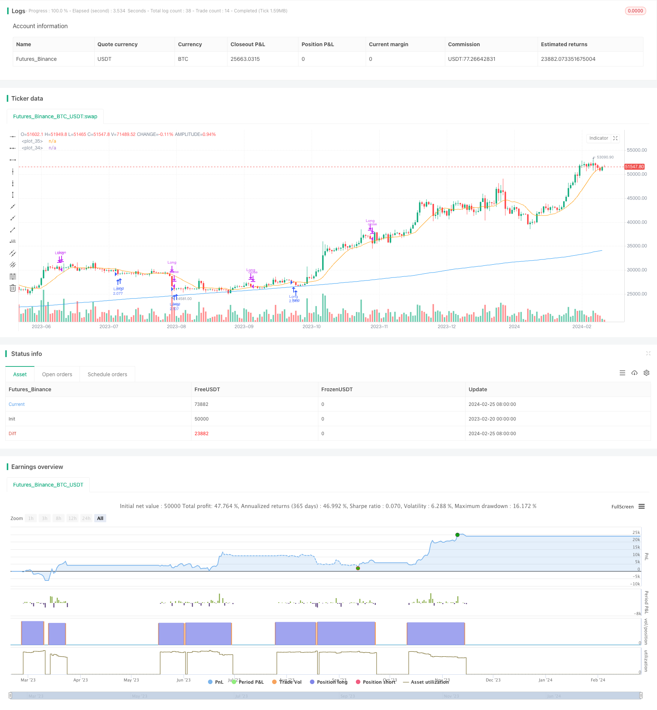

> Name

Pullback-Trading-Strategy-Based-on-Dynamic-Moving-Average
> Author

ChaoZhang

> Strategy Description


[trans]
## Overview
This strategy uses a dual moving average system to look for potential breakthrough opportunities in specific stocks or digital currencies. The basic principle is to buy stocks or digital currencies when the short-term moving average rebounds from below the long-term moving average. Sell ​​stocks or cryptocurrencies when prices retest long-term moving averages.
## Strategy Principle
This strategy uses two simple moving averages (SMA) with different periods as trading signals. The first SMA period is longer and represents the overall trend direction. The second SMA has a shorter period and is used to capture short-term price fluctuations.
When the short-term SMA crosses the long-term SMA from below, it means that the price is in an overall upward trend, so the strategy opens a long position. When the price falls and retests the long-term SMA, it indicates the end of the short-term pullback. At this time, the strategy will consider stop loss or profit taking positions.
In addition, the strategy also sets "oversold" and "overbought" conditions to avoid trading in extreme situations. A position will be opened only when the conditions of double moving average crossover and reasonable valuation are met at the same time.
## Strategic Advantages
- Use the dual moving average system to effectively identify short- and medium-term trends
- Combines the advantages of trend following and pullback trading
- Built-in "oversold" and "overbought" conditions to reduce unnecessary trades
## Risk Analysis
- It is difficult to judge the timing of the end of the callback, and you may misjudge the stop loss.
- When the trend changes, you cannot stop the loss quickly and may suffer large losses.
- Improper parameter settings may lead to too frequent or conservative trading
## Strategy optimization
There is room for further optimization of this strategy:
1. Use more complex tools to determine price fluctuations and trends, such as Bollinger Bands, KD indicators, etc.
2. Combine more factors to determine the timing of the callback end, such as changes in trading volume, volatility, etc.
3. Dynamically adjust position size to maximize profits
4. Optimize the stop loss logic and use KAMA, Ichimoku cloud and lower time frames to determine the stop loss timing.
## Summarize
This strategy integrates the advantages of trend tracking and callback trading, and uses the dual moving average system to determine the emergence of opportunities. At the same time, certain overbought and oversold conditions are built-in to avoid unnecessary opening of positions. This is a very practical quantitative trading strategy that deserves in-depth study and optimization.
||

## Overview  

This strategy employs a dual moving average system to identify potential breakout opportunities in selected stocks or cryptocurrencies. The core principle is to buy when the shorter-term moving average bounces back from below the longer-term moving average and sell when prices retest the longer-term moving average.

## Strategy Logic

The strategy utilizes two simple moving averages (SMA) with different periods as trading signals. The first SMA has a longer period to represent the overall trend direction. The second SMA has a shorter period to capture short-term price fluctuations.  

When the shorter-term SMA crosses above the longer-term SMA from below, it signals an uptrend in prices overall hence the strategy opens a long position. When prices pull back down to retest the longer-term SMA, it indicates the short-term pullback has ended and the strategy considers stopping out or taking profit on the position.

In addition, the strategy has “oversold” and “overbought” conditions to avoid trading in extreme situations. It only opens positions when both SMA crossover and reasonable valuation criteria are met.

## Advantages

- Dual moving average system effectively identifies medium-term trends  
- Combines the merits of trend following and pullback trading
- Embedded oversold and overbought conditions reduce unnecessary trades

## Risk Analysis 

- Difficult to determine precise pullback end timing, may stop out prematurely
- Unable to quickly cut losses when trend changes, could suffer large drawdowns
- Poor parameter tuning may result in over-trading or conservative trading

## Optimization Directions

There is further room to optimize this strategy:

1. Utilize more advanced technical indicators like Bollinger Bands and KD to gauge price waves and trends
2. Incorporate more factors like volume change, volatility to determine pullback completion  
3. Dynamically size positions to maximize profit potential
4. Optimize stop loss logic with KAMA, Ichimoku clouds and lower timeframe signals  

## Conclusion

This strategy combines the strengths of trend following and pullback trading using a dual moving average system to detect opportunities. At the same time, embedded overbought/oversold conditions avoid unnecessary position opening. It is a very practical quant trading strategy worth deeper research and optimization.

[/trans]

> Strategy Arguments


|Argument|Default|Description|
|----|----|----|
|v_input_int_1|280|(?Moving Avg. Parameters)MA length 1|
|v_input_int_2|13|MA length 2|
|v_input_float_1|0.07|Stop Loss (%)|
|v_input_float_2|0.27|(?Too Deep and Thin conditions)Too Deep (%)|
|v_input_float_3|0.03|Too Thin (%)|


> Source (PineScript)

``` pinescript
/*backtest
start: 2023-02-20 00:00:00
end: 2024-02-26 00:00:00
period: 1d
basePeriod: 1h
exchanges: [{"eid":"Futures_Binance","currency":"BTC_USDT"}]
*/

// @version=5
strategy("Profitable Pullback Trading Strategy", overlay=true,initial_capital=1000, default_qty_type=strategy.percent_of_equity, default_qty_value=100)

// Inputs
ma_length1 = input.int(280,'MA length 1', step = 10,group = 'Moving Avg. Parameters', inline = 'MA')
ma_length2 = input.int(13,'MA length 2', step = 1,group = 'Moving Avg. Parameters', inline = 'MA')
sl = input.float(title="Stop Loss (%)", defval=0.07, step=0.1, group="Moving Avg. Parameters")
too_deep    = input.float(title="Too Deep (%)", defval=0.27, step=0.01, group="Too Deep and Thin conditions", inline = 'Too')
too_thin    = input.float(title="Too Thin (%)", defval=0.03, step=0.01, group="Too Deep and Thin conditions", inline = 'Too')

// Calculations
ma1 = ta.sma(close,ma_length1)
ma2 = ta.sma(close,ma_length2)
too_deep2   = (ma2/ma1-1) < too_deep
too_thin2   = (ma2/ma1-1) > too_thin

// Entry and close condtions
var float buy_price = 0
buy_condition = (close > ma1) and (close < ma2) and strategy.position_size == 0 and too_deep2 and too_thin2
close_condition1  = (close > ma2) and strategy.position_size > 0 and (close < low[1])
stop_distance = strategy.position_size > 0 ? ((buy_price - close) / close) : na
close_condition2 = strategy.position_size > 0 and stop_distance > sl
stop_price = strategy.position_size > 0 ? buy_price - (buy_price * sl) : na

// Entry and close orders
if buy_condition
    strategy.entry('Long',strategy.long)
if buy_condition[1]
    buy_price := open
if close_condition1 or close_condition2
    strategy.close('Long',comment="Exit" + (close_condition2 ? "SL=true" : ""))
    buy_price := na

plot(ma1,color = color.blue)
plot(ma2,color = color.orange)


```

> Detail

https://www.fmz.com/strategy/442929

> Last Modified

2024-02-27 14:38:45
