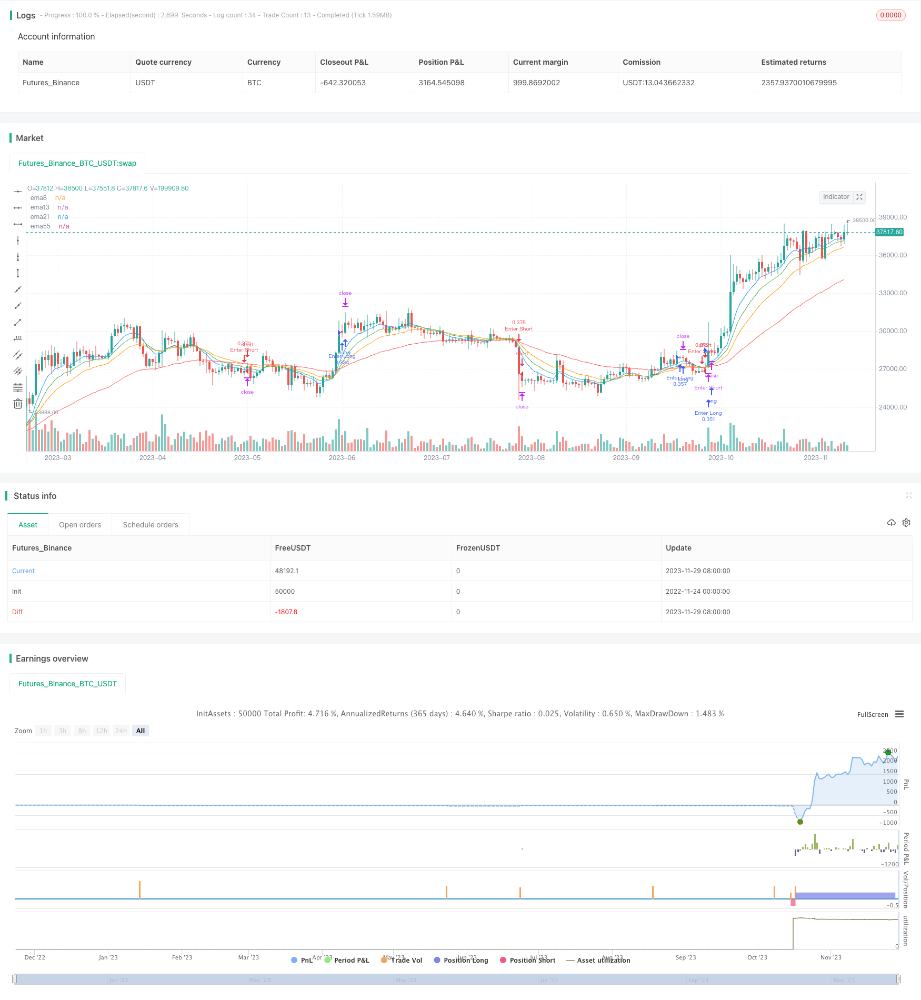

> Name

Quadriple-Exponential-Moving-Average-Trading-Strategy
> Author

ChaoZhang

> Strategy Description



[trans]

## Overview
The Quadruple Exponential Moving Average trading strategy is a typical trend trading strategy that tracks multiple exponential moving averages. It simultaneously tracks four exponential moving averages of different periods, the 13-day line, the 21-day line, the 55-day line and the 8-day line, and uses their intersections to determine market trends and generate trading signals.
## Strategy Principle
The core logic of this strategy is to track the intersection of four exponential moving averages EMA13, EMA21, EMA55 and EMA8. Specifically, it follows the following trading rules:
1. When EMA55 crosses EMA21, and EMA21 is higher than EMA55, EMA13 is higher than EMA21, and EMA8 is higher than EMA13, enter the market long.
2. When EMA55 crosses EMA21, and EMA21 is lower than EMA55, EMA13 is lower than EMA21, and EMA8 is lower than EMA13, enter the market short.
3. When EMA55 crosses EMA21, if you hold a long position, close the long position and open a short position at the same time.
4. When EMA55 crosses EMA21, if you hold a short position, close the short position and open a long position at the same time.
5. The long stop loss is 150 points and the take profit is 1000 points; the short stop loss is 150 points and the take profit is 1000 points.
It can be seen that this strategy uses the intersection of EMA55 and EMA21 as a signal to determine the main trend of the market, and uses the relationship between EMA13, EMA21 and EMA8 to determine the specific entry timing.
## Advantage Analysis
The quadruple EMA strategy has the following advantages:
1. Using multiple sets of EMA, you can more accurately judge market trends. EMA55 and EMA21 determine the main trend direction, and EMA13, EMA21 and EMA8 optimize the entry timing to improve strategy efficiency.
2. The strategy is relatively simple and clear, easy to understand and implement.
3. Using the smoothing properties of EMA, you can effectively filter market noise and avoid being trapped.
4. This strategy has no special requirements for trading varieties and can be widely applied to different financial products such as stocks, foreign exchange, and cryptocurrencies.
## Risks and improvements
This strategy also has the following risks:
1. When the trend reverses, the tracking EMA may suffer losses or be delayed in reversing. At this time, the EMA parameters can be appropriately adjusted or other indicators can be added for judgment.
2. The stop-loss and stop-profit points may need to be adjusted according to different varieties. This can be optimized by adding dynamic stop-profit and stop-loss.
3. Parameter optimization can also be further improved to find the optimal parameter combination. Adding machine learning algorithms may help.
4. Consider combining volatility indicators to reduce positions when volatility is high. This controls risk.
## Summarize
The Quadruple EMA strategy is a relatively simple trend following strategy. It uses multiple sets of EMA to depict market trends and generate trading signals accordingly. This strategy is relatively simple, easy to implement, can be widely applied to different varieties, and is a reliable trend following strategy. However, we must also note that this strategy has the risk of passive switching trends, which can be further improved by adding more auxiliary judgment indicators or optimizing parameters.
||
## Overview  

The Quadriple Exponential Moving Average (EMA) trading strategy is a typical trend-following strategy that tracks multiple exponential moving averages. It simultaneously tracks the 13-day, 21-day, 55-day and 8-day EMAs and generates trading signals based on their crossover situations to determine market trends.  

## Strategy Logic  

The core logic of this strategy is to track the crossover situations between the 4 EMAs - EMA13, EMA21, EMA55 and EMA8. Specifically, it follows these trading rules:  

1. When EMA55 crosses below EMA21, and EMA21 is above EMA55, EMA13 is above EMA21, and EMA8 is above EMA13, go long.  

2. When EMA55 crosses above EMA21, and EMA21 is below EMA55, EMA13 is below EMA21, and EMA8 is below EMA13, go short.

3. When EMA55 crosses above EMA21, if already long, close long position and open short position.  

4. When EMA55 crosses below EMA21, if already short, close short position and open long position.

5. Set stop loss at 150 points and take profit at 1000 points for both long and short trades.

As we can see, this strategy uses the crossover between EMA55 and EMA21 to judge the major trend direction. The relative positions of EMA13, EMA21 and EMA8 are then used to optimize entry timings.  

## Advantage Analysis 

The Quadriple EMA strategy has these advantages:

1. Using multiple EMAs can accurately determine market trends. EMA55 vs EMA21 judges the major trend while EMA13, EMA21 and EMA8 optimize entry timings to improve efficiency.   

2. The strategy logic is simple and clear, easy to understand and implement.  

3. The smoothing nature of EMAs helps filter market noise and avoid traps. 

4. This strategy can be broadly applied to different products like stocks, forex, crypto etc as it has no special requirements.

## Risks and Improvements

The risks of this strategy include:

1. Tracking EMAs may lead to losses or late trend reversal signals when trend reverses. Adjusting EMA parameters or adding other indicators could help.  

2. Stop loss and take profit points may need adjustment for different products. Dynamic SL/TP can optimize this.

3. Further parameter optimization with machine learning algorithms may also improve performance.  

4. Incorporating volatility metrics to lower position sizes during high volatility periods could help control risks.

## Conclusion  

The Quadriple EMA strategy is a relatively simple trend-following strategy. It uses multiple EMAs to depict market trends and generate trading signals accordingly. The strategy is concise, easy to implement, and broadly applicable across different products. However, we should also note the risks of passive trend switch and further improve it by adding more supplemental indicators or optimizing parameters.

[/trans]


> Source (PineScript)

``` pinescript
/*backtest
start: 2022-11-24 00:00:00
end: 2023-11-30 00:00:00
period: 1d
basePeriod: 1h
exchanges: [{"eid":"Futures_Binance","currency":"BTC_USDT"}]
*/

//@version=5
strategy(title="Quadriple EMA Strategy", overlay=true, pyramiding=1, currency=currency.USD, initial_capital=10000, default_qty_type=strategy.cash, default_qty_value=10000)

ema13 = ta.ema(close, 13)
ema21 = ta.ema(close, 21)
ema55 = ta.ema(close, 55)
ema8 = ta.ema(close, 8)

plot(ema13, color=color.green, title="ema13")
plot(ema21, color=color.orange, title="ema21")
plot(ema55, color=color.red, title="ema55")
plot(ema8, color=color.blue, title="ema8")

if ta.crossunder(ema55, ema21) and strategy.position_size == 0 and ema21>ema55 and ema13>ema21 and ema8>ema13
	strategy.entry("Enter Long", strategy.long)
    strategy.exit("Exit Long", from_entry="Enter Long", loss=150, profit=1000)

if (ta.crossover(ema55, ema21) and strategy.position_size == 0) and ema21<ema55 and ema13<ema21 and ema8<ema13
	strategy.entry("Enter Short", strategy.short)
    strategy.exit("Exit Short", from_entry="Enter Short", loss=150, profit=1000)

if ta.crossover(ema55,ema21)
    strategy.close("Enter Long")
    strategy.entry("Enter Short", strategy.short)

if ta.crossunder(ema55,ema21)
    strategy.close("Enter Short")
    strategy.entry("Enter Long", strategy.long)

```

> Detail

https://www.fmz.com/strategy/433971

> Last Modified

2023-12-01 18:29:07
