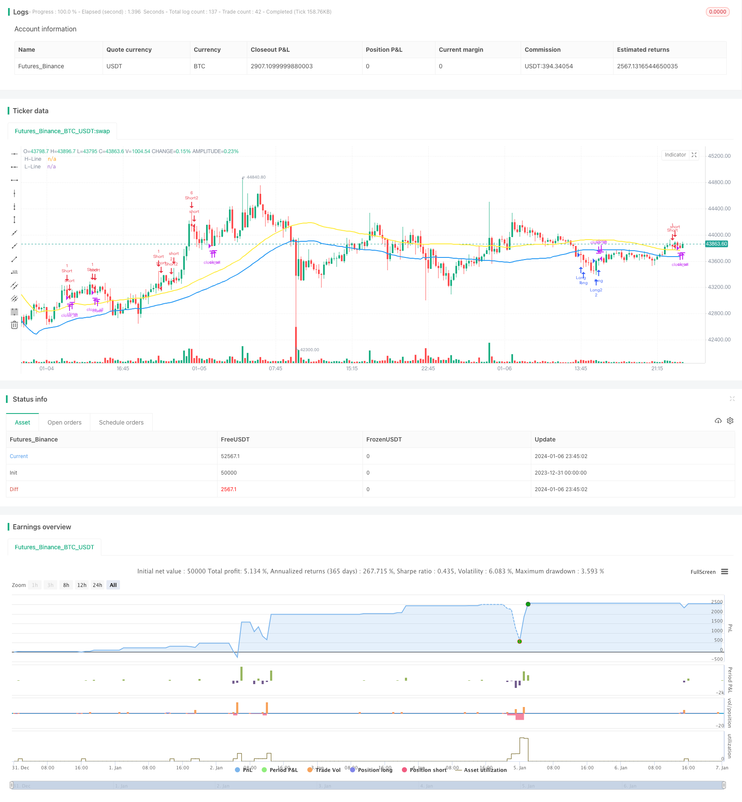

> Name

Quant-Strategy-with-Stochastic-Signal-SMA-Filter-and-Random-Stop-loss-take-profit
> Author

ChaoZhang

> Strategy Description


[trans]

## Overview
The name of this strategy is "DayLight Hunter two-way opening random stop loss profit quantification strategy". The main idea of ​​this strategy is to use Stochastic indicators to generate buy and sell signals, filter them with SMA moving averages, realize two-way opening of positions, and set random stop-loss and stop-profit points to achieve profits.
## Strategy Principle
This strategy uses the intersection of the %K and %D lines of the 5-day Stochastic indicator to generate trading signals. When the %K line crosses the %D line from bottom to top, a buy signal is generated; when the %K line crosses the %D line from top to bottom, a sell signal is generated. In order to filter out false signals, the strategy also introduces a SMA with a length of 50, which generates a buy signal only when the closing price is lower than the SMA low, and a sell signal when the closing price is higher than the SMA high.
When a buy signal is received, the strategy will open a long position with a fixed amount; when a sell signal is received, if it is a unilateral trading mode, the previous long order will be closed and a short order will be opened; if it is a hedging mode, a short order will be added directly for hedging. For each trading unit, the strategy will set a random stop loss and take profit point. Specifically, a certain percentage of the current price will be used as the profit stop point, and a certain percentage of the loss will be used as the stop loss point. This can lock in profits and control risks.
## Strategic Advantages
The biggest advantage of this strategy is that it uses the signal of the Stochastic indicator and SMA filtering to achieve two-way trading with a low false alarm rate. This provides a greater opportunity for profit. In addition, the random stop-profit and stop-loss mechanism of the strategy can stop the profit in time after making a profit to prevent all profits from returning to zero; it can also stop the loss when a large loss occurs to reduce the loss. Therefore, overall, the strategy has greater profit potential and better risk control.
## Risk Analysis
The main risk of this strategy is that the Stochastic indicator can generate false signals, which can lead to unnecessary losses. In addition, the randomly set take-profit and stop-loss points may be too aggressive, causing the take-profit and stop-loss to be taken too early or too late, thus affecting profits. Finally, failure to stop losses in time in hedging transactions will also lead to increased losses.
In order to reduce risks, it is recommended to optimize the parameters of the SMA moving average and filter out more false signals. In addition, you can consider combining other indicators to judge market trends and avoid contrarian trading. Finally, it is necessary to set a reasonable stop loss range and set an independent stop loss point for the hedging unit to control risks.
## Optimization direction
This strategy can be optimized from the following aspects:
1. Optimize the parameters of the Stochastic indicator and find the best parameter combination to reduce false signals.
2. Optimize or add other technical indicators to assist the Stochastic indicator in determining trends. For example, MACD, KD, etc.
3. Use machine learning and other methods to study the accuracy, winning rate and other indicators of the Stochastic signal under different parameters to find its optimal parameter space.
4. Optimize the random take-profit and stop-loss algorithm to make it more intelligent and dynamic. For example, combine ideas such as trailing stop loss and balance management.
5. Add a position control module so that positions can be dynamically adjusted based on strategic performance, market environment and other factors.
## Summarize
"DayLight Hunter two-way opening random stop-loss profit quantification strategy" comprehensively uses the cross signal of the Stochastic indicator, SMA filtering principle, two-way opening ideas and random stop-loss and take-profit methods. It has the advantages of relatively accurate signals, many two-way trading opportunities, flexible stop-profit and stop-loss, and the risks are also controllable. By further optimizing parameter settings, indicator combinations and risk control modules, this strategy can achieve more stable and outstanding performance. It provides a very worthy reference example for quantitative trading practice.
||

## Overview

The strategy is named "DayLight Hunter Quant Strategy with Two-way Position, Stochastic Signal and Random Stop loss/take profit". The main idea is to generate trading signals with Stochastic indicator, filter the signals with SMA, implement two-way position opening, and set random stop loss and take profit points to lock in profits.  

## Strategy Logic

The strategy uses 5-day Stochastic Indicator %K and %D line crossovers to generate trading signals. When %K crosses over %D from below, a buy signal is generated. When %K crosses below %D from above, a sell signal is generated. To filter false signals, 50-day SMA lines are used - only when close price is below SMA low point, a buy signal is valid; only when close price is above SMA high point, a sell signal is valid.

Upon receiving a buy signal, the strategy will open long position with fixed quantity. Upon receiving a sell signal, if in one-way trading mode, it will close previous long position and open short position. If in hedging mode, it will simply open additional short position to hedge. For every trading unit, random stop loss and take profit points are set based on certain percentage of current price. This allows locking in profits and controlling risks.

## Advantages

The biggest advantage of this strategy is it uses Stochastic signals with SMA filter to achieve relatively low false signal rate in two-way trading. This provides more profit opportunities. In addition, the random stop loss/take profit mechanism allows taking profit in time after making profits, avoiding giving back all profits; and cutting losses in case of huge loss, to reduce loss. In summary, the strategy has larger profit margin and better risk control.  

## Risks

Main risks of this strategy include false signals of Stochastic indicator may lead to unnecessary losses; improper random stop loss/take profit points may be too aggressive, causing premature or late exit, impacting profitability; inability to cut loss in time in hedging trades can lead to amplification of losses.

To reduce risks, parameters of SMA filter can be optimized to filter out more false signals. Also consider combining other indicators to determine market trends to avoid trading against trends. Finally, reasonable stop loss range should be set, and independent stop loss points should be used for hedging units to control risk.

## Optimization Directions 

The strategies can be optimized in the following aspects:

1. Optimize parameters of Stochastic to find best parameter combination to reduce false signals.

2. Optimize or add other technical indicators to aid Stochastic in determining trends, e.g. MACD, KD etc.  

3. Use machine learning models to study metrics like accuracy, win rate etc of Stochastic signals under different parameters, to find optimal parameter space.

4. Optimize the random stop loss/take profit algorithms to make them more intelligent and dynamic, e.g. incorporate concepts like moving stop loss, position sizing etc.

5. Add position sizing module, allowing dynamic position adjustments based on performance, market regimes etc.

## Conclusion

The “DayLight Hunter Quant Strategy with Two-way Position, Stochastic Signal and Random Stop loss/take profit” combines Stochastic crossover signals, SMA filter principle, two-way trading and random stop loss/take profit method. It has advantages like relatively accurate signals, abundant two-way trading opportunities, flexible stop loss/profit taking, and risks within acceptable range. Further optimizations on parameter tuning, indicator combinations and risk control modules can help achieve more stable and better performance. It provides a very good reference case for quantitative trading practice.

[/trans]

> Strategy Arguments


|Argument|Default|Description|
|----|----|----|
|v_input_string_3|0|Position: bottom_center|middle_right|bottom_right|top_center|middle_center|top_right|middle_left|bottom_left|
|v_input_string_4|0|size: auto|tiny|small|normal|
|v_input_color_1|blue|color_Net|
|v_input_string_1|0|(?Mode Trade)⚖️ Mode For Trade [Oneway / Hedge]: Hedge|Oneway|
|v_input_string_2|0|⚖️ Risk Signal Mode [Low / Medium / High]: Low Risk|Medium Risk|High Risk|
|v_input_int_1|15|(?Stochastic Setting)%K Length|
|v_input_int_2|3|%K Smoothing|
|v_input_int_3|3|%D Smoothing|
|v_input_bool_1|true|(?SMA Filter Mode)SMA High and Low Filter Mode|
|v_input_int_4|50|SMA High|
|v_input_int_5|50|SMA Low|
|v_input_bool_2|true|(?=====??? TAKE PROFIT & STOP LOSS BY [%] ???=====)? Take Profit & Stop Loss By Percent (%)|
|v_input_float_1|false|? TP [LONG] % >> [Oneway Only]|
|v_input_float_2|false|? TP [SHORT] % >> [Oneway Only]|
|v_input_float_3|false|? Stop Loss %|
|v_input_float_4|true|? TP by PNL $ eg. (0.1 = 0.1$)|
|v_input_float_5|0.35|? Spread Point Size(Eg. 35 Point or 350 Point From Your Broker Digits)|
|v_input_int_6|500|(?===??? Hedge Mode ???===)? Hedge Point Range|
|v_input_float_6|2|✳️ Martingale For Hedge Multiply [default = 2]|
|v_input_1|timestamp(01 Jan 1945 00:00 +0000)|(?════════⌚⌚ INPUT BACKTEST TIME RANGE ⌚⌚════════)Start|
|v_input_2|timestamp(01 Jan 2074 23:59 +0000)|End|
|v_input_3|{{strategy.order.alert_message}}|(?═ Bot Setting ═ n >> If You Dont Use Bot Just Pass It)Alert Message for BOT|
|v_input_4|Input Your TimeFrame [1m, 15m, 1h, 4h, 1d ,1w]|TimeFrame Text Alert|
|v_input_bool_3|true|(?= PNL MONITOR SETTING =)Monitor Profit&Loss|


> Source (PineScript)

``` pinescript
/*backtest
start: 2023-12-31 00:00:00
end: 2024-01-07 00:00:00
period: 15m
basePeriod: 5m
exchanges: [{"eid":"Futures_Binance","currency":"BTC_USDT"}]
*/

//@version=5
var int slippage = 0
strategy("X48 - DayLight Hunter | Strategy | V.01.01", overlay=true, calc_on_order_fills = true, initial_capital = 50,default_qty_type = strategy.fixed, default_qty_value = 1, commission_type = strategy.commission.percent, commission_value = 0, currency = currency.USD, slippage = 0)

var bool hedge_mode = false
var int sto_buy = 0
var int sto_sell = 0

Trade_Mode = input.string(defval = "Hedge", title = "⚖️ Mode For Trade [Oneway / Hedge]", options = ["Oneway", "Hedge"], group = "Mode Trade", tooltip = "Oneway = Switching Position Type With Signal\nHedge Mode = Not Switching Position Type Unitl TP or SL")
Risk_Mode = input.string(defval = "Low Risk", title = "⚖️ Risk Signal Mode [Low / Medium / High]", options = ["Low Risk", "Medium Risk", "High Risk"], group = "Mode Trade", tooltip = "[[Signal Form Stochastic]]\nLow Risk is >= 80 and <= 20\nMedium Risk is >= 70 and <= 30\nHigh Risk is >= 50 and <=50")

if Trade_Mode == "Oneway"
    hedge_mode := false
else
    hedge_mode := true

if Risk_Mode == "Low Risk"
    sto_buy := 20
    sto_sell := 80
else if Risk_Mode == "Medium Risk"
    sto_buy := 30
    sto_sell := 70
else if Risk_Mode == "High Risk"
    sto_buy := 50
    sto_sell := 50

periodK = input.int(15, title="%K Length", minval=1, group = "Stochastic Setting", inline = "Sto0")
smoothK = input.int(3, title="%K Smoothing", minval=1, group = "Stochastic Setting", inline = "Sto0")
periodD = input.int(3, title="%D Smoothing", minval=1, group = "Stochastic Setting", inline = "Sto0")

SMA_Mode = input.bool(defval = true, title = "SMA High and Low Filter Mode", group = "SMA Filter Mode", tooltip = "Sell Signal With Open >= SMA High\nBuy Signal With Close <= SMA Low")
SMA_High = input.int(defval = 50, title = "SMA High", group = "SMA Filter Mode", inline = "SMA1")
SMA_Low = input.int(defval = 50, title = "SMA Low", group = "SMA Filter Mode", inline = "SMA1")

k = ta.sma(ta.stoch(close, high, low, periodK), smoothK)
d = ta.sma(k, periodD)
high_line = ta.sma(high, SMA_High)
low_line = ta.sma(low, SMA_Low)
plot(SMA_Mode ? high_line : na, "H-Line", color = color.yellow, linewidth = 2)
plot(SMA_Mode ? low_line : na, "L-Line", color = color.blue, linewidth = 2)

entrybuyprice = strategy.position_avg_price

var bool longcondition = na
var bool shortcondition = na

if SMA_Mode == true
    longcondition := ta.crossover(k,d) and d <= sto_buy and close < low_line and open < low_line// or ta.crossover(k, 20)// and close <= low_line
    shortcondition := ta.crossunder(k,d) and d >= sto_sell and close > high_line and open > high_line// or ta.crossunder(k, 80)// and close >= high_line
else
    longcondition := ta.crossover(k,d) and d <= sto_buy
    shortcondition := ta.crossunder(k,d) and d >= sto_sell
//longcondition_double = ta.crossover(d,20) and close < low_line// and strategy.position_size > 0
//shortcondition_double = ta.crossunder(d,80) and close > high_line// and strategy.position_size < 0

//=============== TAKE PROFIT and STOP LOSS by % =================

tpsl(percent) =>
    strategy.position_avg_price * percent / 100 / syminfo.mintick
GR4 = "=====??? TAKE PROFIT & STOP LOSS BY [%] ???====="
mode= input.bool(title="? Take Profit & Stop Loss By Percent (%)", defval=true, group=GR4, tooltip = "Take Profit & Stop Loss by % Change\n0 = Disable")
tp_l = tpsl(input.float(0, title='? TP [LONG] % >> [Oneway Only]', group=GR4, tooltip = "0 = Disable"))
tp_s = tpsl(input.float(0, title='? TP [SHORT] % >> [Oneway Only]', group=GR4, tooltip = "0 = Disable"))
sl = tpsl(input.float(0, title='? Stop Loss %', group=GR4, tooltip = "0 = Disable"))
tp_pnl = input.float(defval = 1, title = "? TP by PNL $ eg. (0.1 = 0.1$)", group = GR4)
spread_size = input.float(defval = 0.350, title = "? Spread Point Size(Eg. 35 Point or 350 Point From Your Broker Digits)", tooltip = "Spread Point Form Your Broker \nEg. 1920.124 - 1920.135 or 1920.12 - 1920.13\nPlease Check From Your Broker", group = GR4)

GR5 = "===??? Hedge Mode ???==="
//hedge_mode = input.bool(defval = true, title = "⚖️ Hedge Mode", group = GR5)
hedge_point = input.int(defval = 500, title = "? Hedge Point Range", group = GR5, tooltip = "After Entry Last Position And Current Price More Than Point Range Are Open New Hedge Position")
hedge_gale = input.float(defval = 2.0, title = "✳️ Martingale For Hedge Multiply [default = 2]", tooltip = "Martingale For Multiply Hedge Order", group = GR5)
hedge_point_size = hedge_point/100

calcStopLossPrice(OffsetPts) =>
    if strategy.position_size > 0
        strategy.position_avg_price - OffsetPts * syminfo.mintick
    else if strategy.position_size < 0
        strategy.position_avg_price + OffsetPts * syminfo.mintick
    else
        na

calcStopLossL_AlertPrice(OffsetPts) =>
    strategy.position_avg_price - OffsetPts * syminfo.mintick
calcStopLossS_AlertPrice(OffsetPts) =>
    strategy.position_avg_price + OffsetPts * syminfo.mintick

calcTakeProfitPrice(OffsetPts) =>
    if strategy.position_size > 0
        strategy.position_avg_price + OffsetPts * syminfo.mintick
    else if strategy.position_size < 0
        strategy.position_avg_price - OffsetPts * syminfo.mintick
    else
        na

calcTakeProfitL_AlertPrice(OffsetPts) =>
    strategy.position_avg_price + OffsetPts * syminfo.mintick
calcTakeProfitS_AlertPrice(OffsetPts) =>
    strategy.position_avg_price - OffsetPts * syminfo.mintick

var stoploss = 0.
var stoploss_l = 0.
var stoploss_s = 0.
var takeprofit = 0.
var takeprofit_l = 0.
var takeprofit_s = 0.
var takeprofit_ll = 0.
var takeprofit_ss = 0.

if mode == true
    if (strategy.position_size > 0)
        if sl > 0
            stoploss := calcStopLossPrice(sl)
            stoploss_l := stoploss
        else if sl <= 0
            stoploss := na
        if tp_l > 0
            takeprofit := tp_l
            takeprofit_ll := close + ((close/100)*tp_l)
            //takeprofit_s := na
        else if tp_l <= 0
            takeprofit := na
    if (strategy.position_size < 0)
        if sl > 0
            stoploss := calcStopLossPrice(sl)
            stoploss_s := stoploss
        else if sl <= 0
            stoploss := na
        if tp_s > 0
            takeprofit := tp_s
            takeprofit_ss := close - ((close/100)*tp_s)
            //takeprofit_l := na
        else if tp_s <= 0
            takeprofit := na
    else if strategy.position_size == 0
        stoploss := na
        takeprofit := na
        //takeprofit_l := calcTakeProfitL_AlertPrice(tp_l)
        //takeprofit_s := calcTakeProfitS_AlertPrice(tp_s)
        //stoploss_l := calcStopLossL_AlertPrice(sl)
        //stoploss_s := calcStopLossS_AlertPrice(sl)

//////////// INPUT BACKTEST RANGE ////////////////////////////////////////////////////
var string BTR1         = '════════⌚⌚ INPUT BACKTEST TIME RANGE ⌚⌚════════'
i_startTime             = input(defval = timestamp("01 Jan 1945 00:00 +0000"), title = "Start", inline="timestart", group=BTR1, tooltip = 'Start Backtest YYYY/MM/DD')
i_endTime               = input(defval = timestamp("01 Jan 2074 23:59 +0000"), title = "End", inline="timeend", group=BTR1, tooltip = 'End Backtest YYYY/MM/DD')
//////////////// Strategy Alert For X4815162342 BOT //////////////////////
Text_Alert_Future = '{{strategy.order.alert_message}}'
copy_Fu = input( defval= Text_Alert_Future ,    title="Alert Message for BOT", inline = '00'  ,group = '═ Bot Setting ═ \n >> If You Dont Use Bot Just Pass It' ,tooltip = 'Alert For X48-BOT > Copy and Paste To Alert Function')
TimeFrame_input = input(defval= 'Input Your TimeFrame [1m, 15m, 1h, 4h, 1d ,1w]' ,    title="TimeFrame Text Alert", inline = '00'  ,group = '═ Bot Setting ═ \n >> If You Dont Use Bot Just Pass It')
string Alert_EntryL = '? Asset : {{ticker}} \n? Status : {{strategy.market_position}}\n? TimeFrame : '+str.tostring(TimeFrame_input)+'\n? Price : {{strategy.order.price}} $\n✅ TP : '+str.tostring(takeprofit_ll)+' $\n❌ SL : '+str.tostring(stoploss_l)+' $\n⏰ Time : {{timenow}}'
string Alert_EntryS = '? Asset : {{ticker}} \n? Status : {{strategy.market_position}}\n? TimeFrame : '+str.tostring(TimeFrame_input)+'\n? Price : {{strategy.order.price}} $\n✅ TP : '+str.tostring(takeprofit_ss)+' $\n❌ SL : '+str.tostring(stoploss_s)+' $\n⏰ Time : {{timenow}}'
string Alert_TPSL = '? Asset : {{ticker}}\n? TimeFrame : '+str.tostring(TimeFrame_input)+'\n? {{strategy.order.comment}}\n? Price : {{strategy.order.price}} $\n⏰ Time : {{timenow}}'

if true
    if longcondition
        strategy.entry("Long", strategy.long, comment = "?", alert_message = Alert_EntryL)
    //if longcondition_double
    //    //strategy.cancel_all()
    //    strategy.entry("Long2", strategy.long, comment = "??")
    //    //strategy.exit("Exit",'Long', qty_percent = 100 , profit = takeprofit, stop = stoploss, comment_profit = "TP?L", comment_loss = "SL?L")
    if shortcondition
        strategy.entry("Short", strategy.short, comment = "?", alert_message = Alert_EntryS)
        //strategy.exit("Exit",'Short', qty_percent = 100, profit = takeprofit, stop = stoploss, comment_profit = "TP❤️️S", comment_loss = "SL❤️️S")
    //if shortcondition_double
    //    //strategy.cancel_all()
    //    strategy.entry("Short2", strategy.short, comment = "??")

if strategy.position_size > 0 and strategy.opentrades >= 1 and hedge_mode == true
    entrypricel = strategy.opentrades.entry_price(strategy.opentrades - 1)
    callpointsize =  entrypricel - close
    lastsize = strategy.position_size
    if callpointsize >= hedge_point_size and longcondition
        strategy.order("Long2", strategy.long, qty = lastsize * hedge_gale, comment = "?⌛", alert_message = Alert_EntryL)

else if strategy.position_size < 0 and strategy.opentrades >= 1 and hedge_mode == true
    entryprices = strategy.opentrades.entry_price(strategy.opentrades - 1)
    callpointsize = (entryprices - close)* -1
    lastsize = (strategy.position_size) * -1
    if callpointsize >= hedge_point_size and shortcondition
        strategy.order("Short2", strategy.short, qty = lastsize * hedge_gale, comment = "?⌛", alert_message = Alert_EntryS)

last_price_l = (strategy.opentrades.entry_price(strategy.opentrades - 1) + (strategy.opentrades.entry_price(strategy.opentrades - 1)/100) * takeprofit) + spread_size
last_price_s = (strategy.opentrades.entry_price(strategy.opentrades - 1) - (strategy.opentrades.entry_price(strategy.opentrades - 1)/100) * takeprofit) - spread_size 
current_price = request.security(syminfo.tickerid, "1", close)
current_pricel = request.security(syminfo.tickerid, "1", close) + spread_size
current_prices = request.security(syminfo.tickerid, "1", close) - spread_size
//if mode == true
if strategy.position_size > 0 and strategy.openprofit >= tp_pnl and mode == true and hedge_mode == true
    lastsize = strategy.position_size
    lastprofitorder = strategy.openprofit
    //if lastprofitorder >= 0.07
    //strategy.close('Long', qty = lastsize, comment = "TP?L", alert_message = Alert_TPSL, immediately = true)
    strategy.cancel_all()
    strategy.close_all(comment = "TP?PNL", alert_message = Alert_TPSL, immediately = true)
    //strategy.close_all(comment = "TP?LH", alert_message = Alert_TPSL)
    //strategy.exit("Exit",'Long2', qty_percent = 100, profit = last_price_l, stop = stoploss, comment_profit = "TP?LH", comment_loss = "SL?LH", alert_message = Alert_TPSL)
    //strategy.exit("Exit",'Long', qty_percent = 100, profit = last_price_l, stop = stoploss, comment_profit = "TP?L", comment_loss = "SL?L", alert_message = Alert_TPSL)
else if strategy.position_size > 0 and strategy.openprofit < tp_pnl and mode == true and hedge_mode == true
    strategy.exit("Exit",'Long', qty_percent = 100, stop = stoploss, comment_loss = "SL?%L", alert_message = Alert_TPSL)

if strategy.position_size > 0 and mode == true and hedge_mode == false
    //strategy.close_all(comment = "TP?LH", alert_message = Alert_TPSL, immediately = true)
    strategy.exit("Exit",'Long', qty_percent = 100, profit = takeprofit, stop = stoploss, comment_profit = "TP?%L", comment_loss = "SL?%L", alert_message = Alert_TPSL)
    //strategy.exit("Exit",'Long', qty_percent = 100, profit = takeprofit, stop = stoploss, comment_profit = "TP?LL", comment_loss = "SL?L", alert_message = Alert_TPSL)

//else if strategy.position_size > 0 and strategy.opentrades > 1
//    lastsize = strategy.position_size
//    lastprofitorder = strategy.openprofit
//    if lastprofitorder >= 0.07
//        strategy.close_all(comment = "TP?LL", alert_message = Alert_TPSL)
if strategy.position_size < 0 and strategy.openprofit >= tp_pnl and mode == true and hedge_mode == true
    lastsize = (strategy.position_size) * -1
    lastprofitorder = strategy.openprofit
    //if lastprofitorder >= 0.07
    //strategy.close('Short', qty = lastsize, comment = "TP❤️️S", alert_message = Alert_TPSL, immediately = true)
    strategy.cancel_all()
    strategy.close_all(comment = "TP❤️️PNL", alert_message = Alert_TPSL, immediately = true)
    //strategy.close_all(comment = "TP❤️️SH", alert_message = Alert_TPSL)
    //strategy.exit("Exit",'Short2', qty_percent = 100, profit = last_price_s, stop = stoploss, comment_profit = "TP❤️️SH", comment_loss = "SL❤️️SH", alert_message = Alert_TPSL)
    //strategy.exit("Exit",'Short', qty_percent = 100, profit = last_price_s, stop = stoploss, comment_profit = "TP❤️️S", comment_loss = "SL❤️️S", alert_message = Alert_TPSL)
else if strategy.position_size < 0 and strategy.openprofit < tp_pnl and mode == true and hedge_mode == true
    strategy.exit("Exit",'Short', qty_percent = 100, stop = stoploss, comment_loss = "SL❤️️%S", alert_message = Alert_TPSL)
if strategy.position_size < 0 and mode == true and hedge_mode == false
    //strategy.close_all(comment = "TP❤️️SH", alert_message = Alert_TPSL, immediately = true)
    strategy.exit("Exit",'Short', qty_percent = 100, profit = takeprofit, stop = stoploss, comment_profit = "TP❤️️%S", comment_loss = "SL❤️️%S", alert_message = Alert_TPSL)
    //strategy.exit("Exit",'Short', qty_percent = 100, profit = takeprofit, stop = stoploss, comment_profit = "TP❤️️S", comment_loss = "SL❤️️S", alert_message = Alert_TPSL)

//else if strategy.position_size < 0 and strategy.opentrades > 1
//    lastsize = (strategy.position_size) * -1
//    lastprofitorder = strategy.openprofit
//    if lastprofitorder >= 0.07
//        strategy.close_all(comment = "TP❤️️SS", alert_message = Alert_TPSL)

//===================== เรียกใช้  library =========================
import X4815162342/X48_LibaryStrategyStatus/2 as fuLi 
//แสดงผล Backtest

show_Net = input.bool(true,'Monitor Profit&Loss', inline = 'Lnet', group = '= PNL MONITOR SETTING =')
position_ = input.string('bottom_center','Position', options = ['top_right','middle_right','bottom_right','top_center','middle_center','bottom_center','middle_left','bottom_left'] , inline = 'Lnet')
size_i = input.string('auto','size', options = ['auto','tiny','small','normal'] , inline = 'Lnet') 
color_Net = input.color(color.blue,"" , inline = 'Lnet')
// fuLi.NetProfit_Show(show_Net , position_ , size_i,  color_Net )

```

> Detail

https://www.fmz.com/strategy/438050

> Last Modified

2024-01-08 16:07:02
