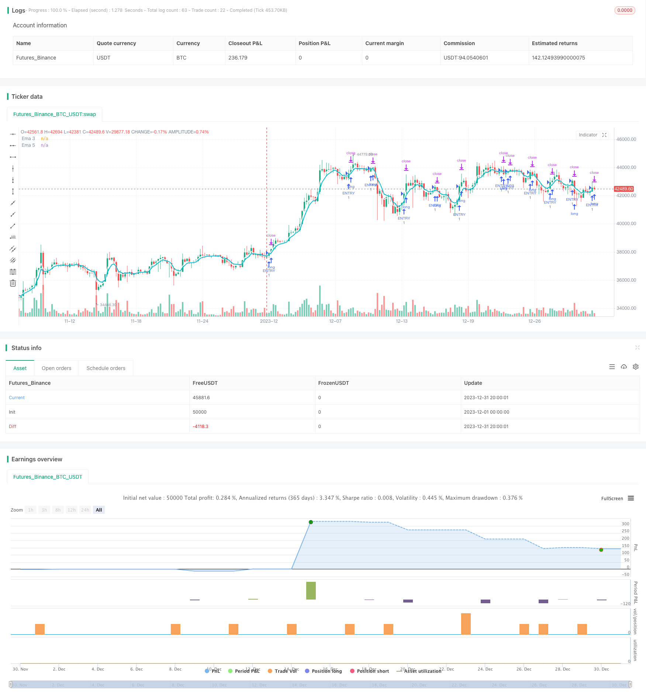

> Name

Quant-Trading-Strategy-Based-on-Moving-Average-Crossover
> Author

ChaoZhang

> Strategy Description


 [trans]
## Overview
This strategy is constructed using the Golden Cross and Death Cross principle of the Simple Moving Average (SMA). The strategy uses the golden cross on the 3-day line and the 5-day line as the entry signal, and uses stop loss or take profit as the exit signal.
## Strategy Principle
This strategy is mainly based on two SMAs, namely the 3-day line and the 5-day line. Among them, the 3-day line represents the short-term trend, and the 5-day line represents the longer medium-term trend. When there is a rapid short-term rise, that is, when the 3-day line crosses the 5-day line, it means that the market is currently rising, and you enter the market to go long at this time; conversely, when there is a short-term decline, that is, when the 3-day line crosses the 5-day line, it means that the market is currently in a decline, and you enter the market to go short at this time. In this way, by capturing the intersection of price changes in the short-term and mid-term periods to judge the market, the success rate of entry can be improved.
## Advantage Analysis
This strategy has the following advantages:
1. The strategy logic is simple and clear, easy to understand and implement.
2. The moving average crossover strategy is more accurate in judging the general trend of the market and has a high probability of entry.
3. Selecting two moving averages with different periods can better grasp the changes in the market.
4. Implemented a stop-profit and stop-loss mechanism to effectively control losses.
## Risk Analysis
This strategy also has certain risks:
1. Due to the use of a shorter moving average period, it is easily affected by short-term market fluctuations, which may increase the probability of stop loss.
2. The strategy is relatively mechanized and cannot be adjusted to special market conditions.
3. Failure to consider the trend judgment of the large cycle will cause the strategy to suffer greater losses in the long-term market downturn.
In order to reduce risks, you can consider optimizing the selection of moving averages for entry, or adding auxiliary judgments of long-period moving averages. At the same time, the stop-profit and stop-loss points can also be adjusted to make them more in line with the real market conditions.
## Optimization direction
This strategy can be optimized from the following aspects:
1. Add more moving averages of different periods to form multi-level screening and improve the stability of the strategy.
2. Add other technical indicators for judgment, such as MACD, strength indicators, etc., to assist in entry. 
3. Add judgment to the general cycle trend to avoid entering the long market in a long-term downward market.
4. Optimize the stop-profit and stop-loss points to better adapt to the actual fluctuations of the market.
5. Test a longer backtest cycle to evaluate parameter stability.
## Summarize
This strategy is built based on the moving average crossover principle, and adopts the strategic logic of golden cross entry and stop-profit and stop-loss exit. It is simple and easy to implement, and the backtest performance is relatively stable. By adding more auxiliary technical indicators, optimizing parameters, and expanding the scope of backtesting, the stability and profitability of the strategy can be further improved. Generally speaking, the moving average strategy has good market adaptability and is worthy of further research and application.
||

## Overview

This strategy is built based on the golden cross and dead cross principles of simple moving averages (SMA). It uses the golden cross of 3-day and 5-day lines as the entry signal and stop loss or take profit as the exit signal.

## Strategy Principle  

The strategy is mainly based on two SMAs, the 3-day line and the 5-day line. Among them, the 3-day line represents the short-term trend, and the 5-day line represents the longer mid-term trend. When the short term rises rapidly, that is, when the 3-day line crosses above the 5-day line, it indicates that the current market is in an upward trend. At this time, go long. On the contrary, when the short term falls rapidly, that is, when the 3-day line crosses below the 5-day line, it indicates that the current market is in a downward trend. At this time, go short. By capturing the crossover of price changes between the two cycles of short-term and medium-term, the market can be better judged and the probability of successful entry can be improved.

## Advantage Analysis  

The strategy has the following advantages:

1. The strategy logic is simple and clear, easy to understand and implement.
2. The moving average crossover strategy makes relatively accurate judgments on the overall market trend with high probability of successful entry.
3. Selecting moving averages of two different cycles can better grasp market changes. 
4. The implementation of take profit and stop loss mechanisms effectively controls losses.

## Risk Analysis

The strategy also has some risks:

1. Due to the use of shorter moving average cycles, it is prone to be affected by short-term market fluctuations, which may increase the probability of stop loss.
2. The strategy is relatively mechanized and cannot adapt to special market conditions.
3. It does not consider the judgment of long-term trends, which can cause the strategy to suffer greater losses in a long-term market downturn.

To reduce risks, we can consider optimizing the selection of entry moving averages, or adding auxiliary judgments of long-cycle moving averages. At the same time, the take profit and stop loss points can also be adjusted to better fit the real market conditions.

## Optimization Directions   

The strategy can be optimized in the following aspects:  

1. Increase more moving averages of different cycles to form multi-level screening to improve the stability of the strategy.
2. Add judgments of other technical indicators such as MACD, RSI, etc. to assist entry.
3. Add judgments on long-term trends to avoid going long in long-term downtrends. 
4. Optimize the take profit and stop loss points to better adapt to actual market fluctuations.
5. Test longer backtest periods to evaluate parameter stability.  

## Summary  

This strategy is constructed based on the principle of moving average crossover, adopting entry on golden cross and exit on stop loss or take profit. It is simple to implement and has relatively stable backtest results. By adding more auxiliary technical indicators, optimizing parameters, and expanding backtest range, etc., the stability and profitability of the strategy can be further enhanced. In general, the moving average strategy has good market adaptability and is worth further research and application.

[/trans]

> Strategy Arguments


|Argument|Default|Description|
|----|----|----|
|v_input_1|true|From Month|
|v_input_2|true|From Day|
|v_input_3|2018|From Year|
|v_input_4|true|To Month|
|v_input_5|true|To Day|
|v_input_6|9999|To Year|


> Source (PineScript)

``` pinescript
/*backtest
start: 2023-12-01 00:00:00
end: 2023-12-31 23:59:59
period: 5h
basePeriod: 15m
exchanges: [{"eid":"Futures_Binance","currency":"BTC_USDT"}]
*/

//@version=3
strategy(title="Revolut v1.0", overlay=true)

// === GENERAL INPUTS ===
ATR = atr(3)
ema3 = ema(close, 3)
ema5 = ema(close, 5)

// === INPUT BACKTEST RANGE ===
FromMonth = input(defval = 1, title = "From Month", minval = 1, maxval = 12)
FromDay   = input(defval = 1, title = "From Day", minval = 1, maxval = 31)
FromYear  = input(defval = 2018, title = "From Year", minval = 2017)
ToMonth   = input(defval = 1, title = "To Month", minval = 1, maxval = 12)
ToDay     = input(defval = 1, title = "To Day", minval = 1, maxval = 31)
ToYear    = input(defval = 9999, title = "To Year", minval = 2017)

// === FUNCTION EXAMPLE ===
start     = timestamp(FromYear, FromMonth, FromDay, 00, 00)  // backtest start window
finish    = timestamp(ToYear, ToMonth, ToDay, 23, 59)        // backtest finish window
window()  => true// create function "within window of time"


// === PLOTTING ===
plot(ema3, title="Ema 3", color = white, linewidth = 2, transp=0)
plot(ema5, title="Ema 5", color = aqua, linewidth = 2, transp=0)


// === ENTRY POSITION LOGIC ===
entryCondition = crossover(ema(close, 3), ema(close, 5))
if (entryCondition)
    strategy.entry("ENTRY", strategy.long, when=window())
    

// === EXIT POSTION LOGIC ===
//strategy.exit("Take Profit", "ENTRY", profit=6, loss=5, when=window())
strategy.exit("Take Profi Or STOP", "ENTRY", profit = 6, loss = 5, when=window())
  

// #####################################
// We can start to incorperate this into the script later
// We can program a emergency exit price
//strategy.close_all()

// You can use this if you want another exit
//strategy.exit("2nd Exit", "ENTRY", profit=1500, stop=500, when=window())


```

> Detail

https://www.fmz.com/strategy/439701

> Last Modified

2024-01-23 11:05:50
