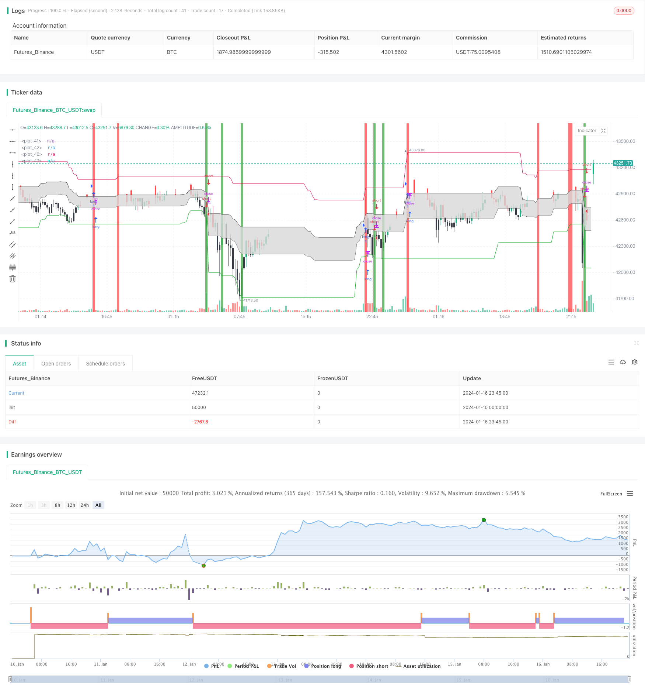

> Name

Quant-Trading-Support-and-Resistance-Cloud-Indicator Quant-Trading-Support-and-Resistance-Cloud-Indicator
> Author

ChaoZhang

> Strategy Description


 [trans]
## Overview
This indicator is designed to identify key support and resistance levels in the market and plot support and resistance clouds on the chart to represent the areas between these points. This indicator combines statistical analysis and graphical display, and can assist traders in determining trend reversal points and breakthroughs. It is a commonly used auxiliary analysis tool.
## Principle
The core logic of this indicator is to statistically calculate the highest and lowest prices within a certain time period to identify potential support and resistance levels. The calculation formula is as follows:
1. Count the highest price periodHigh and lowest price periodLow within the input period
2. Calculate the middle price periodCenter = (periodHigh+periodLow)/2
3. Calculate the 0.382 regression line period0382 = periodLow + (periodHigh-periodLow)*0.382
4. Calculate the 0.618 regression line period0618 = periodLow + (periodHigh-periodLow)*0.618
The above four lines constitute the key points of the indicator's support and resistance cloud. The indicator uses color filling to fill the cloud shape between the 0.382 line and the 0.618 line, visually displaying the fluctuation range and key price levels.
When the closing price is higher than the 0.618 line, the blockchain is white. On the contrary, when the closing price is lower than the 0.382 line, it is black, which is a sell and buy signal. The support and resistance clouds displayed by this indicator can be viewed as ranges of potential support and resistance levels. Price breaks above these upper and lower bounds usually indicate a trend reversal.
## Advantage Analysis
This support and resistance cloud form indicator has the following outstanding advantages:
1. Visually display key support and resistance levels and price fluctuation ranges to assist in determining trends and reversal points.
2. The filling form emphasizes the visual effect and is clear at a glance
3. Simple parameter setting, easy to master and adjust
4. Can be used in combination with other indicators to improve the effect
5. Suitable for various time period analysis
## Risk Analysis
It should be noted that this indicator also has some inherent flaws and usage risks:
1. Smooth curves may lag price changes
2. There may be misjudgments in the judgment of long and short positions.
3. Diagnosis and judgment need to be combined with other indicators to avoid single reliance.
4. Pay attention to the divergence of the breakthrough entity
5. Improper parameter settings may affect the effect
## Optimization direction
You can continue to optimize this indicator from the following dimensions:
1. Add adaptive parameter setting function
2. Combine with more statistical indicators to filter misjudgments
3. Add audio and message reminder modules
4. Add backtest analysis and evaluation module
5. Visual parameter adjustment module
6. Customized indicator combination template storage function
## Summarize
This support and resistance cloud shape indicator integrates statistical analysis and graphic display functions, which can effectively assist in determining key support and resistance levels and breakthrough points. But it cannot be relied on alone. It needs to be used in combination with a variety of other indicators to achieve maximum effectiveness. It can be optimized and upgraded from adaptive parameter settings, multi-index filter combination and other dimensions to improve practicality.
|| 

## Overview

This indicator aims to identify key support and resistance levels in the market and draw support and resistance clouds on the chart to represent the areas between these points. The indicator combines statistical analysis and graphical display to assist traders in determining trend reversal points and breakouts. It is a commonly used auxiliary analysis tool.

## Principle 

The core logic of this indicator is to statistically calculate the highest and lowest prices over a certain period of time to identify potential support and resistance levels. The calculation formulas are as follows:

1. Statistically calculate the highest price periodHigh and the lowest price periodLow over the input cycle  
2. Calculate the mid-price of the period periodCenter = (periodHigh+periodLow)/2
3. Calculate the 0.382 retracement period0382 = periodLow + (periodHigh-periodLow)*0.382  
4. Calculate the 0.618 retracement period0618 = periodLow + (periodHigh-periodLow)*0.618

The above four lines constitute the key points of the support/resistance cloud of this indicator. The indicator uses filled colors to fill cloud shapes between the 0.382 line and the 0.618 line, visually displaying the fluctuation range and key price levels.  

When the closing price is above the 0.618 line, the bar color is white, and conversely when it is below the 0.382 line, the bar color is black, which belongs to sell and buy signals. The support/resistance cloud displayed by this indicator can be seen as the range of potential support/resistance levels. Prices breaking through these upper and lower boundaries usually mean a trend reversal.

## Advantage Analysis

This support/resistance cloud indicator has the following outstanding advantages:

1. Intuitively displays key support/resistance levels and price fluctuation ranges to assist in judging trends and reversal points  
2. Filled shapes emphasize visual effects for clarity
3. Simple parameter settings, easy to master and adjust  
4. Can be combined with other indicators to improve efficacy 
5. Applicable to multi-cycle analysis

## Risk Analysis

It should be noted that this indicator also has some inherent deficiencies and risks:  

1. Smoothed curves may lag price changes
2. Multi-empty position judgments may be misjudged  
3. Need to be combined with other indicators for diagnosis and judgment to avoid reliance on a single one  
4. Need to pay attention to piercing and envelope dilemmas
5. Improper parameter settings may affect results

## Optimization Directions

This indicator can be further optimized in the following aspects:

1. Increase adaptive parameter setting functions
2. Combine more statistical indicators to filter misjudgements 
3. Add audio, message reminder modules
4. Increase backtesting analysis evaluation modules
5. Visual parameter tuning modules
6. Custom indicator portfolio template storage functions  

## Summary 

This support/resistance cloud indicator integrates statistical analysis and graphical display functions. It can effectively assist in determining key support/resistance levels and breakouts. However, it cannot rely solely on itself. It needs to be combined with other multiple indicators to maximize its usefulness. It can be upgraded from adaptive parameter settings, multi-indicator filtering combinations and other dimensions to improve practicality.

[/trans]

> Strategy Arguments


|Argument|Default|Description|
|----|----|----|
|v_input_1|50|Entry Period: |
|v_input_2|25|Exit period: |
|v_input_3|0.9999|Sensitivity|


> Source (PineScript)

``` pinescript
/*backtest
start: 2024-01-10 00:00:00
end: 2024-01-17 00:00:00
period: 15m
basePeriod: 5m
exchanges: [{"eid":"Futures_Binance","currency":"BTC_USDT"}]
*/

//@version=3
strategy("[IND] rang3r", overlay=true)
entP = input(50, "Entry Period: ")
exP = input(25, "Exit period: ")
sensitivity = input(0.9999, "Sensitivity")
periodHigh = 0.0
periodLow = 0.0
epH = 0.0
epL = 0.0

    
//Entry Trades
for i = 1 to (entP+1)
    if i == 1 
        periodHigh:=high[i]
    else
        if periodHigh < high[i]
            periodHigh:=high[i]
    

for i = 1 to (entP+1)
    if i == 1 
        periodLow:=low[i]
    else
        if periodLow > low[i]
            periodLow:=low[i]
                
s = high[1] > periodHigh*sensitivity and open > close //and (close[1] > open[1] ? open[1] : close[1]) > close
l = low[1] < periodLow*(1/sensitivity) and close > open //and (close[1] > open[1] ? close[1] : open[1]) < close

strategy.entry("long", strategy.long, when=s)
strategy.entry("short", strategy.short, when=l)

bgcolor(l ? green : na)
bgcolor(s ? red : na)

periodCenter = (periodHigh+periodLow)/2
period0618 = (periodLow)+(periodHigh-periodLow)*0.618
period0382 = (periodLow)+(periodHigh-periodLow)*0.382

cloud1 = plot(period0382, color=#494949)
cloud2 = plot(period0618, color=#494949)

fill(cloud1, cloud2, color=#d8d8d8)

plot(periodHigh, color=#d81751)
plot(periodLow, color=#0daa20)
//plot(periodCenter, color=#494949)

bc = close > period0618 ? white : (close < period0382 ? black : na)

barcolor(bc)
```

> Detail

https://www.fmz.com/strategy/439233

> Last Modified

2024-01-18 15:30:46
