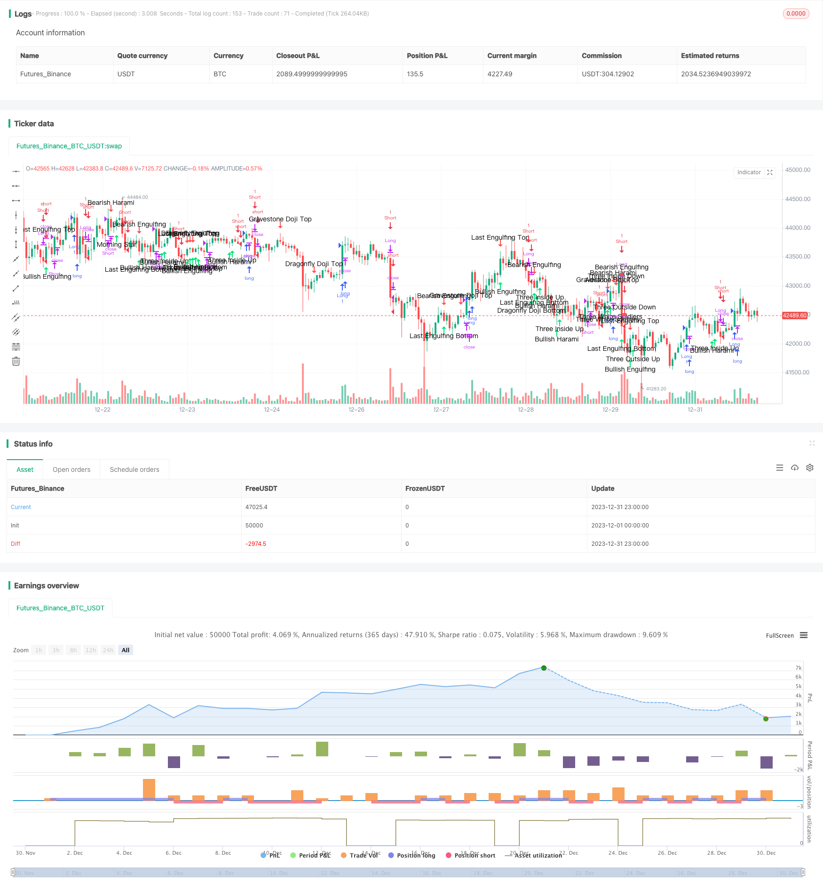

> Name

Quantitative-Candlestick-Pattern-and-Trend-Following-Strategy
> Author

ChaoZhang

> Strategy Description


 [trans]
## Overview
The name of this strategy is "Quantitative Trading Candlestick Pattern and Trend Following Strategy". This strategy combines the strategic ideas of candle pattern analysis and trend following trading.
The strategy mainly determines the current long and short situation of the market and possible turning points by identifying different candle patterns. Combining the tracking of the highest and lowest prices, entry and exit signals are formed to capture medium and long-term price trends.
## Strategy Principle
The strategy is mainly divided into the following modules:
1. Judgment of candle patterns    
The strategy first defines the elements of candles such as entities and shadow lines, and sets some parameters to identify more than 40 common candle patterns such as cross stars, morning stars, and three internal rises. When these patterns are identified, they are marked and judged as long or short signals.    
2. Trend judgment
The strategy uses the tracking of the highest price and the lowest price to determine the trend. When the price exceeds the highest price within N days, it is determined as an upward trend. When the price falls below the lowest price within N days, it is determined as a short trend.    
3. Entry and exit
The entry and exit rules are formed based on the long and short signals judged by the candle shape and combined with the breakthrough of the highest price and the lowest price in the trend judgment.    
For example, when a long candle pattern such as a hammer is identified and the price exceeds the highest price on N days, go long; when the price falls below the lowest price on N days, close the long order.    
4. Backtest range setting
The strategy finally completes the closed loop of the entire strategy logic by setting the start and end time of the backtest.
## Advantage Analysis
This strategy has the following advantages:
1. Combine patterns and trends
Taking advantage of the combination of candle pattern judgment and trend tracking, you can not only judge the possible turning point of the price through the pattern, but also determine the timing of entry through the trend.
2. Multiple form recognition
The strategy includes the identification of more than 40 common candle patterns, with wide coverage and more potential trading opportunities can be identified in different market environments.
3. High parameter adjustability
The parameters in the strategy, such as the number of days to track and the parameters for identifying patterns, can be adjusted independently, making it highly adaptable and easier to tune for specific markets.
4. Easy to expand
More morphological recognition modules can be directly expanded on the existing logic, or more factor judgment modules can be added to continue optimizing the strategy effect.
## Risk Analysis
This strategy also has the following risks:
1. The accuracy of shape recognition cannot be 100%
Judgment of candle patterns is not completely accurate, there is still a certain probability of misidentification, and trading signals may be triggered incorrectly.
2. Lack of stop loss module
The current strategy does not have stop-loss logic and cannot effectively control single losses. When trend judgment fails, it may bring large losses to the account.
3. Backtest data fitting risks
The current strategy effect may have a certain degree of fit to the data in the backtest range, and the performance in the real market may decline.
## Optimization direction
The main optimization directions of this strategy are as follows:
1. Add stop loss module
Adding stop loss strategies such as trailing stop loss and percentage stop loss can effectively control risks and limit the maximum loss in a single transaction.
2. Use machine learning to improve morphological judgment accuracy
Use machine learning algorithms to train models to improve the accuracy of candle pattern judgment and reduce the false signal rate.    
3. Multi-market verification
Test the robustness of strategies in more markets such as foreign exchange and digital currency markets to prevent backtest data fitting.
4. Combine more factors
More quantitative factors can be introduced, such as volume and price indicators, capital flow indicators, etc., to enrich the strategy logic and improve stability.
## Summarize
Generally speaking, this strategy, combined with candle pattern judgment and trend following trading, can capture the price trend while judging the market turning point, and achieve excess returns. The strategy optimization space is large and can be improved from risk control, machine learning, multi-factor and other aspects to make the strategy more robust and commercially valuable.
||

## Overview

The strategy is named "Quantitative Candlestick Pattern and Trend Following Strategy". It integrates the strategy ideas of candlestick pattern analysis and trend following trading.

The strategy mainly identifies different candlestick patterns to judge the current market sentiment and potential turning points. Combined with tracking the highest and lowest prices to form entry and exit signals and capture mid-to-long term price trends.

## Strategy Principle   

The main modules of this strategy are:   

1. Candlestick Pattern Identification
    
    The strategy first defines elements on the candlestick like the body, shadow, and sets some parameters to identify over 40 common candlestick patterns like Doji, Morning Star, Three Inside Up, etc. When these patterns are identified, marks will be plotted and judged as bullish or bearish signals.
    
2. Trend Identification  

    The strategy utilizes the tracking of highest and lowest prices in N days to determine the trend. When price breaks above the highest price in N days, it is judged as an uptrend. When price breaks below the lowest price in N days, it is judged as a downtrend.
    
3. Entry and Exit

    According to the bullish/bearish signals from candlestick pattern identification and the breakthrough of highest/lowest prices from trend identification, the strategy forms the entry and exit rules. 

    For example, when a bullish pattern like Hammer is identified and price breaks above the N-day highest price, go long. When price breaks below the N-day lowest price, close the long position.

4. Backtest Range Setting

    At last, the strategy sets the start and end time for backtest to complete the whole logical loop.  

## Advantage Analysis  

The advantages of this strategy:

1. Combination of Pattern and Trend

    Utilize both pattern identification and trend following, it can spot potential turning points through patterns and determine entry timing according to trends.

2. Broad Pattern Coverage  

    The strategy covers over 40 common candlestick patterns, which provides wider coverage in different market environments for more potential trading opportunities.
    
3. High Parameter Tunability

    The parameters like tracking days, pattern identification parameters are adjustable for users. It has better adaptivity and easier to tune for specific markets.
    
4. Easy to Expand

    It's easy to expand with more pattern identifications based on existing logic or add in more factors to further optimize the strategy performance.

## Risk Analysis   

The main risks of the strategy:

1. Accuracy of Pattern Identification 
    
    Candlestick pattern identification does not provide 100% accuracy, there are still probabilities of misidentification and wrong signal triggering.

2. Lack of Stop Loss Module 

    Currently there is no stop loss logic in the strategy, unable to control losses of single trades effectively. It may lead to huge losses when trend identification fails.

3. Data Fitting Risk of Backtest

    The current good results may have some data fitting risks towards the backtest data. Real trading performance may see a decrease.

## Optimization Directions   

The main optimization directions:

1. Add in Stop Loss Module

    Add in modules like moving stop loss, percentage stop loss etc. to effectively control risks and limit max loss per trade.

2. Utilize Machine Learning to Improve Accuracy of Pattern Identification

    Use machine learning algorithms to train models and improve accuracy of candlestick pattern identification, decrease misidentified signals.

3. Multi-Market Validation  

    Test the robustness of strategy on more markets like forex, crypto to avoid data fitting risks on single backtest.

4. Introduce More Factors

    Bring in more quant factors like volume-price indicators, money flow indicators to enrich strategy logic and improve stability.

## Conclusion  

Overall, this strategy combines candlestick pattern identification and trend following trading to spot potential turning points and capture price trends simultaneously to achieve alpha. There are ample optimization space from risk control, machine learning models to multi-factor models to make it more robust and valuable for actual trading.

[/trans]

> Strategy Arguments


|Argument|Default|Description|
|----|----|----|
|v_input_1|0.05|Doji size|
|v_input_2|true|From Month|
|v_input_3|true|From Day|
|v_input_4|2016|From Year|
|v_input_5|true|To Month|
|v_input_6|true|To Day|
|v_input_7|9999|To Year|
|v_input_8|20|enter_fast|
|v_input_9|10|exit_fast|
|v_input_10|10|exit_fast_short|


> Source (PineScript)

``` pinescript
/*backtest
start: 2023-12-01 00:00:00
end: 2023-12-31 23:59:59
period: 1h
basePeriod: 15m
exchanges: [{"eid":"Futures_Binance","currency":"BTC_USDT"}]
*/

//@version=3
strategy("Candle analysis & long/short strategy (HF) inspired by TurtleBC", shorttitle="TurtleBC-V.Troussel", overlay=true,initial_capital=1000)

//VARIABLES
body=close-open
range=high-low
middle=(open+close)/2
abody=abs(body)
ratio=abody/range
longcandle= (ratio>0.6)
bodytop=max(open, close)
bodybottom=min(open, close)
shadowtop=high-bodytop
shadowbottom=bodybottom-low

//Doji
DojiSize = input(0.05, minval=0.01, title="Doji size")
data=(abs(open - close) <= (high - low) * DojiSize)
plotchar(data, title="Doji", text='Doji', color=black)

//BULLISH SIGNALS
//Homing Pigeon
HomingPigeon=(body[1]<0 and body<0 and longcandle[1] and bodybottom>bodybottom[1] and bodytop<bodytop[1])
plotshape(HomingPigeon, title= "Homing Pigeon", location=location.belowbar, color=lime, style=shape.arrowup, text="Homing\nPigeon")

//Dragonfly Doji Bottom
DragonflyDojiBottom=(body[1]<0 and longcandle[1] and low<low[1] and shadowbottom>3*abody and shadowtop<shadowbottom/3)
plotshape(DragonflyDojiBottom, title= "Dragonfly Doji Bottom", location=location.belowbar, color=lime, style=shape.arrowup, text="Dragonfly\nDoji\nBottom")

//Concealing Baby Swallow
ConcealingBabySwallow=(body[3]<0 and body[2]<0 and body[1]<0 and body<0 and ratio[3]>0.8 and ratio[2]>0.8 and ratio>0.8 and open[1]<close[2] and high[1]>close[2] and shadowtop[1]>0.6*(abody[1]+shadowbottom[1]) and bodybottom<bodybottom[1] and bodytop>high[1])
plotshape(ConcealingBabySwallow, title= "Concealing Baby Swallow", location=location.belowbar, color=lime, style=shape.arrowup, text="Concealing\nBaby\nSwallow")

//Gravestone Doji Bottom
GravestoneDojiBottom=(body[1]<0 and longcandle[1] and low<low[1] and shadowtop>3*abody and shadowbottom<shadowtop/3)
plotshape(GravestoneDojiBottom, title= "Gravestone Doji Bottom", location=location.belowbar, color=lime, style=shape.arrowup, text="Gravestone\nDoji\nBottom")

//Last Engulfing Bottom
LastEngulfingBottom=(body[1]>0 and body<0 and bodybottom<bodybottom[1] and bodytop>bodytop[1] and longcandle)
plotshape(LastEngulfingBottom, title= "Last Engulfing Bottom", location=location.belowbar, color=lime, style=shape.arrowup, text="Last\nEngulfing\nBottom")

//Bullish Harami Cross
BullishHaramiCross=(body[1]<0 and longcandle[1] and bodybottom>bodybottom[1] and bodytop<bodytop[1] and ratio<0.3 and range<0.3*range[1])
plotshape(BullishHaramiCross, title= "Bullish Harami Cross", location=location.belowbar, color=lime, style=shape.arrowup, text="Bullish\nHarami\nCross")

//Three Stars in the South
ThreeStarsInTheSouth=(body[2]<0 and body[1]<0 and body<0 and shadowtop[2]<range[2]/4 and shadowbottom[2]>abody[2]/2 and low[1]>low[2] and high[1]<high[2] and abody[1]<abody[2]  and shadowtop[1]<range[1]/4 and shadowbottom[1]>abody[1]/2 and low>low[1] and high<high[1] and abody<abody[1] and shadowtop<range/4 and shadowbottom<range/4)
plotshape(ThreeStarsInTheSouth, title= "Three Stars In TheSouth", location=location.belowbar, color=lime, style=shape.arrowup, text="Three\nStars\nIn\nThe\nSouth")

//Bullish Breakaway
BullishBreakaway=(body[4]<0 and body[3]<0 and body>0 and open[3]<close[4] and close[2]<close[3] and close[1]<close[2] and longcandle and close<close[4] and close>open[3])
plotshape(BullishBreakaway, title= "Bullish Breakaway", location=location.belowbar, color=lime, style=shape.arrowup, text="Bullish\nBreakaway")

//Hammer
Hammer=(body[1]<0 and longcandle[1] and low<low[1] and shadowbottom>2*abody and shadowtop<0.3*abody)
plotshape(Hammer, title= "Hammer", location=location.belowbar, color=lime, style=shape.arrowup, text="Hammer")

//Inverted Hammer
InvertedHammer=(body[1]<0 and longcandle[1] and low<low[1] and shadowtop>2*abody and shadowbottom<0.3*abody)
plotshape(InvertedHammer, title= "Inverted Hammer", location=location.belowbar, color=lime, style=shape.arrowup, text="Inverted\nHammer")

//Rising Three Methods
RisingThreeMethods=(body[4]>0 and body[3]<0 and body[1]<0 and body>0 and longcandle[4] and longcandle and close[2]<close[3] and close[1]<close[2] and high[2]<high[3] and high[1]<high[2] and low[1]>low[4] and open>close[1] and close>high[4] and close>high[3] and close>high[2] and close>high[1])
plotshape(RisingThreeMethods, title= "Rising Three Methods", location=location.belowbar, color=lime, style=shape.arrowup, text="Rising\nThree\nMethods")

//BullishThreeLineStrike
BullishThreeLineStrike=(body[3]>0 and body[2]>0 and body[1]>0 and body<0 and longcandle[3] and longcandle[2] and longcandle[1] and close[2]>close[3] and close[1]>close[2] and open>close[1] and close<open[3])
plotshape(BullishThreeLineStrike, title= "Bullish Three Line Strike", location=location.belowbar, color=lime, style=shape.arrowup, text="Bullish\nThreeLine\nStrike")

//Bullish Mat Hold
BullishMatHold=(body[4]>0 and body[3]<0 and body[1]<0 and body>0 and longcandle[4] and close[3]>close[4] and close[2]<close[3] and close[1]<close[2] and high[2]<high[3] and high[1]<high[2] and low[1]>low[4] and open>close[1] and close>high[4] and  close>high[3] and close>high[2] and close>high[1])
plotshape(BullishMatHold, title= "Bullish Mat Hold", location=location.belowbar, color=lime, style=shape.arrowup, text="Bullish\nMat\nHold")

//Doji Star Bottom
DojiStarBottom=(body[1]<0 and longcandle[1] and low<low[1] and open<close[1] and ratio<0.3 and range<0.3*range[1])
plotshape(DojiStarBottom, title= "Doji Star Bottom", location=location.belowbar, color=lime, style=shape.arrowup, text="Doji\nStar\nBottom")

//Morning Star
MorningStar=(body[2]<0 and body>0 and longcandle[2] and open[1]<close[2] and open>close[1] and ratio[1]<0.3 and abody[1]<abody[2] and abody[1]<abody and low[1]<low and low[1]<low[2] and high[1]<open[2] and high[1]<close)
plotshape(MorningStar,  title= "Morning Star", location=location.belowbar, color=lime, style=shape.arrowup, text="Morning\nStar")

//Abandoned Baby Bottom
AbandonedBabyBottom=(body[2]<0 and body>0 and longcandle[2] and ratio[1]<0.3 and high[1]<low[2] and high[1]<low)
plotshape(AbandonedBabyBottom,  title= "Abandoned Baby Bottom", location=location.belowbar, color=lime, style=shape.arrowup, text="Abandoned\nBaby\nBottom")

//Bullish Harami
BullishHarami=(body[1]<0 and body>0 and longcandle[1] and bodybottom>bodybottom[1] and bodytop<bodytop[1])
plotshape(BullishHarami,  title= "Bullish Harami", location=location.belowbar, color=lime, style=shape.arrowup, text="Bullish\nHarami")

//Three Inside Up
ThreeInsideUp=(body[2]<0 and body[1]>0 and body>0 and BullishHarami[1] and close>close[1])
plotshape(ThreeInsideUp,  title= "Three Inside Up", location=location.belowbar, color=lime, style=shape.arrowup, text="Three\nInside\nUp")

//Bullish Engulfing
BullishEngulfing=(body[1]<0 and body>0 and bodybottom<bodybottom[1] and bodytop>bodytop[1] and longcandle)
plotshape(BullishEngulfing, title= "Bullish Engulfing", location=location.belowbar, color=lime, style=shape.arrowup, text="Bullish\nEngulfing")

//Piercing Line
PiercingLine=(body[1]<0 and body>0 and longcandle[1] and longcandle and open<low[1] and close>middle[1] and close<open[1])
plotshape(PiercingLine, title= "Piercing Line", location=location.belowbar, color=lime, style=shape.arrowup, text="Piercing\nLine")

//Three Outside Up
ThreeOutsideUp=(body[2]<0 and body[1]>0 and body>0 and BullishEngulfing[1] and close>close[1])
plotshape(ThreeOutsideUp, title= "Three Outside Up", location=location.belowbar, color=lime, style=shape.arrowup, text="Three\nOutside\nUp")

//Three White Soldiers
ThreeWhiteSoldiers=(body[2]>0 and body[1]>0 and body>0 and high[1]>high[2] and high>high[1] and close[1]>close[2] and close>close[1] and open[1]>open[2] and open[1]<close[2] and open>open[1] and open<close[1])
plotshape(ThreeWhiteSoldiers, title= "Three White Soldiers", location=location.belowbar, color=lime, style=shape.arrowup, text="Three\nWhite\nSoldiers")

//BEARISH SIGNALS

//Evening Star
EveningStar=(body[2]>0 and body<0 and longcandle[2] and open[1]>close[2] and open<close[1] and ratio[1]<0.3 and abody[1]<abody[2] and abody[1]<abody and high[1]>high and high[1]>high[2] and low[1]>open[2] and low[1]>close)
plotshape(EveningStar, title= "Evening Star", color=red, style=shape.arrowdown, text="Evening\nStar")

//Dark Cloud Cover
DarkCloudCover=(body[1]>0 and body<0 and longcandle[1] and longcandle and open>high[1] and close<middle[1] and close>open[1])
plotshape(DarkCloudCover, title= "Dark Cloud Cover", color=red, style=shape.arrowdown, text="Dark\nCloud\nCover")

//Abandoned Baby Top
AbandonedBabyTop=(body[2]>0 and body<0 and longcandle[2] and ratio[1]<0.3 and low[1]>high[2] and low[1]>high)
plotshape(AbandonedBabyTop, title= "Abandoned Baby Top", color=red, style=shape.arrowdown, text="Abandoned\nBaby\nTop")

//Bearish Harami
BearishHarami=(body[1]>0 and body<0 and longcandle[1] and bodybottom>bodybottom[1] and bodytop<bodytop[1])
plotshape(BearishHarami, title= "Bearish Harami", color=red, style=shape.arrowdown, text="Bearish\nHarami")

//Descending Hawk
DescendingHawk=(body[1]>0 and body>0 and longcandle[1] and bodybottom>bodybottom[1] and bodytop<bodytop[1])
plotshape(DescendingHawk, title= "Descending Hawk", color=red, style=shape.arrowdown, text="Descending\nHawk")

//Bearish Engulfing
BearishEngulfing=(body[1]>0 and body<0 and bodybottom<bodybottom[1] and bodytop>bodytop[1] and longcandle)
plotshape(BearishEngulfing, title= "Bearish Engulfing", color=red, style=shape.arrowdown, text="Bearish\nEngulfing")

//Gravestone Doji Top
GravestoneDojiTop=(body[1]>0 and longcandle[1] and high>high[1] and shadowtop>3*abody and shadowbottom<shadowtop/3)
plotshape(GravestoneDojiTop, title= "Gravestone Doji Top", color=red, style=shape.arrowdown, text="Gravestone\nDoji\nTop")

//Shooting Star
ShootingStar=(body[1]>0 and longcandle[1] and high>high[1] and shadowtop>2*abody and shadowbottom<0.3*abody)
plotshape(ShootingStar, title= "Shooting Star", color=red, style=shape.arrowdown, text="Shooting\nStar")

//Hanging Man
HangingMan=(body[1]>0 and longcandle[1] and high>high[1] and shadowbottom>2*abody and shadowtop<0.3*abody)
plotshape(HangingMan, title= "Hanging Man", color=red, style=shape.arrowdown, text="Hanging\nMan")

//Bearish Three Line Strike
BearishThreeLineStrike=(body[3]<0 and body[2]<0 and body[1]<0 and body>0 and longcandle[3] and longcandle[2] and longcandle[1] and close[2]<close[3] and close[1]<close[2] and open<close[1] and close>open[3])
plotshape(BearishThreeLineStrike, title= "Bearish Three Line Strike", color=red, style=shape.arrowdown, text="Bearish\nThree\nLine\nStrike")

//Falling Three Methods
FallingThreeMethods=(body[4]<0 and body[3]>0 and body[1]>0 and body<0 and longcandle[4] and longcandle and close[2]>close[3] and close[1]>close[2] and low[2]>low[3] and low[1]>low[2] and high[1]<high[4] and open<close[1] and close<low[4] and close<low[3] and close<low[2] and close<low[1])
plotshape(FallingThreeMethods, title= "Falling Three Methods", color=red, style=shape.arrowdown, text="Falling\n\nThreeMethods")

//Three Inside Down
ThreeInsideDown=(body[2]>0 and body[1]<0 and body<0 and BearishHarami[1] and close<close[1])
plotshape(ThreeInsideDown, title= "Three Inside Down", color=red, style=shape.arrowdown, text="Three\nInside\nDown")

//Three Outside Down
ThreeOutsideDown=(body[2]>0 and body[1]<0 and body<0 and BearishEngulfing[1] and close<close[1])
plotshape(ThreeOutsideDown, title= "Three Outside Down", color=red, style=shape.arrowdown, text="Three\nOutside\nDown")

//Three Black Crows
ThreeBlackCrows=(body[2]<0 and body[1]<0 and body<0 and longcandle[2] and longcandle[1] and longcandle and low[1]<low[2] and low<low[1] and close[1]<close[2] and close<close[1] and open[1]<open[2] and open[1]>close[2] and open<open[1] and open>close[1])
plotshape(ThreeBlackCrows, title= "Three Black Crows", color=red, style=shape.arrowdown, text="Three\nBlack\nCrows")

//Upside Gap Two Crows
UpsideGapTwoCrows=(body[2]>0 and body[1]<0 and body<0 and longcandle[2] and open[1]>close[2] and bodytop>bodytop[1] and bodybottom<bodybottom[1] and close>close[2])
plotshape(UpsideGapTwoCrows, title= "Upside Gap Two Crows", color=red, style=shape.arrowdown, text="Upside\nGap\nTwo\nCrows")

//Last Engulfing Top
LastEngulfingTop=(body[1]<0 and body>0 and bodybottom<bodybottom[1] and bodytop>bodytop[1] and longcandle)
plotshape(LastEngulfingTop, title= "Last Engulfing Top", color=red, style=shape.arrowdown, text="Last\nEngulfing\nTop")

//Dragonfly Doji Top
DragonflyDojiTop=(body[1]>0 and longcandle[1] and high>high[1] and shadowbottom>3*abody and shadowtop<shadowbottom/3)
plotshape(DragonflyDojiTop, title= "Dragonfly Doji Top", color=red, style=shape.arrowdown, text="Dragonfly\nDoji\nTop")

//Bearish Harami Cross
BearishHaramiCross=(body[1]>0 and longcandle[1] and bodybottom>bodybottom[1] and bodytop<bodytop[1] and ratio<0.3 and range<0.3*range[1])
plotshape(BearishHaramiCross, title= "Bearish Harami Cross", color=red, style=shape.arrowdown, text="Bearish\nHarami\nCross")

//Advance Block
AdvanceBlock=(body[2]>0 and body[1]>0 and body>0 and high[2]<high[1] and high[1]<high and open[1]>bodybottom[2] and open[1]<bodytop[2] and open>bodybottom[1] and open<bodytop[1] and abody[1]<abody[2] and abody<abody[1])
plotshape(AdvanceBlock, title= "Advance Block", color=red, style=shape.arrowdown, text="Advance\nBlock")

//Bearish Breakaway
BearishBreakaway=(body[4]>0 and body[3]>0 and body<0 and open[3]>close[4] and close[2]>close[3] and close[1]>close[2] and longcandle and close>close[4] and close<open[3])
plotshape(BearishBreakaway, title= "Bearish Breakaway", color=red, style=shape.arrowdown, text="Bearish\nBreakaway")

//Two Crows

TwoCrows=(body[2]>0 and body[1]<0 and body<0 and longcandle[2] and open[1]>close[2] and close[1]>close[2] and open<bodytop[1] and open>bodybottom[1] and close<bodytop[2] and close>bodybottom[2])
plotshape(TwoCrows, title= "Two Crows", color=red, style=shape.arrowdown, text="Two\nCrows")


// === BACKTEST RANGE ===
FromMonth = input(defval = 1, title = "From Month", minval = 1)
FromDay   = input(defval = 1, title = "From Day", minval = 1)
FromYear  = input(defval = 2016, title = "From Year", minval = 2016)
ToMonth   = input(defval = 1, title = "To Month", minval = 1)
ToDay     = input(defval = 1, title = "To Day", minval = 1)
ToYear    = input(defval = 9999, title = "To Year", minval = 9999)

enter_fast = input(20, minval=1)
exit_fast = input(10, minval=1)
exit_fast_short=input(10,minval=1)


fastL = highest(close, enter_fast)
fastS = highest(close ,exit_fast_short)
fastLC = lowest(close, exit_fast)


//entrées et sorties pour long et short, le short utilise la sortie du long comme entrée
enterL1 = close > fastL[1]
exitL1 = close <= fastLC[1]
exitS=close>fastS[1]


strategy.entry("Long", strategy.long, when = enterL1 )
strategy.close("Long", when = exitL1)

strategy.entry("Short", strategy.short, when = exitL1)
strategy.close("Short", when = exitS)


```

> Detail

https://www.fmz.com/strategy/440564

> Last Modified

2024-01-31 17:24:30
