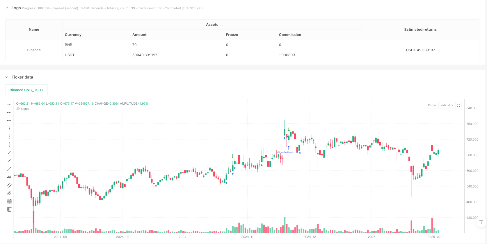
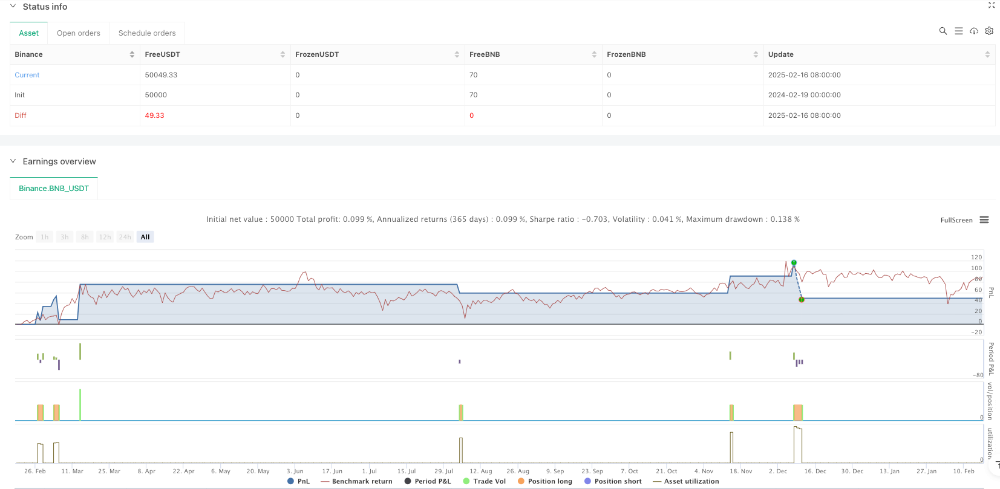

> Name

Quantitative-Momentum-Based-Micropullback-Breakout-Strategy
> Author

ianzeng123

> Strategy Description




[trans]
#### Overview
This strategy is a price momentum and volume based trading system that focuses on identifying minor pullback opportunities after a strong advance. The strategy works by monitoring short-term pullbacks after sharply rising green candles, entering trades when price signals a reversal. The system uses multiple filtering conditions, including trading volume, ATR volatility and callback amplitude limits, to improve the accuracy of transactions.
#### Strategy Principle
The core logic of the strategy is based on the principle of market momentum continuation and mainly includes the following key elements:
1. Identify strong rising candles through trading volume and ATR multiple. The trading volume is required to exceed 1.5 times the average volume and be greater than 200,000
2. Monitor the callback process after rising and limit the maximum number of consecutive red candles to 3.
3. Set the maximum retracement range to 50%. If it exceeds, the trading opportunity will be abandoned.
4. After the correction stabilizes, a long signal is triggered when the price breaks through the previous high.
5. Use OCO order combination to manage positions, including stop loss and profit targets
6. Stop loss is set below the retracement low, and the profit target is 2 times the risk
#### Strategic Advantages
1. Combines dual confirmation of price momentum and trading volume to improve signal reliability
2. Filter through strict callback conditions to avoid false breakthrough traps
3. Use objective technical indicators to reduce the impact of subjective judgments
4. Clear risk control mechanism and fixed risk-benefit ratio settings
5. The system has a high degree of automation and is suitable for batch trading of multiple varieties.
6. It has good scalability and is easy to add new filter conditions.
#### Strategy Risk
1. False signals may be frequently triggered when the market fluctuates violently.
2. The correction of strong stocks at high levels may exceed the preset limit
3. Trading volume conditions need to be dynamically adjusted under different market environments.
4. The stop loss level is set close and may be hit by market noise.
5. Profit targets may be too aggressive and difficult to fully achieve
6. A larger sample size is needed to verify the stability of the strategy
#### Strategy optimization direction
1. Introduce trend filters, such as moving average systems or trend indicators, to ensure trading in the main trend direction
2. Dynamically adjust the trading volume threshold to adapt to different market cycles
3. Optimize stop loss position settings, consider using multiples of ATR
4. Add time filters to avoid market opening and closing fluctuations
5. Introduce multi-time cycle confirmation to improve signal reliability
6. Develop an adaptive parameter system to adjust strategy parameters according to market conditions
#### Summary
This is a well-designed trend following strategy that can capture high-quality trading opportunities in the market through strict condition screening and risk management. The key to the success of the strategy lies in the optimization of parameters and the adaptive adjustment of the market environment. It is recommended to conduct sufficient backtest verification before real trading, and adjust parameters according to the characteristics of specific trading varieties. ||
#### Overview
This strategy is a trading system based on price momentum and volume, focusing on identifying micropullback opportunities after strong upward movements. The strategy monitors short-term pullbacks following large green candles and enters trades when price reversal signals appear. The system employs multiple filtering conditions, including volume, ATR volatility, and pullback magnitude restrictions, to enhance trading accuracy.

#### Strategy Principles
The core logic is based on market momentum continuation, incorporating the following key elements:
1. Identifies strong upward candles through volume and ATR multiples, requiring volume above 1.5x average and exceeding 200,000
2. Monitors pullback process after upward movement, limiting maximum consecutive red candles to 3
3. Sets maximum pullback magnitude at 50%, abandoning trade opportunities if exceeded
4. Triggers long signals when price breaks above previous high after pullback stabilization
5. Employs OCO order combination for position management, including stop-loss and profit targets
6. Sets stop-loss below pullback low, with profit target at 2x risk

#### Strategy Advantages
1. Combines price momentum and volume confirmation, improving signal reliability
2. Filters false breakouts through strict pullback conditions
3. Uses objective technical indicators, reducing subjective judgment impact
4. Clear risk control mechanism with fixed risk-reward ratio
5. High degree of system automation, suitable for batch trading multiple instruments
6. Good scalability, easy to add new filtering conditions

#### Strategy Risks
1. May trigger frequent false signals during market volatility
2. High-momentum stocks' pullbacks might exceed preset limits
3. Volume conditions require dynamic adjustment in different market environments
4. Stop-loss placement might be too tight, susceptible to market noise
5. Profit targets may be too aggressive, difficult to fully achieve
6. Requires large sample size to verify strategy stability

#### Strategy Optimization Directions
1. Introduce trend filters, such as moving average systems or trend indicators, to ensure trading with main trend
2. Dynamically adjust volume thresholds to adapt to different market cycles
3. Optimize stop-loss placement, consider using ATR multiples
4. Add time filters to avoid market opening and closing volatility
5. Incorporate multi-timeframe confirmation to improve signal reliability
6. Develop adaptive parameter system to adjust strategy parameters based on market conditions

#### Summary
This is a well-designed trend-following strategy that captures quality trading opportunities through strict condition screening and risk management. The key to strategy success lies in parameter optimization and adaptability to market conditions. It is recommended to conduct thorough backtesting before live trading and adjust parameters according to specific trading instrument characteristics.[/trans]


> Source (PineScript)

``` pinescript
/*backtest
start: 2024-02-19 00:00:00
end: 2025-02-17 08:00:00
period: 1d
basePeriod: 1d
exchanges: [{"eid":"Binance","currency":"BNB_USDT"}]
*/

//@version=6
strategy(title="Micropullback Detector w/ Stop Buy & Exits", shorttitle="MicroPB Det+Exits", overlay=true)

// USER INPUTS
volLookback = input.int(20, "Volume SMA Period", minval=1)
volMultiplier = input.float(1.5, "Volume Multiplier for High Volume", minval=1.0)
largeCandleATR = input.float(0.5, "Fraction of ATR to define 'Large Candle'", minval=0.1)
maxRedPullback = input.int(3, "Max Consecutive Red Candles in Pullback")
maxRetracementPc = input.float(50, "Max Retracement % for pullback", minval=1.0, maxval=100.0)

// CALCULATIONS
fastAtr = ta.atr(14)
avgVolume = ta.sma(volume, volLookback)
isLargeGreenCandle = (close > open) and ((close - open) > fastAtr * largeCandleATR) and (volume > avgVolume * volMultiplier) and (volume > 200000)

// HELPER FLAGS
isGreen = close >= open
isRed   = close < open

// STATE VARIABLES
var int   state = 0
var float waveStartPrice   = na
var float waveHighestPrice = na
var float largestGreenVol  = na
var int   consecutiveRedPulls = 0
var bool  triggerSignal    = false
var float wavePullbackLow  = na

if barstate.isnew
    triggerSignal:=false
    if state==0
        wavePullbackLow:=na
        if isLargeGreenCandle
            state:=1
            waveStartPrice:=open
            waveHighestPrice:=high
            largestGreenVol:=volume
            consecutiveRedPulls:=0
    else if state==1
        if isGreen
            waveHighestPrice:=math.max(waveHighestPrice,high)
            if volume>largestGreenVol
                largestGreenVol:=volume
        else
            state:=2
            consecutiveRedPulls:=1
            wavePullbackLow:=low
    else if state==2
        if isRed
            if volume>largestGreenVol
                state:=0
            consecutiveRedPulls+=1
            if consecutiveRedPulls>=maxRedPullback+1
                state:=0
            retracementLevel=waveStartPrice+(maxRetracementPc/100.0)*(waveHighestPrice-waveStartPrice)
            wavePullbackLow:=math.min(wavePullbackLow,low)
            if close<retracementLevel
                state:=0
        else
            consecutiveRedPulls:=0
            if high>high[1]
                triggerSignal:=true
                state:=3
    else if state==3
        state:=0

// Plot shapes for signals (last 1440 bars ~ 1 day at 1-min TF)
plotshape(isLargeGreenCandle, title="Large Green Candle", style=shape.diamond, location=location.belowbar, color=color.new(color.blue, 0), offset=0, size=size.small, show_last=1440)
plotshape(triggerSignal, title="MicroPB Entry", style=shape.arrowdown, location=location.abovebar, color=color.new(color.green, 0), offset=0, size=size.large, show_last=1440)

// ENTRY & EXITS
if triggerSignal
    // Stop Buy above the previous bar's high
    entryPrice = high[1]
    strategy.order("MicroPullback Long", strategy.long, limit=entryPrice, oca_name="MicroPullback")

    // Stoploss slightly below pullback low
    stopPrice = wavePullbackLow - 2*syminfo.mintick

    // Risk & take-profit calculations
    risk = entryPrice - stopPrice
    tpPrice = entryPrice + 2 * risk

    // Exit: stop or TP
    strategy.exit("SL+TP", "MicroPullback Long", stop=stopPrice, limit=tpPrice, qty_percent=100)

// ALERT
alertcondition(triggerSignal, title="MicroPullback LONG", message="Micropullback Long Signal Detected!")
```

> Detail

https://www.fmz.com/strategy/482666

> Last Modified

2025-02-19 17:25:25
