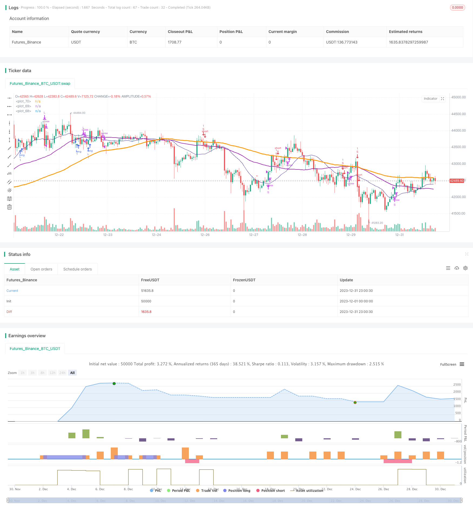

> Name

Support and Resistance Oscillation Trading Strategy Quantitative-Support-and-Resistance-Oscillation-Strategy
> Author

ChaoZhang

> Strategy Description


 [trans]
 
### Overview
This strategy achieves precise control of trading logic and accurate stop loss and profit by combining the crossover strategy of RSI and stochastic indicators, as well as the closing slippage optimization strategy. At the same time, by introducing signal optimization, you can better control the trend and achieve reasonable management of funds.
### Strategy Principles
1. The RSI indicator determines the overbought and oversold areas, and the golden cross and dead cross of the stochastic indicator K value and D value form a trading signal.
2. Introduce K-line classification recognition to assist in judging trend signals and avoid erroneous transactions. 
3. SMA moving average assists in determining the trend direction. When the short-term moving average breaks above the long-term moving average from bottom to top, it is a bullish signal.
4. Position closing slippage strategy, set stop-loss and take-profit prices based on the fluctuation range of the highest price and lowest price.
### Advantage Analysis
1. RSI indicator parameters are optimized to better determine overbought and oversold areas and avoid wrong transactions.
2. STO index parameter optimization and smoothness parameter adjustment can filter out noise and improve signal quality.
3. Introduce Heikin-Ashi technical analysis to identify changes in the direction of K-line entities to ensure the accuracy of trading signals
4. SMA moving average helps determine the direction of the general trend and avoid counter-trend trading.
5. Combined with the stop-profit and stop-loss slippage strategy, you can lock in the profit of each transaction to the greatest extent
### Risk Analysis
1. When the market continues to decline, funds face greater risks
2. Transaction frequency may be too high, increasing transaction costs and slippage costs
3. The RSI indicator can easily form false signals and should be filtered in combination with other indicators.
### Strategy optimization
1. Adjust RSI parameters to optimize overbought and oversold judgments
2. Adjust STO indicator parameters, smoothness and period to improve signal quality
3. Adjust the moving average cycle and optimize trend judgment
4. Introduce more technical indicators to improve the accuracy of signal judgment
5. Optimize the stop-loss and take-profit ratio to reduce the risk of a single transaction
### Summary
This strategy integrates the advantages of a variety of mainstream technical indicators, and achieves a balance between the quality of trading signals and stop-profit and stop-loss through parameter optimization and rule improvement. It has certain versatility and stable profitability. Through continuous optimization, the winning rate and profitability can be further improved.
||

### Overview
This strategy combines RSI crossover strategy with optimized stop loss strategy to achieve precise logic control and accurate stop loss and take profit. Meanwhile, by introducing signal optimization, it can better grasp the trend and achieve reasonable capital management.  

### Strategy Principle
1. RSI indicator determines overbought and oversold area. Combined with K and D value golden cross and dead cross to form trading signals.  
2. Introduces candlestick pattern recognition to assist in judging trend signals to avoid wrong trades.
3. SMA lines assist in determining trend direction. Uptrend when short period SMA breaks out upper long period SMA.   

### Advantage Analysis 
1. RSI parameter optimization determines overbought and oversold area precisely to avoid wrong trades.   
2. STO parameter optimization, smoothness adjustment filters out noise and improves signal quality.  
3. Heikin-Ashi technology introduced to recognize candlestick direction change and ensure accurate trading signals.   
4. SMA lines assist judging major trend direction, avoids trading against the trend.  
5. Stop loss strategy locks in maximum profit for each trade.   

### Risk Analysis
1. Facing greater risk when market continues going down.  
2. High trading frequency increases trading cost and slippage cost.  
3. RSI tends to generate false signals, needs filtering by other indicators.  

### Strategy Optimization  
1. Adjust RSI parameters, optimize overbought oversold judgement.  
2. Adjust STO parameters, smoothness and period to improve signal quality.   
3. Adjust moving average period to optimize trend judgement.  
4. Introduce more technical indicators to improve signal accuracy.   
5. Optimize stop loss ratio to reduce single trade risk.   

### Conclusion
The strategy integrates advantages of multiple mainstream technical indicators. Through parameter optimization and logic refinement, it balances trading signal quality and stop loss. With certain versatility and steady profitability. Further optimization can improve win rate and profitability.
[/trans]

> Strategy Arguments


|Argument|Default|Description|
|----|----|----|
|v_input_1|3|smoothK|
|v_input_2|3|smoothD|
|v_input_3|14|lengthRSI|
|v_input_4|14|lengthStoch|
|v_input_5|80|overbought|
|v_input_6|20|oversold|
|v_input_7|100|smaLengh|
|v_input_8|50|smaLengh2|
|v_input_9|20|smaLengh3|
|v_input_10_close|0|RSI Source: close|high|low|open|hl2|hlc3|hlcc4|ohlc4|
|v_input_11|2017|Backtest Start Year|
|v_input_12|true|Backtest Start Month|
|v_input_13|true|Backtest Start Day|


> Source (PineScript)

``` pinescript
/*backtest
start: 2023-12-01 00:00:00
end: 2023-12-31 23:59:59
period: 1h
basePeriod: 15m
exchanges: [{"eid":"Futures_Binance","currency":"BTC_USDT"}]
*/

//@version=4
//study(title="@sentenzal strategy", shorttitle="@sentenzal strategy", overlay=true)
strategy(title="@sentenzal strategy", shorttitle="@sentenzal strategy", overlay=true  )
smoothK = input(3, minval=1)
smoothD = input(3, minval=1)
lengthRSI = input(14, minval=1)
lengthStoch = input(14, minval=1)
overbought = input(80, minval=1)
oversold = input(20, minval=1)
smaLengh = input(100, minval=1)
smaLengh2 = input(50, minval=1)
smaLengh3 = input(20, minval=1)

src = input(close, title="RSI Source")
testStartYear = input(2017, "Backtest Start Year")
testStartMonth = input(1, "Backtest Start Month")
testStartDay = input(1, "Backtest Start Day")
testPeriodStart = timestamp(testStartYear,testStartMonth,testStartDay,0,0)
testPeriod() =>
    time >= testPeriodStart ? true : false

rsi1 = rsi(src, lengthRSI)
k = sma(stoch(rsi1, rsi1, rsi1, lengthStoch), smoothK)
d = sma(k, smoothD)
crossBuy = crossover(k, d) and k < oversold
crossSell = crossunder(k, d) and k > overbought

dcLower = lowest(low, 10)
dcUpper = highest(high, 10)


heikinashi_close = security(heikinashi(syminfo.tickerid), timeframe.period, close)
heikinashi_open = security(heikinashi(syminfo.tickerid), timeframe.period, open)
heikinashi_low = security(heikinashi(syminfo.tickerid), timeframe.period, low)
heikinashi_high = security(heikinashi(syminfo.tickerid), timeframe.period, high)
heikinashiPositive = heikinashi_close >= heikinashi_open

heikinashiBuy = heikinashiPositive == true and heikinashiPositive[1] == false  and heikinashiPositive[2] == false
heikinashiSell = heikinashiPositive == false and heikinashiPositive[1] == true and heikinashiPositive[2] == true

//plotshape(heikinashiBuy, style=shape.arrowup, color=green, location=location.belowbar, size=size.tiny)
//plotshape(heikinashiSell, style=shape.arrowdown, color=red, location=location.abovebar, size=size.tiny)

buy = (crossBuy == true or crossBuy[1] == true or crossBuy[2] == true) and (heikinashiBuy == true or heikinashiBuy[1] == true or heikinashiBuy[2] == true)
sell = (crossSell == true or crossSell[1] == true or crossSell[2] == true) and (heikinashiSell == true or heikinashiSell[1] == true or heikinashiSell[2] == true)

mult = timeframe.period == '15' ? 4 : 1
mult2 = timeframe.period == '240' ? 0.25 : mult

movingAverage = sma(close, round(smaLengh))
movingAverage2 = sma(close, round(smaLengh2))
movingAverage3 = sma(close, round(smaLengh3))

uptrend = movingAverage < movingAverage2 and movingAverage2 < movingAverage3 and close > movingAverage
downtrend = movingAverage > movingAverage2 and movingAverage2 > movingAverage3 and close < movingAverage

signalBuy = (buy[1] == false and buy[2] == false and buy == true) and uptrend
signalSell = (sell[1] == false and sell[2] == false and sell == true) and downtrend

takeProfitSell = (buy[1] == false and buy[2] == false and buy == true) and uptrend == false
takeProfitBuy = (sell[1] == false and sell[2] == false and sell == true)  and uptrend

plotshape(signalBuy, style=shape.triangleup, color=green, location=location.belowbar, size=size.tiny)
plotshape(signalSell, style=shape.triangledown, color=red, location=location.abovebar, size=size.tiny)


plot(movingAverage, linewidth=3, color=orange, transp=0)
plot(movingAverage2, linewidth=2, color=purple, transp=0)
plot(movingAverage3, linewidth=1, color=navy, transp=0)

alertcondition(signalBuy, title='Signal Buy', message='Signal Buy')
alertcondition(signalSell, title='Signal Sell', message='Signal Sell')


strategy.close("L", when=dcLower[1] > low)
strategy.close("S", when=dcUpper[1] < high)

strategy.entry("L", strategy.long, 1, when = signalBuy and testPeriod() and uptrend) 
strategy.entry("S", strategy.short, 1, when = signalSell and testPeriod() and uptrend ==false) 

//strategy.exit("Exit Long", from_entry = "L", loss = 25000000, profit=25000000)
//strategy.exit("Exit Short", from_entry = "S", loss = 25000000, profit=25000000)


```

> Detail

https://www.fmz.com/strategy/439993

> Last Modified

2024-01-25 15:53:06
