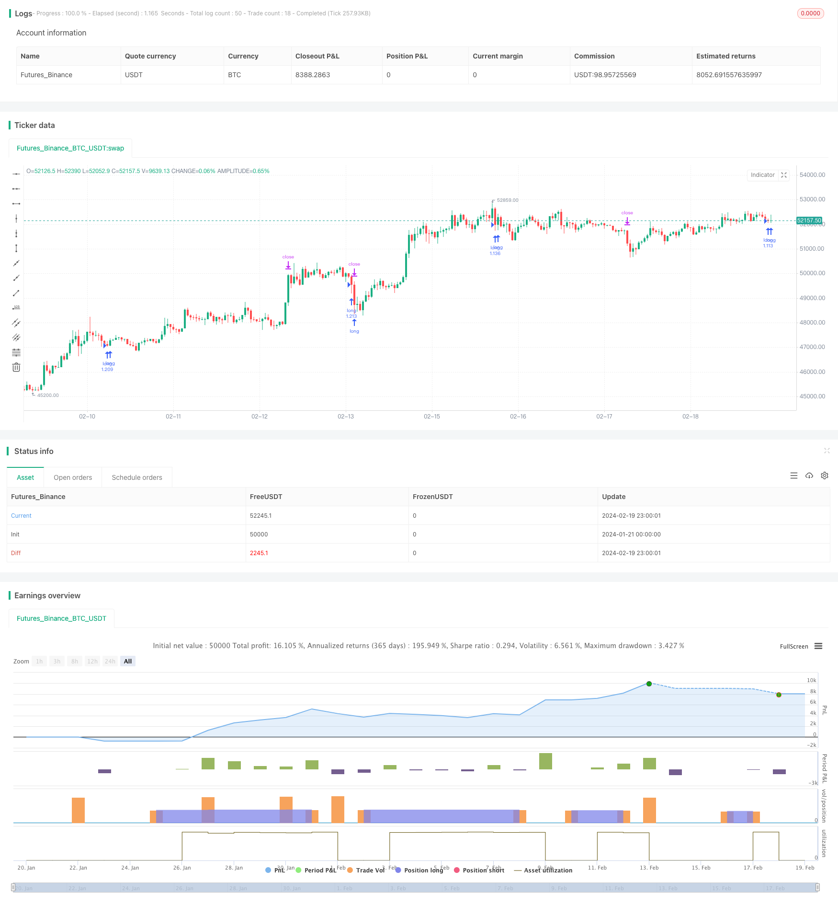

> Name

Quantitative-Trading-Strategy-Based-on-Double-Moving-Average-Crossover
> Author

ChaoZhang

> Strategy Description


[trans]
## Overview
The name of this strategy is "Quantitative Trading Strategy Double Moving Average Breakthrough Strategy". The main idea of ​​this strategy is to use the cross signals of the fast moving average and the slow moving average to judge the price trend and then make buying and selling decisions.
## Strategy Principle
The core indicators of this strategy are the fast moving average and the slow moving average. The strategy uses the intersection relationship between the fast moving average and the slow moving average to determine the price trend and use this to make buying and selling decisions.
Specifically, the fast moving average parameters are set to 24 periods, and the slow moving average parameters are set to 100 periods. When the fast moving average crosses the slow moving average from below, it means that the price has entered an upward trend, and the strategy will send a buy signal; when the fast moving average crosses the slow moving average from above, it means that the price has entered a downward trend, and the strategy will send a sell signal.
In this way, by judging the crossing direction of the fast and slow moving averages, you can effectively capture changes in price trends and assist in making buying and selling decisions.
## Strategic Advantages
This strategy has the following advantages:
1. The principle is simple to understand and easy to implement. Double moving average crossover is one of the most basic technical indicators and is easy to understand and apply.
2. Parameters are adjustable and adaptable. The parameters of the fast moving average and slow moving average can be adjusted according to the actual situation, making the strategy more flexible.
3. Strong ability to capture trend changes. Double moving average crossovers are often used to capture the turning point when prices move from consolidation into a trend.
4. It can effectively filter shocks and reduce invalid transactions. Double moving averages can be used to identify shock ranges and avoid repeated openings during shocks.

## Strategy Risk
There are also some risks with this strategy:
1. The double moving average crossover signal may lag. As a trend tracking indicator, the cross signal of the double moving average often lags behind by a certain period. This may result in some degree of opportunity cost.
2. False signals are prone to occur in volatile markets. The scenario where double moving averages perform best is when there is a clear trend in price. However, in a volatile market, frequent false signals are likely to occur.
3. Improper parameter settings may affect strategy performance. If the fast and slow moving average parameters are set improperly, it will affect the sensitivity of catching trend crossovers.
Corresponding solutions:
1. Appropriately shorten the moving average period and improve the sensitivity of the cross signal.
2. Add volatility or trading volume indicators for filtering to reduce invalid transactions in volatile markets.
3. Parameter optimization, finding the best parameter combination. Add machine learning and other methods to automatically optimize.
## Strategy optimization direction
This strategy can be optimized from the following aspects:
1. Use more advanced moving average technical indicators, such as linear weighted moving average, etc., to replace the simple moving average to improve the tracking and prediction capabilities of the indicator.
2. Add more auxiliary indicators, such as trading volume indicators, volatility indicators, etc., for joint filtering to reduce invalid signals.
3. Optimize fast and slow moving average parameters and improve parameter adaptability. Machine learning, stochastic optimization and other methods can be used to find optimal parameters.
4. After entering the market, stop loss points and trailing stops can be designed to control single losses. At the same time, profit optimization technology is added to ensure sufficient profits.
5. New technologies such as deep learning can be used to identify more complex price patterns and assist moving average crossovers in making buying and selling decisions, in order to achieve better results.
## Summarize
Generally speaking, this strategy is relatively classic and simple. It judges the price trend based on the double moving average indicator to explore opportunities for the price to transform from shock to trend. The advantages are clear thinking, simple and practical, and suitable for tracking trending market conditions. However, there are also some defects such as signal lag, etc., which require parameter adjustment and optimization to improve the stability and trading efficiency of the strategy. In general, this strategy is more suitable as a basic strategy, but it needs to be continuously optimized to adapt to more complex market environments.
||

## Overview

This strategy is named "Quantitative Trading Strategy Based on Double Moving Average Crossover". The main idea of this strategy is to use the cross signals between fast and slow moving average lines to determine price trends and make buying and selling decisions accordingly.  

## Strategy Principle   

The core indicators of this strategy are the fast and slow moving average lines. The strategy uses the crossover relationship between the fast and slow moving average lines to determine price trends and make trading decisions based on this.  

Specifically, the fast moving average line parameter is set to 24 periods, and the slow moving average line parameter is set to 100 periods. When the fast moving average line crosses above the slow moving average line from below, it indicates that prices are entering an upward trend, and the strategy will issue a buy signal at this time. When the fast moving average line crosses below the slow moving average line from above, it indicates that prices are entering a downward trend, and the strategy will issue a sell signal at this time.

By judging the crossover direction of the fast and slow moving average lines, price trend changes can be effectively captured to aid in making buy and sell decisions.

## Advantages of the Strategy

This strategy has the following advantages:

1. The principle is simple and easy to understand, easy to implement. Double moving average crossover is one of the most basic technical indicators and is easy to understand and apply.  

2. Adjustable parameters, high adaptability. The parameters of the fast and slow moving averages can be adjusted according to actual conditions, making the strategy more flexible.

3. Strong ability to capture trend changes. Double moving average crossovers are often used to capture turning points when prices move from consolidation to trend.

4. Can effectively filter out consolidations and reduce invalid trades. Double moving averages can be used to identify consolidation ranges and avoid repeated opening of positions during consolidations.

## Risks of the Strategy   

There are also some risks with this strategy:   

1. Double moving average crossover signals may lag. As trend tracking indicators, crossover signals of double moving averages often lag by a certain period, which can lead to a certain degree of opportunity cost.

2. Easy to produce false signals in oscillating markets. Double moving averages perform best when prices show a clear trend. But in oscillating markets, they tend to produce frequent fake signals.  

3. Improper parameter settings may affect strategy performance. If the fast and slow moving average parameters are set improperly, it will affect the sensitivity to capturing trend crossovers.

Corresponding solutions:

1. Appropriately shorten the moving average period to increase the sensitivity of crossover signals.

2. Add volatility or volume indicators for filtration to reduce invalid trades in oscillating markets.   

3. Parameter optimization to find the best parameter combinations. Add machine learning and other methods to automatically optimize.

## Directions for Strategy Optimization   

The strategy can be optimized in the following aspects:

1. Use more advanced moving average technical indicators such as Linear Weighted Moving Average to replace Simple Moving Average to improve the tracking and predictive capability of the indicators.

2. Add more auxiliary indicators such as volume and volatility indicators for joint filtering to reduce invalid signals. 

3. Optimize fast and slow moving average parameters to improve parameter adaptability. Methods such as machine learning and random optimization can be used to find the optimal parameters.  

4. After the strategy enters the market, stop loss points and trailing stop loss can be designed to control single loss. At the same time, add profit optimization techniques to ensure sufficient profits.

5. New technologies such as deep learning can be used to identify more complex price patterns to aid moving average crossovers in making buy and sell decisions, in order to obtain better results.  

## Summary   

In general, this strategy is relatively classic and simple. It determines price trends based on double moving average indicators to uncover opportunities when prices move from consolidation to trend. The advantages are clear logic and simplicity, suitable for tracking trending markets. But there are also some flaws like signal lag that need to be improved through parameter tuning and optimization to increase the stability and efficiency of the strategy. Overall, as a basic strategy, this is quite suitable, but needs continuous optimization to adapt to more complex market environments.

[/trans]

> Strategy Arguments


|Argument|Default|Description|
|----|----|----|
|v_input_string_1|0|(?Smoothing)Method: SMA|EMA|SMMA (RMA)|WMA|VWMA|
|v_input_int_1|20|Length|
|v_input_float_1|true|Limit|


> Source (PineScript)

``` pinescript
/*backtest
start: 2024-01-21 00:00:00
end: 2024-02-20 00:00:00
period: 1h
basePeriod: 15m
exchanges: [{"eid":"Futures_Binance","currency":"BTC_USDT"}]
*/

//@version=5
strategy('Pine Script Tutorial Example Strategy 1', overlay=true, initial_capital=100000, default_qty_value=100, default_qty_type=strategy.percent_of_equity)

//OBV
src = close
obv = ta.cum(math.sign(ta.change(src)) * volume)
ma(source, length, type) =>
    switch type
        "SMA" => ta.sma(source, length)
        "EMA" => ta.ema(source, length)
        "SMMA (RMA)" => ta.rma(source, length)
        "WMA" => ta.wma(source, length)
        "VWMA" => ta.vwma(source, length)
typeMA = input.string(title = "Method", defval = "SMA", options=["SMA", "EMA", "SMMA (RMA)", "WMA", "VWMA"], group="Smoothing")
smoothingLength = input.int(title = "Length", defval = 20, minval = 1, maxval = 100, group="Smoothing")
Limit = input.float(title = "Limit", defval = 1, minval = 0.1, maxval = 10, group="Smoothing")
smoothingLine_ma = ma(obv,smoothingLength, typeMA)
obv_diff = (obv-smoothingLine_ma)*100/obv

//PVT
var cumVolp = 0.
cumVolp += nz(volume)
if barstate.islast and cumVolp == 0
    runtime.error("No volume is provided by the data vendor.")
srcp = close
vt = ta.cum(ta.change(srcp)/srcp[1]*volume)
smoothingLine_map = ma(vt,smoothingLength, typeMA)
pvt_diff = (vt-smoothingLine_map)*100/vt

// plot(obv_diff+close+100 ,title="OBV_DIFF", color = color.rgb(255, 118, 54))
// plot(pvt_diff+close+80 ,title="PVT_DIFF", color = color.rgb(223, 61, 255))

indicator = (pvt_diff+obv_diff)/2
goLongCondition1 = ta.crossover(indicator,Limit)
timePeriod = time >= timestamp(syminfo.timezone, 2023,1, 1, 0, 0)  // Backtesting Time
notInTrade = strategy.position_size <= 0
if goLongCondition1 and timePeriod and notInTrade
    stopLoss = low * 0.99 // -2%
    takeProfit = high * 1.05 // +5%
    strategy.entry('long', strategy.long )
    strategy.exit('exit', 'long', stop=stopLoss, limit=takeProfit)


// fastEMA = ta.ema(close, 24)
// slowEMA = ta.ema(close, 100)
// goLongCondition1 = ta.crossover(fastEMA, slowEMA)
// timePeriod = time >= timestamp(syminfo.timezone, 2018, 12, 15, 0, 0)
// notInTrade = strategy.position_size <= 0
// if goLongCondition1 and timePeriod and notInTrade
//     stopLoss = low * 0.97
//     takeProfit = high * 1.12
//     strategy.entry('long', strategy.long)
//     strategy.exit('exit', 'long', stop=stopLoss, limit=takeProfit)
// plot(fastEMA, color=color.new(color.blue, 0))
// plot(slowEMA, color=color.new(color.yellow, 0))
```

> Detail

https://www.fmz.com/strategy/442370

> Last Modified

2024-02-21 14:28:28
