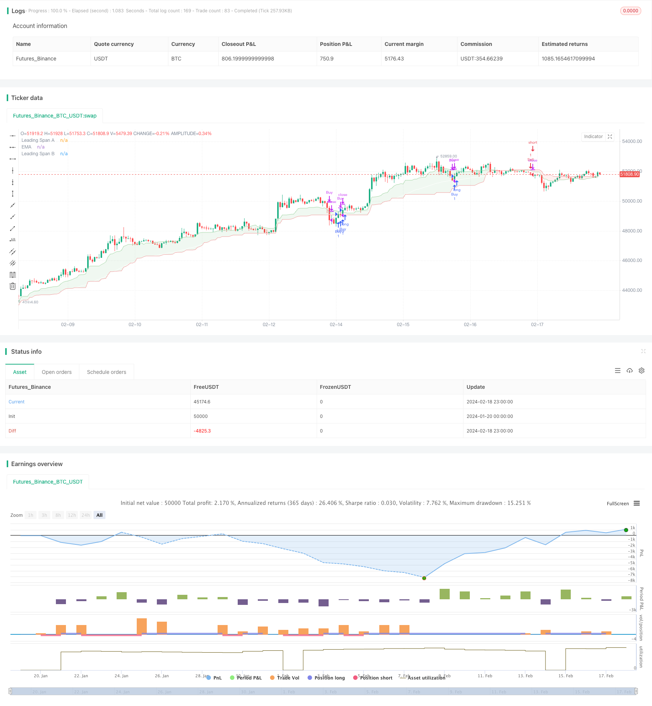

> Name

Quantitative-Trading-Strategy-Based-on-Ichimoku-Cloud-and-Moving-Average Based on Ichimoku-Cloud-and-Moving-Average
> Author

ChaoZhang

> Strategy Description


[trans]
## Overview
This strategy combines the Ichimoku equilibrium indicator and the implicit conflict indicator to implement a relatively simple quantitative trading strategy. A buy signal is generated when the Ichimoku Line is higher than the hidden conflict line and the closing price is higher than the Ichimoku Line; a sell signal is generated when the Ichimoku Line is lower than the hidden conflict line and the closing price is lower than the Ichimoku Line. This strategy is suitable for short-term trading of highly volatile assets such as cryptocurrencies.
## Strategy Principle
The Ichimoku equilibrium indicator consists of three curves: the forward line, the base line and the delay line. The forward line represents the average price of a certain recent period, the baseline represents the average price of a longer period, and the delay line is usually the average of the forward line and the baseline. When the short-term average price is higher than the long-term average price, it means that the current price is in an upward trend.
The implicit conflict indicator includes two curves, leading line A and leading line B. They represent averages of price fluctuations over periods of different lengths. When leading line A is higher than leading line B, it means that the volatility in the short term increases and the price has sufficient momentum to rise.
This strategy uses the Ichimoku equilibrium line to determine the general trend direction, the hidden conflict leading line to determine the price momentum, and combines it with the closing price to form an exact trading signal. Buy when there is an upward trend and the fluctuations amplify, and sell when there is a downward trend and the fluctuations shrink, thereby making a profit.
## Strategic Advantages
This is a relatively simple quantitative trading strategy, which has the following advantages:
1. Use a combination of indicators to comprehensively judge price trends and momentum, and the trading signals will be more reliable.
2. Only enter the market at certain breakthrough points to avoid too many invalid transactions. 
3. Suitable for short-term trading of highly volatile assets, which can make more profits.
4. The strategy logic is simple and easy to understand and modify.
5. More indicators can be easily expanded to form a multi-factor model.
## Risk Analysis
There are also some risks in this strategy, mainly including:
1. Mistrade risk. Stop loss must be set to control single losses.
2. Price reversal risk. Prices may reverse after the indicator signals, resulting in losses. Position conditions can be appropriately relaxed to reduce this risk.
3. Parameter optimization risks. Different parameters have a greater impact on the results, and multiple combination tests are needed to find the optimal parameters.
4. Risk of over-optimization. It performed well on historical data, but failed in actual transactions. The number of parameter combinations must be controlled to avoid over-optimization.
## Strategy optimization
This strategy can be optimized from the following aspects:
1. Test more combinations of indicators to find better parameters. Common ones include KDJ, BOLL, MACD, etc.
2. Add a stop loss mechanism. Set a trailing stop or multiple stop.
3. Optimize admission filtering conditions. Consider adding trading volume or volatility indicators, etc.  
4. Optimize position holding rules. You can try to shorten the stop loss time or increase the take profit range.
5. Add machine learning components. Use neural networks etc. to find better parameter combinations.
## Summarize
Overall, this strategy is a very simple quantitative trading strategy. It combines the Ichimoku equilibrium line and hidden conflict indicators to determine price trends and momentum to form trading signals. This strategy is suitable for short-term trading of highly volatile assets and can yield good returns. Of course, no strategy can be perfect. This strategy also has some room for optimization. It can be improved in terms of entry rules, stop loss mechanism, parameter selection, etc. to make it more effective.
||

## Overview

This strategy combines the Ichimoku Cloud indicator and the moving average indicator to implement a simple quantitative trading strategy. It generates buy signals when the conversion line is above the base line and the closing price is above the conversion line. It generates sell signals when the conversion line is below the base line and the closing price is below the conversion line. The strategy is suitable for short-term trading of high volatility assets like cryptocurrencies.  

## Strategy Logic

The Ichimoku Cloud contains three lines: the conversion line, the base line and the lagging span. The conversion line represents the short-term average price and the base line represents the long-term average price. The lagging span is usually the average of the conversion and base lines. When the short-term average is higher than the long-term average, it indicates an upward trend.

The Ichimoku Cloud also contains two leading lines: Leading Span A and Leading Span B. They represent the average range of price fluctuations over different periods. When Leading Span A is higher than Leading Span B, it indicates expanding volatility and upward momentum in the short term.

This strategy uses the conversion line to determine the overall trend direction and the leading lines to gauge momentum. It generates trading signals based on the trend, momentum and closing prices. It goes long when there is an upward trend and expanding volatility and goes short when there is a downward trend and contracting volatility.

## Advantages

The main advantages of this strategy are:

1. Uses a combination of indicators to provide reliable signals. 
2. Only enters on solid breakouts to avoid false signals.
3. Suitable for short-term trading volatile assets with high profit potential.  
4. Simple logic that is easy to understand and modify.
5. Easily extensible to a multi-factor model with more indicators.

## Risks

The main risks of this strategy are:  

1. Mistrade risk. Need to set stop loss to control loss per trade.
2. Price reversal risk. Price may reverse after signal is triggered. Can loosen holding conditions to reduce this risk.   
3. Parameter optimization risk. Results are sensitive to parameters. Need exhaustive combinatorial testing to find optimum.  
4. Overfitting risk. May perform very well historically but fail in actual trading. Need to constrain parameter combinations.

## Enhancement Opportunities 

Some ways in which this strategy can be enhanced:

1. Test combinations of more indicators like KDJ, BOLL, MACD to find better parameters.  
2. Incorporate stop loss mechanisms like moving stop loss or x times atr. 
3. Optimize entry filters with volume, volatility etc.
4. Tighten holding rules by reducing holding period or increasing profit taking target.
5. Introduce machine learning to find optimal parameter combinations using neural nets.

## Conclusion

In summary, this is a very simple quantitative trading strategy that combines Ichimoku Cloud and moving average to determine trend and momentum for trade signals. It is suitable for short-term trading volatile assets with good profit potential. Of course no strategy is perfect and this one has some room for improvement via entry rules, stop losses, parameter selection etc. to make it more robust.

[/trans]

> Strategy Arguments


|Argument|Default|Description|
|----|----|----|
|v_input_int_1|50|Length|
|v_input_1_close|0|Source: close|high|low|open|hl2|hlc3|hlcc4|ohlc4|
|v_input_int_2|9|Conversion Line Length|
|v_input_int_3|26|Base Line Length|
|v_input_int_4|52|Leading Span B Length|
|v_input_int_5|true|Lagging Span|


> Source (PineScript)

``` pinescript
/*backtest
start: 2024-01-20 00:00:00
end: 2024-02-19 00:00:00
period: 1h
basePeriod: 15m
exchanges: [{"eid":"Futures_Binance","currency":"BTC_USDT"}]
*/

//@version=5
strategy("Ichimoku Cloud + ema 50 Strategy", overlay=true)

len = input.int(50, minval=1, title="Length")
src = input(close, title="Source")
out = ta.ema(src, len)

conversionPeriods = input.int(9, minval=1, title="Conversion Line Length")
basePeriods = input.int(26, minval=1, title="Base Line Length")
laggingSpan2Periods = input.int(52, minval=1, title="Leading Span B Length")
displacement = input.int(1, minval=1, title="Lagging Span")

donchian(len) => math.avg(ta.lowest(len), ta.highest(len))
conversionLine = donchian(conversionPeriods)
baseLine = donchian(basePeriods)
leadLine1 = math.avg(conversionLine, baseLine)
leadLine2 = donchian(laggingSpan2Periods)

p1 = plot(leadLine1, offset = displacement - 1, color=#A5D6A7,
     title="Leading Span A")
p2 = plot(leadLine2, offset = displacement - 1, color=#EF9A9A,
     title="Leading Span B")
fill(p1, p2, color = leadLine1 > leadLine2 ? color.rgb(67, 160, 71, 90) : color.rgb(244, 67, 54, 90))

plot(out, title="EMA", color=color.white)

// Condition for Buy Signal
buy_signal = close > out and leadLine1 > leadLine2

// Condition for Sell Signal
sell_signal = close < out and leadLine2 > leadLine1

// Strategy entry and exit conditions
if (buy_signal)
    strategy.entry("Buy", strategy.long)
if (sell_signal)
    strategy.entry("Sell", strategy.short)

// Exit long position if candle closes below EMA 50
if (strategy.opentrades > 0)
    if (close < out)
        strategy.close("Buy")

// Exit short position if candle closes above EMA 50
if (strategy.opentrades < 0)
    if (close > out)
        strategy.close("Sell")

```

> Detail

https://www.fmz.com/strategy/442275

> Last Modified

2024-02-20 17:12:35
