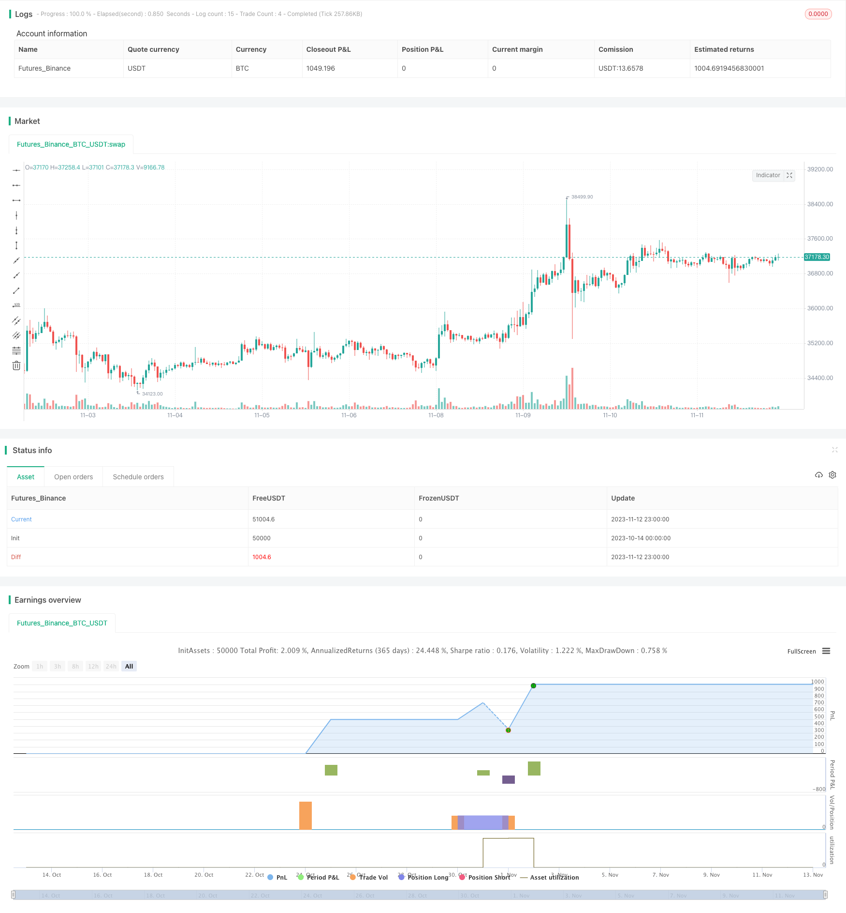

> Name

Quantitative-Trading-Strategy-Based-on-Improved-Vortex-Indicator
> Author

ChaoZhang

> Strategy Description



[trans]

## Overview
This strategy is an improved version of the turbine indicator strategy. Based on the original turbine indicator, it adds a number of new functions, including triggering buy and sell signals based on thresholds, using EMA to smooth the turbine line, adding stop loss and take profit, and realizing long only, short only or two-way trading, etc. This strategy is suitable for investors who wish to utilize the improved Turbo indicator for quantitative trading.
## Principle
The core indicator of this strategy is an improved version of the Turbo indicator. The traditional turbine indicator forms positive and negative turbine lines by calculating the sum of the absolute values ​​of price fluctuations. When the positive turbine line crosses the negative turbine line, it is a buy signal; when the negative turbine line crosses below the positive turbine line, it is a sell signal.
This strategy upgrades the traditional turbine indicator:
1. Instead of judging buying and selling only based on the intersection of turbine lines, the concept of threshold is introduced. Only when the difference between the positive and negative turbine lines exceeds the set threshold, the buy and sell will be triggered. This can filter out some invalid small-amplitude crossover signals.
2. Perform EMA smoothing on the turbine line to reduce the jitter of the curve.
3. Add stop-loss and stop-profit settings, and you can preset the profit and loss ratio to control risks more precisely.
4. You can choose to do only long, only short or two-way trading to meet different needs.
Based on the above improvements, this strategy can capture trends more reliably and perform well in backtests.
## Advantage Analysis
1. The improved turbine indicator filters out invalid signals and can effectively avoid false breakthroughs. EMA smoothing also helps with denoising.
2. Using thresholds to judge buying and selling signals instead of simple crossovers can more reliably judge trend turning points.
3. Add a stop-loss and stop-profit function, and you can preset the profit-loss ratio to control the risk of a single transaction, which is in line with the principles of rational trading.
4. You can choose to do only long, only short or both directions, which can flexibly adapt to different stages of the market and meet the needs of different traders.
5. The parameter design of this strategy is reasonable, the backtest performance is good, and it has practical application value.
## Risk Analysis
1. This strategy is mainly suitable for trending market conditions, and performance may be affected in consolidating markets.
2. The turbine line itself is sensitive to stock fluctuations, and improper parameter settings may lead to too frequent trading.
3. If the threshold is set too high, the buying and selling point will be missed. If the threshold is set too low, false signals will increase. Careful testing is required to find the best parameters.
4. When there are abnormal market conditions, the stop loss may be breached, so you need to be alert to this risk.
## Optimization direction
1. You can consider combining it with other indicators to introduce more factors into the judgment when determining the signal.
2. You can test the sensitivity of different stocks to parameters and optimize parameter settings.
3. You can study adaptive stop loss techniques and adjust the stop loss position with the price in the general trend.
4. Machine learning and other technologies can be introduced to train the model to automatically optimize parameters.
5. Indexing methods based on this strategy can be explored to expand the strategy capacity.
## Summarize
This strategy has made many improvements on the basis of traditional turbine indicators, forming a more mature and reliable quantitative trading plan. It combines the advantages of trend judgment and risk control, which can not only avoid the risk of over-fitting in scattered transactions, but also make use of the trend capturing ability of the indicator itself. Through the application of parameter optimization and combination technology, this strategy can further enhance stability and tracking capabilities. Overall, this strategy has certain practical value and is an improved version of the turbine indicator strategy.
||

## Overview

This strategy is an upgraded version of the Vortex Indicator strategy. Based on the original Vortex Indicator, it incorporates several new features, including triggering trades based on threshold, smoothing vortex lines with EMA, adding stop loss and take profit, implementing long-only, short-only or long/short strategies, etc. It is suitable for investors who want to apply improved Vortex Indicator in quantitative trading.  

## Principles 

The core indicator of this strategy is the improved Vortex Indicator. The traditional Vortex Indicator forms positive and negative vortex lines by calculating the absolute sum of price fluctuations. When the positive line crosses above the negative line, it sends a buy signal. When the negative line crosses below the positive line, it sends a sell signal.

This strategy makes the following upgrades to the traditional Vortex Indicator:

1. Instead of solely relying on line crosses, it introduces the concept of threshold. Trades are triggered only when the spread between the positive and negative lines exceeds a preset threshold. This helps filter out small, insignificant crosses.

2. The vortex lines are smoothed with EMA to reduce curve jitters.

3. Stop loss and take profit functionalities are added. Loss/profit ratios can be pre-set for better risk control.

4. Traders can choose between long-only, short-only or long/short strategies to suit different needs.

With these improvements, the strategy can more reliably detect trends and performs well in backtests.

## Advantage Analysis  

1. The improved Vortex Indicator filters out invalid signals and avoids false breaks. EMA smoothing also helps reduce noise.

2. Using threshold for signals instead of simple crosses can more reliably detect trend reversal points.

3. The stop loss/take profit features allow pre-setting profit/loss ratios to control risks for each trade, aligning with rational trading principles. 

4. Choosing between long-only, short-only or long/short provides flexibility to adapt to different market stages and suit needs of different traders.

5. The strategy has well-designed parameters and good backtest results, giving it practical value.

## Risk Analysis

1. The strategy mainly works for trending markets. Performance may suffer during range-bound markets.

2. Vortex lines are inherently sensitive to price fluctuations. Improper settings may cause over-trading.

3. If threshold is set too high, it may miss trades. If set too low, it may generate false signals. Extensive testing is needed to find the optimal levels.

4. Stop loss may be taken out during black swan events. Traders need to be alert about this risk.

## Optimization Directions 

1. Consider combining with other indicators for signal confirmation and more comprehensive judgments.

2. Test parameter sensitivity across different stocks and optimize settings.  

3. Research adaptive stop loss techniques to adjust stops along the major trend.

4. Introduce machine learning etc. to auto-optimize parameters. 

5. Explore indexation methods based on this strategy to expand capacity.

## Conclusion

This strategy makes multiple enhancements over the traditional Vortex Indicator and forms a relatively mature and reliable quantitative trading system. Combining trend filtering and risk control, it avoids overfit risks from scattered trades and utilizes the trend capture capabilities of the indicator itself. With further parameter optimization and combination techniques, the strategy can be made more stable and responsive. Overall, it holds practical value as an upgraded version of the Vortex Indicator strategy.

[/trans]

> Strategy Arguments


|Argument|Default|Description|
|----|----|----|
|v_input_1|300|Length|
|v_input_2|7|EMA Length|
|v_input_3|16.2|Threshold|
|v_input_4|true|Do Short?|
|v_input_5|true|Do Long?|
|v_input_6|2.5|Stop Loss Long|
|v_input_7|1.5|Take Profit Long|
|v_input_8|2.5|Stop Loss Short|
|v_input_9|1.7|Take Profit Short|


> Source (PineScript)

``` pinescript
/*backtest
start: 2023-10-14 00:00:00
end: 2023-11-13 00:00:00
period: 1h
basePeriod: 15m
exchanges: [{"eid":"Futures_Binance","currency":"BTC_USDT"}]
*/

// [Guz] Custom Vortex
// Custom version of the Vortex indicators that adds many features:
// -Triggers trades after a threshold is reached instead of the normal vortex lines cross (once the difference between the 2 lines is important enough)
// -Smooths the Vortex lines with an EMA
// -Adds Take Profit and Stop Loss selection
// -Adds the possibility to go Long only, Short only or both of them
// ! notice that it uses 10% position size and 0.04% trade fee, found on some crypto exchanges futures contracts
// Allows testing leverage with position size moddification (values above 100%, to be done with caution)
// Not an investment advice 

//@version=4
strategy(title="%-[Guz] Vortex Indicator Custom", shorttitle="%-[Guz] Vortex Indicator Custom", overlay=true)

period_ = input(300, title="Length", minval=2)
VMP = sum( abs( high - low[1]), period_ )
VMM = sum( abs( low - high[1]), period_ )
STR = sum( atr(1), period_ )
ema_len = input(title="EMA Length", defval=7)
tresh= input(title="Threshold", defval=16.2, step=0.1)
VIP = ema(VMP / STR,ema_len)
VIM = ema(VMM / STR,ema_len)
//plot(VIP, title="VI +", color=#2962FF)
//plot(VIM, title="VI -", color=#E91E63)

condition_long = crossover(VIP-VIM, tresh/100)
condition_close = cross(VIP-VIM,0)
condition_short = crossunder(VIP-VIM, -tresh/100)

is_short=input(true,title="Do Short?")
is_long=input(true,title="Do Long?")


if (condition_long and is_long)
    strategy.entry("VortexLE", strategy.long, comment="Long Algo")
if (condition_short and is_short)
	strategy.entry("VortexSE", strategy.short, comment="Short Algo")
if (condition_close)
    strategy.close_all()

//plot(strategy.equity, title="equity", color=color.red, linewidth=2, style=plot.style_areabr)


stop_loss_long_percent = input(2.5, title="Stop Loss Long", minval=0.1, step=0.1)
stop_loss_long = (1-stop_loss_long_percent/100)*strategy.position_avg_price

take_profit_long_percent = input(1.5, title="Take Profit Long", minval=0.1, step=0.1)
take_profit_long = (1+take_profit_long_percent/100)*strategy.position_avg_price


stop_loss_short_percent = input(2.5,title="Stop Loss Short", minval=0.1, step=0.1) 
stop_loss_short = (1+stop_loss_short_percent/100)*strategy.position_avg_price

take_profit_short_percent = input(1.7,title="Take Profit Short", minval=0.1, step=0.1)
take_profit_short = (1-take_profit_short_percent/100)*strategy.position_avg_price

strategy.exit("TP-SL Long", "VortexLE",  limit = take_profit_long , stop = stop_loss_long) //, trail_price = trail_price_long , trail_offset = trail_offset_long) //, trail_offset=tsl_offset_tick, trail_price=tsl_offset_tick) 
strategy.exit("TP-SL Short", "VortexSE",  limit = take_profit_short , stop = stop_loss_short)  
 

```

> Detail

https://www.fmz.com/strategy/432100

> Last Modified

2023-11-14 14:40:54
