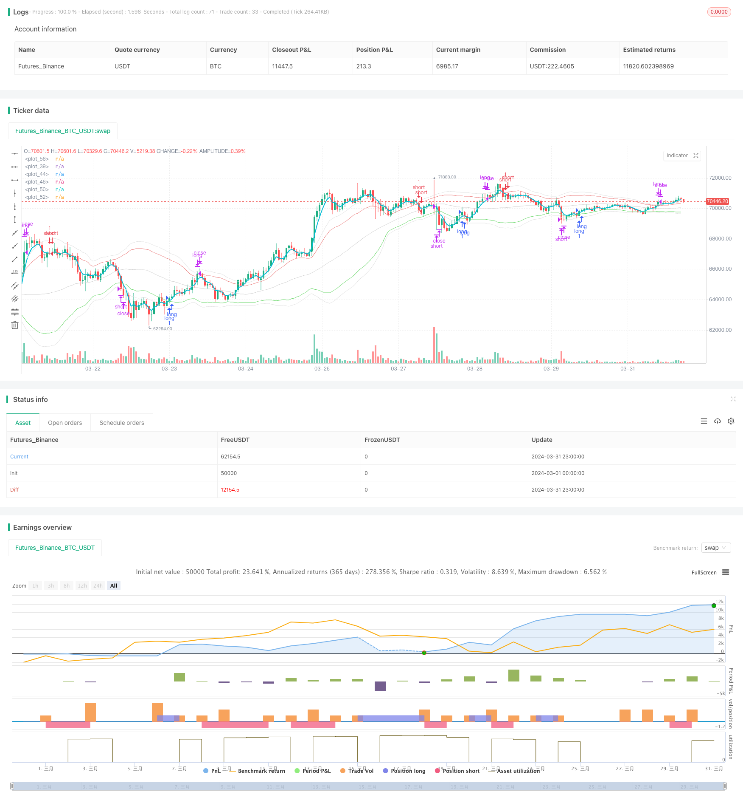

> Name

Moving Averages and Bollinger Bands Quantitative-Trading-Strategy-Based-on-Moving-Averages-and-Bollinger-Bands
> Author

ChaoZhang

> Strategy Description



[trans]
#### Overview
This strategy mainly uses moving averages and Bollinger Bands to capture market trends and fluctuations. There are three different moving averages used in the strategy: Simple Moving Average (SMA), Weighted Moving Average (WMA), and Exponential Moving Average (EMA). At the same time, Bollinger Bands are used to set the price channel, and the upper and lower rails serve as signals for opening and closing positions respectively. Open a short position when the price breaks through the upper band of Bollinger Bands, and open a long position when it breaks through the lower band. At the same time, a wider Bollinger Band is set as a stop loss level, and the position is closed when the price breaks through the stop loss Bollinger Band. In general, this strategy attempts to build a position in time when the trend occurs and decisively stop losses when the risk increases, in order to obtain stable returns.
#### Strategy Principles
1. Calculate moving averages of three different periods: slow SMA, fast EMA and medium-speed WMA, which reflect the long-term, short-term and medium-term trends of the market respectively.
2. Calculate two sets of Bollinger Bands based on the price standard deviation: opening Bollinger Bands (the distance between the upper and lower rails is closer) and stop-loss Bollinger Bands (the distance between the upper and lower rails is wider). Open Bollinger Bands are used to open positions, and Stop Loss Bollinger Bands are used to close positions and stop losses.
3. When the fast EMA goes above the upper track of the opening Bollinger Band, open a short position; when the fast EMA goes below the lower track of the opening Bollinger Band, open a long position. This means that the price deviates more from the mean and a trend may occur.
4. Once a position is opened, if the price further crosses the upper limit of the stop-loss Bollinger Band, all long positions will be closed; if the price further moves below the lower limit of the stop-loss Bollinger Band, all short positions will be closed. This is to control losses and stop losses decisively once the trend reverses.
5. The above process is continuously cycled, allowing the strategy to flexibly adjust positions according to market trends and stop losses in a timely manner in order to achieve stable returns.
#### Strategic Advantages
1. Three moving averages of different speeds are considered to comprehensively capture market trends at various levels.
2. Introducing Bollinger Bands as the conditions for opening and closing positions, which can be dynamically adjusted according to market volatility and respond flexibly to market conditions.
3. Set up stop-loss Bollinger Bands to control retracement, and decisively close positions when the market fluctuates violently to avoid further losses.
4. The logic is clear, the rules are simple, and it is easy to implement and optimize.
5. It has a wide scope of application and may be effective for a variety of markets and multiple time periods.
#### Strategy Risk
1. In a volatile market, frequent opening and closing of positions may result in large transaction costs, thereby eroding profits.
2. In the early stage of a trend turning point, the strategy may still trade in the original trend direction, resulting in certain losses.
3. For extreme market conditions, such as rapid price jumps, stop-loss Bollinger Bands may not be able to control risks well.
4. Improper parameter selection (such as moving average period, Bollinger Band width, etc.) may render the strategy ineffective.
5. If the market continues to fluctuate, the strategy may not be able to capture obvious trend opportunities in the long term.
#### Strategy optimization direction
1. Appropriately increase the moving average period and Bollinger Band width parameters to reduce transaction frequency and cost in volatile markets.
2. Introduce more technical indicators or market sentiment indicators as filters to improve the accuracy of position opening signals and avoid possible loss-making transactions in the early stages of the trend.
3. Set special rules for extreme market conditions, such as suspending the opening of new positions during short jumps, etc., to control risks.
4. Optimize the parameters, find the parameter combination that is most suitable for the current market, and improve the robustness of the strategy.
5. Add position management and fund management rules, such as adjusting positions according to trend strength or profitability, setting overall stop loss lines, etc., to further control strategic risks.
#### Summary
Marina Parfenova School Project Robot is a quantitative trading strategy based on moving averages and Bollinger Bands. It attempts to profit by capturing market trends while controlling retracements through Bollinger Bands stop loss lines. The strategy logic is simple and clear, has a wide range of applications, and can flexibly adjust parameters according to market characteristics. However, in practical applications, we still need to pay attention to issues such as market shocks, extreme market conditions, parameter optimization, etc., and further refine the rules for fund management and position management. In general, this strategy can be used as a basic quantitative trading framework, on which basis it can be continuously optimized and improved in order to obtain more robust trading effects.
|| 

#### Overview
This strategy mainly utilizes moving averages and Bollinger Bands to capture market trends and volatility. It employs three different types of moving averages: Simple Moving Average (SMA), Weighted Moving Average (WMA), and Exponential Moving Average (EMA). At the same time, it uses Bollinger Bands to set price channels, with the upper and lower bands serving as signals for opening and closing positions. When the price breaks through the upper Bollinger Band, it opens a short position; when it breaks through the lower band, it opens a long position. It also sets wider Bollinger Bands as stop-loss levels, closing positions when the price breaches these bands. Overall, this strategy attempts to establish positions promptly when trends emerge and decisively cut losses when risks escalate, aiming to achieve stable returns.

#### Strategy Principles
1. Calculate three moving averages with different periods: slow SMA, fast EMA, and medium WMA, reflecting the long-term, short-term, and medium-term market trends respectively.
2. Compute two sets of Bollinger Bands based on price standard deviation: entry Bollinger Bands (with narrower distance between upper and lower bands) and stop-loss Bollinger Bands (with wider distance). Entry bands are used for opening positions, while stop-loss bands are used for closing positions.
3. When the fast EMA crosses above the upper entry Bollinger Band, open a short position; when the fast EMA crosses below the lower entry Bollinger Band, open a long position. This implies that the price has deviated significantly from the mean and a trend may emerge.
4. Once a position is open, if the price further crosses above the upper stop-loss Bollinger Band, close all long positions; if the price further crosses below the lower stop-loss Bollinger Band, close all short positions. This is to control losses and decisively stop loss once the trend reverses.
5. The above process is repeated continuously, allowing the strategy to flexibly adjust positions according to market trends and stop losses in a timely manner, in order to achieve robust returns.

#### Strategy Advantages
1. It considers three moving averages of different speeds, comprehensively capturing market trends at various levels.
2. It introduces Bollinger Bands as conditions for opening and closing positions, which can be dynamically adjusted according to market volatility, flexibly adapting to market conditions.
3. It sets stop-loss Bollinger Bands to control drawdowns and decisively closes positions when the market fluctuates dramatically, avoiding amplified losses.
4. The logic is clear and the rules are simple, easy to implement and optimize.
5. It has a wide range of applications and may be effective for various markets and time periods.

#### Strategy Risks
1. In a sideways market, frequent opening and closing of positions may lead to substantial transaction costs, eroding profits.
2. At the initial stage of a trend reversal, the strategy may still trade in the direction of the original trend, resulting in certain losses.
3. For extreme market conditions, such as rapid price gaps, the stop-loss Bollinger Bands may not effectively control risks.
4. Improper parameter selection (such as moving average periods, Bollinger Band widths, etc.) may invalidate the strategy.
5. If the market continues to fluctuate, the strategy may not be able to capture significant trend opportunities for an extended period.

#### Strategy Optimization Directions
1. Appropriately increase the parameters of moving average periods and Bollinger Band widths to reduce trading frequency and costs in a sideways market.
2. Introduce more technical indicators or market sentiment indicators as filters to improve the accuracy of entry signals and avoid losing trades that may occur at the beginning of a trend.
3. Set special rules for extreme market conditions, such as suspending new positions when gaps occur, to control risks.
4. Optimize parameters to find the most suitable combination for the current market, enhancing the robustness of the strategy.
5. Add position management and capital management rules, such as adjusting positions based on trend strength or profitability, setting overall stop-loss lines, etc., to further control strategy risks.

#### Summary
The Marina Parfenova School Project Bot is a quantitative trading strategy based on moving averages and Bollinger Bands. It attempts to profit by capturing market trends while controlling drawdowns through Bollinger Band stop-loss lines. The strategy logic is simple and straightforward, with a wide range of applications, and parameters can be flexibly adjusted according to market characteristics. However, in practical application, attention still needs to be paid to issues such as sideways markets, extreme conditions, parameter optimization, etc., and further refinement of capital and position management rules is necessary. Overall, this strategy can serve as a basic quantitative trading framework, which can be continuously optimized and improved upon to achieve more robust trading results.
[/trans]

> Strategy Arguments


|Argument|Default|Description|
|----|----|----|
|v_input_int_1|50|Период медленной скользящей средней|
|v_input_int_2|4|Период быстрой скользящей средней|
|v_input_int_3|30|Период среднеквадратического отклонения|
|v_input_float_1|1.2|Коэффициент ширины коридора покупки|
|v_input_float_2|1.6|Коэффициент ширины коридора продажи|


> Source (PineScript)

``` pinescript
/*backtest
start: 2024-03-01 00:00:00
end: 2024-03-31 23:59:59
period: 1h
basePeriod: 15m
exchanges: [{"eid":"Futures_Binance","currency":"BTC_USDT"}]
*/

//@version=5
strategy ("Marina Parfenova School Project Bot", overlay = true)

sma(price, n) =>
    result = 0.0
    for i = 0 to n - 1
        result := result + price [i] / n    
    result

wma(price, n) =>
    result = 0.0
    sum_weight = 0.0
    weight = 0.0
    for i = 0 to n - 1
        weight := n - 1
        result := result + price [i]*weight
        sum_weight := sum_weight + weight
    result/sum_weight

ema(price, n) =>
    result = 0.0
    alpha = 2/(n + 1)
    prevResult = price 
    if (na(result[1]) == false)
        prevResult := result[1]
    result := alpha * price + (1 - alpha) * prevResult

/// Настройки
n_slow = input.int(50, "Период медленной скользящей средней", step=5)
n_fast = input.int(4, "Период быстрой скользящей средней")
n_deviation = input.int(30, "Период среднеквадратического отклонения", step=5)
k_deviation_open = input.float(1.2, "Коэффициент ширины коридора покупки", step=0.1)
k_deviation_close = input.float(1.6, "Коэффициент ширины коридора продажи", step=0.1)

// ----- Линии индикаторов -----

// Медленная скользящая 
sma = sma(close, n_slow)
plot(sma, color=#d3d3d3)

// Линии Боллинджера, обозначающие коридор цены
bollinger_open = k_deviation_open * ta.stdev(close, n_deviation)
open_short_line = sma + bollinger_open
plot(open_short_line, color=#ec8383)
open_long_line = sma - bollinger_open
plot(open_long_line, color=#6dd86d)

bollinger_close = k_deviation_close * ta.stdev(close, n_deviation)
close_short_line = sma + bollinger_close
plot(close_short_line, color=#e3e3e3)
close_long_line = sma - bollinger_close
plot(close_long_line, color=#e3e3e3)

// Быстрая скользящая
ema = ema(close, n_fast)
plot(ema, color = color.aqua, linewidth = 2)

// ----- Сигналы для запуска стратегии -----

// если ema пересекает линию open_short сверху вниз - сигнал на создание ордера в short
if(ema[1] >= open_short_line[1] and ema < open_short_line)
    strategy.entry("short", strategy.short)

// если ema пересекает линию open_long снизу вверх - сигнал на создание ордера в long
if(ema[1] <= open_long_line[1] and ema > open_long_line)
    strategy.entry("long", strategy.long)

// если свеча пересекает верхнюю линию коридора продажи - закрываем все long-ордера 
if (high >= close_short_line)
    strategy.close("long")

// если свеча пересекает нижнюю линию коридора продажи - закрываем все short-ордера
if (low <= close_long_line)
    strategy.close("short")
```

> Detail

https://www.fmz.com/strategy/449506

> Last Modified

2024-04-26 11:45:05
