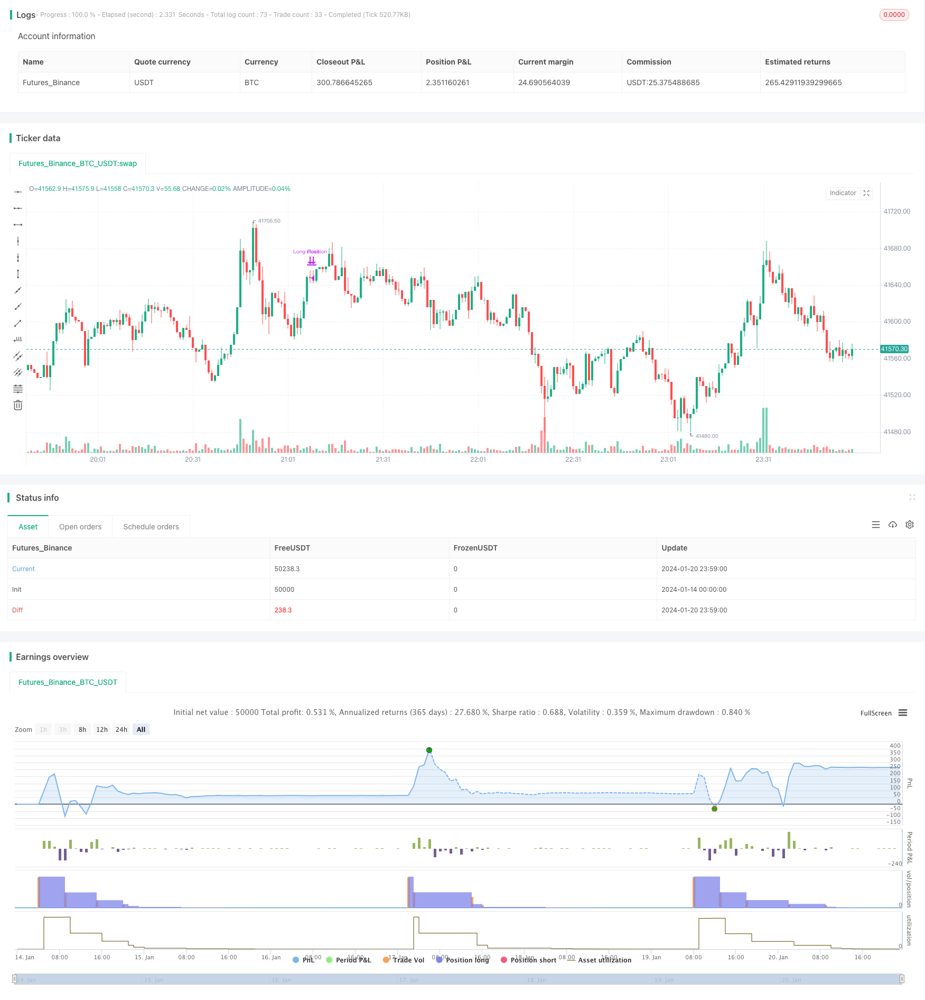

> Name

Quantitative-Trend-Tracking-Strategy-Based-on-Multiple-Technical-Indicators
> Author

ChaoZhang

> Strategy Description


 [trans]
### Overview
This strategy combines multiple technical indicators such as Bollinger Bands, Stochastic Oscillator and Relative Strength Index to set buy and sell signals to achieve long-term tracking operations on cryptocurrencies and other assets. The strategy name is set to be “Multi-Factor Cryptocurrency Quantitative Strategy.”
### Strategy Principles
The strategy first sets the calculation parameters of indicators such as Bollinger Bands, Stochastic Oscillator and RSI. Then define the buy signal conditions as: the closing price is lower than the lower track of the Bollinger Bands, the K line is lower than 20 and higher than the D line, and the RSI is lower than 30. When these three conditions are met at the same time, longing is performed. Define a partial sell signal as: the K line is above 70 and the previous period is below 70 (Golden Cross), and there is an RSI divergence. When these two conditions are met, 50% of the position is closed.
### Advantage Analysis
This strategy combines multiple indicators to judge market conditions and avoid misjudgments caused by a single indicator. The Bollinger Bands determine whether it is oversold, the stochastic oscillator determines whether it is oversold, and the RSI determines whether it is oversold. Multiple indicators work together to effectively identify market troughs and make long positions accurately. In addition, the strategy also uses RSI divergence to determine potential trend reversals and prevent losses from being stopped too late. Therefore, this strategy can better grasp the opportunity of buying low and selling high.
### Risk Analysis
This strategy relies on parameter optimization, and if the parameters are not set properly, troughs and peaks will not be correctly identified. In addition, there may be incorrect combinations of indicators. For example, Bollinger Bands identifies oversold conditions, but other indicators do not meet the corresponding conditions. These situations may lead to unnecessary losses. Finally, the strategy does not consider the maximum drawdown and position management issues, which are also areas that need to be optimized.
### Optimization direction
1. Test and optimize indicator parameters to find the best parameter combination.
2. Add maximum drawdown control and suspend trading when the threshold is reached.
3. Add a position management module to dynamically adjust positions according to market conditions. The initial position is small, and the position can be increased later.
4. Add a stop loss strategy. When the market direction is misjudged, set a reasonable stop loss point to control single losses.

### Summarize
The overall idea of ​​this strategy is clear, and through the judgment of multiple indicators, it has a strong ability to capture the troughs and peaks. However, there is still room for optimization in some parameters and modules. After appropriate adjustments, it can become a quantitative strategy with stable returns.
||

### Overview  

This strategy combines multiple technical indicators such as Bollinger Bands, Stochastic Oscillator, and Relative Strength Index to set buy and sell signals for long-term trend tracking operations on crypto assets. The strategy is named "Multi-factor Crypto Quantitative Strategy".  

### Strategy Principle    

The strategy first sets the calculation parameters for indicators like Bollinger Bands, Stochastic Oscillator, and RSI. The buy signal is defined as: close below the Bollinger Lower Band, K line below 20 and above D line, RSI below 30. When all three conditions are met at the same time, go long. The sell signal is partially defined as: K line above 70 and below 70 in the previous period (golden cross dead cross), and there is RSI divergence. When these two conditions are met, close 50% of the position.

### Advantage Analysis   

This strategy combines multiple indicators to judge the market condition and avoids misjudgment caused by a single indicator. Bollinger Bands to judge whether it is oversold, Stochastic Oscillator to judge whether it is oversold, and RSI to judge whether it is overoversold. The combined effects of multiple indicators can effectively identify market bottoms for accurate long. In addition, the strategy also uses RSI divergence to judge potential trend reversals to avoid late stop loss. Therefore, this strategy can better seize low buy high sell opportunities.  

### Risk Analysis   

This strategy relies on parameter optimization. If the parameters are set improperly, it will fail to correctly identify bottoms and peaks. In addition, there may be incorrect combinations between indicators. For example, Bollinger Bands identify oversold, but other indicators do not reach the corresponding conditions. All these situations can lead to unnecessary losses. Finally, the strategy does not consider the maximum drawdown and position management, which also needs optimization.

### Optimization Directions   

1. Test and optimize indicator parameters to find the best parameter combination.  

2. Add maximum drawdown control to pause trading when reaching the threshold.   

3. Add a position management module to dynamically adjust positions based on market conditions. The initial position is smaller and can be increased later.  

4. Add a stop loss strategy. When the market direction is incorrectly determined, set a reasonable stop loss point to control single loss.


### Summary   

The overall idea of this strategy is clear. Through the judgment of multiple indicators, it has a strong ability to capture bottoms and peaks. But some parameters and modules still have room for optimization. With proper adjustments, it can become a stable profit quantitative strategy.

[/trans]


> Source (PineScript)

``` pinescript
/*backtest
start: 2024-01-14 00:00:00
end: 2024-01-21 00:00:00
period: 1m
basePeriod: 1m
exchanges: [{"eid":"Futures_Binance","currency":"BTC_USDT"}]
*/

//@version=5
strategy("Stratégie d'Entrée et de Sortie Longue", overlay=true)

// Paramètres des indicateurs
longueurBollinger = 20
stdDevBollinger = 2
longueurStochastic = 14
smoothK = 3
smoothD = 3
longueurRSI = 14

// Bollinger Bands
basis = ta.sma(close, longueurBollinger)
dev = ta.stdev(close, longueurBollinger)
lowerBand = basis - stdDevBollinger * dev

// Stochastic Oscillator
k = ta.sma(ta.stoch(close, high, low, longueurStochastic), smoothK)
d = ta.sma(k, smoothD)

// RSI
rsi = ta.rsi(close, longueurRSI)

// Logique des autres indicateurs (à compléter)

// Conditions d'entrée (à définir)
conditionBollinger = close < lowerBand
conditionStochastic = k < 20 and k > d
conditionRSI = rsi < 30
// Autres conditions (Braid Filter, VolumeBIS, Price Density...)

conditionEntree = conditionBollinger and conditionStochastic and conditionRSI // et autres conditions

// Exécution du trade (entrée)
if (conditionEntree)
    strategy.entry("Long Position", strategy.long)

// Conditions de sortie
stochCrossOver70 = k > 70 and k[1] <= 70

// Simplification de la détection de divergence baissière
// (Cette méthode est basique et devrait être raffinée pour une analyse précise)
highsRising = high > high[1]
lowsRising = low > low[1]
rsiFalling = rsi < rsi[1]
divergenceBearish = highsRising and lowsRising and rsiFalling

// Clôturer la moitié de la position
if (stochCrossOver70 and divergenceBearish)
    strategy.close("Long Position", qty_percent = 50)

```

> Detail

https://www.fmz.com/strategy/439607

> Last Modified

2024-01-22 10:40:01
