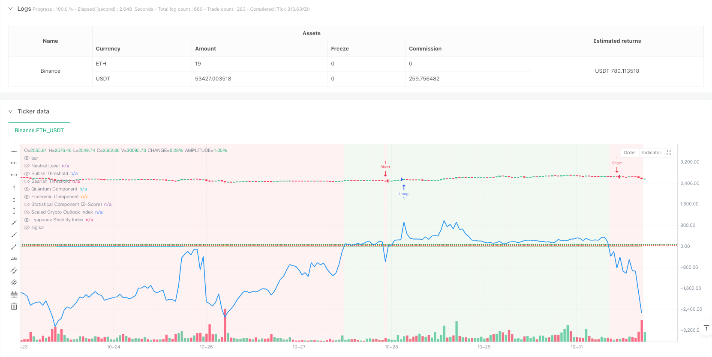
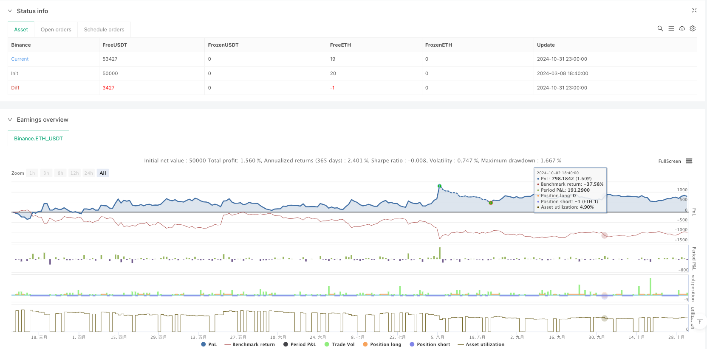

> Name

Multi-dimensional momentum trading strategy based on quantum spectrum analysis-Quantum-Spectral-Momentum-Trading-Strategy-with-Multi-Component-Analysis
> Author

ianzeng123

> Strategy Description





[trans]
#### Overview
This strategy is an innovative quantitative trading system that combines the principles of quantum mechanics, statistics and economics. It builds a comprehensive market analysis framework by combining simple moving average (SMA), Z-Score statistical analysis, quantum fluctuation components, economic momentum indicators, and Lyapunov stability index. The core of the strategy is to generate a comprehensive market outlook index (COI) through a weighted combination of these multi-dimensional indicators to guide trading decisions.
#### Strategy Principle
The strategy is built on five main technical pillars:
1. The statistical analysis module uses SMA and standard deviation to calculate Z-Score to evaluate the relative position of prices.
2. The quantum component converts the Z-Score into an oscillator, simulating the fluctuation characteristics of the quantum state through exponential and sine functions.
3. The Economic component measures market momentum using the logarithmic ratio of fast and slow EMA.
4. The Lyapunov Index assesses market status by analyzing the combined stability of quantum and economic components.
5. The Comprehensive Market Outlook Index (COI) integrates all components according to different weights to form the final trading signal.
#### Strategic Advantages
1. Multi-dimensional analysis provides a more comprehensive market insight and reduces the possible bias caused by a single indicator.
2. The introduction of quantum components brings a unique perspective on market fluctuations and helps capture short-term opportunities.
3. The application of Lyapunov index effectively evaluates market stability and improves risk management capabilities.
4. The weight-adjustable design allows the strategy to be flexibly adapted to different market environments.
5. The neutral line design of the composite index provides clear boundaries for trading signals.
#### Strategy Risk
1. Multiple indicators may cause signal lag and affect the timing of entry.
2. Excessive parameter optimization may lead to the risk of overfitting.
3. In highly volatile markets, quantum components may produce too frequent signals.
4. Economic components can produce misleading signals in sideways markets.
5. Stop loss needs to be set appropriately to control risks.
#### Strategy optimization direction
1. Introduce an adaptive weighting system to dynamically adjust the weight of each component according to the market environment.
2. Add a volatility filter to adjust signal sensitivity during periods of high volatility.
3. Integrate market sentiment indicators to provide additional confirmation signals.
4. Develop a dynamic stop loss mechanism and adjust the stop loss level according to market conditions.
5. Add time filter to avoid opening positions during unfavorable trading hours.
#### Summary
This is an innovative quantitative trading strategy that builds a comprehensive market analysis framework by integrating multidisciplinary theories. Although there are some areas that need optimization, its multi-dimensional analysis method provides a unique perspective for trading decisions. Through continuous optimization and risk management improvements, the strategy is expected to maintain stable performance in different market environments. ||
#### Overview
This strategy is an innovative quantitative trading system that integrates principles from quantum mechanics, statistics, and economics. It constructs a comprehensive market analysis framework by combining Simple Moving Average (SMA), Z-Score statistical analysis, quantum oscillation component, economic momentum indicators, and the Lyapunov stability index. The strategy's core generates a Composite Outlook Index (COI) through weighted combinations of these multi-dimensional indicators to guide trading decisions.

#### Strategy Principles
The strategy is built on five main technical pillars:
1. Statistical analysis module uses SMA and standard deviation to calculate Z-Score, evaluating relative price positions.
2. Quantum component transforms Z-Score into an oscillator, simulating quantum state fluctuations through exponential and sine functions.
3. Economic component measures market momentum using the logarithmic ratio of fast and slow EMAs.
4. Lyapunov index assesses market stability by analyzing the combined stability of quantum and economic components.
5. Composite Outlook Index (COI) integrates all components with different weights to form final trading signals.

#### Strategy Advantages
1. Multi-dimensional analysis provides more comprehensive market insights, reducing bias from single indicators.
2. Introduction of quantum component brings unique market oscillation perspective, helping capture short-term opportunities.
3. Application of Lyapunov index effectively evaluates market stability, enhancing risk management capabilities.
4. Adjustable weights design allows strategy adaptation to different market environments.
5. Neutral line design in composite index provides clear trading signal boundaries.

#### Strategy Risks
1. Multiple indicators may lead to signal lag, affecting entry timing.
2. Parameter optimization may result in overfitting risk.
3. Quantum component may generate too frequent signals in high volatility markets.
4. Economic component may produce misleading signals in ranging markets.
5. Proper stop-loss settings are necessary for risk control.

#### Strategy Optimization Directions
1. Introduce adaptive weight system to dynamically adjust component weights based on market conditions.
2. Add volatility filters to adjust signal sensitivity during high volatility periods.
3. Integrate market sentiment indicators to provide additional confirmation signals.
4. Develop dynamic stop-loss mechanisms to adjust stop-loss levels based on market conditions.
5. Add time filters to avoid opening positions during unfavorable trading periods.

#### Summary
This is an innovative quantitative trading strategy that builds a comprehensive market analysis framework by integrating multi-disciplinary theories. While there are areas for optimization, its multi-dimensional analysis approach provides unique perspectives for trading decisions. Through continuous optimization and risk management improvements, the strategy shows promise for maintaining stable performance across different market environments.
[/trans]


> Source (PineScript)

``` pinescript
/*backtest
start: 2024-03-08 18:40:00
end: 2024-11-01 00:00:00
period: 1h
basePeriod: 1h
exchanges: [{"eid":"Binance","currency":"ETH_USDT"}]
*/

// This Pine Script™ code is subject to the terms of the Mozilla Public License 2.0 at https://mozilla.org/MPL/2.0/
// © Quantum-Lukas 2.0

//@version=6
strategy("Quantum Spectral Crypto Trading", shorttitle="QSCT", overlay=true, precision=2)

// ──────────────────────────────────────────────────────────────
// Input Parameters
// ──────────────────────────────────────────────────────────────
smaLength         = input.int(50, title="SMA Length (Quantum & Statistical Component)", minval=1)
emaFastLength     = input.int(20, title="EMA Fast Length (Economic Component)", minval=1)
emaSlowLength     = input.int(50, title="EMA Slow Length (Economic Component)", minval=1)
quantumWeight     = input.float(20.0, title="Quantum Component Weight", step=0.1)
economicWeight    = input.float(30.0, title="Economic Component Weight", step=0.1)
statisticalWeight = input.float(20.0, title="Statistical Component Weight", step=0.1)
lyapunovWeight    = input.float(10.0, title="Lyapunov Stability Weight", step=0.1)

// ──────────────────────────────────────────────────────────────
// Price Averages and Volatility Calculation
// ──────────────────────────────────────────────────────────────
smaPrice   = ta.sma(close, smaLength)
stdevPrice = ta.stdev(close, smaLength)

// ──────────────────────────────────────────────────────────────
// Statistical Component: z-score Calculation
// ──────────────────────────────────────────────────────────────
z = (close - smaPrice) / stdevPrice

// ──────────────────────────────────────────────────────────────
// Quantum Component: Inspired by Quantum Mechanics
// ──────────────────────────────────────────────────────────────
quantum_component = math.exp(-0.5 * z * z) * (1 + math.sin((math.pi / 2) * z))

// ──────────────────────────────────────────────────────────────
// Economic Component: EMA Ratio as a Proxy for Market Momentum
// ──────────────────────────────────────────────────────────────
emaFast = ta.ema(close, emaFastLength)
emaSlow = ta.ema(close, emaSlowLength)
economic_component = math.log(emaFast / emaSlow)

// ──────────────────────────────────────────────────────────────
// Lyapunov Exponent for Market Stability (Prevents Log(0) Error)
// ──────────────────────────────────────────────────────────────
lyapunov_index = ta.sma(math.log(math.max(1e-10, math.abs(economic_component + quantum_component))), smaLength)

// ──────────────────────────────────────────────────────────────
// Composite Crypto Outlook Index Calculation (Fixed Indentation)
// ──────────────────────────────────────────────────────────────
crypto_outlook_index = 
  50 + quantumWeight * (quantum_component - 1) +
     economicWeight * economic_component +
     statisticalWeight * z +
     lyapunovWeight * lyapunov_index

// ──────────────────────────────────────────────────────────────
// Plotting and Visual Enhancements
// ──────────────────────────────────────────────────────────────
// Normalized for better visibility in the BTC/USD chart range
normalized_outlook_index = (crypto_outlook_index - 50) * close / 100

plot(normalized_outlook_index, title="Scaled Crypto Outlook Index", color=color.blue, linewidth=2)

// Debugging: Plot each component separately
plot(quantum_component, title="Quantum Component", color=color.purple, linewidth=1)
plot(economic_component, title="Economic Component", color=color.orange, linewidth=1)
plot(z, title="Statistical Component (Z-Score)", color=color.yellow, linewidth=1)
plot(lyapunov_index, title="Lyapunov Stability Index", color=color.aqua, linewidth=1)

hline(50, title="Neutral Level", color=color.gray)
hline(70, title="Bullish Threshold", color=color.green, linestyle=hline.style_dotted)
hline(30, title="Bearish Threshold", color=color.red, linestyle=hline.style_dotted)

// Background color for bullish/bearish conditions
bgcolor(crypto_outlook_index > 50 ? color.new(color.green, 90) : color.new(color.red, 90), title="Outlook Background")

// ──────────────────────────────────────────────────────────────
// Trading Strategy: Entry and Exit Conditions (Fixed Errors)
// ──────────────────────────────────────────────────────────────

// Define entry conditions
longCondition  = crypto_outlook_index > 70
shortCondition = crypto_outlook_index < 30

// Execute long entry
if (longCondition)
    strategy.entry("Long", strategy.long)

// Execute short entry
if (shortCondition)
    strategy.entry("Short", strategy.short)

// Define exit conditions (Added Stop Losses)
if (crypto_outlook_index < 50)
    strategy.exit("Exit Long", from_entry="Long", stop=low)

if (crypto_outlook_index > 50)
    strategy.exit("Exit Short", from_entry="Short", stop=high)
```

> Detail

https://www.fmz.com/strategy/482771

> Last Modified

2025-02-27 17:51:47
