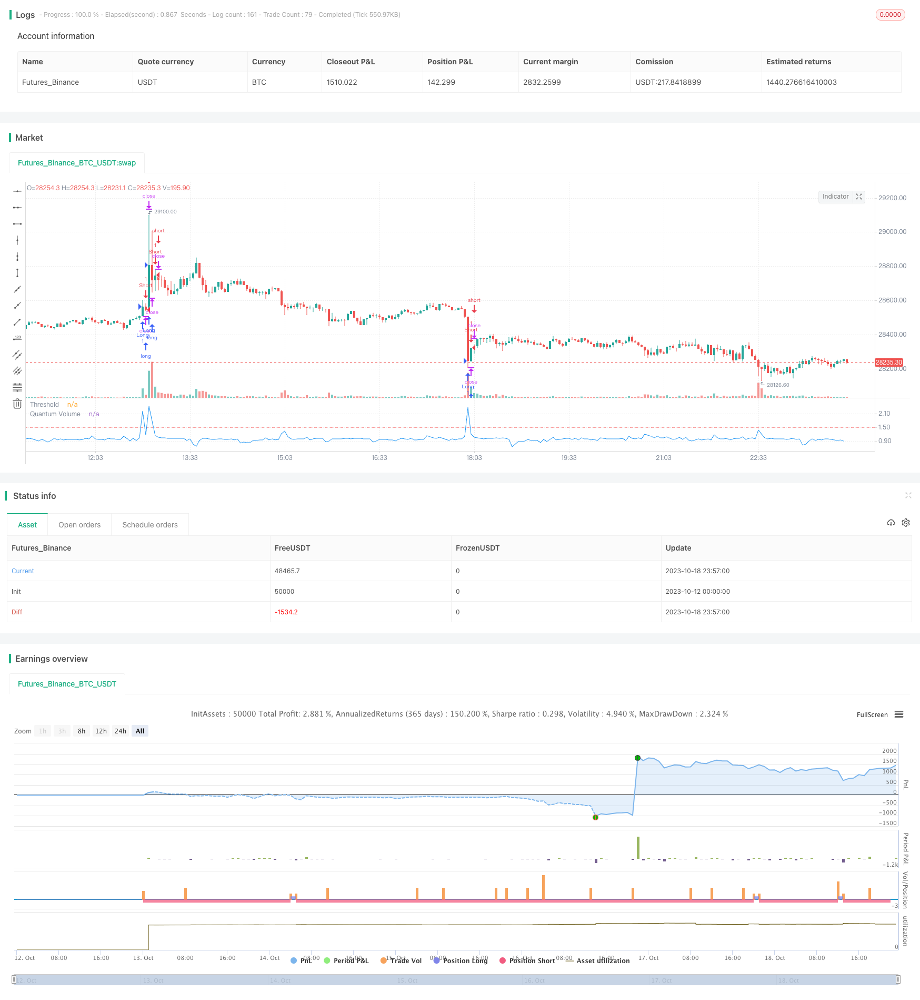

> Name

Quantum-Volume-Strategy
> Author

ChaoZhang

> Strategy Description



[trans]

### Overview
Quantum volume and price strategy is a trading strategy based on quantum volume and price indicators. This strategy calculates the quantum volume and price indicator within a certain period and sets a threshold. When the indicator crosses above or below the threshold, a trading signal is generated. This strategy is mainly used to capture trend price changes brought about by market volume breakthroughs.
### Strategy Principles
The core indicator of this strategy is the Quantum Volume Price Index. The quantum volume price indicator calculates the ratio between the moving average of trading volume in a certain period and the moving average of trading volume in the previous period, and judges the extent to which the volume can be enhanced or weakened by comparing the year-on-year changes in volume energy. When the volume energy is significantly enhanced, the quantum volume and price indicators rise significantly, which usually indicates a trend increase in prices; when the volume energy is significantly weakened, the quantum volume and price indicators drop significantly, which often indicates a trend decline in prices.
Specifically, the strategy first calculates the 14-period quantum volume and price indicator, and then sets an indicator threshold of 1.5. When the indicator crosses above the threshold, a long signal is generated; when the indicator crosses below the threshold, a short signal is generated. A long signal indicates that the volume can be enlarged, and the predicted price is upward; a short signal indicates that the volume can be reduced, and the predicted price is downward. Therefore, this strategy predicts price trend changes through the volume and price reversal caused by the volume energy breakthrough.
### Advantage Analysis
This strategy has several advantages:
1. Capture early signals of trends. The calculation of quantum volume and price indicators is based on trading volume, which can capture the price trend turning caused by changes in volume and energy in advance. Use this indicator to generate trading signals early in a price trend.
2. Avoid false breakthroughs. Since this strategy is based on volume energy indicators, it can filter out false breakthrough signals that are not supported by actual volume energy and avoid unnecessary trading losses.
3. Parameter setting is simple. This strategy only requires setting the parameters of the quantum volume and price indicator. There is no complicated multi-parameter optimization process, and it is simple and intuitive to use.
4. Can be integrated into various trading systems. Quantum volume and price indicators have no specific usage restrictions, can be easily integrated into a variety of trading strategy systems, and have strong applicability.
5. Programmatic trading friendly. This strategy is completely based on clear rules, the signal generation method is simple and systematic, and it is very suitable for programmed and algorithmic trading.
### Risk Analysis
There are also some risks to be aware of with this strategy:
1. It is easy to produce false signals. The quantum volume and price indicator is very sensitive to changes in trading volume, and there may be some abnormal volume-price relationships in the market that cause the indicator to generate false signals.
2. Trend periods need to be identified. This strategy is most suitable for trending markets and needs to be combined with other indicators to identify trends and consolidation markets to avoid generating false signals during consolidation.
3. Transaction frequency needs to be controlled. The trading frequency of this strategy may be high, and position size and trading frequency need to be appropriately controlled to control transaction costs and risks.
4. Strict stop loss is required. Since price changes cannot be perfectly predicted, this strategy requires strict stop loss methods to control single losses.
5. Indicators are easy to optimize. The periods and parameters of the quantum volume and price indicator can be combined in various ways, so beware of over-optimization.
### Optimization direction
This strategy can be optimized from the following aspects:
1. Combine trend judgment indicators and set trend filter conditions to avoid trading during consolidation. For example, combine the SMA indicator to determine the price trend direction.
2. Add an overall position management mechanism, such as a fixed share trading method based on fund management, to control the risk of single loss.
3. Set a retracement stop loss method. When the price retraces a certain amount in the opposite direction, stop loss and exit to control losses.
4. Optimize the parameters of the quantum volume and price indicator and test the impact of different cycle parameters on the strategy effect. You can also test adding smoothing and other processing.
5. Add multiple energy indicators for comprehensive judgment. A single indicator can easily produce false signals, and more energy indicators can be added for verification.
6. Set filter conditions for trading signals, such as entering the market only if the indicator threshold exceeds for 3 consecutive days, which can reduce unnecessary transactions.
### Summarize
Quantum volume and price strategy is a typical trading strategy based on volume and energy indicators. It determines changes in volume and energy by calculating quantum volume and price indicators and predicts price trend change points. This strategy can effectively capture early opportunities in the trend and avoid chasing the rise and killing the fall. It is a strategic idea that is very suitable for programmed trading. However, this strategy also has a certain risk of false signals, and it requires appropriate optimization and strict risk control to achieve the maximum effect of the strategy. Generally speaking, the quantum volume and price strategy, as a quantitative energy indicator strategy, can provide a unique Alpha for the quantitative trading system and has very high practical value.
||

### Overview

The Quantum Volume Strategy is a trading strategy based on the Quantum Volume indicator. This strategy generates trading signals when the Quantum Volume indicator crosses above or below a threshold value over a certain period. The strategy aims to capture trending price moves driven by significant changes in trading volume.  

### Strategy Logic

The core indicator of this strategy is the Quantum Volume indicator. The Quantum Volume indicator calculates the ratio between the moving average of volume over a certain period and the moving average of volume over the previous period. By comparing the relative changes in volume, it judges the strengthening or weakening of trading momentum. When trading momentum strengthens markedly, the Quantum Volume indicator surges, usually presaging a trending price rise. When momentum weakens significantly, the Quantum Volume indicator declines sharply, often foreshadowing a trending price fall.

Specifically, this strategy first calculates the 14-period Quantum Volume indicator, then sets a threshold of 1.5 for the indicator. A buy signal is generated when the indicator crosses above the threshold, and a sell signal is generated when the indicator crosses below the threshold. The buy signal indicates expanding momentum predicting an upside price move, while the sell signal represents contracting momentum calling for a downside price move. Therefore, the strategy aims to predict trending price reversals based on momentum breakouts reflected in volume.

### Advantage Analysis 

This strategy has several key advantages:

1. Captures early trend signals. The Quantum Volume indicator, based on volume data, can early detect trend reversals driven by volume changes. Using this indicator can generate trading signals at the very beginning of emerging trends.

2. Avoids false breakouts. Relying on volume momentum, this strategy filters out false breakout signals not supported by actual trading activity, avoiding unnecessary losses. 

3. Simple parameter setting. The strategy only needs to set the parameters for the Quantum Volume indicator without complex multi-parameter optimization, making it simple and intuitive to use.

4. Flexibility. The Quantum Volume indicator has no rigid usage restrictions and can be easily incorporated into various trading systems, giving it strong adaptability.

5. Algorithm friendly. The strategy is completely rule-based with simple and systematic signal generation, making it very suitable for algorithmic and automated trading.

### Risk Analysis

Some risks of this strategy should be noted:

1. Prone to whipsaws. The Quantum Volume indicator is very sensitive to volume changes. Abnormal volume-price patterns in the market may cause whipsaw signals.

2. Needs trend identification. This strategy works best in trending markets. Other indicators should be used to identify trends and ranges to avoid wrong signals during consolidations.

3. High trading frequency. The strategy may generate frequent trades. Position sizing and trade frequency should be controlled to manage costs and risks. 

4. Strict stop loss needed. As price movements cannot be perfectly predicted, a tight stop loss is required to limit losses on individual trades.

5. Overoptimization risk. The parameters and periods of the Quantum Volume indicator can be optimized in many ways. Overoptimization should be avoided.

### Improvement Directions

The strategy can be enhanced in several aspects:

1. Add trend filters using indicators like SMA to avoid trading in ranges.

2. Implement position sizing rules based on account size to control single trade risk. 

3. Set trailing stop loss to lock in profits as price moves favorably.

4. Optimize parameters of the Quantum Volume indicator through robust backtesting. Smoothing techniques can also be tested.

5. Incorporate additional volume indicators for consensus confirmation to avoid false signals.

6. Add signal filters such as requiring 3 consecutive closes beyond thresholds to reduce unwanted trades. 

### Summary

The Quantum Volume Strategy is a representative trading strategy based on volume momentum. It forecasts trend reversals by assessing changes in momentum reflected in the Quantum Volume indicator. This strategy can effectively capture early trend opportunities and avoid chasing momentum extremes. With proper enhancements and risk management, the Quantum Volume Strategy can significantly improve the performance of quantitative trading systems. Overall, as a unique alpha source based on volume analysis, the Quantum Volume Strategy has immense practical value for algo trading.

[/trans]

> Strategy Arguments


|Argument|Default|Description|
|----|----|----|
|v_input_1|14|Quantum Volume Period|
|v_input_2|1.5|Quantum Volume Threshold|


> Source (PineScript)

``` pinescript
/*backtest
start: 2023-10-12 00:00:00
end: 2023-10-19 00:00:00
period: 3m
basePeriod: 1m
exchanges: [{"eid":"Futures_Binance","currency":"BTC_USDT"}]
*/

//@version=5
strategy("Quantum Volume Strategy")

// Quantum Volume indicator inputs
qvPeriod = input(14, "Quantum Volume Period")
qvThreshold = input(1.5, "Quantum Volume Threshold")

// Calculate Quantum Volume
qv = ta.sma(volume, qvPeriod) / ta.sma(volume, qvPeriod)[1]

// Entry conditions
enterLong = ta.crossover(qv, qvThreshold)
enterShort = ta.crossunder(qv, qvThreshold)

// Exit conditions
exitLong = ta.crossunder(qv, qvThreshold)
exitShort = ta.crossover(qv, qvThreshold)

// Strategy orders
if (enterLong)
    strategy.entry("Long", strategy.long)
if (enterShort)
    strategy.entry("Short", strategy.short)

if (exitLong)
    strategy.close("Long")
if (exitShort)
    strategy.close("Short")

// Plot Quantum Volume and threshold
plot(qv, title = "Quantum Volume", color = color.blue)
hline(qvThreshold, "Threshold", color = color.red)
```

> Detail

https://www.fmz.com/strategy/429775

> Last Modified

2023-10-20 16:28:44
