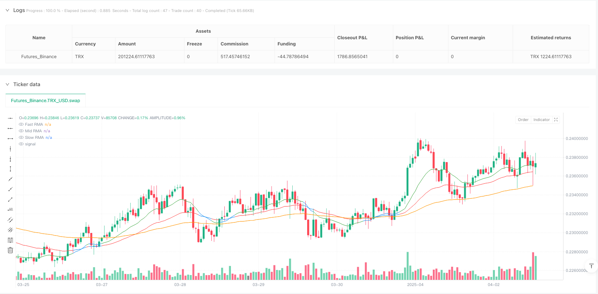
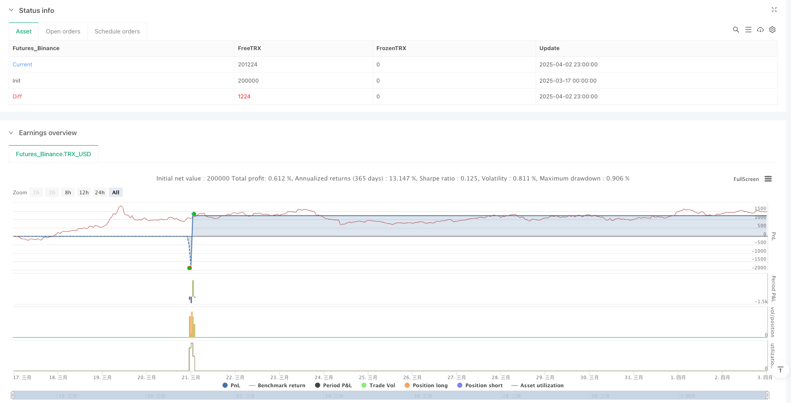

> Name

Multi-Layer-Dynamic-Threshold-RMA-Trading-Strategy-Trend-and-Momentum-Synergy-Optimization
> Author

ianzeng123

> Strategy Description




[trans]

#### Overview
The multi-layer dynamic threshold RMA quantitative trading strategy is an advanced trading strategy based on the three-layer running moving average (RMA) system. This strategy accurately identifies market trend directions and high-probability trading opportunities by combining the relative strength index (RSI) and candle chart structure analysis. The core of this strategy lies in three RMA lines of different periods: fast RMA line (capturing short-term momentum), medium-speed RMA line (filtering market noise) and slow RMA line (representing the overall market structure). The strategy forms a complete trading signal system by analyzing the stacking direction of the RMA line, RSI momentum confirmation, candle breakouts, and price rejection patterns. The unique feature is that the trend threshold is dynamically adjusted according to different market types (Forex, cryptocurrency, gold), allowing the strategy to maintain optimal performance in different market environments.
#### Strategy Principle
The core principles of this strategy are based on multi-level trend identification and momentum confirmation:
1. **RMA stacking structure analysis**: The strategy calculates the RMA of three different periods (fast 9 periods, medium 21 periods, slow 50 periods) and analyzes their relative positions. When fast RMA > medium speed RMA > slow RMA, it is identified as a bullish structure; when fast RMA < medium speed RMA < slow RMA, it is identified as a bearish structure.
2. **Dynamic Trend Strength Judgment**: The strategy calculates the distance percentage between fast RMA and medium-speed RMA, and sets different thresholds according to different market types (foreign exchange 0.12%, gold 0.15%, cryptocurrency 0.25%) to determine whether the market is in a strong trend state.
3. **RSI Momentum Filter**: Use the 8-period RSI indicator as a momentum confirmation tool. Long signals require RSI>50, and short signals require RSI<50 to avoid contrarian trading.
4. **Price Structure Confirmation**: Increase the reliability of the signal by analyzing whether the current closing price breaks through the previous candle's high (long) or low (short).
5. **Comprehensive judgment of entry conditions**:
   - Bullish entry: Bullish RMA structure + closing price breaks above medium speed RMA + RSI>50 + closing price breaks through previous high
   - Short entry: Bearish RMA structure + closing price below medium speed RMA + RSI <50 + closing price above previous low
6. **Take profit and stop loss strategy**: Use slow RMA as the take profit target, and set the stop loss price based on user-defined points to achieve risk control.
#### Strategic Advantages
1. **Adaptive market environment**: By setting special trend threshold parameters for different asset classes (foreign exchange, gold, cryptocurrency), the strategy can adapt to the fluctuation characteristics of different markets and improve adaptability.
2. **Multi-level confirmation mechanism**: Combining confirmation from the three dimensions of trend direction (RMA stacking), price momentum (RSI) and price structure (candle breakout), significantly improves signal reliability and reduces the risk of false signals.
3. **Dynamic Trend Strength Identification**: By calculating the distance percentage between RMA lines, the strategy can dynamically evaluate the trend strength and visually reflect it through color changes (fast RMA is green when the trend is strong, medium speed RMA is red; when the trend is weak, it is blue), helping traders to intuitively judge the market status.
4. **Accurate entry point**: The strategy not only relies on indicator crossovers, but also combines price structure confirmation to ensure entry at the early stage of trend establishment and improve the risk-reward ratio.
5. **Structured take-profit and stop-loss**: Using slow RMA as a natural take-profit position reflects respect for the market structure rather than an arbitrary target price.
#### Strategy Risk
1. **Trend turning point risk**: When a strong trend suddenly reverses, the strategy may not be able to capture the turning point in time, resulting in a retracement. It is recommended to suspend the use of this strategy during extreme market conditions (such as after major news releases), or to combine it with a volatility filter to enhance the protection mechanism.
2. **Parameter Optimization Trap**: Over-optimizing the RMA cycle and RSI parameters may lead to curve fitting and reduce the performance of the strategy in the future market. Parameter robustness should be backtested regularly across different time frames and market conditions.
3. **Fixed Stop Loss Risk**: The current strategy uses a fixed number of points as stop loss, which may not be flexible enough when volatility changes. It is recommended to change the stop loss design to a dynamic stop loss based on ATR (average true range) to better adapt to changes in market volatility.
4. **False Breakout Risk**: Candlestick breakout conditions may produce false signals in volatile markets. You can consider increasing trading volume confirmation or waiting for backtest confirmation after a breakthrough to improve signal quality.
5. **Market Type Misjudgment**: If market type parameters are incorrectly selected (such as using cryptocurrency parameters on low-volatility FX pairs), it may lead to over-trading. It is recommended to use an automatic market type identification mechanism to dynamically adjust the threshold based on volatility.
#### Optimization direction
1. **Adaptive parameter optimization**: Change the fixed RMA cycle and RSI cycle parameters to adaptive parameters based on market volatility. For example, use longer parameters during periods of low volatility to reduce noise, and use shorter parameters during periods of high volatility to increase response speed. The implementation method can be an automatic adjustment mechanism based on ATR.
2. **Integrated trading volume analysis**: The current strategy only relies on price data, and trading volume indicators can be added as an additional confirmation dimension. Especially when a breakthrough signal is confirmed, combining the volume breakout can significantly improve the signal quality.
3. **Multiple time frame analysis**: Introduce trend confirmation of higher time frames to ensure that the trading direction is consistent with the larger trend. For example, look for long opportunities on the 4-hour chart during a daily uptrend and avoid trading against the trend.
4. **Machine Learning Enhancement**: Use machine learning algorithms to dynamically optimize trend thresholds under different market conditions, replacing the current manual selection of market types. This can be done by identifying the current market state through a classification algorithm and then applying the optimal parameter combination.
5. **Advanced Risk Management**: Implement volatility-based position management and dynamic stop loss mechanism, such as using closing stop loss in the breakthrough stage and trailing stop loss in the trend stage. In addition, maximum drawdown control and daily risk limits can be added to improve fund management levels.
#### Summarize
The multi-layer dynamic threshold RMA quantitative trading strategy creates a comprehensive trend following and reversal identification framework by integrating the three-layer RMA system, RSI momentum filtering and price structure analysis. The core advantage of the strategy lies in its adaptability and multi-layer confirmation mechanism, allowing it to operate effectively in different market environments. By dynamically adjusting trend thresholds for different asset classes, strategies can adapt to the unique characteristics of each type of market.
This strategy provides clear visual feedback and a structured trading decision-making process, and is particularly suitable for mid- to long-term trend traders. Although there are some risks, such as trend turning point risk and parameter optimization traps, the robustness and profitability of the strategy can be further improved through recommended optimization directions, such as adaptive parameters, multi-time frame analysis and machine learning enhancement.
Most importantly, this strategy is not only a trading system, but also a market analysis method that helps traders understand market structure and dynamics. Through continuous improvement and personalized adjustments, it can become a powerful tool for all types of market participants to achieve long-term stable trading performance. ||
#### Overview
The Multi-Layer Dynamic Threshold RMA Trading Strategy is an advanced trading approach based on a three-layered Running Moving Average (RMA) system that precisely identifies market trend directions and high-probability trading opportunities by combining Relative Strength Index (RSI) and candle structure analysis. The strategy's core consists of three different period RMA lines: Fast RMA (capturing short-term momentum), Mid RMA (filtering market noise), and Slow RMA (representing overall market structure). The strategy forms a complete trading signal system by analyzing RMA stack direction, RSI momentum confirmation, candle breakouts, and price rejection patterns. Its uniqueness lies in dynamically adjusting trend thresholds according to different market types (Forex, Cryptocurrency, Gold), optimizing performance across various market environments.

#### Strategy Principles

The core principles of this strategy are built on multi-level trend identification and momentum confirmation:

1. **RMA Stack Structure Analysis**: The strategy calculates three RMAs with different periods (Fast 9, Mid 21, Slow 50) and analyzes their relative positions. When Fast RMA > Mid RMA > Slow RMA, it identifies a bullish structure; when Fast RMA < Mid RMA < Slow RMA, it identifies a bearish structure.

2. **Dynamic Trend Strength Assessment**: The strategy calculates the percentage distance between Fast RMA and Mid RMA, setting different thresholds for different market types (Forex 0.12%, Gold 0.15%, Crypto 0.25%) to determine if the market is in a strong trend.

3. **RSI Momentum Filtering**: Using an 8-period RSI indicator as a momentum confirmation tool, long signals require RSI>50, while short signals require RSI<50, avoiding counter-trend trading.

4. **Price Structure Confirmation**: By analyzing whether the current closing price breaks the previous candle's high (long) or low (short), increasing signal reliability.

5. **Comprehensive Entry Condition Assessment**: 
   - Long entry: Bullish RMA structure + Close crossing above Mid RMA + RSI>50 + Close breaking previous high
   - Short entry: Bearish RMA structure + Close crossing below Mid RMA + RSI<50 + Close breaking previous low

6. **Take Profit and Stop Loss Strategy**: Using Slow RMA as the take profit target and setting stop loss prices based on user-defined points for risk control.

#### Strategy Advantages

1. **Adaptive Market Environment**: By setting specific trend threshold parameters for different asset classes (Forex, Gold, Cryptocurrency), the strategy can adapt to the volatility characteristics of different markets, enhancing adaptability.

2. **Multi-Level Confirmation Mechanism**: Combining confirmations from three dimensions—trend direction (RMA stacking), price momentum (RSI), and price structure (candle breakouts)—significantly increases signal reliability and reduces false signal risks.

3. **Dynamic Trend Strength Identification**: By calculating the percentage distance between RMA lines, the strategy can dynamically evaluate trend strength and visually reflect it through color changes (Fast RMA green, Mid RMA red during strong trends; both blue during weak trends), helping traders intuitively judge market conditions.

4. **Precise Entry Points**: The strategy relies not only on indicator crossovers but also on price structure confirmation, ensuring entry at the early stages of trend establishment, improving risk-reward ratios.

5. **Structured Take Profit and Stop Loss**: Using Slow RMA as a natural take profit position demonstrates respect for market structure, rather than arbitrarily set target prices.

#### Strategy Risks

1. **Trend Reversal Point Risk**: During sudden trend reversals, the strategy may fail to capture turning points promptly, leading to drawdowns. It is recommended to pause using this strategy during extreme market conditions (such as after major news releases) or enhance protection mechanisms by incorporating volatility filters.

2. **Parameter Optimization Trap**: Excessive optimization of RMA periods and RSI parameters may lead to curve-fitting, reducing strategy performance in future markets. Parameters should be regularly backtested for robustness across different timeframes and market conditions.

3. **Fixed Stop Loss Risk**: The current strategy uses fixed points as stop losses, which may not be flexible enough when volatility changes. It is recommended to redesign the stop loss as a dynamic stop based on ATR (Average True Range) to better adapt to changes in market volatility.

4. **False Breakout Risk**: Candle breakout conditions may produce false signals in consolidating markets. Consider adding volume confirmation or waiting for retest confirmation after the breakout to improve signal quality.

5. **Market Type Misjudgment**: Incorrectly selecting market type parameters (such as using cryptocurrency parameters for low-volatility forex pairs) may lead to overtrading. An automatic market type recognition mechanism is recommended, dynamically adjusting thresholds based on volatility.

#### Optimization Directions

1. **Adaptive Parameter Optimization**: Change fixed RMA period and RSI period parameters to adaptive parameters based on market volatility. For example, use longer parameters during low volatility periods to reduce noise and shorter parameters during high volatility periods to improve response speed. This can be implemented using an ATR-based automatic adjustment mechanism.

2. **Integrate Volume Analysis**: The current strategy relies solely on price data; volume indicators can be added as an additional confirmation dimension. Especially when confirming breakout signals, combining volume breakouts can significantly improve signal quality.

3. **Multi-Timeframe Analysis**: Introduce trend confirmation from higher timeframes to ensure trading direction aligns with the larger trend. For example, look for long opportunities on 4-hour charts during an uptrend on the daily chart, avoiding counter-trend trading.

4. **Machine Learning Enhancement**: Utilize machine learning algorithms to dynamically optimize trend thresholds under different market conditions, replacing the current manual market type selection method. This can be achieved by using classification algorithms to identify the current market state and then applying the optimal parameter combination.

5. **Advanced Risk Management**: Implement volatility-based position sizing and dynamic stop loss mechanisms, such as using closing price stops during breakout phases and trailing stops during trend phases. Additionally, maximum drawdown controls and daily risk limits can be added to improve capital management.

#### Summary

The Multi-Layer Dynamic Threshold RMA Trading Strategy integrates a three-layer RMA system, RSI momentum filtering, and price structure analysis to create a comprehensive framework for trend following and reversal identification. The strategy's core advantages lie in its adaptability and multi-level confirmation mechanisms, enabling it to operate effectively across different market environments. By dynamically adjusting trend thresholds for different asset classes, the strategy can adapt to the unique characteristics of various markets.

The strategy provides clear visual feedback and a structured trading decision process, particularly suitable for medium to long-term trend traders. While there are some risks, such as trend reversal point risk and parameter optimization traps, the suggested optimization directions—including adaptive parameters, multi-timeframe analysis, and machine learning enhancements—can further improve the strategy's robustness and profitability.

Most importantly, this strategy is not just a trading system but a market analysis method that helps traders understand market structure and dynamics. Through continuous improvement and personalized adjustments, it can become a powerful tool for various market participants, achieving long-term stable trading performance.[/trans]


> Source (PineScript)

``` pinescript
/*backtest
start: 2025-03-17 00:00:00
end: 2025-04-03 00:00:00
period: 1h
basePeriod: 1h
exchanges: [{"eid":"Futures_Binance","currency":"TRX_USD"}]
*/

//@version=5
strategy("RMA Strategy - Weekly Dynamic Thresholds", overlay=true, default_qty_type=strategy.percent_of_equity, default_qty_value=100)

// === User Inputs ===
fastLen = input.int(9, title="Fast RMA")
midLen = input.int(21, title="Mid RMA")
slowLen = input.int(50, title="Slow RMA")
rsiLen = input.int(8, title="RSI Length")
slPoints = input.float(10, title="Stop Loss (Points)")

// === Weekly Threshold Inputs ===
forexThreshold = input.float(0.12, title="Forex Weekly Avg RMA Distance (%)", step=0.01)
goldThreshold = input.float(0.15, title="Gold Weekly Avg RMA Distance (%)", step=0.01)
cryptoThreshold = input.float(0.25, title="Crypto Weekly Avg RMA Distance (%)", step=0.01)

// === Select Current Market Type ===
marketType = input.string("FOREX", title="Asset Class", options=["FOREX", "GOLD", "CRYPTO"])

// === Use appropriate threshold based on selected market
weeklyThreshold = marketType == "FOREX" ? forexThreshold :
                  marketType == "GOLD" ? goldThreshold :
                  cryptoThreshold  // Default to crypto if somehow not matched

// === RMA Calculations ===
fastRMA = ta.rma(close, fastLen)
midRMA = ta.rma(close, midLen)
slowRMA = ta.rma(close, slowLen)

// === RSI Calculation ===
rsi = ta.rsi(close, rsiLen)

// === Trend Structure ===
bullish = fastRMA > midRMA and midRMA > slowRMA
bearish = fastRMA < midRMA and midRMA < slowRMA

// === Candle Break Conditions ===
longCandleBreak = close > high[1]
shortCandleBreak = close < low[1]

// === Distance and Trend Strength Check ===
distance = math.abs(fastRMA - midRMA)
distancePct = distance / midRMA * 100
isTrending = distancePct >= weeklyThreshold

// === Entry Conditions ===
longSignal = bullish and ta.crossover(close, midRMA) and rsi > 50 and longCandleBreak
shortSignal = bearish and ta.crossunder(close, midRMA) and rsi < 50 and shortCandleBreak

// === TP and SL Setup ===
takeProfitPriceLong = slowRMA
stopLossPriceLong = close - slPoints * syminfo.mintick

takeProfitPriceShort = slowRMA
stopLossPriceShort = close + slPoints * syminfo.mintick

// === Trade Execution ===
if (longSignal)
    strategy.entry("Long", strategy.long)
    strategy.exit("TP/SL Long", from_entry="Long", limit=takeProfitPriceLong, stop=stopLossPriceLong)

if (shortSignal)
    strategy.entry("Short", strategy.short)
    strategy.exit("TP/SL Short", from_entry="Short", limit=takeProfitPriceShort, stop=stopLossPriceShort)

// === Highlight RMAs Based on Trending Strength ===
fastColor = isTrending ? color.green : color.blue
midColor = isTrending ? color.red : color.blue
slowColor = color.orange

// === Plot RMAs ===
plot(fastRMA, color=fastColor, title="Fast RMA")
plot(midRMA, color=midColor, title="Mid RMA")
plot(slowRMA, color=slowColor, title="Slow RMA")

```

> Detail

https://www.fmz.com/strategy/490919

> Last Modified

2025-04-17 14:44:40
