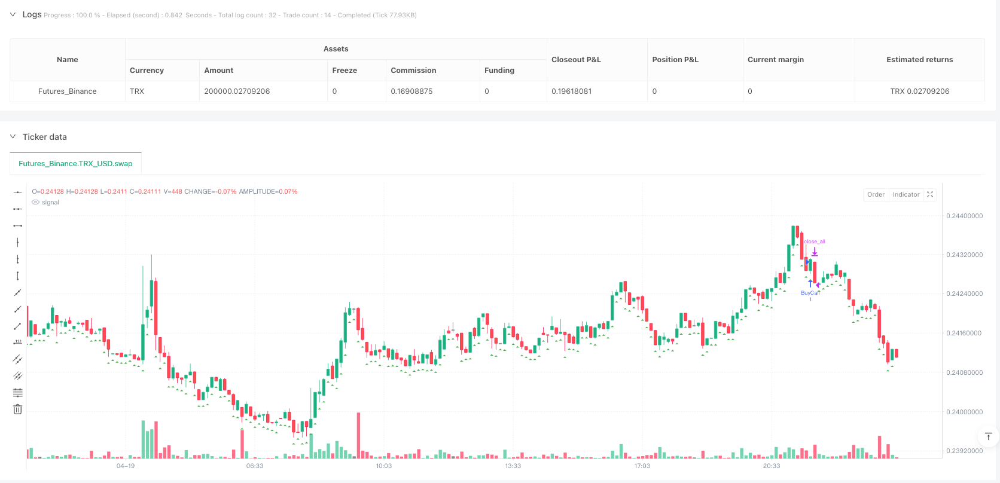
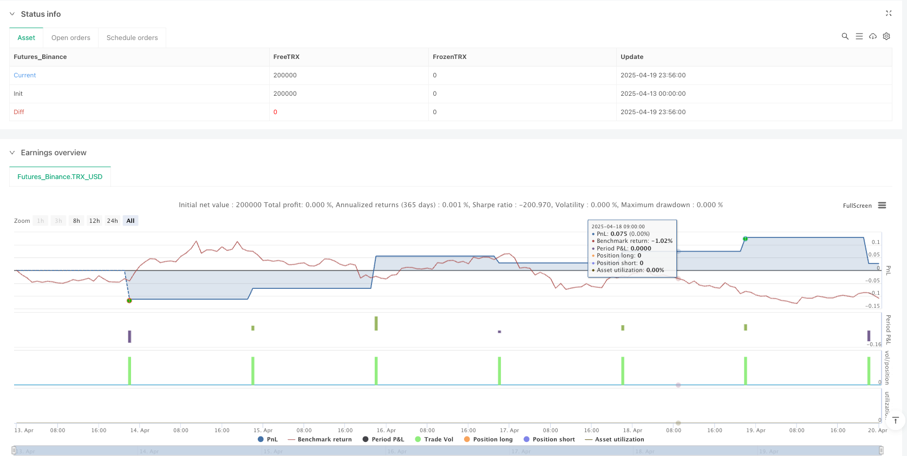

> Name

Open Price Momentum Reversal-RSI-Trading-Strategy-Market-Open-Momentum-Reversal-RSI-Trading-Strategy
> Author

ianzeng123

> Strategy Description





[trans]

## Strategy Overview
This strategy is a trading system based on short-term price momentum after the market opens. It observes the price trend direction in the first 90 seconds after the market opens, and then enters the market with the trend after determining the direction. The strategy sets two exit conditions: one is a reversal signal based on the RSI indicator, and the other is a fixed 10-minute time window limit. This strategy is particularly suitable for rapidly volatile market environments, taking advantage of the price volatility and trend-forming characteristics that typically exist when the market opens.
The core idea of ​​the strategy is to capture the short-term trend formed at the beginning of the market opening and make profits if the trend continues, while controlling risks through technical indicators and time limits. This method is particularly suitable for day traders and options traders who seek to take advantage of the volatility at the market's opening for short-term gains.
## Strategy Principle
How this strategy works is broken down into several key steps:
1. **Initial direction determination**: The strategy observes price action within the first 90 seconds after the market opens. At the end of the 90 seconds, the market direction (up, down, or flat) is determined by comparing the current price to the opening price.
2. **Entry signal**: Once the direction is determined, the strategy will enter the market immediately after the direction is determined. If it is an upward trend, it will go long (buy a call option), if it is a down trend, it will go short (buy a put option).
3. **Exit conditions**: The strategy has two exit mechanisms:
   - **RSI-based reversal signals**: The strategy triggers an exit signal if the RSI reaches or exceeds 70 (overbought) when in the case of a long position, or reaches or falls below 30 (oversold) in the case of a short position.
   - **Time-Based Exit**: Regardless of profit or loss, the strategy will exit within 10 minutes (600 seconds) of entering the trade.
4. **Daily Reset**: At the beginning of each trading day, the strategy will reset all variables to prepare for a new day of trading.
## Strategic Advantages
1. **Simple and clear entry rules**: The strategy determines the direction based on the price trend 90 seconds after the opening. The entry rules are simple, intuitive and easy to execute.
2. **Combined with technical indicators and time limits**: Through RSI overbought and oversold indicators and fixed time windows, the strategy provides a multi-layered protection mechanism to help control risks.
3. **Adapt to market opening characteristics**: There are usually large fluctuations when the market opens. This strategy takes advantage of this characteristic to capture short-term price momentum.
4. **No complex market analysis required**: The strategy does not rely on complex market analysis or a combination of multiple indicators, and is easy to operate.
5. **Clearly defined stop loss mechanism**: Through RSI reversal signals and time limits, the strategy has a clear stop loss mechanism, which helps control the maximum loss in a single transaction.
6. **Can be used for options trading**: The strategy is particularly suitable for options trading. You can use option leverage to amplify returns while controlling fixed risks.
## Strategy Risk
1. **False breakthrough risk**: There may be a false breakthrough in the early stages of the market opening, causing the strategy to open a position in the wrong direction. Solution: Consider adding additional filtering conditions, such as volume confirmation or a longer observation period.
2. **RSI indicator hysteresis**: As a reversal indicator, RSI has hysteresis, which may cause the best exit point to be missed when the exit signal appears. Solution: RSI parameters can be adjusted or combined with other leading indicators.
3. **Fixed Time Window Limitation**: The fixed position holding time of 10 minutes may be too short or too long, depending on market conditions. Solution: Adjust the time window according to the fluctuation characteristics of different markets and varieties.
4. **Not considering the overall market trend**: The strategy is only based on the short-term trend of the opening and does not take into account the larger market trend. Solution: Add daily or weekly trend filter conditions.
5. **May face higher transaction costs**: Since it is a short-term strategy, frequent transactions may lead to higher transaction costs. Solution: Choose a brokerage or trading product with lower transaction costs.
6. **The impact of major news events is not considered**: Major news events may cause abnormal market fluctuations. Solution: Pause the strategy or adjust parameters on major news announcement days.
## Strategy optimization direction
1. **Adjust time parameters**: The initial observation window (90 seconds) and maximum position time (10 minutes) can be adjusted for different markets and varieties to adapt to different market volatility. Reasons for optimization: Different markets and varieties have different fluctuation characteristics, and fixed parameters may not be the optimal choice.
2. **Add trend filter**: Add a trend filter with a larger time frame, and only enter the market when the direction of the general trend is consistent. Reason for optimization: Following the trend of the larger time frame can improve the winning rate of the strategy.
3. **Optimize RSI parameters**: Adjust the RSI length and overbought and oversold thresholds according to the characteristics of specific trading varieties. Reasons for Optimization: The standard RSI parameters (14, 70, 30) may not be suitable for all markets and time frames.
4. **Add volume confirmation**: Add volume analysis to entry decisions to ensure that price momentum is supported by sufficient trading activity. Reason for optimization: Price changes combined with volume confirmation can reduce the risk of false breakthroughs.
5. **Dynamic Stop Loss Mechanism**: Introduce dynamic stop loss based on volatility, instead of just relying on RSI and time limits. Reason for optimization: Volatility-adjusted stop loss is more adaptable to current market conditions.
6. **Add retracement control**: Set the maximum acceptable retracement ratio, and suspend the strategy when it exceeds this ratio. Reasons for optimization: Controlling drawdowns can protect funds and prevent continuous losses from causing a significant shrinkage of the account.
7. **Add multiple time frame analysis**: Combine the analysis of multiple time frames to improve the quality of entry signals. Reason for optimization: Multi-time frame consistency can improve signal reliability.
## Summarize
The Open Momentum Reversal RSI trading strategy is a simple and effective short-term trading method that is particularly suitable for capturing momentum opportunities when the market opens. This strategy determines trade direction by observing price action 90 seconds after the open, and combines RSI reversal signals with a 10-minute time window to manage exits.
Although the strategy design is simple, it contains the core elements of the trading system such as direction determination, entry execution, risk control and exit management. Through appropriate parameter adjustment and optimization, this strategy can adapt to different market environments and trading varieties.
However, traders should be aware of the risk of false breakouts when the market opens when using this strategy, and consider combining it with trend analysis on a larger time frame to increase the winning rate. In addition, dynamically adjusting RSI parameters, adding volume confirmation and implementing a more flexible stop-loss mechanism are all optimization directions worth exploring.
For options traders, this strategy provides clear directional trading signals and limited risk exposure, which is well suited to the time decay characteristics of options. By properly controlling positions and selecting appropriate option expiration dates, the risk-reward ratio of the strategy can be further optimized. ||
## Strategy Overview

This strategy is a trading system based on short-term price momentum after market opening. It observes the price movement direction during the first 90 seconds after market opening, then enters a trade in the established direction. The strategy has two exit conditions: a reversal signal based on the RSI indicator and a fixed 10-minute time window limit. This approach is particularly suitable for rapidly fluctuating market environments, leveraging the price volatility and trend formation characteristics typically present at market open.

The core concept is to capture short-term trends formed during the initial market opening period and profit from trend continuation, while controlling risk through technical indicators and time limitations. This method is especially suitable for intraday traders and options traders seeking to capitalize on market opening volatility for short-term gains.

## Strategy Principles

The strategy operates through several key steps:

1. **Initial Direction Determination**: The strategy observes price movements during the first 90 seconds after market opening. At the end of this period, it determines market direction (up, down, or flat) by comparing the current price to the opening price.

2. **Entry Signal**: Once the direction is determined, the strategy immediately enters a position - going long (buying call options) for upward trends or going short (buying put options) for downward trends.

3. **Exit Conditions**: The strategy implements two exit mechanisms:
   - **RSI-based Reversal Signal**: If RSI reaches or exceeds 70 (overbought) in a long position, or reaches or falls below 30 (oversold) in a short position, the strategy triggers an exit signal.
   - **Time-based Exit**: Regardless of profit or loss, the strategy exits within 10 minutes (600 seconds) after entering a trade.

4. **Daily Reset**: At the beginning of each trading day, the strategy resets all variables in preparation for a new day of trading.

## Strategy Advantages

1. **Simple and Clear Entry Rules**: The strategy determines direction based on price movement in the first 90 seconds after opening, making entry rules simple, intuitive, and easy to execute.

2. **Combines Technical Indicators and Time Limits**: Through RSI overbought/oversold indicators and a fixed time window, the strategy provides multiple layers of protection, helping to control risk.

3. **Adapts to Market Opening Characteristics**: Markets often experience significant volatility at open, and this strategy capitalizes on this characteristic to capture short-term price momentum.

4. **No Need for Complex Market Analysis**: The strategy doesn't rely on complex market analysis or combinations of multiple indicators, making operation straightforward.

5. **Well-defined Stop-loss Mechanism**: Through RSI reversal signals and time limitations, the strategy has clear stop-loss mechanisms, helping to control maximum loss per trade.

6. **Suitable for Options Trading**: The strategy is particularly appropriate for options trading, utilizing options leverage to amplify returns while controlling fixed risk.

## Strategy Risks

1. **False Breakout Risk**: The early market opening period may experience false breakouts, causing the strategy to establish positions in the wrong direction. Solution: Consider adding additional filtering conditions, such as volume confirmation or a longer observation period.

2. **RSI Indicator Lag**: RSI as a reversal indicator has inherent lag, potentially causing exit signals to appear after missing the optimal exit point. Solution: Adjust RSI parameters or combine with other leading indicators.

3. **Fixed Time Window Limitation**: The fixed 10-minute holding period may be too short or too long, depending on market conditions. Solution: Adjust the time window based on volatility characteristics of different markets and instruments.

4. **Failure to Consider Overall Market Trend**: The strategy is based solely on short-term opening movement without considering the broader market trend. Solution: Add daily or weekly trend filtering conditions.

5. **Potentially High Transaction Costs**: As a short-term strategy, frequent trading may lead to high transaction costs. Solution: Choose brokers or trading instruments with lower transaction costs.

6. **Impact of Major News Events Not Considered**: Major news events can cause abnormal market volatility. Solution: Pause the strategy or adjust parameters on days with major news announcements.

## Strategy Optimization Directions

1. **Adjust Time Parameters**: Initial observation window (90 seconds) and maximum holding time (10 minutes) can be adjusted for different markets and instruments to adapt to varying market volatility. Optimization rationale: Different markets and instruments have different volatility characteristics, and fixed parameters may not be optimal.

2. **Add Trend Filters**: Incorporate larger timeframe trend filters, only entering positions when aligned with the major trend direction. Optimization rationale: Following the direction of larger timeframe trends can improve the strategy's win rate.

3. **Optimize RSI Parameters**: Adjust RSI length and overbought/oversold thresholds based on the characteristics of specific trading instruments. Optimization rationale: Standard RSI parameters (14, 70, 30) may not be suitable for all markets and timeframes.

4. **Add Volume Confirmation**: Incorporate volume analysis in entry decisions to ensure price momentum is supported by sufficient trading activity. Optimization rationale: Price movements confirmed by volume can reduce the risk of false breakouts.

5. **Dynamic Stop-loss Mechanism**: Introduce volatility-based dynamic stop-losses, rather than relying solely on RSI and time limitations. Optimization rationale: Volatility-adjusted stops better adapt to current market conditions.

6. **Add Drawdown Control**: Set maximum acceptable drawdown percentages, pausing the strategy when exceeded. Optimization rationale: Controlling drawdowns protects capital and prevents significant account reduction from consecutive losses.

7. **Incorporate Multiple Timeframe Analysis**: Combine analysis from multiple timeframes to improve entry signal quality. Optimization rationale: Multi-timeframe consensus can enhance signal reliability.

## Summary

The Market Open Momentum Reversal RSI Trading Strategy is a simple yet effective short-term trading method, particularly suitable for capturing momentum opportunities at market open. This strategy determines trading direction by observing price movements during the first 90 seconds after opening and manages exits through RSI reversal signals and a 10-minute time window.

Despite its simple design, the strategy encompasses core elements of a trading system including direction determination, entry execution, risk control, and exit management. With appropriate parameter adjustments and optimization, this strategy can adapt to different market environments and trading instruments.

However, traders should be aware of the risk of false breakouts during market opening and consider incorporating larger timeframe trend analysis to improve the win rate. Additionally, dynamically adjusting RSI parameters, adding volume confirmation, and implementing more flexible stop-loss mechanisms are all worthwhile optimization directions to explore.

For options traders, this strategy provides clear directional trading signals with limited risk exposure time, making it well-suited to the time decay characteristics of options. Through reasonable position sizing and appropriate selection of option expiration dates, the risk-reward ratio of the strategy can be further optimized.[/trans]


> Source (PineScript)

``` pinescript
/*backtest
start: 2025-04-13 00:00:00
end: 2025-04-20 00:00:00
period: 7m
basePeriod: 7m
exchanges: [{"eid":"Futures_Binance","currency":"TRX_USD"}]
*/

// @version=5
strategy("Market Open Options Strategy", overlay=true)

// Define trading session start (e.g., 9:30 AM for US markets)
session_start = timestamp("GMT-4", year, month, dayofmonth, 09, 30, 00)

// Time window for initial direction (90 seconds = 1.5 minutes)
initial_window = 90 * 1000 // in milliseconds
is_in_initial_window = (time - session_start) <= initial_window and (time - session_start) >= 0

// Variables to track open price and direction
var float open_price = 0.0
var float direction = 0.0
var bool direction_set = false

// Capture open price at session start
if (time == session_start)
    open_price := close
    direction_set := false

// Determine direction after 90 seconds
if (is_in_initial_window[1] and not is_in_initial_window and not direction_set)
    direction := close > open_price ? 1.0 : close < open_price ? -1.0 : 0.0
    direction_set := true

// Reset direction_set at the start of a new day
if (time == session_start)
    direction_set := false

// Reversal indicator (RSI-based)
rsi_length = 14
rsi_overbought = 70
rsi_oversold = 30
rsi = ta.rsi(close, rsi_length)
reversal_signal = (direction == 1.0 and rsi >= rsi_overbought) or (direction == -1.0 and rsi <= rsi_oversold)

// Time-based exit (10 minutes = 600 seconds)
max_hold_time = 600 * 1000 // in milliseconds
is_within_hold_time = (time - (session_start + initial_window)) <= max_hold_time and (time - (session_start + initial_window)) >= 0

// Strategy logic
if (direction_set and direction != 0.0 and is_within_hold_time and not reversal_signal)
    if (direction == 1.0)
        strategy.entry("BuyCall", strategy.long)
    else if (direction == -1.0)
        strategy.entry("BuyPut", strategy.short)

// Exit conditions: Reversal or time-based
if (reversal_signal or not is_within_hold_time)
    strategy.close_all("Exit")

// Plot signals
plotshape(direction == 1.0 and strategy.position_size == 0 and direction_set ? close : na, "Buy Call", shape.triangleup, location.belowbar, color.green, size=size.small)
plotshape(direction == -1.0 and strategy.position_size == 0 and direction_set ? close : na, "Buy Put", shape.triangledown, location.abovebar, color.red, size=size.small)
```

> Detail

https://www.fmz.com/strategy/491510

> Last Modified

2025-04-21 16:10:30
