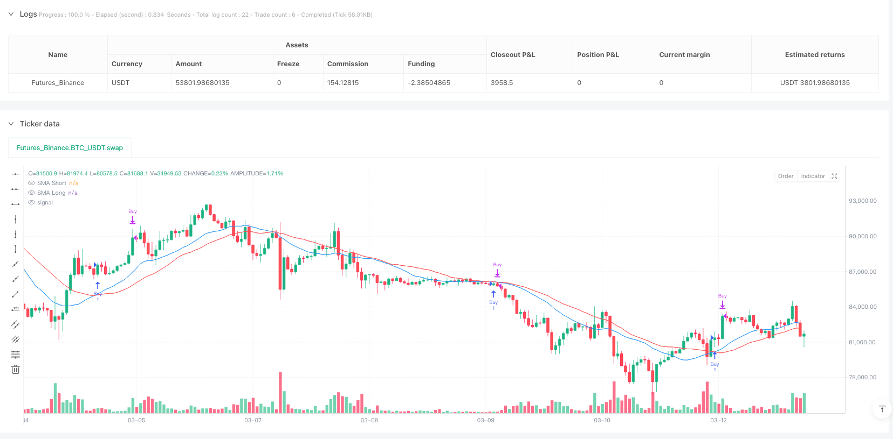
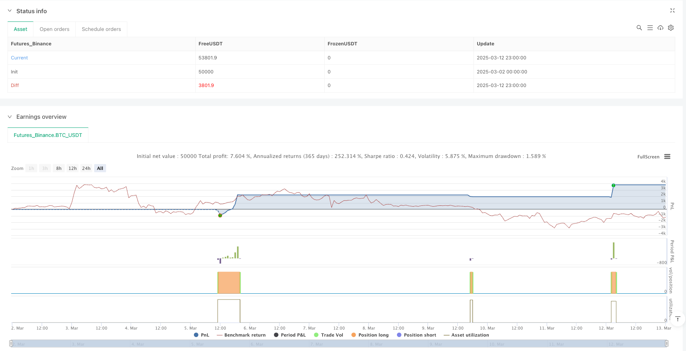

> Name

Moving-Average-RSI-Crossover-Momentum-Confirmation-Strategy
> Author

ianzeng123

> Strategy Description





[trans]
#### Overview
The Moving Average RSI Cross Momentum Confirmation Strategy is a quantitative trading system that combines the Simple Moving Average (SMA) and the Relative Strength Index (RSI). This strategy identifies buy and sell signals through the synergy of two technical indicators, with the SMA used to determine the overall trend direction and the RSI used to confirm overbought and oversold conditions. This strategy performs well in medium-term trending markets and is particularly suitable for operating on the 1-hour time frame. The core of the strategy is to generate a buy signal when the short-term SMA crosses above the long-term SMA (forming a golden cross) and the RSI is above the oversold level; when the short-term SMA crosses below the long-term SMA (forming a dead cross) and the RSI is below the overbought level, a sell signal is generated. In addition, this strategy also incorporates a flexible take-profit management mechanism, including full-position take-profit and half-position take-profit options, providing traders with more sophisticated position management tools.
#### Strategy Principle
The rationale for this strategy is based on the coordinated working of two core technical indicators:
1. **Simple Moving Average (SMA)**: The strategy uses two SMAs with different periods. The default settings are short-term 20 periods and long-term 30 periods. When the short-term SMA crosses the long-term SMA upward, it indicates that the price momentum is turning into an uptrend, forming a potential buy signal; conversely, when the short-term SMA crosses below the long-term SMA, it indicates that the price momentum is turning into a downtrend, forming a potential sell signal.
2. **Relative Strength Index (RSI)**: The strategy uses the 14-period RSI to confirm whether the market is overbought or oversold. An RSI below 25 is considered an oversold condition, and an RSI above 75 is considered an overbought condition. The RSI indicator plays a filtering role in this strategy, ensuring that buy signals occur when the RSI has left the oversold zone and sell signals occur when the RSI has left the overbought zone.
The specific transaction logic is as follows:
- Buy signal: Triggered when the short-term SMA crosses the long-term SMA upward (forming a golden cross) and the RSI value is greater than the oversold level (25).
- Sell signal: Triggered when the short-term SMA crosses the long-term SMA downward (forming a dead cross) and the RSI value is less than the overbought level (75).
In the code implementation, the ta.crossover and ta.crossunder functions are used to detect the crossover of SMA and combine with RSI conditions to generate the final buy and sell signal. The transaction status is tracked through the Boolean variables inBuyState and inSellState to ensure that the strategy can correctly manage the position status.
#### Strategic Advantages
After in-depth analysis of the code, this strategy shows several significant advantages:
1. **Synergy effect of indicator combination**: The strategy cleverly combines the trend following indicator (SMA) and the momentum indicator (RSI), which can effectively reduce false signals. The SMA cross confirms the change in trend direction, while the RSI further verifies the market's momentum state. The combination of the two improves the reliability of the signal.
2. **Flexible take-profit mechanism**: The strategy has a built-in customizable take-profit function, which is set to a target profit rate of 2% by default. More importantly, traders can choose to enable or disable the take-profit function, or even choose the half-position take-profit mode (halfPositionTakeProfit), which only closes half of the position when the target price is reached, allowing the remaining positions to continue to obtain potential profits. This flexibility allows traders to adjust their strategies based on their risk appetite and market conditions.
3. **Parameter customizability**: All key parameters of the strategy can be adjusted through input variables, including short-term and long-term SMA cycles, RSI cycles, overbought and oversold thresholds, and take-profit percentages. This allows the strategy to adapt to different market environments and trading varieties.
4. **Intuitive visualization**: The strategy draws short-term and long-term SMA lines on the chart, and changes the color of the candle chart according to the market status (green for buying status, red for selling status), allowing traders to intuitively track the strategy's signals and market status.
5. **Clear code structure**: The strategy code is well organized and uses variables to track market status, entry price and half position take profit status. The logic is clear and easy to understand and maintain.
#### Strategy Risk
Although this strategy is well designed, there are still some potential risks:
1. **False signals in sideways markets**: When the market is sideways or the fluctuation range is limited, SMA crossovers may occur frequently, leading to over-trading and continuous losses. In this market environment, the SMA indicator often produces many invalid crossover signals.
2. **Parameter Sensitivity**: The performance of the strategy is quite sensitive to the parameter settings of SMA and RSI. Different market environments may require different parameter configurations. If the parameters are not set appropriately, the strategy may not be able to capture the real turning point of the market.
3. **Limitations of a single signal system**: This strategy relies only on technical indicators to generate signals, without taking into account other important factors such as market structure, support and resistance levels, or fundamental factors. Under certain market conditions, purely technical indicator-driven strategies may be out of touch with actual market trends.
4. **Potential Problems with Take Profit Settings**: Fixed percentage take profit settings may not be suitable for all market environments. In markets with greater volatility, a 2% take-profit may be too small, resulting in frequent take-profits and missing the general trend; while in markets with lower volatility, a 2% target may be too aggressive.
Ways to reduce these risks include:
- Backtest and optimize parameters under different market conditions
- Add additional filters, such as considering longer-term trend direction or market volatility
- Combine with other technical analysis methods or fundamental analysis to confirm signals
- Implement a dynamic take-profit mechanism to automatically adjust the take-profit level based on market volatility
#### Strategy optimization direction
Based on code analysis, this strategy has the following possible optimization directions:
1. **Dynamic parameter adjustment mechanism**: The current strategy uses fixed SMA and RSI parameters. An effective optimization direction is to achieve dynamic adjustment of parameters, such as automatically adjusting the SMA cycle or RSI threshold based on market volatility (ATR). Using shorter SMA periods in markets with high volatility and longer SMA periods in markets with low volatility can better adapt to different market environments.
2. **Added Trend Strength Filtering**: Trend strength indicators such as ADX (Average Directional Index) can be added to filter SMA crossover signals. Only when ADX is above a certain threshold (such as 25) is the trend confirmed to be strong enough to execute the trading signal generated by the SMA crossover. This helps avoid false signals in weak trends or sideways markets.
3. **Added dynamic stop-loss mechanism**: The current strategy only has a stop-profit function and no stop-loss mechanism. It is recommended to add a dynamic stop loss based on ATR to limit the maximum loss of a single transaction. For example, the stop loss level can be set to the entry price minus 2 times the ATR value, so that the stop loss distance can be automatically adjusted according to market volatility.
4. **Optimize the half-position take-profit logic**: The current half-position take-profit logic can be further improved. For example, after reaching the first take-profit target, move the stop-loss of the remaining positions to the entry price (guaranteed stop-loss), or set multiple take-profit targets and close the position in batches. This can maximize the opportunity to seize the general trend while protecting existing profits.
5. **Add trading time filter**: Many markets exhibit different characteristics during different trading hours. You can consider adding a trading time filter to only execute trading signals during specific high-quality trading periods (such as the overlap between European and American trading sessions).
The core idea of ​​these optimization directions is to make the strategy more adaptable and able to automatically adjust its behavior according to market conditions, thereby improving its stability and profitability in different market environments.
#### Summary
The Moving Average RSI Cross Momentum Confirmation Strategy is a quantitative trading system that combines the technical analysis indicators SMA and RSI to generate trading signals by identifying trend turning points and confirming momentum conditions. The main advantages of this strategy are its simplicity, customizability and built-in flexible take-profit mechanism, making it an effective tool for medium-term trend following.
Although there are risks such as false signals in sideways markets and parameter sensitivity, the robustness and adaptability of the strategy can be significantly improved by introducing methods such as dynamic parameter adjustment, trend strength filtering, dynamic stop loss and optimized position management. In particular, integrating the ATR indicator into parameter adjustment and risk management can enable the strategy to better adapt to different market fluctuation conditions.
This strategy is suitable for medium and long-term trending markets. It is a simple starting point with room for expansion for traders who are interested in entering the field of quantitative trading. Through continuous optimization and personalized adjustments, traders can develop this basic strategy into a unique trading system suitable for their own trading style and risk preference. Finally, it is recommended that traders conduct sufficient historical backtesting and simulated trading on the strategy before actual trading to verify its performance in different market environments. ||
#### Overview
The Moving Average RSI Crossover Momentum Confirmation Strategy is a quantitative trading system that combines Simple Moving Averages (SMA) and Relative Strength Index (RSI). This strategy utilizes the synergy between two technical indicators to identify buy and sell signals, where SMA determines the overall trend direction, while RSI confirms overbought and oversold conditions. The strategy performs well in medium-term trending markets, particularly suitable for the 1-hour timeframe. The core principle is generating buy signals when the short-term SMA crosses above the long-term SMA (golden cross) and RSI is above the oversold level; sell signals are generated when the short-term SMA crosses below the long-term SMA (death cross) and RSI is below the overbought level. Additionally, the strategy incorporates flexible take profit management mechanisms, including full position and half position take profit options, providing traders with more refined position management tools.

#### Strategy Principles
The strategy's principles are based on the collaborative work of two core technical indicators:

1. **Simple Moving Averages (SMA)**: The strategy uses two SMAs with different periods, defaulting to a short-term 20-period and a long-term 30-period. When the short-term SMA crosses above the long-term SMA, it indicates that price momentum is shifting to an uptrend, forming a potential buy signal; conversely, when the short-term SMA crosses below the long-term SMA, it indicates that price momentum is shifting to a downtrend, forming a potential sell signal.

2. **Relative Strength Index (RSI)**: The strategy uses a 14-period RSI to confirm whether the market is in overbought or oversold conditions. An RSI below 25 is considered oversold, while an RSI above 75 is considered overbought. The RSI indicator serves as a filter in this strategy, ensuring buy signals occur when RSI has already moved out of oversold territory, and sell signals occur when RSI has moved out of overbought territory.

The specific trading logic is as follows:
- Buy Signal: Triggered when the short-term SMA crosses above the long-term SMA (golden cross) and the RSI value is greater than the oversold level (25).
- Sell Signal: Triggered when the short-term SMA crosses below the long-term SMA (death cross) and the RSI value is less than the overbought level (75).

In the code implementation, ta.crossover and ta.crossunder functions are used to detect SMA crossovers, combined with RSI conditions to generate the final buy and sell signals. Trading states are tracked using boolean variables inBuyState and inSellState, ensuring the strategy correctly manages position status.

#### Strategy Advantages
After an in-depth analysis of the code, this strategy demonstrates several significant advantages:

1. **Synergistic Effect of Indicator Combination**: The strategy cleverly combines a trend-following indicator (SMA) with a momentum indicator (RSI), effectively reducing false signals. SMA crossovers confirm changes in trend direction, while RSI further validates the momentum state of the market, improving signal reliability when used together.

2. **Flexible Take Profit Mechanism**: The strategy features a customizable take profit function, defaulting to a 2% target profit rate. More importantly, traders can choose to enable or disable the take profit function, or even select a half-position take profit mode (halfPositionTakeProfit), closing only half of the position when reaching the target price and allowing the remaining position to continue capturing potential gains. This flexibility enables traders to adjust the strategy according to their risk preferences and market conditions.

3. **Parameter Customizability**: All key parameters of the strategy can be adjusted through input variables, including short and long-term SMA periods, RSI period, overbought/oversold thresholds, and take profit percentage. This makes the strategy adaptable to different market environments and trading instruments.

4. **Intuitive Visualization Effects**: The strategy plots short-term and long-term SMA lines on the chart and changes candlestick colors based on market state (green for buy state, red for sell state), allowing traders to visually track strategy signals and market conditions.

5. **Clear Code Structure**: The strategy code is well-organized, using variables to track market status, entry price, and half-position take profit status, with clear logic that is easy to understand and maintain.

#### Strategy Risks
Despite being well-designed, the strategy still has some potential risks:

1. **False Signals in Ranging Markets**: In sideways or range-bound markets, SMA crossovers may occur frequently, leading to overtrading and consecutive losses. In such market environments, SMA indicators often produce many invalid crossing signals.

2. **Parameter Sensitivity**: The strategy's performance is quite sensitive to SMA and RSI parameter settings. Different market environments may require different parameter configurations; if parameters are set inappropriately, the strategy may fail to capture the market's true turning points.

3. **Limitations of a Single Signal System**: The strategy relies solely on technical indicators to generate signals, without considering other important factors such as market structure, support/resistance levels, or fundamental factors. In certain market conditions, a purely technical indicator-driven strategy may disconnect from actual market movements.

4. **Potential Issues with Take Profit Settings**: Fixed percentage take profit settings may not be suitable for all market environments. In highly volatile markets, a 2% take profit may be too small, causing frequent profit-taking and missing larger trends; in low-volatility markets, the 2% target might be too aggressive.

Methods to reduce these risks include:
- Backtesting and optimizing parameters under different market conditions
- Adding additional filtering conditions, such as considering longer-term trend direction or market volatility
- Combining with other technical analysis methods or fundamental analysis to confirm signals
- Implementing dynamic take profit mechanisms that automatically adjust take profit levels based on market volatility

#### Strategy Optimization Directions
Based on code analysis, the strategy has several possible optimization directions:

1. **Dynamic Parameter Adjustment Mechanism**: Currently, the strategy uses fixed SMA and RSI parameters. An effective optimization direction would be to implement dynamic parameter adjustments, such as automatically adjusting SMA periods or RSI thresholds based on market volatility (ATR). Using shorter SMA periods in high-volatility markets and longer SMA periods in low-volatility markets could better adapt to different market environments.

2. **Add Trend Strength Filtering**: A trend strength indicator like ADX (Average Directional Index) could be added to filter SMA crossover signals. Only when ADX is above a certain threshold (like 25) would the trend be considered strong enough to execute trade signals generated by SMA crossovers. This helps avoid false signals in weak trend or ranging markets.

3. **Add Dynamic Stop Loss Mechanism**: The current strategy only has a take profit function without a stop loss mechanism. It's recommended to add an ATR-based dynamic stop loss to limit maximum losses on single trades. For example, setting the stop loss level at entry price minus 2 times the ATR value would automatically adjust stop loss distance based on market volatility.

4. **Optimize Half-Position Take Profit Logic**: The current half-position take profit logic could be further improved, such as moving the stop loss for the remaining position to the entry price (breakeven stop) after reaching the first take profit target, or setting multiple take profit targets for partial position closing. This would protect existing profits while maximizing opportunities to capture larger trends.

5. **Add Trading Time Filter**: Many markets exhibit different characteristics during different trading sessions. Consider adding a trading time filter to execute trading signals only during specific high-quality trading sessions (such as the overlap of European and American trading hours).

The core idea behind these optimization directions is to make the strategy more adaptable, automatically adjusting its behavior based on market conditions, thereby improving its stability and profitability across different market environments.

#### Summary
The Moving Average RSI Crossover Momentum Confirmation Strategy is a quantitative trading system combining the technical analysis indicators SMA and RSI, generating trading signals by identifying trend turning points and confirming momentum conditions. The strategy's main advantages lie in its simplicity, customizability, and built-in flexible take profit mechanism, making it an effective tool for medium-term trend following.

Despite risks such as false signals in ranging markets and parameter sensitivity, the strategy's robustness and adaptability can be significantly improved by introducing dynamic parameter adjustments, trend strength filtering, dynamic stop losses, and optimized position management. In particular, integrating the ATR indicator into parameter adjustment and risk management can help the strategy better adapt to different market volatility conditions.

This strategy is suitable for medium to long-term trending markets and serves as a simple yet expandable starting point for traders interested in quantitative trading. Through continuous optimization and personalization, traders can develop this basic strategy into a unique trading system suited to their trading style and risk preferences. Finally, it is recommended that traders thoroughly backtest the strategy and conduct simulated trading before live trading to verify its performance under different market conditions.
[/trans]


> Source (PineScript)

``` pinescript
/*backtest
start: 2025-03-02 00:00:00
end: 2025-03-13 00:00:00
period: 1h
basePeriod: 1h
exchanges: [{"eid":"Futures_Binance","currency":"BTC_USDT"}]
*/

//@version=6
strategy("SMA+RSI Strategy", overlay=true)

// Customizable input settings
smaShortPeriod = input.int(20, title="SMA Short Period", minval=1)
smaLongPeriod = input.int(30, title="SMA Long Period", minval=1)
rsiPeriod = input.int(14, title="RSI Period", minval=1)
rsiOverbought = input.int(75, title="RSI Overbought Level", minval=1, maxval=100)
rsiOversold = input.int(25, title="RSI Oversold Level", minval=1, maxval=100)
takeProfitPerc = input.float(2.0, title="Take Profit (%)", minval=0.1, step=0.1) / 100  // Target profit percentage
enableTakeProfit = input.bool(true, title="Enable Take Profit")  // Enable/disable take profit option
halfPositionTakeProfit = input.bool(false, title="Enable Half Position Take Profit")  // Option to take profit on half position

// Indicator calculations
smaShort = ta.sma(close, smaShortPeriod)
smaLong = ta.sma(close, smaLongPeriod)
rsi = ta.rsi(close, rsiPeriod)

// Buy and sell signals
buySignal = ta.crossover(smaShort, smaLong) and rsi > rsiOversold
sellSignal = ta.crossunder(smaShort, smaLong) and rsi < rsiOverbought

// Variable to store current market state
var bool inBuyState = false
var bool inSellState = false

// Store entry price
var float entryPrice = na

// Variable to track whether half position take profit has been executed
var bool halfPositionTaken = false

// Update market state based on signals
if (buySignal)
    inBuyState := true
    inSellState := false
    entryPrice := close  // Store entry price at buy signal
    halfPositionTaken := false  // Reset half position take profit state when opening a new trade
if (sellSignal)
    inSellState := true
    inBuyState := false
    halfPositionTaken := false  // Reset half position take profit state when closing a trade

// Calculate target take profit level
takeProfitLevel = inBuyState ? entryPrice * (1 + takeProfitPerc) : na

// Execute trades
if (buySignal)
    strategy.entry("Buy", strategy.long, comment="Buy")  // Comment when opening trade

// Close half position at target if enabled and not yet taken
if (inBuyState and enableTakeProfit and halfPositionTakeProfit and close >= takeProfitLevel and not halfPositionTaken)
    strategy.close("Buy", qty_percent=50, comment="partialClose")  // Close half position
    halfPositionTaken := true  // Update state to prevent re-execution

// Close full position at target if half position take profit is disabled
if (inBuyState and enableTakeProfit and not halfPositionTakeProfit and close >= takeProfitLevel)
    strategy.close("Buy", comment="Close")  // Close full position

// Close position on sell signal
if (sellSignal)
    strategy.close("Buy", comment="Close")  // Close position on sell signal

// Plot moving averages on chart
plot(smaShort, color=color.blue, title="SMA Short")
plot(smaLong, color=color.red, title="SMA Long")

// Change candle colors based on market state
barcolor(inBuyState ? color.green : inSellState ? color.red : na)

```

> Detail

https://www.fmz.com/strategy/486566

> Last Modified

2025-03-14 09:35:47
