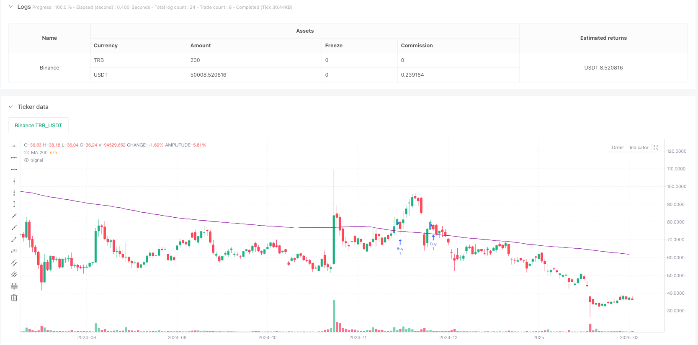
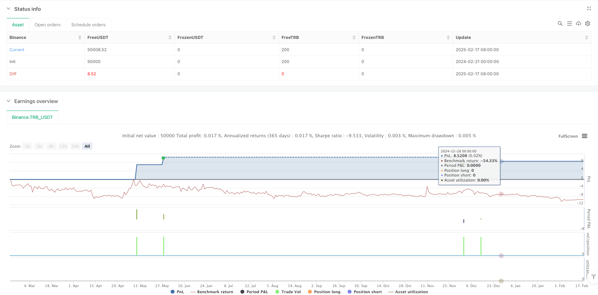

> Name

Dynamic-Moving-Average-Trend-Following-Strategy-with-RSI-ADX-Composite-Indicators
> Author

ianzeng123

> Strategy Description





[trans]
#### Overview
This strategy is a trend following system based on the 200-period simple moving average (MA200), which combines technical indicators such as the Relative Strength Index (RSI), the Average Trend Index (ADX), and the Average True Range (ATR) to form a complete trading decision-making framework. The strategy achieves effective risk control through the setting of dynamic stop loss and profit targets. Judging from the backtest results, this strategy has achieved a good winning rate in multiple trading varieties, showing strong adaptability and stability.
#### Strategy Principles
The core logic of the strategy is based on the following key points:
1. Use MA200 as the main trend judgment indicator, and generate an initial signal when the price breaks through MA200
2. Use the RSI indicator to determine overbought and oversold. The buy signal requires RSI>40, and the sell signal requires RSI<60.
3. Introduce the ADX indicator to judge the strength of the trend, requiring ADX>20 to ensure a clear trend
4. Filter false breakthroughs through 2 cycles of signal confirmation
5. Set dynamic stop loss based on ATR, take profit is fixed at 2%
#### Strategic Advantages
1. Multi-indicator collaborative verification improves signal reliability
2. The design of dynamic stop loss effectively controls risks
3. Adopt signal delay confirmation mechanism to reduce the impact of false breakthroughs
4. The strategy logic is clear, the parameter settings are reasonable, and it has strong practicality
5. The backtest results show that it can maintain a high winning rate on multiple trading varieties.
#### Strategy Risk
1. The MA200 cycle is long, which may lead to delayed entry timing.
2. A fixed 2% profit target may leave the market prematurely in a strong trend
3. The parameter settings of RSI and ADX may need to be optimized for different market characteristics.
4. The signal confirmation mechanism may miss trading opportunities in fast market conditions
#### Strategy optimization direction
1. Consider introducing an adaptive moving average period
2. Design a dynamic profit target calculation method
3. Add trading volume indicators as auxiliary judgments
4. Optimize the dynamic adjustment mechanism of the signal confirmation cycle
5. Introduce volatility filter to adjust position size during periods of high volatility
#### Summary
This strategy builds a robust trend following system by combining multiple technical indicators. The strategy focuses on risk control in design, and improves the reliability of transactions through dynamic stop loss and signal confirmation mechanisms. Although there is some room for optimization, overall it is a trading strategy with practical value. In the future, the performance of the strategy can be further improved through parameter optimization and adding auxiliary indicators. ||
#### Overview
This strategy is a trend following system based on the 200-period Simple Moving Average (MA200), combined with technical indicators including the Relative Strength Index (RSI), Average Directional Index (ADX), and Average True Range (ATR) to form a complete trading decision framework. The strategy implements effective risk control through dynamic stop-loss and profit targets. Backtesting results show that the strategy has achieved good win rates across multiple trading instruments, demonstrating strong adaptability and stability.

#### Strategy Principles
The core logic of the strategy is built on the following key points:
1. Uses MA200 as the primary trend indicator, generating initial signals when price breaks through MA200
2. Employs RSI for overbought/oversold judgment, requiring RSI>40 for buy signals and RSI<60 for sell signals
3. Incorporates ADX to judge trend strength, requiring ADX>20 to ensure clear trends
4. Filters false breakouts through 2-period signal confirmation
5. Sets dynamic stop-loss based on ATR, with fixed take profit at 2%

#### Strategy Advantages
1. Multiple indicator collaboration validates signals, improving reliability
2. Dynamic stop-loss design effectively controls risk
3. Signal delay confirmation mechanism reduces false breakout impacts
4. Clear strategy logic with reasonable parameter settings, highly practical
5. Backtesting shows maintained high win rates across multiple trading instruments

#### Strategy Risks
1. Long MA200 period may lead to delayed entry timing
2. Fixed 2% profit target might exit too early in strong trends
3. RSI and ADX parameters may need optimization for different market characteristics
4. Signal confirmation mechanism might miss trading opportunities in fast markets

#### Strategy Optimization Directions
1. Consider introducing adaptive moving average periods
2. Design dynamic profit target calculation methods
3. Add volume indicators as auxiliary judgment
4. Optimize dynamic adjustment mechanism for signal confirmation periods
5. Introduce volatility filters to adjust position sizing during high volatility periods

#### Summary
The strategy builds a robust trend following system by combining multiple technical indicators. The design emphasizes risk control through dynamic stop-loss and signal confirmation mechanisms to improve trading reliability. While there is room for optimization, it is overall a practical trading strategy with real value. Future improvements can be made through parameter optimization and additional auxiliary indicators to further enhance strategy performance.[/trans]


> Source (PineScript)

``` pinescript
/*backtest
start: 2024-02-21 00:00:00
end: 2025-02-18 08:00:00
period: 1d
basePeriod: 1d
exchanges: [{"eid":"Binance","currency":"TRB_USDT"}]
*/

//@version=5
strategy("BTC/USD MA200 with RSI, ADX, ATR", overlay=true)

// Definition of the main moving average
ma_trend = ta.sma(close, 200)  // Main trend filter

// Definition of RSI and ADX
rsi = ta.rsi(close, 14)
[diplus, diminus, adx] = ta.dmi(14, 14)  // Correction for ADX

// Definition of ATR for Stop Loss and Take Profit
atr = ta.atr(14)

// Conditions for crossing of the MA200
crossover_condition = ta.crossover(close, ma_trend)
crossunder_condition = ta.crossunder(close, ma_trend)

// Trend confirmation after 2 bars
buy_confirmation = crossover_condition[2] and (rsi > 40) and (adx > 20) and close > ma_trend
sell_confirmation = crossunder_condition[2] and (rsi < 60) and (adx > 20) and close < ma_trend

// Definition of Stop Loss and Take Profit
take_profit = close * 1.02  // 2% profit
stop_loss = close - (1.5 * atr)  // Dynamic stop based on ATR

// Execution of orders
if (buy_confirmation and strategy.opentrades == 0)
    strategy.entry("Buy", strategy.long)
    strategy.exit("Take Profit/Stop Loss", from_entry="Buy", limit=take_profit, stop=stop_loss)
    label.new(bar_index, high, "BUY", style=label.style_label_down, color=color.green, textcolor=color.white, size=size.normal)

if (sell_confirmation)
    if (strategy.opentrades > 0)
        strategy.close("Buy")
    label.new(bar_index, low, "SELL", style=label.style_label_up, color=color.red, textcolor=color.white, size=size.normal)

// Draw the main moving average
plot(ma_trend, color=color.purple, title="MA 200")

```

> Detail

https://www.fmz.com/strategy/482901

> Last Modified

2025-02-27 17:27:00
