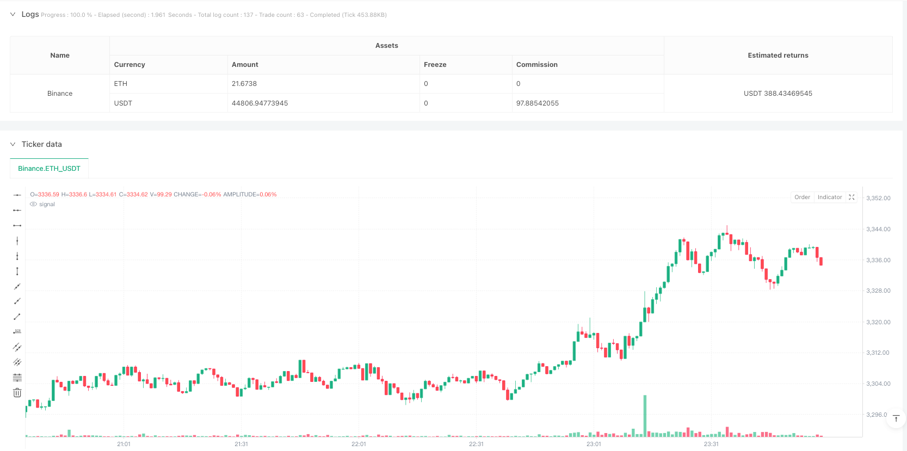
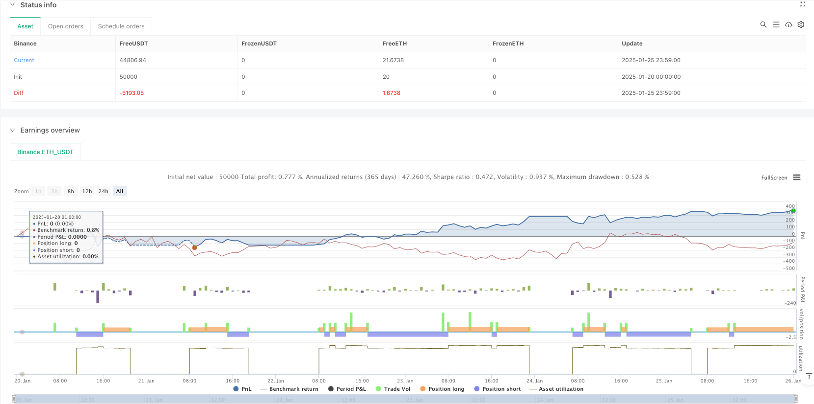

> Name

Adaptive-Market-Trading-Strategy-Based-on-RSI-Overbought-Oversold
> Author

ianzeng123

> Strategy Description





[trans]
#### Overview
This strategy is an adaptive trading system based on the Relative Strength Index (RSI). The strategy operates on the M5 timeframe and identifies potential trading opportunities by monitoring overbought and oversold levels of the RSI indicator. The system sets a fixed stop loss and take profit ratio and limits execution to a specific trading period. The strategy adopts the fund percentage management method, investing 10% of the total funds in each transaction.
#### Strategy Principle
The core of the strategy is to trade using the fluctuation characteristics of the RSI indicator within a 14-period period. When the RSI is below the oversold level of 30, the system sends a long signal; when the RSI is above the overbought level of 70, the system sends a short signal. Transactions are only executed within the time window of 6:00-17:00, which helps avoid periods of greater market volatility. Each trade is set with a 1% stop loss and 2% take profit level. This asymmetric risk-return ratio is conducive to long-term profits.
#### Strategic Advantages
1. Scientific indicator selection: RSI is a market-proven momentum indicator that can effectively capture reversal opportunities when prices overshoot or overfall.
2. Perfect risk control: The strategy adopts a fixed percentage of stop-loss and take-profit settings, which can effectively control the risk of each transaction.
3. Reasonable time management: By limiting the trading time window, periods of poor market liquidity are avoided.
4. Robust fund management: 10% of the funds are used for each transaction, which not only ensures profit potential, but also avoids excessive risk-taking.
#### Strategy Risk
1. Trending market risk: In a strong trending market, RSI may be in the overbought or oversold range for a long time, leading to an increase in false signals.
2. Slippage risk: When the market fluctuates violently, the actual transaction price may deviate greatly from the signal price.
3. Fixed parameter risk: RSI parameters and overbought and oversold thresholds are fixed and may not adapt to all market environments.
#### Strategy optimization direction
1. Introduce trend filter: you can add trend indicators such as moving averages and trade in the main trend direction.
2. Dynamic parameter optimization: Consider using adaptive RSI cycles and overbought and oversold thresholds to adapt to different market environments.
3. Optimize trading time: The best trading time can be further refined based on market statistics.
4. Improve fund management: the position size can be dynamically adjusted according to volatility to achieve more sophisticated risk control.
#### Summary
This is a well-designed and logical trading strategy. Capturing overbought and oversold opportunities in the market through the RSI indicator, combined with strict risk control and time management, has good practical application value. The main advantage of the strategy lies in the integrity of the system and the clarity of the operation. However, in real trading, it is still necessary to pay attention to the impact of the market environment on the performance of the strategy, and perform appropriate parameter optimization according to the actual situation. ||
#### Overview
This strategy is an adaptive trading system based on the Relative Strength Index (RSI). Operating on the M5 timeframe, it identifies potential trading opportunities by monitoring RSI overbought and oversold levels. The system implements fixed stop-loss and take-profit ratios and operates within specific trading hours. The strategy employs percentage-based money management, investing 10% of total capital per trade.

#### Strategy Principles
The core mechanism relies on RSI fluctuations over a 14-period cycle. The system generates long signals when RSI falls below the oversold level of 30 and short signals when RSI exceeds the overbought level of 70. Trading is restricted to the 6:00-17:00 time window, helping avoid highly volatile market periods. Each trade is set with a 1% stop-loss and 2% take-profit level, creating an asymmetric risk-reward ratio favorable for long-term profitability.

#### Strategy Advantages
1. Scientific Indicator Selection: RSI is a market-proven momentum indicator effective at capturing price reversal opportunities in overbought and oversold conditions.
2. Comprehensive Risk Control: The strategy employs fixed percentage-based stop-loss and take-profit settings, effectively controlling risk per trade.
3. Rational Time Management: By restricting trading hours, the strategy avoids periods of poor market liquidity.
4. Robust Money Management: Using 10% capital allocation per trade ensures good profit potential while avoiding excessive risk.

#### Strategy Risks
1. Trend Market Risk: In strong trend markets, RSI may remain in overbought or oversold zones for extended periods, increasing false signals.
2. Slippage Risk: During volatile market conditions, actual execution prices may significantly deviate from signal prices.
3. Fixed Parameter Risk: The fixed RSI parameters and overbought/oversold thresholds may not adapt to all market conditions.

#### Optimization Directions
1. Introduce Trend Filters: Add trend indicators like moving averages to trade in the direction of the main trend.
2. Dynamic Parameter Optimization: Consider using adaptive RSI periods and overbought/oversold thresholds to suit different market conditions.
3. Optimize Trading Hours: Further refine optimal trading periods based on market statistics.
4. Enhance Money Management: Dynamically adjust position sizes based on volatility for more precise risk control.

#### Summary
This is a well-designed trading strategy with clear logic. It captures market overbought and oversold opportunities through the RSI indicator, combined with strict risk control and time management, demonstrating good practical application value. The strategy's main strengths lie in its system completeness and operational clarity, but attention must be paid to market conditions' impact on strategy performance in live trading, with appropriate parameter optimization based on actual circumstances.[/trans]


> Source (PineScript)

``` pinescript
/*backtest
start: 2025-01-20 00:00:00
end: 2025-01-26 00:00:00
period: 1m
basePeriod: 1m
exchanges: [{"eid":"Binance","currency":"ETH_USDT"}]
*/

//@version=6
strategy("Gold Trading RSI", overlay=true, default_qty_type=strategy.percent_of_equity, default_qty_value=10)

// Input parameters configuration
rsi_length = input.int(14, title="RSI Period") // RSI period
rsi_overbought = input.int(70, title="RSI Overbought Level") // Overbought level
rsi_oversold = input.int(30, title="RSI Oversold Level") // Oversold level
sl_percent = input.float(1.0, title="Stop Loss (%)") / 100 // Stop loss percentage
tp_percent = input.float(2.0, title="Take Profit (%)") / 100 // Take profit percentage

capital = strategy.equity // Current equity

// Calculate RSI on the 5-minute timeframe
rsi_m5 = ta.rsi(close, rsi_length)

// Get the current hour based on the chart's timezone
current_hour = hour(time)

// Limit trading to the hours between 6:00 AM and 5:00 PM
is_trading_time = current_hour >= 6 and current_hour < 17

// Entry conditions
long_condition = is_trading_time and rsi_m5 < rsi_oversold
short_condition = is_trading_time and rsi_m5 > rsi_overbought

// Calculate Stop Loss and Take Profit levels
sl_long = close * (1 - sl_percent)
tp_long = close * (1 + tp_percent)

sl_short = close * (1 + sl_percent)
tp_short = close * (1 - tp_percent)

// Enter trade
if (long_condition)
    strategy.entry("Buy", strategy.long)
    strategy.exit("Exit Buy", from_entry="Buy", stop=sl_long, limit=tp_long)

if (short_condition)
    strategy.entry("Sell", strategy.short)
    strategy.exit("Exit Sell", from_entry="Sell", stop=sl_short, limit=tp_short)

```

> Detail

https://www.fmz.com/strategy/482895

> Last Modified

2025-02-27 17:28:19
