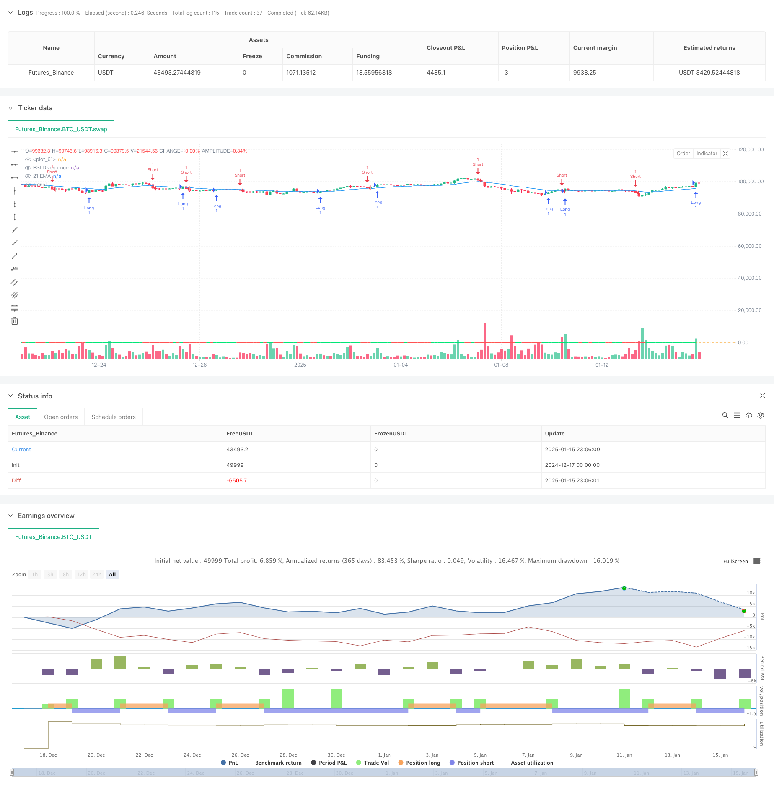

> Name

Advanced-Dynamic-Stop-Loss-Strategy-Based-on-Large-Candles-and-RSI-Divergence
> Author

ChaoZhang

> Strategy Description



[trans]
#### Overview
This strategy is based on large-scale candle line identification and the RSI divergence indicator as the main signal, combined with initial fixed stop loss and dynamic trailing stop loss, to form a complete trend following trading system. The strategy identifies large-scale market conditions by comparing the physical size of the current candle line and the previous five candle lines, while using the divergence between fast and slow RSI to confirm momentum changes, and finally uses a double stop-loss mechanism to manage risks and lock in profits.
#### Strategy Principle
The strategy consists of four core components: 1) Mass Candlestick Identification - Determine significant price momentum by comparing the current body size to the previous 5 candles; 2) RSI Divergence Analysis - Use the difference between the 5-period Fast RSI and the 14-period Slow RSI to measure momentum changes; 3) Initial Stop Loss - Set a fixed stop loss of 200 pips on entry to control initial risk; 4) Trailing Stop Loss - It is activated after the profit reaches 200 points and maintains a dynamic following distance of 150 points from the price. The strategy also uses the 21-period EMA as a trend filter to help determine overall market direction.
#### Strategic Advantages
1. Comprehensive risk management - limit maximum losses with fixed stops and protect realized profits with trailing stops
2. Reliable entry signals - Large-volume candle lines usually represent strong price momentum and provide higher probability trading opportunities.
3. Signal confirmation is sufficient - RSI divergence serves as an auxiliary indicator to help verify momentum changes and reduce the risk of false signals.
4. Flexible profit protection - dynamic trailing stop mechanism allows capturing larger price movements while protecting profits
5. Highly adjustable parameters - key parameters such as tracking starting point, tracking distance and initial stop loss can be optimized according to different market characteristics
#### Strategy Risk
1. Risk of volatile market - Stop loss may be triggered frequently during the sideways trading phase
2. Gap risk - A large gap may cause the actual stop loss point to be inconsistent with expectations
3. Slippage risk - you may face large slippage in fast market conditions, which will affect the actual execution effect.
4. Risk of false breakthrough - a false breakthrough may occur after a large number of candles, leading to stop-loss exit
5. Parameter sensitivity - the setting of stop loss parameters has a greater impact on strategy performance
#### Strategy optimization direction
1. Market environment filtering - it is recommended to add volatility indicators such as ATR and suspend trading in low volatility environments
2. Optimization of entry timing - can be combined with price patterns or other technical indicators to improve the accuracy of entry timing
3. Dynamic stop loss parameters - consider dynamically adjusting the trailing stop loss distance based on market volatility
4. Improvement of position management - a position sizing mechanism based on volatility can be introduced
5. Add trend strength filtering - you can add trend strength indicators and use looser stop loss settings in strong trends.
#### Summary
This strategy builds a complete trend following system by combining large-scale candle lines and RSI divergence, and achieves comprehensive risk management through a double stop-loss mechanism. The strategy is suitable for operating in market environments with clear trends and high volatility, but requires traders to adjust parameter settings according to specific market characteristics. Through the suggested optimization direction, the stability and profitability of the strategy are expected to be further improved.
||

#### Overview
This strategy combines large candle identification and RSI divergence as primary signals, incorporating both initial fixed stops and dynamic trailing stops to form a complete trend-following trading system. The strategy identifies significant price movements by comparing the current candle body with the previous five candles, confirms momentum changes using fast and slow RSI divergence, and employs a dual-stop mechanism for risk management and profit protection.

#### Strategy Principles
The strategy consists of four core components: 1)Large Candle Identification - determining significant price momentum by comparing current candle body with previous five candles; 2)RSI Divergence Analysis - measuring momentum changes using the difference between 5-period fast RSI and 14-period slow RSI; 3)Initial Stop - setting a 200-point fixed stop loss at entry to control initial risk; 4)Trailing Stop - activating after 200 points profit, maintaining a dynamic 150-point following distance. The strategy also uses 21-period EMA as a trend filter to help determine overall market direction.

#### Strategy Advantages
1. Comprehensive Risk Management - Limiting maximum loss through fixed stops while protecting realized profits with trailing stops
2. Reliable Entry Signals - Large candles typically represent strong price momentum, providing high-probability trading opportunities
3. Sufficient Signal Confirmation - RSI divergence as a supplementary indicator helps validate momentum changes and reduces false signal risks
4. Flexible Profit Protection - Dynamic trailing stop mechanism allows capturing larger price moves while protecting gains
5. Strong Parameter Adaptability - Key parameters like trailing start point, trailing distance, and initial stop can be optimized for different market characteristics

#### Strategy Risks
1. Choppy Market Risk - Frequent stop-outs may occur during consolidation phases
2. Gap Risk - Large gaps may cause actual stop levels to differ from expected
3. Slippage Risk - Fast markets may lead to significant slippage affecting execution quality
4. False Breakout Risk - False breakouts after large candles may trigger stop losses
5. Parameter Sensitivity - Stop loss parameters significantly impact strategy performance

#### Strategy Optimization Directions
1. Market Environment Filtering - Suggest adding volatility indicators like ATR, pausing trades in low volatility environments
2. Entry Timing Optimization - Can combine price patterns or other technical indicators to improve entry timing accuracy
3. Dynamic Stop Loss Parameters - Consider dynamically adjusting trailing stop distance based on market volatility
4. Position Management Improvement - Can introduce volatility-based position sizing mechanism
5. Enhanced Trend Strength Filtering - Can add trend strength indicators, using wider stops in strong trends

#### Summary
The strategy builds a complete trend-following system by combining large candles and RSI divergence, achieving comprehensive risk management through a dual-stop mechanism. It is suitable for markets with clear trends and higher volatility, but requires parameter adjustment based on specific market characteristics. Through the suggested optimization directions, the strategy's stability and profitability can be further enhanced.
[/trans]


> Source (PineScript)

``` pinescript
/*backtest
start: 2024-12-17 00:00:00
end: 2025-01-16 00:00:00
period: 3h
basePeriod: 3h
exchanges: [{"eid":"Futures_Binance","currency":"BTC_USDT","balance":49999}]
*/

//@version=6
strategy('[F][IND] - Big Candle Identifier with RSI Divergence and Advanced Stops', shorttitle = '[F][IND] Big Candle RSI Trail', overlay = true)

// Inputs for the trailing stop and stop loss
trail_start_ticks = input.int(200, "Trailing Start Ticks", tooltip="The number of ticks the price must move in the profitable direction before the trailing stop starts.")
trail_distance_ticks = input.int(150, "Trailing Distance Ticks", tooltip="The distance in ticks between the trailing stop and the price once the trailing stop starts.")
initial_stop_loss_points = input.int(200, "Initial Stop Loss Points", tooltip="The fixed stop loss applied immediately after entering a trade.")

// Tick size based on instrument
tick_size = syminfo.mintick

// Calculate trailing start and distance in price
trail_start_price = trail_start_ticks * tick_size
trail_distance_price = trail_distance_ticks * tick_size
initial_stop_loss_price = initial_stop_loss_points * tick_size

// Identify big candles
body0 = math.abs(close[0] - open[0])
body1 = math.abs(close[1] - open[1])
body2 = math.abs(close[2] - open[2])
body3 = math.abs(close[3] - open[3])
body4 = math.abs(close[4] - open[4])
body5 = math.abs(close[5] - open[5])

bullishBigCandle = body0 > body1 and body0 > body2 and body0 > body3 and body0 > body4 and body0 > body5 and open < close
bearishBigCandle = body0 > body1 and body0 > body2 and body0 > body3 and body0 > body4 and body0 > body5 and open > close

// RSI Divergence
rsi_fast = ta.rsi(close, 5)
rsi_slow = ta.rsi(close, 14)
divergence = rsi_fast - rsi_slow

// Trade Entry Logic
if bullishBigCandle
    strategy.entry('Long', strategy.long, stop=low - initial_stop_loss_price)
if bearishBigCandle
    strategy.entry('Short', strategy.short, stop=high + initial_stop_loss_price)

// Trailing Stop Logic
var float trail_stop = na
if strategy.position_size > 0 // Long Position
    entry_price = strategy.position_avg_price
    current_profit = close - entry_price
    if current_profit >= trail_start_price
        trail_stop := math.max(trail_stop, close - trail_distance_price)
    strategy.exit("Trailing Stop Long", "Long", stop=trail_stop)

if strategy.position_size < 0 // Short Position
    entry_price = strategy.position_avg_price
    current_profit = entry_price - close
    if current_profit >= trail_start_price
        trail_stop := math.min(trail_stop, close + trail_distance_price)
    strategy.exit("Trailing Stop Short", "Short", stop=trail_stop)

// Plotting Trailing Stop
plot(strategy.position_size > 0 ? trail_stop : na, color=color.green, title="Trailing Stop (Long)")
plot(strategy.position_size < 0 ? trail_stop : na, color=color.red, title="Trailing Stop (Short)")

// Plotting RSI Divergence
plot(divergence, color=divergence > 0 ? color.lime : color.red, linewidth=2, title="RSI Divergence")
hline(0)

// Plotting EMA
ema21 = ta.ema(close, 21)
plot(ema21, color=color.blue, title="21 EMA")

```

> Detail

https://www.fmz.com/strategy/478719

> Last Modified

2025-01-17 15:51:14
