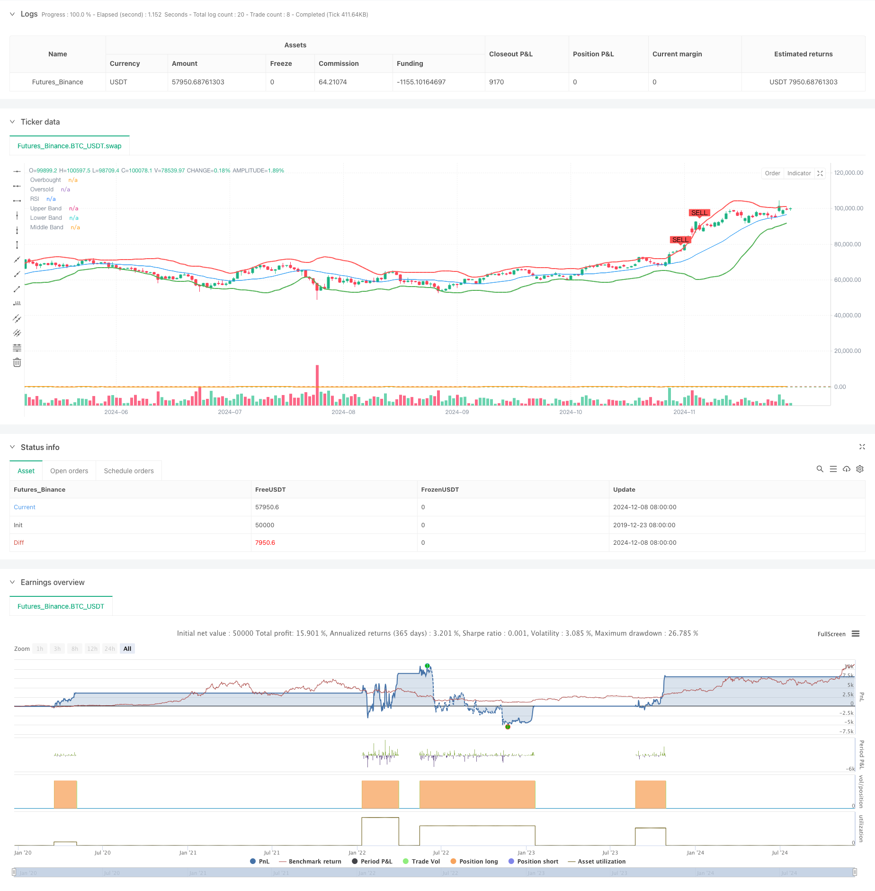

> Name

Bollinger-Bands-and-RSI-Combined-Dynamic-Trading-Strategy
> Author

ChaoZhang

> Strategy Description



[trans]#### Overview
This strategy is an adaptive trading system that combines Bollinger Bands and Relative Strength Index (RSI). This strategy uses the price channel of Bollinger Bands and the overbought and oversold signals of RSI to identify potential trading opportunities and realize the grasp of market trends and fluctuations. The strategy uses standard deviation to dynamically adjust the trading range, and combines the overbought and oversold levels of the RSI indicator to confirm trading signals, thereby improving the accuracy of trading.
#### Strategy Principle
The core of the strategy is to capture market fluctuation opportunities through the upper, middle and lower tracks of Bollinger Bands combined with the RSI indicator. Bollinger Bands are based on a 20-period moving average and use 2 times the standard deviation to calculate the upper and lower rails. RSI uses a 14-period calculation, setting 70 as overbought and 30 as oversold. When the price touches the lower band and the RSI is in the oversold area, the system generates a buy signal; when the price touches the upper band and the RSI is in the overbought area, the system generates a sell signal. This double confirmation mechanism can effectively reduce false signals.
#### Strategic Advantages
1. Strong adaptability: Bollinger Bands can automatically adjust the trading range according to market fluctuations and adapt to different market environments.
2. Reliable signals: Through the double confirmation mechanism of Bollinger Bands and RSI, false signals are significantly reduced.
3. Risk control: The standard deviation calculation of Bollinger Bands provides a dynamic risk control mechanism.
4. Visualization effect: The strategy provides clear visual signals for traders to understand and execute.
5. Flexible parameters: The main parameters can be adjusted according to different market characteristics.
#### Strategy Risk
1. Risk of volatile market: Frequent false breakthrough signals may occur in a volatile market.
2. Lagging risk: Both the moving average and RSI indicators have a certain degree of lag.
3. Parameter sensitivity: Different parameter settings may lead to large differences in strategy performance.
4. Dependence on the market environment: It performs better in markets with obvious trends, but the effect of market shocks may not be good.
#### Strategy optimization direction
1. Introduce trend filters: add long-term moving averages or trend indicators to filter trading directions.
2. Dynamic parameter adjustment: Automatically adjust Bollinger Bands and RSI parameters according to market volatility.
3. Add volume confirmation: Add volume analysis to the signal system.
4. Optimize stop loss settings: Introduce dynamic stop loss mechanisms, such as ATR stop loss or percentage trailing stop loss.
5. Add time filtering: consider market time characteristics to avoid trading in inappropriate time periods.
#### Summary
This strategy builds a relatively complete trading system through the combined application of Bollinger Bands and RSI. The advantage of the strategy is that it can adapt to market fluctuations and provide reliable trading signals, but it is still necessary to pay attention to the impact of the market environment on the performance of the strategy. Through the proposed optimization direction, the stability and reliability of the strategy are expected to be further improved. In practical applications, it is recommended that traders adjust parameters according to specific market characteristics and combine other technical analysis tools to make trading decisions. ||
#### Overview
This strategy is an adaptive trading system that combines Bollinger Bands and Relative Strength Index (RSI). It identifies potential trading opportunities by utilizing Bollinger Bands' price channels and RSI's overbought/oversold signals to capture market trends and volatility. The strategy uses standard deviation to dynamically adjust trading ranges and combines RSI indicator's overbought/oversold levels to confirm trading signals, thereby improving trading accuracy.

#### Strategy Principles
The core of the strategy is to capture market volatility opportunities through Bollinger Bands' upper, middle, and lower bands in conjunction with the RSI indicator. Bollinger Bands are based on a 20-period moving average with 2 standard deviations for the upper and lower bands. RSI uses a 14-period calculation with 70 as overbought and 30 as oversold levels. Buy signals are generated when price touches the lower band and RSI is in oversold territory; sell signals occur when price touches the upper band and RSI is in overbought territory. This double confirmation mechanism effectively reduces false signals.

#### Strategy Advantages
1. High Adaptability: Bollinger Bands automatically adjust trading ranges based on market volatility, adapting to different market environments.
2. Reliable Signals: Double confirmation mechanism through Bollinger Bands and RSI significantly reduces false signals.
3. Risk Control: Bollinger Bands' standard deviation calculation provides dynamic risk control.
4. Visual Clarity: Strategy provides clear visual signals for easy understanding and execution.
5. Flexible Parameters: Main parameters can be adjusted according to different market characteristics.

#### Strategy Risks
1. Sideways Market Risk: May generate frequent false breakout signals in range-bound markets.
2. Lag Risk: Moving averages and RSI indicators have inherent lag.
3. Parameter Sensitivity: Different parameter settings may lead to significant variations in strategy performance.
4. Market Environment Dependency: Performs better in trending markets, may underperform in ranging markets.

#### Strategy Optimization Directions
1. Introduce Trend Filters: Add long-term moving averages or trend indicators to filter trading direction.
2. Dynamic Parameter Adjustment: Automatically adjust Bollinger Bands and RSI parameters based on market volatility.
3. Add Volume Confirmation: Incorporate volume analysis into the signal system.
4. Optimize Stop Loss: Introduce dynamic stop-loss mechanisms like ATR stops or percentage trailing stops.
5. Add Time Filters: Consider market time characteristics to avoid trading during unfavorable periods.

#### Summary
The strategy builds a relatively complete trading system through the combined application of Bollinger Bands and RSI. Its strength lies in its ability to adapt to market volatility and provide reliable trading signals, though market environment impact on strategy performance needs attention. Through the suggested optimization directions, the strategy's stability and reliability can be further enhanced. In practical application, traders are advised to adjust parameters according to specific market characteristics and combine with other technical analysis tools for trading decisions.[/trans]


> Source (PineScript)

``` pinescript
/*backtest
start: 2019-12-23 08:00:00
end: 2024-12-09 08:00:00
period: 1d
basePeriod: 1d
exchanges: [{"eid":"Futures_Binance","currency":"BTC_USDT"}]
*/

//@version=5
strategy("Bollinger Bands and RSI Strategy with Buy/Sell Signals", overlay=true)

// Input settings
bb_length = input.int(20, title="Bollinger Bands Length", minval=1)
bb_mult = input.float(2.0, title="Bollinger Bands Multiplier", minval=0.1)
rsi_length = input.int(14, title="RSI Length", minval=1)
rsi_overbought = input.int(70, title="RSI Overbought Level", minval=50)
rsi_oversold = input.int(30, title="RSI Oversold Level", minval=1)

// Bollinger Bands calculation
basis = ta.sma(close, bb_length)
dev = bb_mult * ta.stdev(close, bb_length)
upper_band = basis + dev
lower_band = basis - dev

// RSI calculation
rsi = ta.rsi(close, rsi_length)

// Buy signal: Price touches lower Bollinger Band and RSI is oversold
buy_signal = ta.crossover(close, lower_band) and rsi < rsi_oversold

// Sell signal: Price touches upper Bollinger Band and RSI is overbought
sell_signal = ta.crossunder(close, upper_band) and rsi > rsi_overbought

// Execute orders
if (buy_signal)
    strategy.entry("Buy", strategy.long)
if (sell_signal)
    strategy.close("Buy")

// Plotting Bollinger Bands and RSI
plot(upper_band, color=color.red, linewidth=2, title="Upper Band")
plot(lower_band, color=color.green, linewidth=2, title="Lower Band")
plot(basis, color=color.blue, linewidth=1, title="Middle Band")
hline(rsi_overbought, "Overbought", color=color.red, linestyle=hline.style_dashed)
hline(rsi_oversold, "Oversold", color=color.green, linestyle=hline.style_dashed)
plot(rsi, "RSI", color=color.orange)

// Add Buy/Sell signals on the chart
plotshape(series=buy_signal, title="Buy Signal", location=location.belowbar, color=color.green, style=shape.labelup, text="BUY")
plotshape(series=sell_signal, title="Sell Signal", location=location.abovebar, color=color.red, style=shape.labeldown, text="SELL")


```

> Detail

https://www.fmz.com/strategy/474635

> Last Modified

2024-12-11 11:21:54
