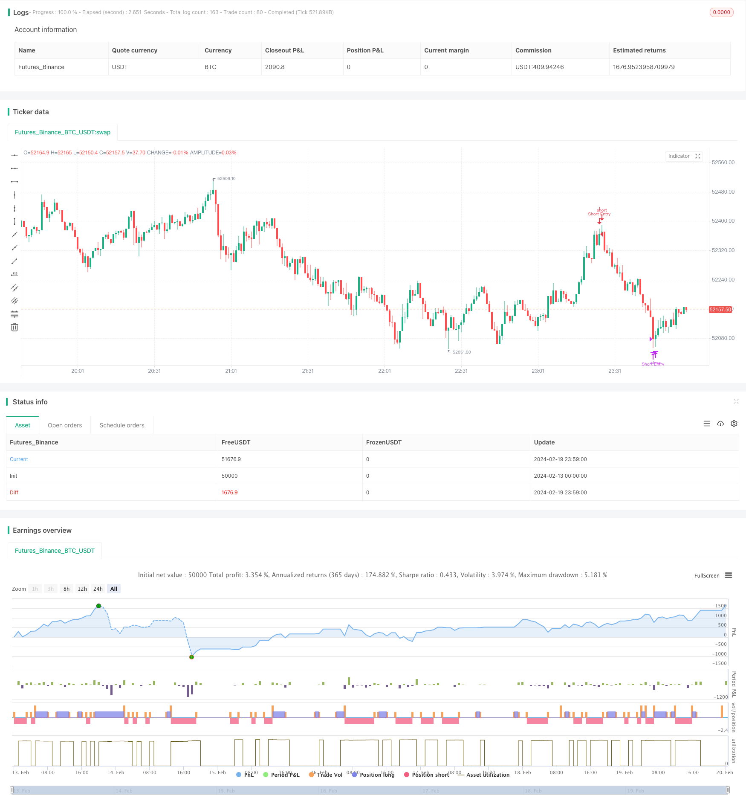

> Name

RSI-Divergence-Strategy
> Author

ChaoZhang

> Strategy Description


[trans]
## Overview
The RSI Divergence Strategy is a strategy that uses the Relative Strength Index (RSI) to identify potential price reversal opportunities. This strategy identifies waning strength and potential reversals by spotting divergences between price action and RSI trends.
When the price reaches a new low but the RSI does not, it is a bullish divergence, indicating that the downward momentum is weakening and an upward reversal may occur. When the price reaches a new high but the RSI does not, it is a bearish divergence, indicating that the upward momentum is weakening and a downward reversal may occur.
This strategy combines RSI's overbought and oversold levels with divergence determination to optimize entry and exit timing, capture market reversals, and improve trading accuracy and profitability. Applicable to various trading varieties, it is an effective tool for traders to buy low and sell high in market fluctuations.
## Strategy Principle
The relative strength index divergence strategy is based on the following key judgments:
1. Calculate the RSI value: By calculating the average increase and average decrease within a certain period, the RSI indicator in the 0-100 range is obtained.
2. Determine overbought and oversold: When the RSI goes above the set overbought line (such as 70), it is overbought; when the RSI goes below the set oversold range (such as 30), it is oversold.
3. Identify divergence: Determine whether the latest price trend is consistent with the RSI trend. If the price makes a new high (low) but the RSI does not, it is a divergence.
4. Combining entry and exit: When long divergence occurs along with the RSI oversold range, it is a long signal. A short divergence coupled with an overbought RSI is a short signal.
5. Set take profit and stop loss: close positions and take profit when RSI re-enters the overbought and oversold range.
By comparing price fluctuations with RSI changes to determine market strength, the strategy can buy low and sell high before reversal, arbitraging unreasonable market fluctuations.
## Strategic Advantages
The relative strength index divergence strategy has the following advantages:
1. Capturing market reversals: The strategy is good at discovering the divergence between price and RSI, judging the exhaustion of market power, and capturing reversal opportunities.
2. Cooperate with overbought and oversold: Combined with the overbought and oversold levels of the RSI indicator itself, it helps to further optimize the entry and exit points.
3. The strategy is simple and easy to implement: relatively simple logic and parameter settings, easy to understand and implement.
4. Strong versatility: It is suitable for different varieties such as CFDs, digital currencies and stocks, and is widely used.
5. Improve profits: A relatively mechanized system strategy with controllable drawdowns helps create long-term stable profits.
## Strategy Risk
The relative strength index divergence strategy also has the following risks:
1. Wrong signal risk: The divergence between price and RSI may not continue or reverse successfully, and there is a wrong signal.
2. Parameter optimization is difficult: RSI parameters, overbought and oversold lines and other settings have a great impact on the results and require continuous testing and optimization.
3. Abnormal market risk: Failure occurs when the market experiences abnormal fluctuations or strategies are generally abused.
4. Technical indicators are lagging: RSI and other technical indicators are generally lagging and cannot accurately determine the reversal point.
Through strict risk control, adjusting parameter settings, and analyzing other factors, risks can be reduced to a certain extent.
## Strategy optimization direction
The relative strength index divergence strategy can also be optimized from the following aspects:
1. Optimize RSI parameters: adjust the RSI calculation period and test the actual effect of different days parameters.
2. Combine with other indicators: Use it in combination with other technical indicators such as MACD and KD to form cross-validation.
3. Add stop loss method: In addition to the original take profit, set a trailing stop loss or oscillating stop loss.
4. Adapt to more varieties: Adjust parameters for different trading varieties to expand the scope of application.
5. Utilize deep learning: Use deep learning models such as RNN to judge RSI deviations and reduce false signals.
## Summarize
The relative strength index divergence strategy determines reversal opportunities in the market by comparing price changes and RSI changes. The strategy is simple, clear, and highly versatile, and can effectively capture short-term reversals and obtain excess returns. However, there is also a certain risk of limited effect, and continuous optimization and testing is required to adapt to the market.
||

## Overview  

The RSI Divergence strategy utilizes the Relative Strength Index (RSI) to identify potential price reversals by spotting divergences between price movements and RSI trends. It focuses on:  

Bullish Divergence: Occurs when price hits a new low while RSI does not, signaling weakening downward momentum and potential upward reversal.  

Bearish Divergence: Happens when price makes a new high while RSI does not, indicating decreasing upward momentum and potential downward reversal.  

This strategy combines overbought and oversold RSI levels to optimize entry and exit points, aiming to capture market reversals for improved trading accuracy and profitability. Suitable for various trading instruments, it's a valuable tool for traders aiming to buy lows and sell highs in fluctuating markets.

## Strategy Logic  

The RSI Divergence strategy is based on the following key judgments:  

1. Calculate RSI Value: Compute RSI in the range of 0-100 based on average gain and average loss over a specific period.  

2. Identify Overbought/Oversold: RSI above overbought level (e.g. 70) indicates overbought; RSI below oversold level (e.g. 30) indicates oversold.   

3. Detect Divergence: Check if latest price movement is consistent with RSI movement. If price makes new high/low but RSI does not, it shows divergence.  

4. Combine Entry/Exit: Bullish divergence with oversold RSI signals long entry. Bearish divergence with overbought RSI signals short entry.  

5. Set Profit Target/Stop Loss: Close position for profit when RSI re-enters overbought/oversold zone.

By comparing price fluctuation and RSI change to gauge market strength, the strategy aims to profit from market inefficiency.  

## Advantages

The RSI Divergence Strategy has the following pros:

1. Capture Reversals: Excellent in detecting divergences between price and RSI to identify exhaustion reversals.  

2. Optimize with Overbought/Oversold Levels: Combining intrinsic overbought/oversold in RSI helps fine tune entries and exits.   

3. Simple and Easy to Implement: Relatively simple logic and parameter settings make this strategy intuitive to understand and implement.  

4. Wide Versatility: Applicable to a variety of products like CFDs, crypto and stocks for broad adoption.  

5. Boost Profitability: The systematic approach results in lower drawdowns for stable long term returns.  

## Risks

The RSI Divergence Strategy also bears the following risks:  

1. False Signal Risks: Divergences do not certainly reverse or sustain - risk of acting on false signals.  

2. Parameter Optimization Difficulties: Results are sensitive to RSI period, overbought/oversold levels etc requiring rigorous testing.  

3. Exceptional Market Conditions: Strategy tends to fail when markets spike irregularly or the setup is overused.  

4. Lagging Indicator: Technical indicators like RSI are generally lagging and unable to precisely determine reversal points.  

Strict risk control, adaptive parameters and combined analysis with other factors can mitigate the risks to some extent.   

## Enhancement Opportunities

The RSI Divergence strategy can be further optimized via:   

1. Testing RSI Input Values: Backtest different RSI lookback periods to find ideal parameters.  

2. Combining Other Indicators: Adding confluence from MACD, KD etc improves signal accuracy.  

3. More Stop Loss Techniques: Complement exiting profit target stop loss with methods like moving average envelope stop loss.  

4. Wider Products Adaptability: Tweak parameters for better strategy alignment with more product types like commodities.  

5. Applying Deep Learning: Use Deep Learning models like RNNs to judge RSI divergences and forecast prices.  

## Conclusion  

The RSI Divergence captures mean-reverting opportunities by comparing price dynamics against RSI flows. The simple robust strategy works across asset classes for scalable short term reversals and excess returns. But its efficacy also carries inherent limitations requiring constant iterations for market adaptability.

[/trans]

> Strategy Arguments


|Argument|Default|Description|
|----|----|----|
|v_input_1|14|RSI Length|
|v_input_2|70|Overbought Level|
|v_input_3|30|Oversold Level|


> Source (PineScript)

``` pinescript
/*backtest
start: 2024-02-13 00:00:00
end: 2024-02-20 00:00:00
period: 1m
basePeriod: 1m
exchanges: [{"eid":"Futures_Binance","currency":"BTC_USDT"}]
*/

//@version=5
strategy("RSI Divergence Strategy", overlay=true)

// RSI Parameters
rsiLength = input(14, "RSI Length")
overboughtLevel = input(70, "Overbought Level")
oversoldLevel = input(30, "Oversold Level")
rsiValue = ta.rsi(close, rsiLength)

// Divergence detection
priceLow = ta.lowest(low, rsiLength)
priceHigh = ta.highest(high, rsiLength)
rsiLow = ta.lowest(rsiValue, rsiLength)
rsiHigh = ta.highest(rsiValue, rsiLength)

bullishDivergence = low < priceLow[1] and rsiValue > rsiLow[1]
bearishDivergence = high > priceHigh[1] and rsiValue < rsiHigh[1]

// Strategy Conditions
longEntry = bullishDivergence and rsiValue < oversoldLevel
longExit = rsiValue > overboughtLevel
shortEntry = bearishDivergence and rsiValue > overboughtLevel
shortExit = rsiValue < oversoldLevel

// ENTER_LONG Condition
if (longEntry)
    strategy.entry("Long Entry", strategy.long)

// EXIT_LONG Condition
if (longExit)
    strategy.close("Long Entry")

// ENTER_SHORT Condition
if (shortEntry)
    strategy.entry("Short Entry", strategy.short)

// EXIT_SHORT Condition
if (shortExit)
    strategy.close("Short Entry")

```

> Detail

https://www.fmz.com/strategy/442346

> Last Modified

2024-02-21 11:43:24
