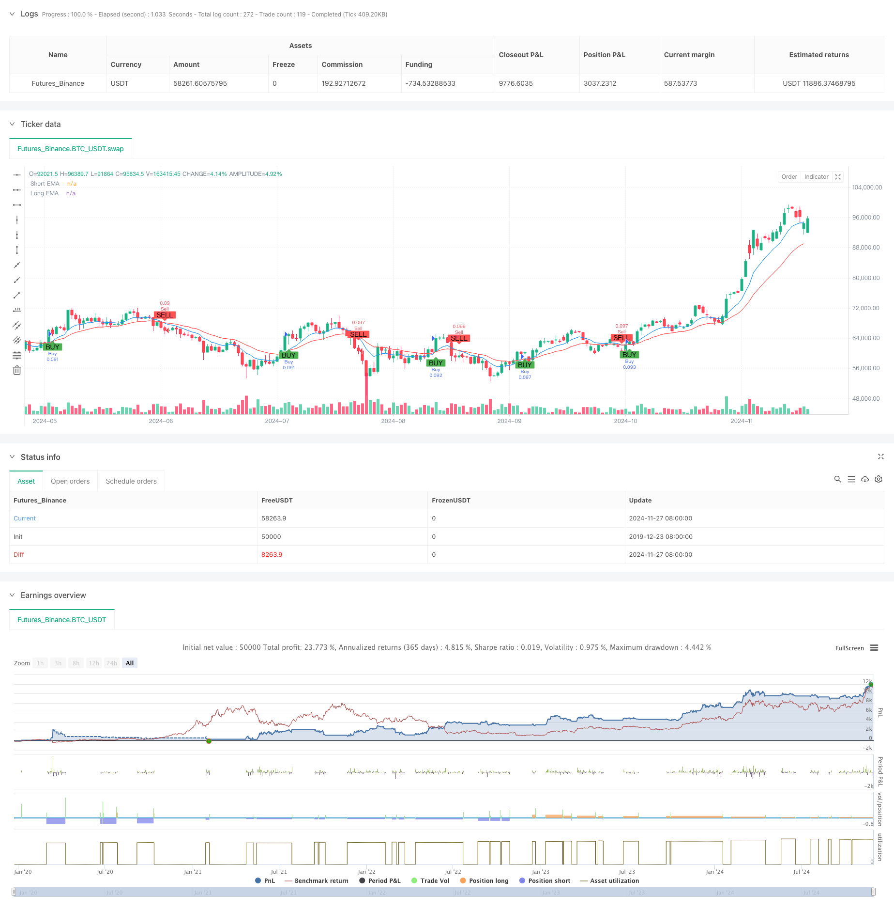

> Name

Dual-EMA-Crossover-with-RSI-Momentum-Enhanced-Trading-Strategy
> Author

ChaoZhang

> Strategy Description



[trans]
#### Overview
This strategy is a short-term trading system based on a combination of double moving average crossovers and the RSI indicator. The strategy uses the 9-period and 21-period exponential moving averages (EMA) as the basis for trend judgment, and combines the relative strength index (RSI) as a momentum confirmation tool to achieve risk management by setting fixed stop losses and take profits. This strategy is mainly used for short-term trading at the 5-minute level, and is especially suitable for volatile market environments.
#### Strategy Principle
The core logic of the strategy is based on the synergy of two technical indicators. First, the market trend direction is determined by the intersection of the 9-period EMA and the 21-period EMA. When the short-term EMA crosses the long-term EMA upward, the upward trend is deemed to be established; when the short-term EMA crosses the long-term EMA downward, the downward trend is deemed to be established. Secondly, use the RSI indicator for momentum confirmation and filter trading signals by determining whether the RSI is in the overbought or oversold zone. The strategy sets a 1% stop loss and a 2% take profit when opening a position to achieve a transaction management with a risk-return ratio of 1:2.
#### Strategic Advantages
1. Clear signals: Through the double filtering mechanism of moving average crossover and RSI confirmation, false signals can be effectively reduced.
2. Controllable risk: Use a fixed percentage of stop-loss and take-profit settings to make the risk expectations of each transaction clear and controllable.
3. High degree of automation: The strategy logic is clear and the parameters are highly adjustable, making it easy to realize automated transactions.
4. Strong adaptability: The strategy can adapt to different market environments, especially in markets with clear trends.
5. Simple operation: The entry and exit conditions are clear, making it easy for traders to execute and track.
#### Strategy Risk
1. Risk of market shock: Frequent false signals may occur in a volatile market, resulting in continuous stop losses.
2. Slippage risk: In short-term trading with a 5-minute period, you may face greater slippage risk.
3. Fixed stop loss risk: The use of fixed percentage stop loss may not be suitable for all market environments. In particularly volatile markets, stop losses may be too dense.
4. Systemic risk: When major events occur in the market, fixed stop loss may not be able to effectively protect funds.
#### Strategy optimization direction
1. Dynamic stop loss optimization: You can consider dynamically adjusting the stop loss distance according to the ATR indicator to make the stop loss more in line with the characteristics of market fluctuations.
2. Time filtering: Add trading time period filtering to avoid periods of severe volatility or insufficient liquidity.
3. Confirmation of trend strength: You can add the ADX indicator to confirm the strength of the trend, and only trade when the trend is clear.
4. Position management optimization: Position size can be dynamically adjusted based on market volatility and account net value.
5. Market environment identification: Add a market environment judgment mechanism and adopt different parameter settings under different market conditions.
#### Summary
This strategy builds a relatively complete short-term trading system by combining moving average crossovers and RSI indicators. The advantage of the strategy is that the signal is clear and the risk is controllable, but there is also some room for optimization. By adding mechanisms such as dynamic stop loss and time filtering, the stability and profitability of the strategy can be further improved. In general, this is a trading strategy with a solid foundation and clear logic, which is suitable for further optimization and improvement as a basic framework for short-term trading. ||
#### Overview
This strategy is a short-term trading system that combines dual EMA crossover with RSI indicator. It utilizes 9-period and 21-period Exponential Moving Averages (EMA) for trend determination, along with the Relative Strength Index (RSI) for momentum confirmation, implementing fixed stop-loss and take-profit levels for risk management. The strategy is primarily designed for 5-minute timeframe trading and is particularly effective in volatile market conditions.

#### Strategy Principles
The core logic is based on the synergistic effect of two technical indicators. First, trend direction is determined by the crossover of 9-period EMA and 21-period EMA, with an uptrend confirmed when the short-term EMA crosses above the long-term EMA, and a downtrend when the opposite occurs. Second, the RSI indicator is used for momentum confirmation by filtering trades based on overbought and oversold conditions. The strategy implements a 1% stop-loss and 2% take-profit, maintaining a 1:2 risk-reward ratio.

#### Strategy Advantages
1. Clear Signals: The dual filtering mechanism of EMA crossover and RSI confirmation effectively reduces false signals.
2. Controlled Risk: Fixed percentage stop-loss and take-profit settings provide clear risk expectations for each trade.
3. High Automation: Clear strategy logic and adjustable parameters facilitate automated trading implementation.
4. High Adaptability: The strategy can adapt to various market conditions, particularly excelling in trending markets.
5. Simple Operation: Clear entry and exit conditions make it easy for traders to execute and monitor.

#### Strategy Risks
1. Choppy Market Risk: May generate frequent false signals in sideways markets, leading to consecutive losses.
2. Slippage Risk: Short-term trading on 5-minute timeframes may face significant slippage issues.
3. Fixed Stop-Loss Risk: Fixed percentage stops may not suit all market conditions, particularly in highly volatile markets.
4. Systematic Risk: Fixed stops may not provide adequate protection during major market events.

#### Optimization Directions
1. Dynamic Stop-Loss: Consider implementing ATR-based dynamic stop-loss adjustments to better align with market volatility.
2. Time Filtering: Add trading session filters to avoid highly volatile or illiquid periods.
3. Trend Strength Confirmation: Incorporate ADX indicator to confirm trend strength and trade only in clear trends.
4. Position Sizing Optimization: Dynamically adjust position sizes based on market volatility and account equity.
5. Market Environment Recognition: Add market condition identification mechanisms to adapt parameters to different market states.

#### Summary
This strategy combines EMA crossover and RSI indicators to create a relatively complete short-term trading system. Its strengths lie in clear signals and controlled risk, though there is room for optimization. By incorporating dynamic stop-loss, time filtering, and other mechanisms, the strategy's stability and profitability can be further enhanced. Overall, it represents a well-founded, logically sound trading strategy that serves as an excellent foundation for short-term trading and can be further refined and optimized.[/trans]


> Source (PineScript)

``` pinescript
/*backtest
start: 2019-12-23 08:00:00
end: 2024-11-28 08:00:00
period: 1d
basePeriod: 1d
exchanges: [{"eid":"Futures_Binance","currency":"BTC_USDT"}]
*/

//@version=5
strategy("abo 3llash - EMA + RSI Strategy", overlay=true, default_qty_type=strategy.percent_of_equity, default_qty_value=10)

// Parameters
emaShortLength = input.int(9, title="Short EMA Length")
emaLongLength = input.int(21, title="Long EMA Length")
rsiLength = input.int(14, title="RSI Length")
rsiOverbought = input.int(70, title="RSI Overbought Level")
rsiOversold = input.int(30, title="RSI Oversold Level")
stopLossPercent = input.float(1, title="Stop Loss Percentage") / 100
takeProfitPercent = input.float(2, title="Take Profit Percentage") / 100

// Calculating EMAs and RSI
emaShort = ta.ema(close, emaShortLength)
emaLong = ta.ema(close, emaLongLength)
rsi = ta.rsi(close, rsiLength)

// Buy and Sell Conditions
buyCondition = ta.crossover(emaShort, emaLong) and rsi < rsiOverbought
sellCondition = ta.crossunder(emaShort, emaLong) and rsi > rsiOversold

// Plotting the EMAs
plot(emaShort, title="Short EMA", color=color.blue)
plot(emaLong, title="Long EMA", color=color.red)

// Generating buy and sell signals on the chart
plotshape(series=buyCondition, title="Buy Signal", location=location.belowbar, color=color.green, style=shape.labelup, text="BUY")
plotshape(series=sellCondition, title="Sell Signal", location=location.abovebar, color=color.red, style=shape.labeldown, text="SELL")

// Strategy Execution
if (buyCondition)
    strategy.entry("Buy", strategy.long)
    // Set Stop Loss and Take Profit for Buy
    stopLossLevel = close * (1 - stopLossPercent)
    takeProfitLevel = close * (1 + takeProfitPercent)
    strategy.exit("Take Profit/Stop Loss", from_entry="Buy", stop=stopLossLevel, limit=takeProfitLevel)

if (sellCondition)
    strategy.entry("Sell", strategy.short)
    // Set Stop Loss and Take Profit for Sell
    stopLossLevel = close * (1 + stopLossPercent)
    takeProfitLevel = close * (1 - takeProfitPercent)
    strategy.exit("Take Profit/Stop Loss", from_entry="Sell", stop=stopLossLevel, limit=takeProfitLevel)

```

> Detail

https://www.fmz.com/strategy/473706

> Last Modified

2024-12-02 16:20:01
