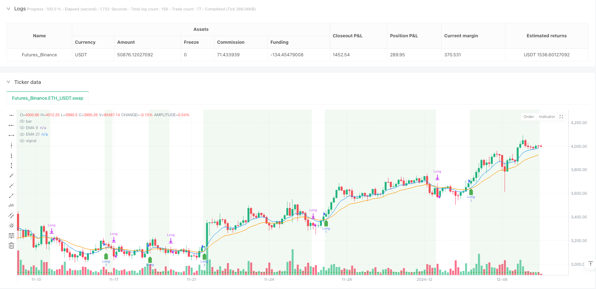
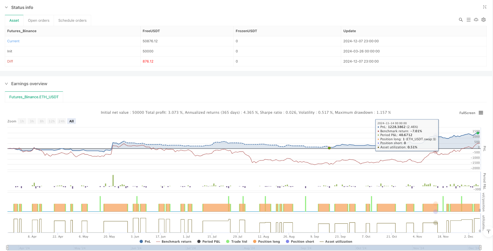

> Name

Dual-EMA-Crossover-with-RSI-Trend-Confirmation-Strategy
> Author

ianzeng123

> Strategy Description




[trans]

#### Overview
This strategy combines EMA (Exponential Moving Average) crossovers with RSI (Relative Strength Index) confirmation signals to identify market trend direction and generate trading signals. This strategy uses the short-term EMA (9 periods) and the long-term EMA (21 periods) to determine the overall trend direction, while utilizing the RSI to confirm trend strength and filter out potential false signals. The core logic of the strategy is based on the directional changes that occur when the short-term moving average crosses the long-term moving average, and uses the RSI indicator as an additional confirmation condition to ensure that transactions are made only when the trend is clear.
#### Strategy Principle
This strategy is based on the intersection of two EMAs (9-period and 21-period) combined with RSI readings to determine the market status. When EMA9 crosses EMA21 upwards and the RSI is above 30, the bullish trend is confirmed and a long signal is generated. Conversely, when EMA9 crosses EMA21 downwards and the RSI is below 30, a bearish trend is confirmed and a short signal is generated. A clear trend judgment standard is defined in the code: when EMA9 is greater than EMA21 and RSI is greater than 30, it is bullish; when EMA9 is less than EMA21 and RSI is less than 30, it is bearish. The system enters the market to go long when the long signal appears, and enters the market to go short when the short signal appears. The closing conditions are also based on the moving average crossover and RSI threshold: long positions are closed when EMA9 crosses EMA21 downwards or RSI is below 30; short positions are closed when EMA9 crosses EMA21 upwards or RSI is above 30. The strategy provides intuitive visual feedback by displaying moving averages, signal arrows and background color simultaneously on the chart.
#### Strategic Advantages
This strategy combines several technical advantages that make it perform well in real trading:
1. The perfect combination of trend following and momentum confirmation: The strategy combines EMA crossover (trend following) with RSI (momentum confirmation), providing a more reliable signal.
2. Clear visual indicators: By using shapes, arrows, and background colors on charts, the strategy provides traders with intuitive clues to trend direction and signals.
3. False signal filtering: Requiring RSI confirmation will help filter out some possible false signals and improve signal quality.
4. Wide applicability: This simple and effective method can be applied to various time periods and markets, and has good adaptability.
5. Automated exit rules: Clear closing conditions help traders maintain discipline in trading and avoid emotional decision-making.
6. The code is concise and efficient: the entire strategy code has a clear structure, strict logic, and is easy to understand and maintain.
7. Double confirmation mechanism: The two conditions of moving average crossover and RSI threshold need to be met at the same time to generate a signal, which greatly improves the reliability of the signal.
#### Strategy Risk
Although this strategy has many advantages, there are also some potential risks and limitations:
1. False signals in volatile markets: In markets that are sideways or have no obvious trend, EMA crossovers may occur frequently, leading to too many false signals and unnecessary transactions.
2. Lagging entry timing: EMA, as a lagging indicator, may cause signals to be generated only after the trend has been formed and developed for a period of time, missing some profits in the early stages of the trend.
3. The RSI threshold is fixed: The 30 used in the code as the RSI threshold may not apply to all market conditions, and different markets may require different threshold settings.
4. Lack of stop-loss mechanism: The strategy does not include a clear stop-loss mechanism, which may lead to larger losses when the market suddenly reverses.
5. Failure to incorporate position management rules: The strategy does not adjust position sizes based on market volatility or risk levels, which can lead to improper risk management.
6. Signal conflict: Under certain market conditions, moving average crossovers and RSI may send conflicting signals, increasing the complexity of decision-making.
7. Parameter optimization challenges: EMA cycles and RSI thresholds need to be optimized for different markets, which requires a lot of historical testing and verification.
#### Strategy optimization direction
Based on in-depth analysis of the code, this strategy has the following optimization directions:
1. Adaptive EMA period: Dynamically adjust the EMA period according to market volatility and specific trading types. For example, use longer periods in volatile markets to reduce false signals.
2. RSI threshold optimization: Adjust the RSI threshold according to different market conditions. You can even consider using adaptive RSI thresholds to automatically adjust according to market fluctuation characteristics.
3. Add a stop-loss mechanism: Introduce a fixed stop-loss, trailing stop-loss or ATR (average true range)-based stop-loss mechanism to limit the potential loss of a single transaction.
4. Integrated position management: Adjust position size based on volatility or risk levels, such as reducing positions in high-volatility markets and increasing positions in low-volatility markets.
5. Add additional filters: such as volume confirmation, trend strength filter or volatility filter to reduce false signals in sideways markets.
6. Implement trailing take-profit: Add a trailing take-profit mechanism based on recent highs/lows or percentages to protect realized profits.
7. Time filter: Add filter conditions based on market periods to avoid trading during periods of extremely low or extremely high volatility.
8. Multi-timeframe confirmation: Filter out signals that are opposite to the main trend by checking the trend direction on higher timeframes.
#### Summary
The Double Exponential Moving Average Crossover and RSI Trend Confirmation strategy provides a balanced approach to trend following by combining EMA crossovers with RSI confirmations. It provides clear entry and exit signals while intuitively displaying current market trends through visual elements. The core advantage of the strategy is that its logic is concise and effective, and it combines market information from the two dimensions of trend and momentum to improve signal quality. Although this strategy has limitations under certain market conditions, it provides a solid foundational framework that can be further refined and customized to suit individual trading preferences and risk tolerance through the optimization directions mentioned earlier. With proper parameter optimization and the integration of risk management measures, this strategy has the potential to become a powerful weapon in a trader's toolbox. ||
#### Overview
This strategy combines EMA (Exponential Moving Average) crossovers with RSI (Relative Strength Index) confirmation to identify market trend direction and generate trading signals. The strategy uses a short-term EMA (9-period) and a long-term EMA (21-period) to determine the overall trend direction, while utilizing RSI to confirm trend strength and filter out potential false signals. The core logic is based on directional changes when the short-term moving average crosses the long-term moving average, with RSI serving as an additional confirmation condition, ensuring trades are only executed when trends are clearly established.

#### Strategy Principle
The strategy is based on the crossover of two EMAs (9 and 21 periods) combined with RSI readings to assess market conditions. When EMA9 crosses above EMA21 and RSI is above 30, a bullish trend is confirmed, generating a long entry signal. Conversely, when EMA9 crosses below EMA21 and RSI is below 30, a bearish trend is confirmed, generating a short entry signal. The code defines clear trend determination criteria: bullish when EMA9 is greater than EMA21 and RSI is above 30; bearish when EMA9 is less than EMA21 and RSI is below 30. The system enters long positions when long signals appear and enters short positions when short signals appear. Exit conditions are similarly based on EMA crossovers and RSI thresholds: long positions are closed when EMA9 crosses below EMA21 or RSI falls below 30; short positions are closed when EMA9 crosses above EMA21 or RSI rises above 30. The strategy provides intuitive visual feedback by simultaneously displaying moving averages, signal arrows, and background colors on the chart.

#### Strategy Advantages
This strategy combines several technical advantages that make it perform well in real trading:

1. Perfect Integration of Trend Following and Momentum Confirmation: The strategy combines EMA crossovers (trend following) with RSI (momentum confirmation) to provide more reliable signals.
2. Clear Visual Indicators: By using shapes, arrows, and background colors on the chart, the strategy provides traders with intuitive cues for trend direction and signals.
3. False Signal Filtering: Requiring RSI confirmation helps filter out some potential false signals, improving signal quality.
4. Wide Applicability: This simple yet effective approach can be applied to various timeframes and markets, demonstrating good adaptability.
5. Automated Exit Rules: Clear exit conditions help traders maintain discipline in trading, avoiding emotional decision-making.
6. Concise and Efficient Code: The entire strategy code has a clear structure, tight logic, and is easy to understand and maintain.
7. Dual Confirmation Mechanism: Signals are generated only when both the EMA crossover and RSI threshold conditions are met simultaneously, greatly enhancing signal reliability.

#### Risk Analysis
Despite its numerous advantages, the strategy also has some potential risks and limitations:

1. False Signals in Oscillating Markets: In sideways or trendless markets, EMA crossovers may occur frequently, leading to excessive false signals and unnecessary trades.
2. Delayed Entry Timing: EMAs as lagging indicators may generate signals only after trends have already formed and developed for some time, missing part of the profits from the early trend.
3. Fixed RSI Threshold: The RSI threshold of 30 used in the code may not be suitable for all market conditions; different markets may require different threshold settings.
4. Lack of Stop-Loss Mechanism: The strategy does not include explicit stop-loss mechanisms, which could lead to larger losses during sudden market reversals.
5. No Position Sizing Rules: The strategy does not adjust position size based on market volatility or risk levels, potentially leading to inadequate risk management.
6. Signal Conflicts: Under certain market conditions, EMA crossovers and RSI may send conflicting signals, increasing decision-making complexity.
7. Parameter Optimization Challenges: EMA periods and RSI thresholds need to be optimized for different markets, requiring extensive historical testing and validation.

#### Optimization Directions
Based on in-depth analysis of the code, the strategy has several potential optimization directions:

1. Adaptive EMA Periods: Dynamically adjust EMA periods based on market volatility and specific trading instruments, for example, using longer periods in more volatile markets to reduce false signals.
2. RSI Threshold Optimization: Adjust RSI thresholds for different market conditions, or even consider using adaptive RSI thresholds that automatically adjust according to market volatility characteristics.
3. Add Stop-Loss Mechanisms: Introduce fixed stop-losses, trailing stops, or ATR (Average True Range) based stop-losses to limit potential losses per trade.
4. Integrate Position Management: Adjust position size based on volatility or risk levels, such as reducing positions in high-volatility markets and increasing positions in low-volatility markets.
5. Add Additional Filters: Incorporate volume confirmation, trend strength filtering, or volatility filtering to reduce false signals in sideways markets.
6. Implement Trailing Profit Stops: Add trailing profit mechanisms based on recent highs/lows or percentages to protect realized profits.
7. Time Filters: Add time-based filtering conditions to avoid trading during periods of extremely low or high volatility.
8. Multi-Timeframe Confirmation: Filter out signals that contradict the trend direction of higher timeframes by checking the trend direction on higher timeframes.

#### Summary
The Dual EMA Crossover with RSI Trend Confirmation Strategy provides a balanced approach to trend following by combining EMA crossovers with RSI confirmation. It offers clear entry and exit signals while visually displaying the current market trend through graphic elements. The core strength of the strategy lies in its clear and effective logic, combining market information from both trend and momentum dimensions to improve signal quality. While the strategy has limitations in certain market conditions, it provides a solid foundational framework that can be further refined and customized through the optimization directions mentioned above to suit individual trading preferences and risk tolerance. With appropriate parameter optimization and integration of risk management measures, this strategy has the potential to become a powerful tool in a trader's arsenal.[/trans]


> Source (PineScript)

``` pinescript
/*backtest
start: 2024-03-26 00:00:00
end: 2024-12-08 00:00:00
period: 3h
basePeriod: 3h
exchanges: [{"eid":"Futures_Binance","currency":"ETH_USDT"}]
*/

//@version=5
strategy("vefaema", overlay=true)

// EMA'ları hesapla
ema9 = ta.ema(close, 9)
ema21 = ta.ema(close, 21)

// RSI hesapla
rsi = ta.rsi(close, 14)

// Trend belirleme kriterleri
bullish = ema9 > ema21 and rsi > 30
bearish = ema9 < ema21 and rsi < 30

// Long ve short sinyalleri
longSignal = ta.crossover(ema9, ema21) and rsi > 30
shortSignal = ta.crossunder(ema9, ema21) and rsi < 30

// Renkleri belirle
plot(ema9, title="EMA 9", color=color.blue)
plot(ema21, title="EMA 21", color=color.orange)

// Grafik üzerine ok ekleme
plotshape(series=longSignal, location=location.belowbar, color=color.green, style=shape.labelup, title="Long")
plotshape(series=shortSignal, location=location.abovebar, color=color.red, style=shape.labeldown, title="Short")

// Trend yönünü simge olarak ekleme
plotshape(series=bullish, location=location.bottom, color=color.green, style=shape.triangleup, title="Bullish Trend")
plotshape(series=bearish, location=location.top, color=color.red, style=shape.triangledown, title="Bearish Trend")

// Arka plan rengi
bgcolor(bullish ? color.new(color.green, 90) : bearish ? color.new(color.red, 90) : na)

// Al/Sat işlemleri
if (longSignal)
    strategy.entry("Long", strategy.long)
if (shortSignal)
    strategy.entry("Short", strategy.short)
if (ta.crossunder(ema9, ema21) or rsi < 30)
    strategy.close("Long")
if (ta.crossover(ema9, ema21) or rsi > 30)
    strategy.close("Short")

```

> Detail

https://www.fmz.com/strategy/488276

> Last Modified

2025-03-26 14:44:02
