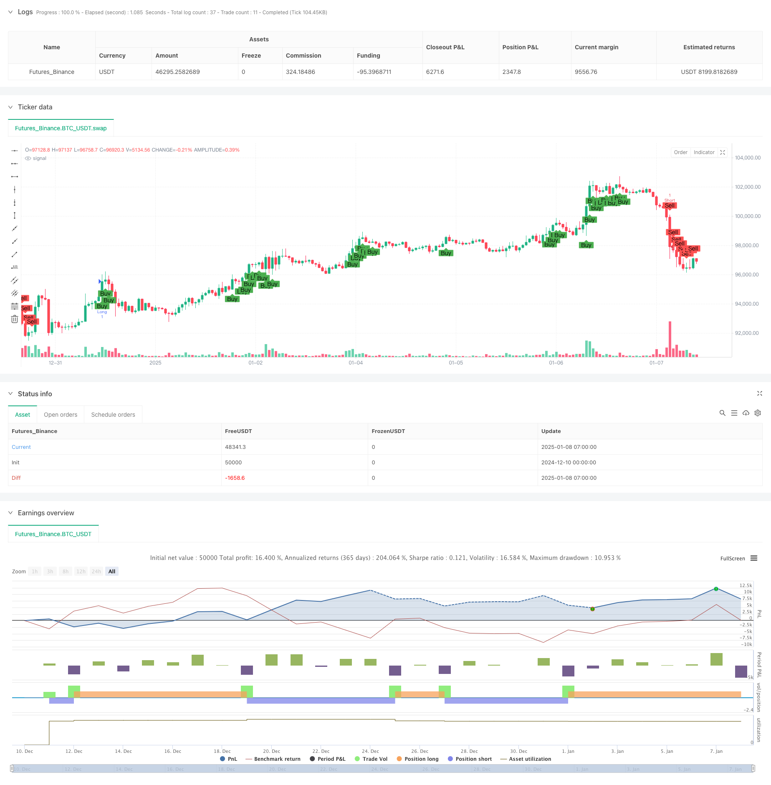

> Name

Dual-EMA-RSI-Divergence-Strategy-A-Trend-Capture-System-Based-on-Exponential-Moving-Average-and-Relative-Strength
> Author

ChaoZhang

> Strategy Description



[trans]
#### Overview
This is a trend following strategy that combines the Exponential Moving Average (EMA) and the Relative Strength Index (RSI). The strategy determines trading signals by monitoring the intersection of fast and slow EMA, combined with the overbought and oversold levels of the RSI indicator and the RSI divergence, to achieve an effective grasp of the market trend. The strategy runs on a 1-hour time period and is verified by multiple technical indicators to improve the accuracy of trading.
#### Strategy Principle
The core logic of the strategy includes the following key elements:
1. Use the 9-period and 26-period EMA to determine the trend direction. If the fast line is above the slow line, it is considered an upward trend, and vice versa is a downward trend.
2. Use the 14-period RSI indicator and set 65 and 35 as the trigger thresholds for long and short signals.
3. Detect RSI divergence on the 1-hour timeframe and identify potential trend turns by comparing price highs and lows with RSI highs and lows
4. Bull trading signals must meet the following requirements: fast EMA is above slow EMA, RSI is greater than 65, and there is no bearish RSI divergence.
5. Short trading signals must meet the following requirements: fast EMA below slow EMA, RSI less than 35, and no bullish RSI divergence
#### Strategic Advantages
1. Cross-validation of multiple technical indicators improves the reliability of trading signals
2. Reduce the risk of false breakthroughs through the detection of RSI divergence
3. Combining the advantages of trend following and overbought and oversold, it can grasp the general trend without missing short-term trading opportunities.
4. Parameters can be optimized and adjusted according to different market characteristics
5. The strategy has clear logic and is easy to understand and execute.
#### Strategy Risk
1. EMA as a lagging indicator may lead to less than ideal entry points
2. RSI may generate too many trading signals in volatile markets
3. Deviation from judgment may lead to misjudgment, especially in highly volatile markets.
4. A rapid market turn may cause a large retracement
Mitigation measures:
- Stop loss and take profit settings can be added
- Consider adding volume indicator verification
- Adjust RSI threshold in volatile markets
#### Strategy optimization direction
1. Introduce adaptive RSI threshold and dynamically adjust it according to market fluctuations
2. Add volume indicator as signal confirmation
3. Develop more accurate divergence detection algorithms
4. Add stop loss and stop profit management mechanism
5. Consider adding a market volatility filter
#### Summary
This strategy builds a relatively complete trading system by combining moving average systems, momentum indicators and divergence analysis. The strategy focuses on multiple verification of signals, effectively reducing the risk of misjudgment. Although there is a certain lag, the strategy has good practical application value through parameter optimization and risk management improvements. ||
#### Overview
This is a trend following strategy that combines Exponential Moving Average (EMA) and Relative Strength Index (RSI). The strategy identifies trading signals by monitoring the crossover of fast and slow EMAs while incorporating RSI overbought/oversold levels and RSI divergence to effectively capture market trends. Operating on a 1-hour timeframe, it enhances trading accuracy through multiple technical indicator verification.

#### Strategy Principles
The core logic includes the following key elements:
1. Uses 9-period and 26-period EMAs to determine trend direction, with uptrend indicated when fast line is above slow line
2. Employs 14-period RSI with 65 and 35 as thresholds for long and short signals
3. Detects RSI divergence on 1-hour timeframe by comparing price highs/lows with RSI highs/lows
4. Long entry requires: fast EMA above slow EMA, RSI above 65, and no bearish RSI divergence
5. Short entry requires: fast EMA below slow EMA, RSI below 35, and no bullish RSI divergence

#### Strategy Advantages
1. Cross-validation of multiple technical indicators improves signal reliability
2. RSI divergence detection reduces false breakout risks
3. Combines benefits of trend following and overbought/oversold conditions
4. Parameters can be optimized for different market characteristics
5. Clear strategy logic that's easy to understand and implement

#### Strategy Risks
1. EMA as a lagging indicator may lead to suboptimal entry points
2. RSI may generate excessive signals in ranging markets
3. Divergence detection may produce false readings, especially in volatile markets
4. Significant drawdowns possible during quick market reversals
Mitigation measures:
- Add stop-loss and take-profit settings
- Consider adding volume indicator verification
- Adjust RSI thresholds in ranging markets

#### Optimization Directions
1. Introduce adaptive RSI thresholds based on market volatility
2. Incorporate volume indicators for signal confirmation
3. Develop more precise divergence detection algorithms
4. Add stop-loss and profit management mechanisms
5. Consider adding market volatility filters

#### Summary
This strategy builds a relatively complete trading system by combining moving averages, momentum indicators, and divergence analysis. It emphasizes multiple signal verification to effectively reduce false judgment risks. While there is some inherent lag, the strategy holds practical value through parameter optimization and risk management improvements.[/trans]


> Source (PineScript)

``` pinescript
/*backtest
start: 2024-12-10 00:00:00
end: 2025-01-08 08:00:00
period: 1h
basePeriod: 1h
exchanges: [{"eid":"Futures_Binance","currency":"BTC_USDT"}]
*/

//@version=5
strategy("EMA9_RSI_Strategy_LongShort", overlay=true)

// Parameters
fastLength = input.int(9, minval=1, title="Fast EMA Length")
slowLength = input.int(26, minval=1, title="Slow EMA Length")
rsiPeriod = input.int(14, minval=1, title="RSI Period")
rsiLevelLong = input.int(65, minval=1, title="RSI Level (Long)")
rsiLevelShort = input.int(35, minval=1, title="RSI Level (Short)")

// Define 1-hour timeframe
timeframe_1h = "60"

// Fetch 1-hour data
high_1h = request.security(syminfo.tickerid, timeframe_1h, high)
low_1h = request.security(syminfo.tickerid, timeframe_1h, low)
rsi_1h = request.security(syminfo.tickerid, timeframe_1h, ta.rsi(close, rsiPeriod))

// Current RSI
rsi = ta.rsi(close, rsiPeriod)

// Find highest/lowest price and corresponding RSI in the 1-hour timeframe
highestPrice_1h = ta.highest(high_1h, 1) // ราคาสูงสุดใน 1 ช่วงของ timeframe 1 ชั่วโมง
lowestPrice_1h = ta.lowest(low_1h, 1)   // ราคาต่ำสุดใน 1 ช่วงของ timeframe 1 ชั่วโมง
highestRsi_1h = ta.valuewhen(high_1h == highestPrice_1h, rsi_1h, 0)
lowestRsi_1h = ta.valuewhen(low_1h == lowestPrice_1h, rsi_1h, 0)

// Detect RSI Divergence for Long
bearishDivLong = high > highestPrice_1h and rsi < highestRsi_1h
bullishDivLong = low < lowestPrice_1h and rsi > lowestRsi_1h
divergenceLong = bearishDivLong or bullishDivLong

// Detect RSI Divergence for Short (switch to low price for divergence check)
bearishDivShort = low > lowestPrice_1h and rsi < lowestRsi_1h
bullishDivShort = high < highestPrice_1h and rsi > highestRsi_1h
divergenceShort = bearishDivShort or bullishDivShort

// Calculate EMA
emaFast = ta.ema(close, fastLength)
emaSlow = ta.ema(close, slowLength)

// Long Conditions
longCondition = emaFast > emaSlow and rsi > rsiLevelLong and not divergenceLong

// Short Conditions
shortCondition = emaFast < emaSlow and rsi < rsiLevelShort and not divergenceShort

// Plot conditions
plotshape(longCondition, title="Buy", location=location.belowbar, color=color.green, style=shape.labelup, text="Buy")
plotshape(shortCondition, title="Sell", location=location.abovebar, color=color.red, style=shape.labeldown, text="Sell")

// Execute the strategy
if (longCondition)
    strategy.entry("Long", strategy.long, comment="entry long")

if (shortCondition)
    strategy.entry("Short", strategy.short, comment="entry short")

// Alert
alertcondition(longCondition, title="Buy Signal", message="Buy signal triggered!")
alertcondition(shortCondition, title="Sell Signal", message="Sell signal triggered!")

```

> Detail

https://www.fmz.com/strategy/477943

> Last Modified

2025-01-10 15:03:06
