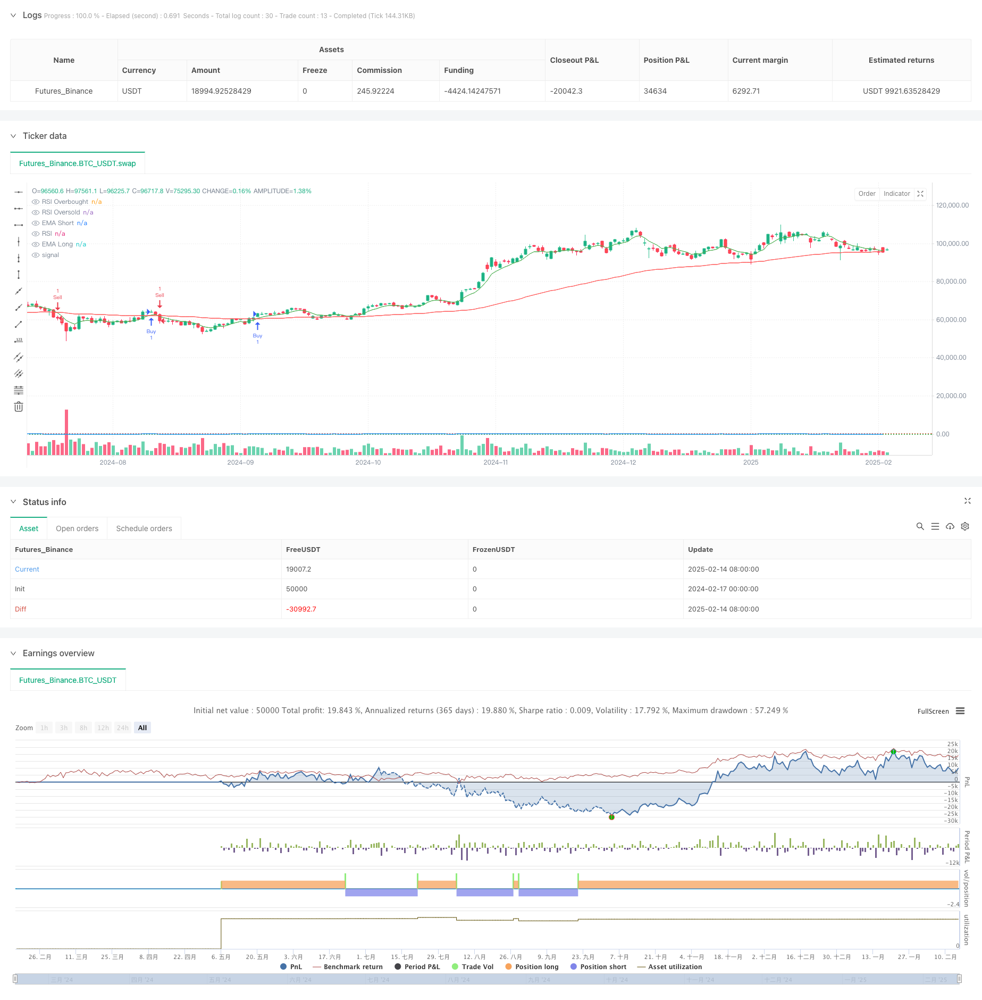

> Name

Dual-EMA-RSI-Momentum-Trend-Following-Strategy
> Author

ChaoZhang

> Strategy Description



[trans]
#### Overview
This strategy is a trend following trading system based on a dual moving average system and the RSI indicator. This strategy combines moving average crossover signals, RSI overbought and oversold judgments, and price breakthrough confirmations to build a multi-filtered trading decision-making framework. The strategy captures short- and medium-term trends through the 6-period and 82-period exponential moving averages (EMA), while using the relative strength index (RSI) to filter out overheated and overcold markets, and finally confirms trading signals through price breakthroughs.
#### Strategy Principle
The core logic of the strategy includes signal filtering in three dimensions:
1. Trend judgment: Use the intersection of fast EMA (6 periods) and slow EMA (82 periods) to determine the trend direction. When the fast line crosses the slow line, a long signal is generated, and when the fast line crosses below the slow line, a short signal is generated.
2. Momentum filtering: Use the 14-period RSI indicator to filter out excessive pursuit of gains and losses. When the RSI is greater than 70, it is considered that the market is overheated and long selling is inhibited; when the RSI is less than 22, the market is considered too cold and short selling is inhibited.
3. Price confirmation: It is required that there must be price breakthrough confirmation when entering the market. Going long requires the closing price to reach a new high, and going short requires the closing price to reach a new low.
#### Strategic Advantages
1. Multiple signal filtering: By combining technical indicators and price behavior, a strict signal filtering mechanism is constructed, which can effectively reduce false signals.
2. Combination of trend following and momentum: It can not only capture the sustainable trend, but also avoid excessive pursuit of gains and losses.
3. Strong parameter adjustability: The key parameters of the strategy, such as the moving average cycle, RSI threshold, etc., can be optimized according to different market characteristics.
4. Improved risk control: Through RSI overbought and oversold judgment, a built-in risk control mechanism is built in.
#### Strategy Risk
1. Risk of volatile market: In a volatile market, moving average crossover signals may appear frequently, leading to excessive trading.
2. Lagging risk: Both EMA and RSI have a certain degree of lag, and may not respond in time when the market turns rapidly.
3. Parameter sensitivity: The strategy effect is more sensitive to parameter selection, and different market environments may require different parameter combinations.
4. Scarce signals: Multiple filtering mechanisms may result in fewer effective signals, affecting strategy profit opportunities.
#### Strategy optimization direction
1. Dynamic parameter adjustment: An adaptive mechanism can be introduced to dynamically adjust the moving average period and RSI threshold according to market volatility.
2. Introduce a stop-loss mechanism: add moving stop-loss or fixed stop-loss rules to improve risk control capabilities.
3. Market environment classification: Add a market environment judgment module and use different parameter combinations under different market conditions.
4. Signal strength grading: A grading system can be designed based on the degree of signal condition satisfaction to adjust the position size.
#### Summary
This strategy builds a logically rigorous trend tracking system through the clever combination of the moving average system and the RSI indicator. The strategy's multiple filtering mechanism effectively controls risks, but it may also miss some trading opportunities. Through continuous optimization and improvement, the strategy is expected to maintain stable performance in different market environments. ||
#### Overview
This strategy is a trend-following trading system based on dual EMAs and RSI indicator. It combines EMA crossover signals, RSI overbought/oversold conditions, and price breakthrough confirmation to build a multi-filtered trading decision framework. The strategy uses 6-period and 82-period Exponential Moving Averages (EMA) to capture medium and short-term trends, while utilizing the Relative Strength Index (RSI) to filter market overheating and overcooling conditions, and finally confirms trading signals through price breakouts.

#### Strategy Principles
The core logic includes three dimensions of signal filtering:
1. Trend Determination: Uses crossovers between fast EMA (6-period) and slow EMA (82-period) to judge trend direction. Long signals are generated when the fast line crosses above the slow line, and short signals when the fast line crosses below.
2. Momentum Filtering: Uses 14-period RSI to filter excessive trend chasing. Market is considered overbought when RSI exceeds 70 (suppressing longs), and oversold when RSI falls below 22 (suppressing shorts).
3. Price Confirmation: Requires price breakthrough confirmation for entry. Long positions require closing price to make new highs, while short positions require new lows.

#### Strategy Advantages
1. Multiple Signal Filtering: Effectively reduces false signals through combination of technical indicators and price action.
2. Trend Following with Momentum Integration: Captures sustained trends while avoiding excessive trend chasing.
3. Strong Parameter Adaptability: Key parameters like EMA periods and RSI thresholds can be optimized for different market characteristics.
4. Comprehensive Risk Control: Built-in risk control mechanism through RSI overbought/oversold conditions.

#### Strategy Risks
1. Choppy Market Risk: EMA crossover signals may occur frequently in sideways markets, leading to overtrading.
2. Lag Risk: Both EMA and RSI have inherent lag, potentially causing delayed reactions to rapid market turns.
3. Parameter Sensitivity: Strategy performance is sensitive to parameter selection, different market environments may require different parameter combinations.
4. Signal Scarcity: Multiple filtering mechanisms may result in fewer valid signals, affecting profit opportunities.

#### Strategy Optimization Directions
1. Dynamic Parameter Adjustment: Introduce adaptive mechanisms to dynamically adjust EMA periods and RSI thresholds based on market volatility.
2. Stop Loss Implementation: Add trailing or fixed stop loss rules to enhance risk control capabilities.
3. Market Environment Classification: Add market state identification module to use different parameter combinations in different market conditions.
4. Signal Strength Grading: Design a grading system based on signal condition satisfaction levels to adjust position sizing.

#### Summary
The strategy constructs a logically rigorous trend-following system through clever combination of EMA system and RSI indicator. While the multiple filtering mechanisms effectively control risk, they may also miss some trading opportunities. Through continuous optimization and improvement, the strategy shows promise in maintaining stable performance across different market environments.[/trans]


> Source (PineScript)

``` pinescript
/*backtest
start: 2024-02-17 00:00:00
end: 2025-02-15 08:00:00
period: 1d
basePeriod: 1d
exchanges: [{"eid":"Futures_Binance","currency":"BTC_USDT"}]
*/

//@version=5
strategy("EMA RSI Strategy", overlay=true)

// Input Parameters
emaShortLength = input.int(6, title="EMA Short Length")
emaLongLength = input.int(82, title="EMA Long Length")
rsiLength = input.int(14, title="RSI Length")
rsiOverbought = input.float(70, title="RSI Overbought Level")
rsiOversold = input.float(22, title="RSI Oversold Level")

// Calculations
emaShort = ta.ema(close, emaShortLength)
emaLong = ta.ema(close, emaLongLength)
rsi = ta.rsi(close, rsiLength)

// Conditions
emaBuyCondition = ta.crossover(emaShort, emaLong)
emaSellCondition = ta.crossunder(emaShort, emaLong)
higherHighCondition = close > ta.highest(close[1], 1)
lowerLowCondition = close < ta.lowest(close[1], 1)
rsiNotOverbought = rsi < rsiOverbought
rsiNotOversold = rsi > rsiOversold

// Entry Signals
buySignal = emaBuyCondition and rsiNotOverbought and higherHighCondition
sellSignal = emaSellCondition and rsiNotOversold and lowerLowCondition

// Execute Trades
if (buySignal)
    strategy.entry("Buy", strategy.long)

if (sellSignal)
    strategy.entry("Sell", strategy.short)

// Plotting
plot(emaShort, color=color.green, title="EMA Short")
plot(emaLong, color=color.red, title="EMA Long")
plot(rsi, title="RSI", color=color.blue, linewidth=1)
hline(rsiOverbought, title="RSI Overbought", color=color.red, linestyle=hline.style_dotted)
hline(rsiOversold, title="RSI Oversold", color=color.green, linestyle=hline.style_dotted)

```

> Detail

https://www.fmz.com/strategy/482241

> Last Modified

2025-02-17 10:51:53
