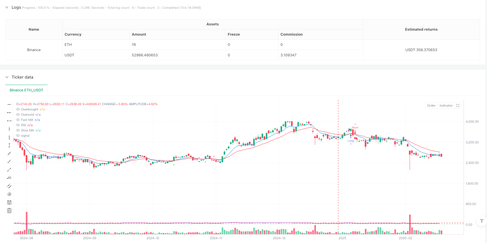
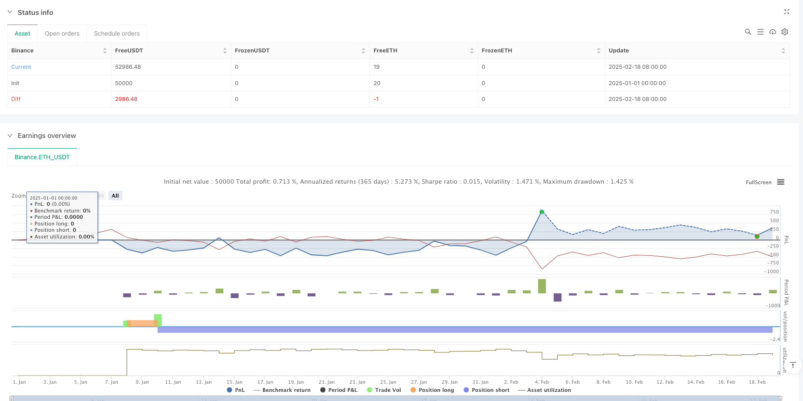

> Name

Dual-Moving-Average-Crossover-with-RSI-Momentum-Enhancement-Strategy
> Author

ianzeng123

> Strategy Description





[trans]
#### Overview
This strategy is a trading system that combines a double moving average crossover and the Relative Strength Index (RSI). The strategy uses the 9- and 21-period exponential moving averages (EMA) as the main signal generation tool, while introducing the RSI indicator as a filter to avoid trading in overbought/sold areas. This combination method not only retains the characteristics of trend following, but also adds the dimension of momentum confirmation.
#### Strategy Principle
The core logic of the strategy is based on the following key components:
1. Cross signal of fast EMA (9 periods) and slow EMA (21 periods)
2. The RSI indicator (14 periods) serves as a filter, setting 70 and 30 as the thresholds for overbuying and overselling.
3. Buying conditions: Fast EMA crosses slow EMA and RSI is below 70
4. Selling conditions: Fast EMA crosses slow EMA and RSI is above 30
In this way, the strategy ensures the reliability of trend signals while avoiding trading during periods when the market is too hot or too cold.
#### Strategic Advantages
1. Signal reliability: By combining indicators from two dimensions: trend and momentum, the reliability of trading signals is improved.
2. Risk control: RSI filter effectively avoids trading in over-buy/sell areas
3. Strong adaptability: strategy parameters can be adjusted according to different market environments
4. High degree of automation: includes complete signal generation and reminder functions
5. Good visualization effect: Provides a clear graphical interface to facilitate traders to understand the market status
#### Strategy Risk
1. Lagging risk: Moving averages are essentially lagging indicators and may cause delays in rapidly volatile markets.
2. False breakthrough risk: Frequent false breakthrough signals may occur in sideways markets
3. Parameter sensitivity: The strategy effect is more sensitive to parameter settings, and different market environments may require different parameter combinations.
4. Market environment dependence: perform better in markets with obvious trends, but may perform poorly in volatile markets
#### Strategy optimization direction
1. Introduce volatility indicators: Consider adding ATR or Bollinger Bands to adapt to different market volatility environments
2. Optimize signal filtering: You can consider adding trading volume indicators as auxiliary confirmation
3. Dynamic parameter adjustment: Develop an adaptive parameter system to automatically adjust indicator parameters according to market conditions.
4. Add stop loss mechanism: add dynamic stop loss function to improve risk management capabilities
5. Time frame optimization: consider multi-time frame analysis to improve signal reliability
#### Summary
This strategy builds a relatively complete trading system by combining classic technical analysis tools. Capturing trends through moving average crossovers and filtering signals using RSI achieves an organic combination of trend tracking and momentum confirmation. The main advantages of the strategy are its reliability and risk control capabilities, but you also need to pay attention to the hysteresis of the moving average and the sensitivity of parameter settings. Through the proposed optimization direction, there is room for further improvement of the strategy. ||
#### Overview
This strategy is a trading system that combines dual moving average crossover with the Relative Strength Index (RSI). It utilizes 9-period and 21-period Exponential Moving Averages (EMA) as the primary signal generation tool, while incorporating the RSI indicator as a filter to avoid trading in overbought/oversold regions. This combination maintains trend-following characteristics while adding a momentum confirmation dimension.

#### Strategy Principle
The core logic of the strategy is based on the following key components:
1. Crossover signals between fast EMA (9-period) and slow EMA (21-period)
2. RSI indicator (14-period) as a filter, with 70 and 30 as overbought and oversold thresholds
3. Buy condition: fast EMA crosses above slow EMA and RSI is below 70
4. Sell condition: fast EMA crosses below slow EMA and RSI is above 30
This approach ensures trend signal reliability while avoiding trades during market extremes.

#### Strategy Advantages
1. Signal Reliability: Combines trend and momentum dimensions to enhance trading signal reliability
2. Risk Control: RSI filter effectively prevents trading in overbought/oversold regions
3. High Adaptability: Strategy parameters can be adjusted for different market conditions
4. High Automation: Includes complete signal generation and alert functionality
5. Good Visualization: Provides clear graphical interface for better market state understanding

#### Strategy Risks
1. Lag Risk: Moving averages are inherently lagging indicators, potentially causing delays in fast-moving markets
2. False Breakout Risk: May generate frequent false signals in ranging markets
3. Parameter Sensitivity: Strategy effectiveness is sensitive to parameter settings, different market environments may require different parameter combinations
4. Market Environment Dependency: Performs better in trending markets, may underperform in ranging markets

#### Strategy Optimization Directions
1. Incorporate Volatility Indicators: Consider adding ATR or Bollinger Bands to adapt to different market volatility environments
2. Optimize Signal Filtering: Consider adding volume indicators as additional confirmation
3. Dynamic Parameter Adjustment: Develop adaptive parameter systems that automatically adjust based on market conditions
4. Add Stop Loss Mechanism: Implement dynamic stop loss functionality to improve risk management
5. Timeframe Optimization: Consider multiple timeframe analysis to improve signal reliability

#### Summary
This strategy constructs a comprehensive trading system by combining classic technical analysis tools. It captures trends through moving average crossovers and filters signals using RSI, achieving an organic combination of trend following and momentum confirmation. The strategy's main advantages lie in its reliability and risk control capabilities, but attention must be paid to the lag in moving averages and parameter setting sensitivity. Through the proposed optimization directions, there is room for further strategy improvement.[/trans]


> Source (PineScript)

``` pinescript
/*backtest
start: 2025-01-01 00:00:00
end: 2025-02-19 08:00:00
period: 1d
basePeriod: 1d
exchanges: [{"eid":"Binance","currency":"ETH_USDT"}]
*/

// This Pine Script™ code is subject to the terms of the Mozilla Public License 2.0 at https://mozilla.org/MPL/2.0/
// © McTunT

// Gold Price Trading Signals
// Pine Script version 6 code for TradingView
//@version=6
strategy("Ausiris Gold Trading Strategy", overlay=true)

// Input parameters
fastLength = input.int(9, title="Fast MA Length", minval=1)
slowLength = input.int(21, title="Slow MA Length", minval=1)
rsiLength = input.int(14, title="RSI Length", minval=1)
rsiOverbought = input.int(70, title="RSI Overbought Level", minval=50, maxval=100)
rsiOversold = input.int(30, title="RSI Oversold Level", minval=0, maxval=50)

// Calculate moving averages
fastMA = ta.ema(close, fastLength)
slowMA = ta.ema(close, slowLength)

// Calculate RSI
rsiValue = ta.rsi(close, rsiLength)

// Plot moving averages
plot(fastMA, color=color.blue, title="Fast MA")
plot(slowMA, color=color.red, title="Slow MA")

// Generate signals
longCondition = ta.crossover(fastMA, slowMA) and rsiValue < rsiOverbought
shortCondition = ta.crossunder(fastMA, slowMA) and rsiValue > rsiOversold

// Plot buy/sell signals
plotshape(longCondition, title="Buy Signal", location=location.belowbar, color=color.green, style=shape.triangleup, size=size.small)
plotshape(shortCondition, title="Sell Signal", location=location.abovebar, color=color.red, style=shape.triangledown, size=size.small)

// Strategy entry/exit
if (longCondition)
    strategy.entry("Long", strategy.long)
if (shortCondition)
    strategy.entry("Short", strategy.short)

// Add alert conditions
alertcondition(longCondition, title="Buy Alert", message="Gold Buy Signal!")
alertcondition(shortCondition, title="Sell Alert", message="Gold Sell Signal!")

// Display RSI values
hline(rsiOverbought, "Overbought", color=color.red)
hline(rsiOversold, "Oversold", color=color.green)
plot(rsiValue, "RSI", color=color.purple, display=display.none)

```

> Detail

https://www.fmz.com/strategy/483116

> Last Modified

2025-02-27 16:57:55
