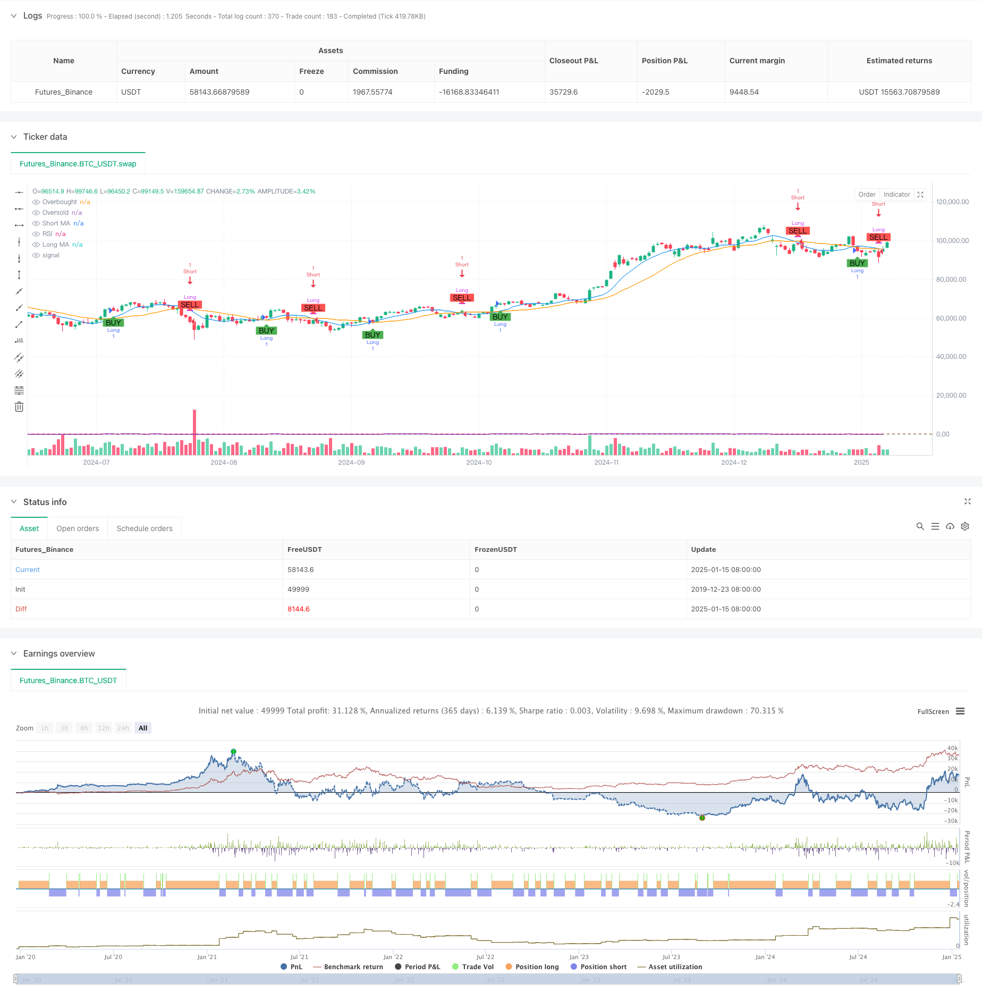

> Name

Dual-Moving-Average-RSI-Multi-Signal-Trend-Trading-Strategy
> Author

ChaoZhang

> Strategy Description



[trans]
#### Overview
This strategy is a multi-signal trend following system based on dual moving averages and the Relative Strength Index (RSI). The strategy operates on a 1-hour timeframe, using the intersection of short-term and long-term moving averages and RSI overbought and oversold levels to determine market trends and trade timing. The system uses a combination of 9-period and 21-period simple moving averages (SMA), combined with the 14-period RSI indicator, to build a complete trend tracking and momentum confirmation trading system.
#### Strategy Principle
The core logic of the strategy is based on the following key elements:
1. Use the 9-period and 21-period simple moving averages to identify the trend direction. The short-term moving average crosses the long-term moving average to form a long signal, and the short-term moving average crosses below to form a short signal.
2. Introduce the RSI indicator as a trend confirmation tool, and set 70 and 30 as overbought and oversold thresholds.
3. When the moving average crossover signal appears, the system will check whether the RSI value meets the corresponding conditions: long requires the RSI to be greater than the oversold level (30), and short requires the RSI to be less than the overbought level (70).
4. When both moving average crossover and RSI conditions are met, the system will execute the corresponding trading signal.
#### Strategic Advantages
1. The multiple signal confirmation mechanism significantly improves transaction reliability and avoids false signals that may be caused by a single indicator.
2. Combining trend and momentum indicators can not only capture the trend, but also avoid excessive pursuit of gains and losses.
3. The parameter settings are reasonable, and the 9- and 21-period moving average combination can effectively balance sensitivity and stability.
4. The system automatically displays trading signals on the chart to facilitate traders' intuitive judgment.
5. The code structure is clear and easy to maintain and optimize.
#### Strategy Risk
1. Frequent cross signals may occur in volatile markets, leading to over-trading.
2. The RSI indicator may miss part of the market in a strong trending market.
3. Fixed overbought and oversold thresholds may not apply to all market environments.
4. There is a certain lag in the moving average system, which may cause a slight delay in entry or exit timing.
#### Strategy optimization direction
1. Introduce an adaptive parameter mechanism to dynamically adjust the moving average period and RSI threshold according to market volatility.
2. Add trend strength filter to reduce trading frequency in volatile markets.
3. Consider adding stop-loss and stop-profit mechanisms to improve risk management capabilities.
4. Introduce trading volume indicators as auxiliary confirmation signals.
5. Develop a market environment identification module and use different parameter settings under different market conditions.
#### Summary
This strategy builds a relatively complete trend following trading system by combining the moving average system and the RSI indicator. The strategy design concept focuses on signal reliability and risk control, and is suitable for medium and long-term trend trading. Although there are some inherent limitations, the overall performance of the strategy is expected to be further improved through the proposed optimization directions. The code of the strategy implements professional specifications and has good scalability. It is a trading system worthy of in-depth study and practice. ||
#### Overview
This strategy is a multi-signal trend following system based on dual moving averages and the Relative Strength Index (RSI). Operating on a 1-hour timeframe, it identifies market trends and trading opportunities through crossovers of short-term and long-term moving averages, combined with RSI overbought and oversold levels. The system employs a combination of 9-period and 21-period Simple Moving Averages (SMA) along with a 14-period RSI to create a comprehensive trend following and momentum confirmation trading system.

#### Strategy Principle
The core logic of the strategy is based on the following key elements:
1. Uses 9-period and 21-period Simple Moving Averages to identify trend direction, with long signals generated when the short MA crosses above the long MA, and short signals when it crosses below.
2. Incorporates RSI as a trend confirmation tool, with 70 and 30 set as overbought and oversold thresholds.
3. When moving average crossovers occur, the system checks if RSI values meet corresponding conditions: long positions require RSI above oversold level (30), short positions require RSI below overbought level (70).
4. Trades are executed only when both moving average crossover and RSI conditions are satisfied simultaneously.

#### Strategy Advantages
1. Multiple signal confirmation mechanism significantly improves trading reliability, avoiding false signals from single indicators.
2. Combination of trend and momentum indicators enables both trend capture and avoidance of excessive momentum chasing.
3. Reasonable parameter settings, with 9 and 21-period moving average combination effectively balancing sensitivity and stability.
4. System automatically displays trading signals on the chart for intuitive judgment.
5. Clear code structure, easy to maintain and optimize.

#### Strategy Risks
1. May generate frequent crossover signals in ranging markets, leading to overtrading.
2. RSI indicator might miss some opportunities in strong trend markets.
3. Fixed overbought and oversold thresholds may not be suitable for all market conditions.
4. Moving average system has inherent lag, potentially causing delayed entry or exit timing.

#### Strategy Optimization Directions
1. Introduce adaptive parameter mechanisms to dynamically adjust moving average periods and RSI thresholds based on market volatility.
2. Add trend strength filters to reduce trading frequency in ranging markets.
3. Consider implementing stop-loss and take-profit mechanisms to improve risk management.
4. Incorporate volume indicators as auxiliary confirmation signals.
5. Develop market environment recognition modules to use different parameter settings under different market conditions.

#### Summary
This strategy constructs a relatively complete trend following trading system by combining moving average systems with RSI indicators. The strategy design philosophy emphasizes signal reliability and risk control, suitable for medium to long-term trend trading. While there are some inherent limitations, the overall performance of the strategy can be further improved through the suggested optimization directions. The code implementation is professional and standardized, with good scalability, making it a trading system worthy of in-depth study and practice.[/trans]


> Source (PineScript)

``` pinescript
/*backtest
start: 2019-12-23 08:00:00
end: 2025-01-16 00:00:00
period: 1d
basePeriod: 1d
exchanges: [{"eid":"Futures_Binance","currency":"BTC_USDT","balance":49999}]
*/

// This Pine Script™ code is subject to the terms of the Mozilla Public License 2.0 at https://mozilla.org/MPL/2.0/
// © Vitaliby

//@version=5
strategy("Vitaliby MA and RSI Strategy", overlay=true)

// Входные параметры для настройки
shortMALength = input.int(9, title="Short MA Length")
longMALength = input.int(21, title="Long MA Length")
rsiLength = input.int(14, title="RSI Length")
rsiOverbought = input.int(70, title="RSI Overbought Level")
rsiOversold = input.int(30, title="RSI Oversold Level")

// Расчет скользящих средних и RSI
shortMA = ta.sma(close, shortMALength)
longMA = ta.sma(close, longMALength)
rsi = ta.rsi(close, rsiLength)

// Определение условий для входа и выхода
longCondition = ta.crossover(shortMA, longMA) and rsi > rsiOversold
shortCondition = ta.crossunder(shortMA, longMA) and rsi < rsiOverbought

// Отображение сигналов на графике
plotshape(series=longCondition, location=location.belowbar, color=color.green, style=shape.labelup, text="BUY", size=size.small)
plotshape(series=shortCondition, location=location.abovebar, color=color.red, style=shape.labeldown, text="SELL", size=size.small)

// Отображение скользящих средних на графике
plot(shortMA, color=color.blue, title="Short MA")
plot(longMA, color=color.orange, title="Long MA")

// Отображение RSI на отдельном окне
hline(rsiOverbought, "Overbought", color=color.red)
hline(rsiOversold, "Oversold", color=color.green)
plot(rsi, color=color.purple, title="RSI")

// Управление позициями
if (longCondition)
    strategy.entry("Long", strategy.long)

if (shortCondition)
    strategy.close("Long")

if (shortCondition)
    strategy.entry("Short", strategy.short)

if (longCondition)
    strategy.close("Short")

```

> Detail

https://www.fmz.com/strategy/478744

> Last Modified

2025-01-17 16:31:31
