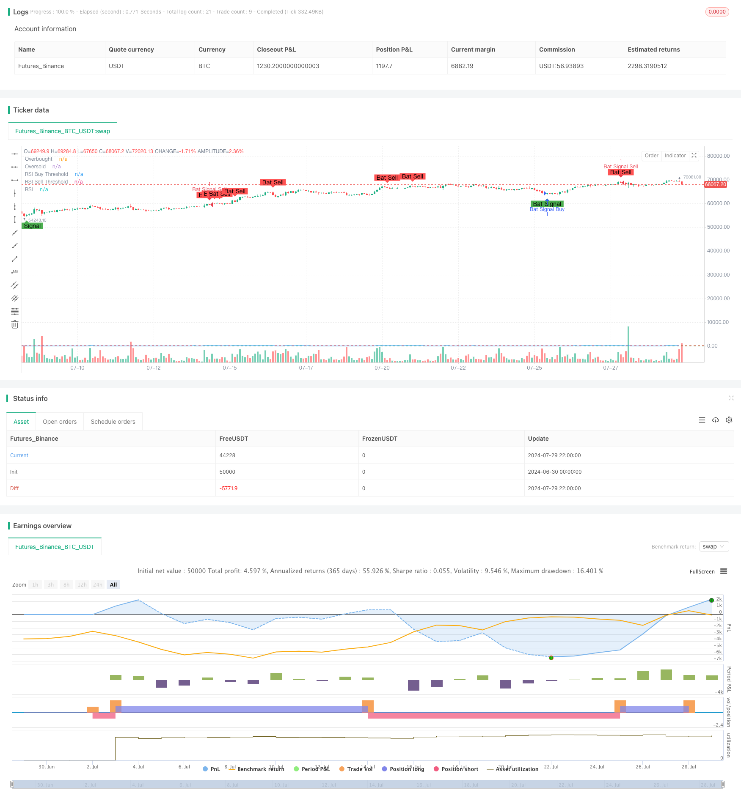

> Name

Dual-RSI-Strategy-Advanced-Trend-Capture-System-Combining-Divergence-and-Crossover
> Author

ChaoZhang

> Strategy Description



[trans]

#### Overview
The dual RSI strategy is an advanced quantitative trading strategy that combines two classic trading methods, RSI divergence and RSI crossover. This strategy aims to capture more reliable buying and selling points in the market by simultaneously monitoring the divergence and crossover signals of the RSI indicator. The core idea of ​​the strategy is that only when RSI divergence and RSI crossover occur at the same time, the trading signal will be triggered. This double confirmation mechanism helps to improve the accuracy and reliability of trading.
#### Strategy Principle
1. RSI Divergence:
   - Bullish Divergence: Formed when price makes a new low, but RSI does not.
   - Bearish Divergence: Formed when the price makes a new high, but the RSI does not.
2. RSI Crossover:
   - Buy signal: RSI breaks upward from the oversold zone (below 30).
   - Sell signal: RSI breaks downward from the overbought zone (above 70).
3. Signal generation:
   - Buying conditions: both RSI bullish divergence and RSI breaking above the oversold line upwards are met.
   - Sell condition: both bearish divergence of RSI and RSI breaking below the overbought line are met simultaneously.
4. Parameter settings:
   - RSI period: 14 (adjustable)
   - Overbought line: 70 (adjustable)
   - Oversold line: 30 (adjustable)
   - Divergence search period: 90 K lines (adjustable)
#### Strategic Advantages
1. High reliability: By combining RSI divergence and crossover signals, the reliability of trading signals is greatly improved and the risk of false signals is reduced.
2. Trend grasp: It can effectively capture the turning point of the market trend and is suitable for medium and long-term transactions.
3. Strong flexibility: The key parameters of the strategy can be adjusted to adapt to different market environments and trading varieties.
4. Risk control: Through a strict double confirmation mechanism, transaction risks are effectively controlled.
5. Visual support: The strategy provides clear chart marks to facilitate traders to intuitively understand market conditions.
#### Strategy Risk
1. Hysteresis: Due to the need for double confirmation, some early stages of rapid market movements may be missed.
2. Over-reliance on RSI: Under certain market conditions, a single indicator may not fully reflect market conditions.
3. Parameter sensitivity: Different parameter settings may lead to completely different trading results and require careful optimization.
4. False signal risk: Although the double confirmation mechanism reduces the risk of false signals, it may still occur in highly volatile markets.
5. Lack of stop-loss mechanism: The strategy itself does not have a built-in stop-loss mechanism and requires traders to set additional settings.
#### Strategy optimization direction
1. Combination of multiple indicators: Introduce other technical indicators (such as MACD, Bollinger Bands) for cross-validation to further improve signal reliability.
2. Adaptive parameters: Dynamically adjust the RSI cycle and threshold according to market volatility to adapt to different market environments.
3. Add a stop-loss mechanism: Design a stop-loss strategy based on ATR or a fixed percentage to control the risk of a single transaction.
4. Time filtering: Add trading time window restrictions to avoid trading during unfavorable periods.
5. Volatility filtering: Suppress trading signals in low volatility environments and reduce the risk of false breakthroughs.
6. Combination of volume and price: Introduce trading volume analysis to improve the credibility of signals.
7. Machine learning optimization: Use machine learning algorithms to optimize parameter selection and improve the adaptability of the strategy.
#### Summarize
The Dual RSI strategy creates a powerful and flexible trading system by cleverly combining RSI divergence and crossover signals. Not only can it effectively capture important turning points in market trends, it also significantly improves the reliability of trading signals through a double confirmation mechanism. Although the strategy has certain risks such as hysteresis and parameter sensitivity, these problems can be effectively alleviated through reasonable optimization and risk management. In the future, through the introduction of advanced technologies such as multi-index cross-validation, adaptive parameters and machine learning, this strategy still has a lot of room for improvement. For quantitative traders looking for a robust and reliable trading system, the dual RSI strategy is undoubtedly a choice worthy of in-depth study and practice.
|| 

#### Overview

The Dual RSI Strategy is an advanced quantitative trading approach that combines two classic RSI-based trading methods: RSI divergence and RSI crossover. This strategy aims to capture more reliable buy and sell signals in the market by simultaneously monitoring both divergence and crossover signals from the RSI indicator. The core idea is to generate trading signals only when both RSI divergence and RSI crossover occur simultaneously, providing a double confirmation mechanism that enhances the accuracy and reliability of trades.

#### Strategy Principles

1. RSI Divergence:
   - Bullish Divergence: Occurs when price makes a new low, but RSI fails to make a new low.
   - Bearish Divergence: Occurs when price makes a new high, but RSI fails to make a new high.

2. RSI Crossover:
   - Buy Signal: RSI crosses above the oversold level (30).
   - Sell Signal: RSI crosses below the overbought level (70).

3. Signal Generation:
   - Buy Condition: Bullish RSI divergence AND RSI crosses above the oversold level.
   - Sell Condition: Bearish RSI divergence AND RSI crosses below the overbought level.

4. Parameter Settings:
   - RSI Period: 14 (adjustable)
   - Overbought Level: 70 (adjustable)
   - Oversold Level: 30 (adjustable)
   - Divergence Lookback Period: 90 bars (adjustable)

#### Strategy Advantages

1. High Reliability: By combining RSI divergence and crossover signals, the strategy significantly improves the reliability of trading signals and reduces the risk of false signals.

2. Trend Capture: Effectively identifies market trend reversal points, suitable for medium to long-term trading.

3. Flexibility: Key parameters are adjustable, allowing adaptation to different market environments and trading instruments.

4. Risk Control: The strict double confirmation mechanism effectively controls trading risk.

5. Visual Support: The strategy provides clear chart markings, facilitating intuitive understanding of market conditions.

#### Strategy Risks

1. Lag: Due to the need for double confirmation, the strategy may miss the early stages of some rapid market movements.

2. Over-reliance on RSI: In certain market conditions, a single indicator may not fully reflect market dynamics.

3. Parameter Sensitivity: Different parameter settings can lead to vastly different trading results, requiring careful optimization.

4. False Signal Risk: Although the double confirmation mechanism reduces false signal risk, it can still occur in highly volatile markets.

5. Lack of Stop-Loss Mechanism: The strategy itself does not include a built-in stop-loss mechanism, requiring traders to set additional risk management measures.

#### Strategy Optimization Directions

1. Multi-Indicator Integration: Introduce other technical indicators (e.g., MACD, Bollinger Bands) for cross-validation to further improve signal reliability.

2. Adaptive Parameters: Dynamically adjust RSI period and thresholds based on market volatility to adapt to different market environments.

3. Implement Stop-Loss: Design a stop-loss strategy based on ATR or fixed percentage to control single trade risk.

4. Time Filtering: Add trading time window restrictions to avoid trading during unfavorable periods.

5. Volatility Filtering: Suppress trading signals in low volatility environments to reduce false breakout risks.

6. Volume Analysis: Incorporate volume analysis to increase signal credibility.

7. Machine Learning Optimization: Use machine learning algorithms to optimize parameter selection and improve strategy adaptability.

#### Conclusion

The Dual RSI Strategy cleverly combines RSI divergence and crossover signals to create a powerful and flexible trading system. It not only effectively captures important turning points in market trends but also significantly improves the reliability of trading signals through its double confirmation mechanism. While the strategy has certain risks such as lag and parameter sensitivity, these issues can be effectively mitigated through proper optimization and risk management. In the future, by introducing advanced techniques such as multi-indicator cross-validation, adaptive parameters, and machine learning, this strategy has great potential for improvement. For quantitative traders seeking a robust and reliable trading system, the Dual RSI Strategy is undoubtedly a worthy choice for in-depth study and practice.

[/trans]


> Source (PineScript)

``` pinescript
/*backtest
start: 2024-06-30 00:00:00
end: 2024-07-30 00:00:00
period: 2h
basePeriod: 15m
exchanges: [{"eid":"Futures_Binance","currency":"BTC_USDT"}]
*/

//@version=4
strategy("Combined RSI Strategies", overlay=true)

// Input parameters for the first strategy (RSI Divergences)
len = input(14, minval=1, title="RSI Length")
ob = input(defval=70, title="Overbought", type=input.integer, minval=0, maxval=100)
os = input(defval=30, title="Oversold", type=input.integer, minval=0, maxval=100)
xbars = input(defval=90, title="Div lookback period (bars)?", type=input.integer, minval=1)

// Input parameters for the second strategy (RSI Crossover)
rsiBuyThreshold = input(30, title="RSI Buy Threshold")
rsiSellThreshold = input(70, title="RSI Sell Threshold")

// RSI calculation
rsi = rsi(close, len)

// Calculate highest and lowest bars for divergences
hb = abs(highestbars(rsi, xbars))
lb = abs(lowestbars(rsi, xbars))

// Initialize variables for divergences
var float max = na
var float max_rsi = na
var float min = na
var float min_rsi = na
var bool pivoth = na
var bool pivotl = na
var bool divbear = na
var bool divbull = na

// Update max and min values for divergences
max := hb == 0 ? close : na(max[1]) ? close : max[1]
max_rsi := hb == 0 ? rsi : na(max_rsi[1]) ? rsi : max_rsi[1]
min := lb == 0 ? close : na(min[1]) ? close : min[1]
min_rsi := lb == 0 ? rsi : na(min_rsi[1]) ? rsi : min_rsi[1]

// Compare current bar's high/low with max/min values for divergences
if close > max
    max := close
if rsi > max_rsi
    max_rsi := rsi
if close < min
    min := close
if rsi < min_rsi
    min_rsi := rsi

// Detect pivot points for divergences
pivoth := (max_rsi == max_rsi[2]) and (max_rsi[2] != max_rsi[3]) ? true : na
pivotl := (min_rsi == min_rsi[2]) and (min_rsi[2] != min_rsi[3]) ? true : na

// Detect divergences
if (max[1] > max[2]) and (rsi[1] < max_rsi) and (rsi <= rsi[1])
    divbear := true
if (min[1] < min[2]) and (rsi[1] > min_rsi) and (rsi >= rsi[1])
    divbull := true

// Conditions for RSI crossovers
isRSICrossAboveThreshold = crossover(rsi, rsiBuyThreshold)
isRSICrossBelowThreshold = crossunder(rsi, rsiSellThreshold)

// Combined buy and sell conditions
buyCondition = divbull and isRSICrossAboveThreshold
sellCondition = divbear and isRSICrossBelowThreshold

// Generate buy/sell signals
if buyCondition
    strategy.entry("Bat Signal Buy", strategy.long)
if sellCondition
    strategy.entry("Bat Signal Sell", strategy.short)

// Plot RSI
plot(rsi, "RSI", color=color.blue)
hline(ob, title="Overbought", color=color.red)
hline(os, title="Oversold", color=color.green)
hline(rsiBuyThreshold, title="RSI Buy Threshold", color=color.green)
hline(rsiSellThreshold, title="RSI Sell Threshold", color=color.red)

// Plot signals
plotshape(series=buyCondition, title="Bat Signal", location=location.belowbar, color=color.green, style=shape.labelup, text="Bat Signal")
plotshape(series=sellCondition, title="Bat Sell", location=location.abovebar, color=color.red, style=shape.labeldown, text="Bat Sell")


```

> Detail

https://www.fmz.com/strategy/458252

> Last Modified

2024-07-31 11:55:12
