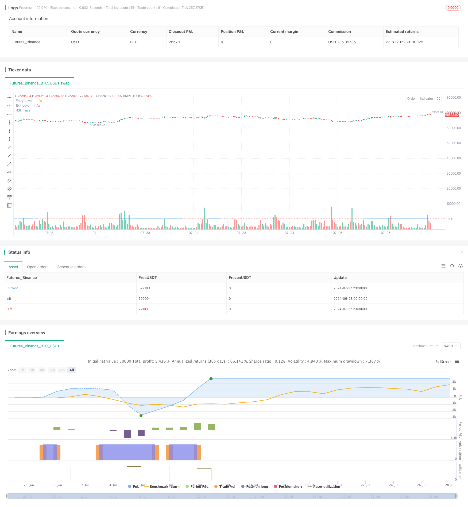

> Name

Dynamic-Low-Price-Entry-and-Stop-Loss-Strategy-Based-on-RSI
> Author

ChaoZhang

> Strategy Description



[trans]

#### Overview
This strategy is a trading system based on the Relative Strength Index (RSI), specifically designed for use in certain markets. It uses the oversold and overbought ranges of the RSI indicator to determine entry and exit points, while incorporating a dynamic stop-loss mechanism to control risks. The core idea of ​​this strategy is to enter the long position when the market is oversold and exit when the RSI rises back to the overbought area or reaches a preset maximum loss percentage.
#### Strategy Principle
1. Entry conditions: When the RSI value is lower than the set entry threshold (default is 24), the strategy will open a long position. The lowest price of the day is used here to calculate RSI, rather than the commonly used closing price, which may make the strategy more sensitive to market lows.
2. Exit conditions: The strategy has two exit conditions:
   a) When the RSI value exceeds the set exit threshold (default is 72), it indicates that the market may be overbought, and the position is closed at this time.
   b) When the loss percentage exceeds the preset maximum loss tolerance (default is 20%), stop-loss closing is triggered.
3. Position management: By default, the strategy uses 10% of the total account value as the amount of funds for each transaction.
4. RSI calculation: Calculate RSI using a 14-day period, but based on the lowest price instead of the traditional closing price.
#### Strategic Advantages
1. Dynamic Entry: By using RSI lows as entry signals, the strategy can capture potential rebound opportunities when the market is oversold.
2. Risk control: It combines the two exit mechanisms of technical indicators (RSI) and percentage stop loss, which can not only take profits in time when the market turns, but also control losses when the market goes unfavorably.
3. Flexibility: The strategy allows users to customize the RSI calculation period, entry and exit thresholds, and maximum loss percentage, which can be adjusted according to different market characteristics.
4. Use low prices to calculate RSI: This non-traditional RSI calculation method may make it easier to capture the extreme lows of the market, which is beneficial to entry at a lower price.
5. Simple and clear: The strategy logic is relatively simple, easy to understand and implement, and also facilitates subsequent optimization and expansion.
#### Strategy Risk
1. Risk of false breakthrough: In a volatile market, RSI may frequently trigger entry signals, resulting in multiple trades being triggered and then quickly stopped.
2. Insufficient trend following: The strategy mainly relies on RSI reversal signals. In a strong trending market, positions may be closed prematurely and greater profit opportunities will be missed.
3. Fixed percentage stop loss: Although the stop loss mechanism is set, the fixed percentage stop loss may not be suitable for all market conditions and may be too loose or too tight in some cases.
4. Single indicator dependence: The strategy only relies on the RSI indicator and lacks verification of other technical indicators or fundamental factors, which may increase the risk of misjudgment.
5. Specific market limitations: The strategy is designed for a specific market and may not be applicable to other types of financial products or markets.
#### Strategy optimization direction
1. Combination of multiple indicators: Consider introducing other technical indicators such as moving averages, Bollinger Bands, etc., and use them in conjunction with RSI to improve the reliability of the signal.
2. Adaptive parameters: A mechanism can be developed to automatically adjust the RSI calculation period and entry/exit thresholds based on market volatility to make the strategy more adaptable.
3. Dynamic stop loss: Changing the fixed percentage stop loss to a trailing stop loss or ATR (average true range) stop loss may better adapt to different market fluctuations.
4. Position management optimization: Consider dynamically adjusting the capital ratio for each transaction based on the strength of RSI or market volatility, instead of using a fixed 10%.
5. Add trend filtering: Introduce a trend judgment mechanism, such as using long-term moving averages, to avoid premature closing of positions in a strong upward trend.
6. Time filtering: Add trading time window restrictions to avoid trading during periods of less market volatility or poor liquidity.
7. Backtesting and optimization: Conduct large-scale parameter optimization and backtesting of the strategy to find the parameter combination that performs best under different market conditions.
#### Summarize
This RSI-based low-price dynamic entry and stop-loss strategy provides a simple and effective trading method. By utilizing RSI's oversold and overbought signals, combined with a dynamic stop-loss mechanism, the strategy aims to capture market lows and control risk. Its unique feature is that it uses the lowest price to calculate RSI, which may make the strategy more sensitive to market bottoms.
However, the strategy also has some limitations, such as over-reliance on a single indicator and possible premature closing of positions. In order to improve the robustness and adaptability of the strategy, you can consider introducing optimization directions such as multi-index verification, adaptive parameters, and dynamic stop loss. At the same time, in-depth backtesting and parameter optimization based on different market characteristics are also necessary.
Overall, this strategy provides traders with a good starting point that can be further customized and improved based on personal trading style and target market characteristics. In practical applications, it is recommended that traders carefully evaluate the performance of strategies in different market environments and combine other analysis tools and risk management techniques to enhance the overall effect of the strategy.
|| 

#### Overview

This strategy is a trading system based on the Relative Strength Index (RSI), specifically designed for certain markets. It utilizes the oversold and overbought zones of the RSI indicator to determine entry and exit points, while incorporating a dynamic stop-loss mechanism to control risk. The core idea of this strategy is to enter long positions when the market is oversold and exit when the RSI rises to the overbought zone or reaches a preset maximum loss percentage.

#### Strategy Principles

1. Entry Condition: The strategy opens a long position when the RSI value falls below the set entry threshold (default 24). It uses the daily low price to calculate RSI, rather than the commonly used closing price, which may make the strategy more sensitive to market lows.

2. Exit Conditions: The strategy has two exit conditions:
   a) When the RSI value exceeds the set exit threshold (default 72), indicating potential market overbought, the position is closed.
   b) When the loss percentage exceeds the preset maximum loss tolerance (default 20%), it triggers a stop-loss closure.

3. Position Management: The strategy defaults to using 10% of the account's total value as the fund amount for each trade.

4. RSI Calculation: RSI is calculated using a 14-day period, but based on the low price rather than the traditional closing price.

#### Strategy Advantages

1. Dynamic Entry: By using RSI lows as entry signals, the strategy can capture potential rebound opportunities when the market is oversold.

2. Risk Control: Combines both technical indicator (RSI) and percentage stop-loss exit mechanisms, allowing for timely profit-taking when the market turns and controlling losses when the trend is unfavorable.

3. Flexibility: The strategy allows users to customize the RSI calculation period, entry and exit thresholds, and maximum loss percentage, which can be adjusted according to different market characteristics.

4. Using Low Price for RSI Calculation: This non-traditional RSI calculation method may be more likely to capture extreme market lows, favoring entry at lower price positions.

5. Simplicity and Clarity: The strategy logic is relatively simple, easy to understand and implement, while also being convenient for subsequent optimization and expansion.

#### Strategy Risks

1. False Breakout Risk: In highly volatile markets, RSI may frequently trigger entry signals, leading to multiple trades being initiated and quickly stopped out.

2. Insufficient Trend Following: The strategy mainly relies on RSI reversal signals, which may lead to premature closing of positions in strong trend markets, missing out on larger profit opportunities.

3. Fixed Percentage Stop-Loss: Although a stop-loss mechanism is set, a fixed percentage stop-loss may not be suitable for all market conditions, potentially being too loose or too tight in certain situations.

4. Single Indicator Dependence: The strategy relies solely on the RSI indicator, lacking verification from other technical indicators or fundamental factors, which may increase the risk of misjudgment.

5. Specific Market Limitations: The strategy is designed for specific markets and may not be applicable to other types of financial products or markets.

#### Strategy Optimization Directions

1. Multi-Indicator Combination: Consider introducing other technical indicators such as moving averages, Bollinger Bands, etc., to be used in conjunction with RSI to improve signal reliability.

2. Adaptive Parameters: Develop a mechanism to automatically adjust the RSI calculation period and entry/exit thresholds based on market volatility, making the strategy more adaptive.

3. Dynamic Stop-Loss: Change the fixed percentage stop-loss to a trailing stop-loss or ATR (Average True Range) stop-loss, which may better adapt to different market volatility situations.

4. Position Management Optimization: Consider dynamically adjusting the fund ratio for each trade based on RSI strength or market volatility, rather than fixed at 10%.

5. Add Trend Filtering: Introduce a trend judgment mechanism, such as using long-term moving averages, to avoid premature closing of positions in strong upward trends.

6. Time Filtering: Add trading time window restrictions to avoid trading during periods of low market volatility or poor liquidity.

7. Backtesting and Optimization: Conduct extensive parameter optimization and backtesting of the strategy to find the best parameter combinations under different market conditions.

#### Conclusion

This RSI-based dynamic low-price entry and stop-loss strategy provides a concise and effective trading method. By leveraging RSI's oversold and overbought signals combined with a dynamic stop-loss mechanism, the strategy aims to capture market lows while controlling risk. Its unique feature lies in using the low price to calculate RSI, which may make the strategy more sensitive to market bottoms.

However, the strategy also has some limitations, such as over-reliance on a single indicator and potential premature closing of positions. To improve the strategy's robustness and adaptability, consider introducing multi-indicator verification, adaptive parameters, dynamic stop-loss, and other optimization directions. Meanwhile, in-depth backtesting and parameter optimization for different market characteristics are also necessary.

Overall, this strategy provides traders with a good starting point that can be further customized and improved based on personal trading styles and target market characteristics. In practical application, it is recommended that traders carefully evaluate the strategy's performance under different market environments and combine it with other analysis tools and risk management techniques to enhance the overall effectiveness of the strategy.

[/trans]


> Source (PineScript)

``` pinescript
//@version=5
strategy("Simple RSI Strategy with Low as Source", overlay=true)

// Input parameters
rsiLength = input.int(14, title="RSI Length")
rsiEntryLevel = input.int(24, title="RSI Entry Level")
rsiExitLevel = input.int(72, title="RSI Exit Level")
lossTolerance = input.float(20.0, title="Max Loss %")

// Calculating RSI using the low price
rsi = ta.rsi(low, rsiLength)

// Entry condition
longCondition = rsi < rsiEntryLevel
if (longCondition)
    strategy.entry("Long", strategy.long)

// Recording the entry price
var float entryPrice = na
if (longCondition)
    entryPrice := low

// Exit conditions
percentFromEntry = 100 * (close - entryPrice) / entryPrice
exitCondition1 = rsi > rsiExitLevel
exitCondition2 = percentFromEntry <= -lossTolerance
if (exitCondition1 or exitCondition2)
    strategy.close("Long")

// Plotting
plot(rsi, "RSI", color=color.blue)
hline(rsiEntryLevel, "Entry Level", color=color.green)
hline(rsiExitLevel, "Exit Level", color=color.red)

```

> Detail

https://www.fmz.com/strategy/458023

> Last Modified

2024-07-29 13:22:37
