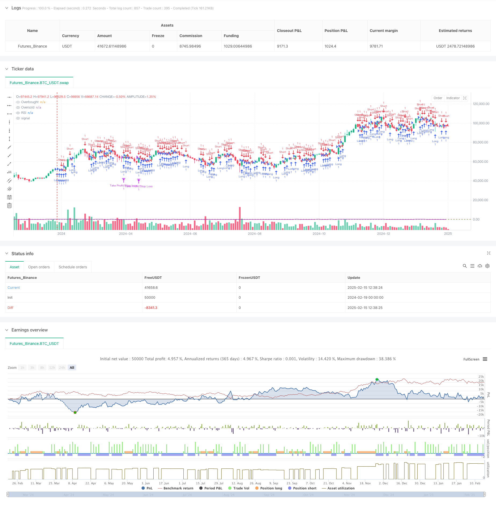

> Name

Dynamic-RSI-Breakout-Trend-Following-Trading-Strategy-with-Risk-Reward-Ratio-Optimization-System
> Author

ChaoZhang

> Strategy Description



[trans]
#### Overview
This strategy is a trend-following trading system based on RSI (relative strength index) breakthroughs, combined with a risk-to-return ratio of 1:4 to optimize trading performance. The strategy realizes systematic transaction management by identifying the trend line formed by the highs and lows of the RSI indicator, entering the market when it breaks through, and using a fixed risk-return ratio to set stop-loss and take-profit positions.
#### Strategy Principle
The core logic of the strategy is based on the following key elements:
1. RSI trend line breakthrough signal: The system forms a dynamic trend line by tracking the local highs and lows of RSI. Open long when the RSI breaks through the high trend line, and open short when it breaks through the low trend line.
2. Identification of entry opportunities: Use the RSI value comparison of three K lines to confirm local highs and lows and improve the accuracy of trend lines.
3. Risk management mechanism: Use the lowest price of the previous K line as the long stop loss, and the highest price as the short stop loss to ensure clear risk control.
4. Income optimization design: Use a risk-to-return ratio of 1:4 to set a profit-taking position to pursue greater profit margins while controlling risks.
#### Strategic Advantages
1. Systematic decision-making: avoid subjective bias through programmed RSI trend line identification and breakthrough judgment.
2. Strict risk control: use recent price fluctuations to set stop losses and control the maximum risk for each transaction.
3. Profit-loss ratio optimization: The fixed 1:4 risk-return ratio setting improves the expected return of the strategy.
4. Trend tracking characteristics: It can effectively capture medium and long-term trends and improve profit opportunities.
5. Strong adaptability: can be applied to different markets and time periods.
#### Strategy Risk
1. Risk of false breakthrough: A false breakthrough may occur after RSI breaks through, leading to stop-loss exit.
2. The take-profit distance is too far: The risk-benefit ratio of 1:4 may make it difficult to reach the take-profit position.
3. Volatile market performance: False signals may be frequently triggered in a volatile market.
4. Impact of slippage: In markets with poor liquidity, the actual stop loss price may be different from expected.
#### Strategy optimization direction
1. Dynamic risk-return ratio: The risk-return ratio can be dynamically adjusted according to market volatility.
2. Trend confirmation: Add trend confirmation indicators, such as moving average or ATR indicator.
3. Position management: Introduce a position management system based on volatility.
4. Exit optimization: Add a trailing stop loss or batch take profit mechanism.
5. Time filtering: Add trading time period filtering to avoid periods of low liquidity.
#### Summary
This strategy builds a complete trend following trading system by combining RSI breakouts and a fixed risk-reward ratio. The advantage of the strategy lies in the systematic decision-making process and strict risk control, but in practical application, attention needs to be paid to the impact of false breakthroughs and the market environment. Through the suggested optimization direction, the strategy is expected to achieve more stable performance in different market environments. ||
#### Overview
This strategy is a trend-following trading system based on RSI (Relative Strength Index) breakouts, combined with a 1:4 risk-reward ratio to optimize trading performance. The strategy identifies trend lines formed by RSI highs and lows, enters positions on breakouts, and uses a fixed risk-reward ratio for stop-loss and take-profit levels, implementing systematic trade management.

#### Strategy Principle
The core logic of the strategy is based on several key elements:
1. RSI Trendline Breakout Signals: The system tracks local RSI highs and lows to form dynamic trend lines. Long positions are opened when RSI breaks above the high trendline, and short positions when it breaks below the low trendline.
2. Entry Timing Identification: Uses RSI values comparison across three candles to confirm local highs and lows, improving trendline accuracy.
3. Risk Management Mechanism: Uses the previous candle's low as stop-loss for long positions and high for short positions, ensuring clear risk control.
4. Profit Optimization Design: Implements a 1:4 risk-reward ratio for take-profit levels, pursuing larger profit potential while controlling risk.

#### Strategy Advantages
1. Systematic Decision-Making: Avoids subjective bias through programmatic RSI trendline identification and breakout detection.
2. Strict Risk Control: Uses recent price volatility for stop-loss placement, controlling maximum risk per trade.
3. Profit Ratio Optimization: Fixed 1:4 risk-reward ratio setup improves strategy's expected return.
4. Trend Following Characteristics: Effectively captures medium to long-term trends, increasing profit opportunities.
5. High Adaptability: Applicable to different markets and timeframes.

#### Strategy Risks
1. False Breakout Risk: RSI breakouts may result in false signals leading to stop-loss exits.
2. Distant Take-Profit Levels: 1:4 risk-reward ratio may set take-profit targets that are difficult to reach.
3. Ranging Market Performance: May trigger frequent false signals in sideways markets.
4. Slippage Impact: Actual stop-loss prices may differ from expected in less liquid markets.

#### Strategy Optimization Directions
1. Dynamic Risk-Reward Ratio: Adjust risk-reward ratio based on market volatility.
2. Trend Confirmation: Add trend confirmation indicators like moving averages or ATR.
3. Position Management: Introduce volatility-based position sizing system.
4. Exit Optimization: Implement trailing stops or scaled take-profit mechanisms.
5. Time Filtering: Add trading session filters to avoid low liquidity periods.

#### Summary
The strategy builds a complete trend-following trading system by combining RSI breakouts with fixed risk-reward ratios. Its strengths lie in systematic decision-making processes and strict risk control, but practical application requires attention to false breakouts and market conditions. Through the suggested optimization directions, the strategy has the potential to achieve more stable performance across different market environments.[/trans]


> Source (PineScript)

``` pinescript
/*backtest
start: 2024-02-19 00:00:00
end: 2025-02-17 08:00:00
period: 2d
basePeriod: 2d
exchanges: [{"eid":"Futures_Binance","currency":"BTC_USDT"}]
*/

// This Pine Script™ code is subject to the terms of the Mozilla Public License 2.0 at https://mozilla.org/MPL/2.0/
// © Sunnysun7771

//@version=6
//@version=5
strategy("RSI Breakout Strategy with RR 1:4", overlay=true)

// Input parameters
rsi_length = input(14, title="RSI Length")
rsi_overbought = input(70, title="RSI Overbought Level")
rsi_oversold = input(30, title="RSI Oversold Level")

// Calculate RSI
rsi_value = ta.rsi(close, rsi_length)

// Identify previous RSI highs and lows
var float rsi_prev_high = na
var float rsi_prev_low = na

// Update previous RSI high
if (rsi_value > rsi_value[1] and rsi_value[1] < rsi_value[2])
    rsi_prev_high := rsi_value[1]

// Update previous RSI low
if (rsi_value < rsi_value[1] and rsi_value[1] > rsi_value[2])
    rsi_prev_low := rsi_value[1]

// Conditions for entering a long position
long_condition = rsi_value > rsi_prev_high and not na(rsi_prev_high)

// Conditions for entering a short position
short_condition = rsi_value < rsi_prev_low and not na(rsi_prev_low)

// Calculate stop loss and take profit for long positions
long_stop_loss = low[1]  // Previous candle's low
long_take_profit = close + (4 * (close - long_stop_loss))  // RR 1:4

// Enter long position if all conditions are met
if (long_condition)
    strategy.entry("Long", strategy.long)
    strategy.exit("Take Profit/Stop Loss", from_entry="Long", stop=long_stop_loss, limit=long_take_profit)

// Calculate stop loss and take profit for short positions
short_stop_loss = high[1]  // Previous candle's high
short_take_profit = close - (4 * (short_stop_loss - close))  // RR 1:4

// Enter short position if all conditions are met
if (short_condition)
    strategy.entry("Short", strategy.short)
    strategy.exit("Take Profit/Stop Loss", from_entry="Short", stop=short_stop_loss, limit=short_take_profit)

// Plotting RSI for visualization
hline(rsi_overbought, "Overbought", color=color.red)
hline(rsi_oversold, "Oversold", color=color.green)
plot(rsi_value, color=color.purple, title="RSI")
```

> Detail

https://www.fmz.com/strategy/482644

> Last Modified

2025-02-19 14:59:26
