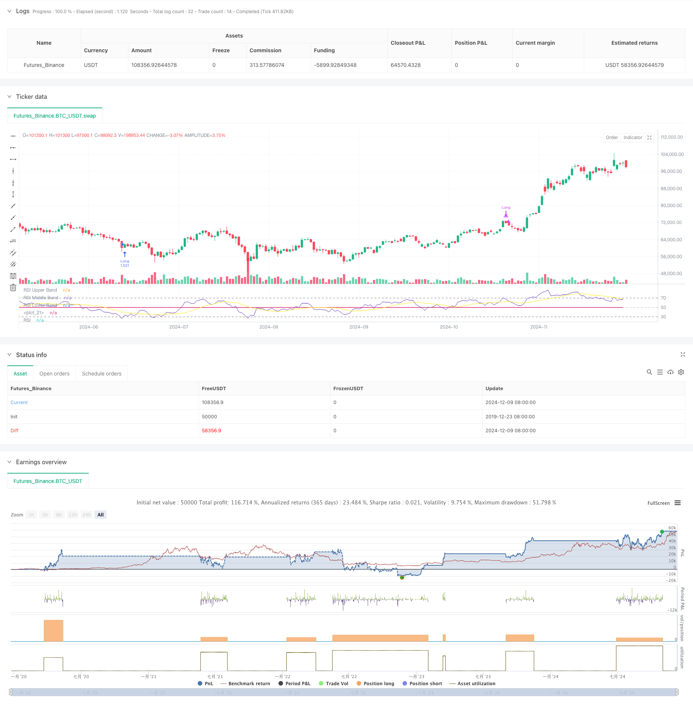

> Name

Dynamic RSI Smart Timing Swing Trading Strategy-Dynamic-RSI-Smart-Timing-Swing-Trading-Strategy
> Author

ChaoZhang

> Strategy Description



[trans]
#### Overview
This strategy is an intelligent trading system based on the Relative Strength Index (RSI), which combines a variety of moving averages and Bollinger Band indicators to conduct timed trading by identifying overbought and oversold areas in the market. The core of the strategy is to use RSI's breakthrough and fallback signals and cooperate with different types of moving averages to confirm trends and achieve efficient band operations. This strategy has strong adaptability and can adjust parameters according to different market environments.
#### Strategy Principle
The strategy uses the 14-period RSI as the core indicator and generates trading signals by monitoring the intersection of the two key levels of RSI and 30/70. When the RSI breaks above 30, the system judges that the market has turned from oversold to bullish, triggering a long signal; when the RSI falls below 70, the system judges that the market has turned from overbought to bearish, triggering a closing signal. At the same time, the strategy introduces a variety of moving averages (SMA, EMA, SMMA, WMA, VWMA) and Bollinger Bands as auxiliary indicators to confirm the trend direction and market volatility.
#### Strategic Advantages
1. Clear signals: The overbought and oversold signals of the RSI indicator are clear and easy to understand and execute.
2. Risk controllable: Effectively control risks by setting clear entry and exit conditions
3. Strong flexibility: supports multiple moving average types and can be flexibly switched according to market conditions
4. Adaptability: Bollinger Bands can automatically adjust the trading range according to market fluctuations
5. Easy to optimize: The parameters are highly adjustable and easy to optimize according to different market conditions.
#### Strategy Risk
1. Risk of market shock: Frequent false breakthrough signals may occur in a volatile market.
2. Risk of trend continuation: closing positions too early may miss the big trend
3. Parameter sensitivity: Different parameter settings may lead to large differences in strategy performance
4. Impact of slippage: You may face larger slippage in markets with poor liquidity
5. Systemic risk: Continuous stop losses may occur under extreme market conditions
#### Strategy optimization direction
1. Introduce trading volume indicators: confirm the validity of signals through trading volume
2. Add trend filter: combined with longer period trend judgment to avoid counter-trend trading
3. Optimize the stop loss mechanism: introduce dynamic stop loss to improve capital utilization efficiency
4. Improve position management: dynamically adjust position size according to market volatility
5. Add market sentiment indicators: combine with other technical indicators to improve signal accuracy
#### Summary
This strategy uses the RSI indicator to capture overbought and oversold opportunities in the market, and combines a variety of technical indicators to confirm signals, which has good practicality and reliability. The strategy design fully considers risk control and can adapt to different market environments through parameter optimization and indicator combination. It is recommended that traders conduct sufficient backtest verification before using it in real trading, and adjust parameter settings according to specific market characteristics. ||
#### Overview
This strategy is an intelligent trading system based on the Relative Strength Index (RSI), combining various moving averages and Bollinger Bands to time trades by identifying market overbought and oversold zones. The core mechanism relies on RSI breakthrough and pullback signals, complemented by different types of moving averages for trend confirmation, enabling efficient swing trading. The strategy demonstrates strong adaptability and can be adjusted for different market conditions.

#### Strategy Principle
The strategy utilizes a 14-period RSI as its core indicator, generating trading signals by monitoring RSI crossovers with key levels at 30 and 70. A long signal is triggered when RSI breaks above 30, indicating a shift from oversold to bullish conditions. A closing signal is generated when RSI falls below 70, suggesting a transition from overbought to bearish conditions. The strategy incorporates various moving averages (SMA, EMA, SMMA, WMA, VWMA) and Bollinger Bands as supplementary indicators for trend confirmation and volatility assessment.

#### Strategy Advantages
1. Clear Signals: RSI's overbought and oversold signals are distinct and easy to understand
2. Risk Control: Well-defined entry and exit conditions enable effective risk management
3. Flexibility: Support for multiple moving average types allows adaptation to market conditions
4. Adaptability: Bollinger Bands automatically adjust trading ranges based on market volatility
5. Easy Optimization: Strong parameter customization facilitates market-specific adjustments

#### Strategy Risks
1. Sideways Market Risk: May generate frequent false breakout signals in ranging markets
2. Trend Continuation Risk: Early exits might miss extended trend movements
3. Parameter Sensitivity: Different parameter settings can significantly affect strategy performance
4. Slippage Impact: Less liquid markets may experience significant slippage
5. Systematic Risk: Consecutive losses possible in extreme market conditions

#### Strategy Optimization Directions
1. Volume Integration: Confirm signal validity through volume analysis
2. Trend Filter Addition: Incorporate longer-term trend analysis to avoid counter-trend trades
3. Stop-Loss Enhancement: Implement dynamic stop-loss mechanisms for improved capital efficiency
4. Position Management Refinement: Adjust position sizes based on market volatility
5. Market Sentiment Integration: Combine additional technical indicators to improve signal accuracy

#### Summary
This strategy captures market overbought and oversold opportunities through the RSI indicator, confirming signals with multiple technical indicators, demonstrating strong practicality and reliability. The strategy design thoroughly considers risk control and can adapt to various market environments through parameter optimization and indicator combinations. Traders are advised to conduct comprehensive backtesting before live implementation and adjust parameters according to specific market characteristics.[/trans]


> Source (PineScript)

``` pinescript
/*backtest
start: 2019-12-23 08:00:00
end: 2024-12-10 08:00:00
period: 1d
basePeriod: 1d
exchanges: [{"eid":"Futures_Binance","currency":"BTC_USDT"}]
*/

//@version=5
strategy(title="Demo GPT - Relative Strength Index", shorttitle="RSI Strategy", overlay=false, default_qty_type=strategy.percent_of_equity, default_qty_value=100, commission_value=0.1, slippage=3)

// Inputs
rsiLengthInput = input.int(14, minval=1, title="RSI Length", group="RSI Settings")
rsiSourceInput = input.source(close, "Source", group="RSI Settings")
calculateDivergence = input.bool(false, title="Calculate Divergence", group="RSI Settings",  tooltip="Calculating divergences is needed in order for divergence alerts to fire.")

// RSI Calculation
change = ta.change(rsiSourceInput)
up = ta.rma(math.max(change, 0), rsiLengthInput)
down = ta.rma(-math.min(change, 0), rsiLengthInput)
rsi = down == 0 ? 100 : up == 0 ? 0 : 100 - (100 / (1 + up / down))

// RSI Plots
rsiPlot = plot(rsi, "RSI", color=#7E57C2)
rsiUpperBand = hline(70, "RSI Upper Band", color=#787B86)
midline = hline(50, "RSI Middle Band", color=color.new(#787B86, 50))
rsiLowerBand = hline(30, "RSI Lower Band", color=#787B86)
fill(rsiUpperBand, rsiLowerBand, color=color.rgb(126, 87, 194, 90), title="RSI Background Fill")
plot(50, color=na, editable=false, display=display.none)

// Moving Averages
maTypeInput = input.string("SMA", "Type", options=["None", "SMA", "SMA + Bollinger Bands", "EMA", "SMMA (RMA)", "WMA", "VWMA"], group="Moving Average")
maLengthInput = input.int(14, "Length", group="Moving Average")
bbMultInput = input.float(2.0, "BB StdDev", minval=0.001, maxval=50, step=0.5, group="Moving Average")
enableMA = maTypeInput != "None"
isBB = maTypeInput == "SMA + Bollinger Bands"

// MA Calculation
ma(source, length, MAtype) =>
    switch MAtype
        "SMA" => ta.sma(source, length)
        "SMA + Bollinger Bands" => ta.sma(source, length)
        "EMA" => ta.ema(source, length)
        "SMMA (RMA)" => ta.rma(source, length)
        "WMA" => ta.wma(source, length)
        "VWMA" => ta.vwma(source, length)

smoothingMA = enableMA ? ma(rsi, maLengthInput, maTypeInput) : na
smoothingStDev = isBB ? ta.stdev(rsi, maLengthInput) * bbMultInput : na
plot(smoothingMA, "RSI-based MA", color=color.yellow, display=enableMA ? display.all : display.none)
bbUpperBand = plot(smoothingMA + smoothingStDev, title="Upper Bollinger Band", color=color.green, display=isBB ? display.all : display.none)
bbLowerBand = plot(smoothingMA - smoothingStDev, title="Lower Bollinger Band", color=color.green, display=isBB ? display.all : display.none)
fill(bbUpperBand, bbLowerBand, color=isBB ? color.new(color.green, 90) : na, title="Bollinger Bands Background Fill", display=isBB ? display.all : display.none)

// Trade Logic
longCondition = ta.crossover(rsi, 30)
exitCondition = ta.crossunder(rsi, 70)

// Start Date & End Date
startDate = input(timestamp("2018-01-01 00:00"), "Start Date", group="Date Range")
endDate = input(timestamp("2069-12-31 23:59"), "End Date", group="Date Range")
inDateRange = true

// Execute Trades
if (longCondition and inDateRange)
    strategy.entry("Long", strategy.long)

if (exitCondition and inDateRange)
    strategy.close("Long")

```

> Detail

https://www.fmz.com/strategy/474815

> Last Modified

2024-12-12 11:32:55
