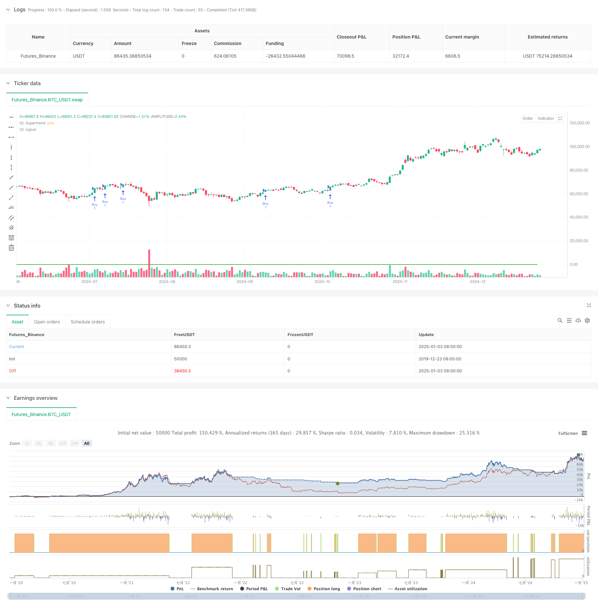

> Name

Dynamic Trend Following Arbitrage Strategy Based on Relative Strength and RSI-Dynamic-Trend-Following-Strategy-Based-on-Relative-Strength-and-RSI
> Author

ChaoZhang

> Strategy Description



[trans]
#### Overview
This strategy is a trend following strategy based on Supertrend, Relative Strength (RS) and Relative Strength Index (RSI). By comprehensively using these three technical indicators, enter the market when the market trend is clear, and set dynamic stop loss to control risks. The strategy mainly obtains profits by capturing the strong upward trend of prices, and combines it with the RSI indicator to confirm the continuity of the trend.
#### Strategy Principle
The strategy uses a triple filtering mechanism to determine trading signals:
1. Use the Supertrend indicator to determine the overall trend. When the indicator direction is upward, it is considered an upward trend.
2. Calculate the relative strength (RS) value, which is a percentage of the position of the current price in the high and low range of the past 55 periods, and is used to measure price strength.
3. Use the RSI indicator to determine overbought and oversold conditions, and confirm upward momentum when the RSI is greater than 60.
The above three conditions must be met at the same time to enter the market, that is, Supertrend is upward, RS is greater than 0, and RSI is greater than the threshold.
The exit condition is when any two indicators send out reverse signals. Also set a fixed stop loss of 1.1% to manage risk.
#### Strategic Advantages
1. Confirm multiple technical indicators to improve the reliability of trading signals.
2. The Supertrend indicator can effectively track trends and reduce false signals that shock the market.
3. The RS indicator can capture changes in price strength in a timely manner and improve the accuracy of entry timing.
4. The RSI indicator can confirm trend momentum and avoid entering the market when the trend fails.
5. Fixed stop loss and set clear risk control boundaries.
6. The exit conditions are flexible and can respond to market changes in a timely manner.
#### Strategy Risk
1. Multiple indicators may cause signal lag and miss the best entry opportunity.
2. Frequent transactions may occur in volatile markets, increasing transaction costs.
3. Fixed stops may be easily triggered in volatile markets.
4. When the trend is strong, the RSI indicator may remain in the overbought zone for a long time and miss trading opportunities.
5. Multiple exit conditions can lead to premature exit from a profitable trend.
#### Strategy optimization direction
1. Introduce adaptive indicator parameters and dynamically adjust them according to market volatility.
2. Add trading volume indicators as auxiliary confirmation to improve signal reliability.
3. Design a dynamic stop loss mechanism and adjust the stop loss range according to the ATR value.
4. To optimize the RSI threshold, consider using different thresholds under different market conditions.
5. Increase trend strength filtering and reduce trading frequency in weak trend markets.
6. Consider adding a moving take-profit mechanism to better lock in profits.
#### Summary
This strategy builds a relatively complete trend following trading system by comprehensively using three technical indicators: Supertrend, RS and RSI. The main advantage of the strategy is that the multiple signal confirmation mechanism improves the reliability of transactions, while the clear risk control mechanism also provides protection for transactions. Although there are some potential risks, the stability and profitability of the strategy can be further improved through the suggested optimization directions. This strategy is particularly suitable for use in market environments with clear trends and can be used as a basic strategic framework for mid- to long-term transactions. ||
#### Overview
This strategy is a trend following system based on Supertrend, Relative Strength (RS), and Relative Strength Index (RSI). By integrating these three technical indicators, it enters trades when market trends are clear and implements dynamic stop-loss for risk management. The strategy primarily aims to capture strong upward price trends while using RSI to confirm trend sustainability.

#### Strategy Principles
The strategy employs a triple-filtering mechanism for trade signals:
1. Uses Supertrend indicator to determine overall trend, considering uptrend when indicator direction is up.
2. Calculates Relative Strength (RS) value, percentizing price position within high-low range over 55 periods to measure price strength.
3. Utilizes RSI to judge overbought/oversold conditions, confirming upward momentum when RSI exceeds 60.
Trade entry requires simultaneous satisfaction of all three conditions: Supertrend up, RS above 0, and RSI above threshold.
Exit occurs when any two indicators signal reversal. A fixed 1.1% stop-loss manages risk.

#### Strategy Advantages
1. Multiple technical indicators confirmation enhances signal reliability.
2. Supertrend effectively tracks trends, reducing false signals in choppy markets.
3. RS indicator captures price strength changes promptly, improving entry timing accuracy.
4. RSI confirms trend momentum, avoiding entries during trend exhaustion.
5. Fixed stop-loss sets clear risk control boundaries.
6. Flexible exit conditions respond promptly to market changes.

#### Strategy Risks
1. Multiple indicators may cause signal lag, missing optimal entry points.
2. Frequent trading in choppy markets may increase transaction costs.
3. Fixed stop-loss might trigger easily in highly volatile markets.
4. RSI may remain in overbought territory during strong trends, missing opportunities.
5. Multiple exit conditions might lead to premature profit taking.

#### Strategy Optimization Directions
1. Introduce adaptive indicator parameters adjusting dynamically with market volatility.
2. Add volume indicators for signal confirmation enhancement.
3. Design dynamic stop-loss mechanism based on ATR values.
4. Optimize RSI thresholds, considering different values for various market conditions.
5. Add trend strength filtering to reduce trading frequency in weak trends.
6. Consider implementing trailing stop-profit mechanism for better profit retention.

#### Summary
The strategy constructs a relatively comprehensive trend following trading system by integrating Supertrend, RS, and RSI indicators. Its main advantage lies in the multiple signal confirmation mechanism enhancing trade reliability, while clear risk control mechanisms provide trading safeguards. Despite potential risks, suggested optimization directions can further improve strategy stability and profitability. This strategy is particularly suitable for markets with clear trends and can serve as a foundation framework for medium to long-term trading.[/trans]


> Source (PineScript)

``` pinescript
/*backtest
start: 2019-12-23 08:00:00
end: 2025-01-04 08:00:00
period: 1d
basePeriod: 1d
exchanges: [{"eid":"Futures_Binance","currency":"BTC_USDT"}]
*/

//@version=5
strategy("Sanjay RS&RSI Strategy V3 for nifty 15min, SL-1.3", overlay=true)

// Inputs
atrLength = input.int(10, title="ATR Length")
factor = input.float(3.0, title="ATR Multiplier")
rsPeriod = input.int(55, title="RS Period")
rsiPeriod = input.int(14, title="RSI Period")
rsiThreshold = input.float(60, title="RSI Threshold")
stopLossPercent = input.float(2.0, title="Stop Loss (%)", step=0.1) // Adjustable Stop Loss in Percentage

// Supertrend Calculation
[supertrendDirection, supertrend] = ta.supertrend(factor, atrLength)

// RS Calculation
rs = (close - ta.lowest(close, rsPeriod)) / (ta.highest(close, rsPeriod) - ta.lowest(close, rsPeriod)) * 100

// RSI Calculation
rsi = ta.rsi(close, rsiPeriod)

// Entry Conditions
buyCondition = (supertrendDirection > 0) and (rs > 0) and (rsi > rsiThreshold)

// Exit Conditions
exitCondition1 = (supertrendDirection < 0)
exitCondition2 = (rs <= 0)
exitCondition3 = (rsi < rsiThreshold)
exitCondition = (exitCondition1 and exitCondition2) or (exitCondition1 and exitCondition3) or (exitCondition2 and exitCondition3)

// Plot Supertrend
plot(supertrend, title="Supertrend", color=supertrendDirection > 0 ? color.green : color.red, linewidth=2)

// Strategy Entry
if (buyCondition)
    strategy.entry("Buy", strategy.long)

// Add Stop Loss with strategy.exit
stopLossLevel = strategy.position_avg_price * (1 - stopLossPercent / 100)
strategy.exit("SL Exit", from_entry="Buy", stop=stopLossLevel)

// Strategy Exit (Additional Conditions)
if (exitCondition)
    strategy.close("Buy")

```

> Detail

https://www.fmz.com/strategy/477564

> Last Modified

2025-01-06 14:02:13
