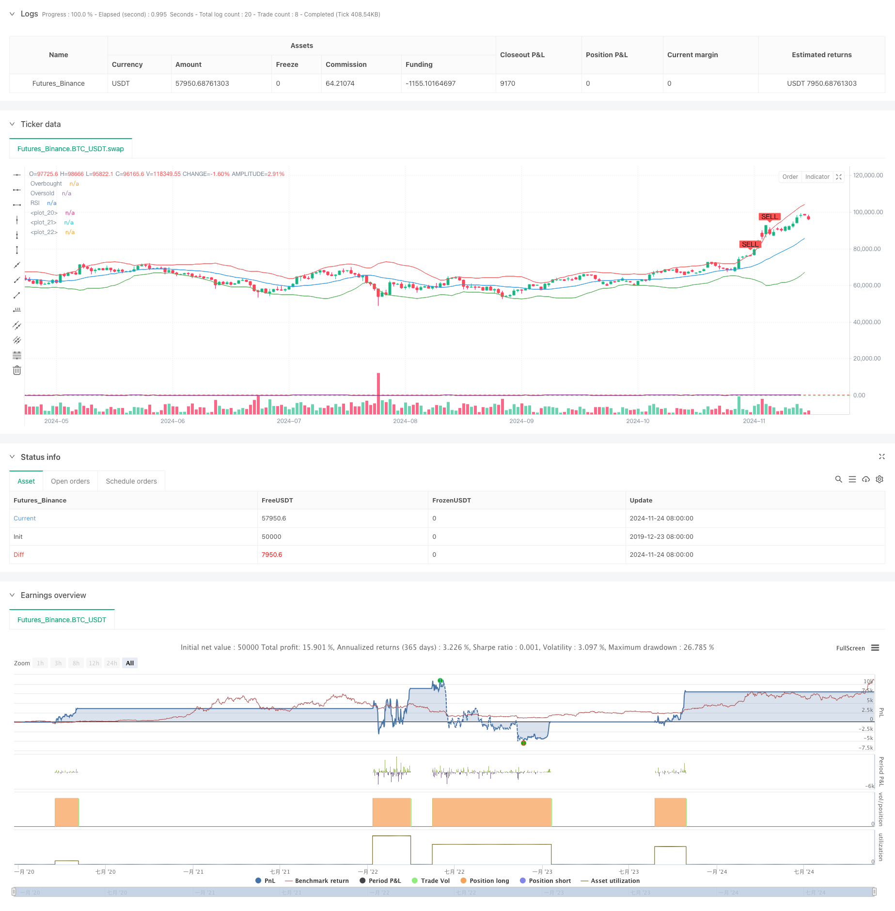

> Name

Dynamic-Trend-Quantitative-Strategy-Based-on-Bollinger-Bands-and-RSI-Cross
> Author

ChaoZhang

> Strategy Description



[trans]
#### Overview
This strategy is a quantitative trading strategy that combines Bollinger Bands and the Relative Strength Index (RSI). The strategy captures the turning point of the market through the combination of the price breakthrough of Bollinger Bands and the overbought and oversold area of ​​RSI, thereby realizing the grasp of the trend. The strategy uses the 20-period Bollinger Band and 14-period RSI indicators. When the price breaks through the lower Bollinger Band and the RSI is in the oversold area, enter the market and close the position when the price breaks through the upper Bollinger Band and the RSI is in the overbought area.
#### Strategy Principle
The core logic of the strategy is based on the synergy of two technical indicators. The Bollinger Bands are composed of the middle rail (20-period simple moving average) and the upper and lower rails (the middle rail ±2 times the standard deviation), which can reflect the fluctuation range and trend of prices. The RSI indicator determines the overbought and oversold status of the market by calculating the relative strength of price changes. When the price touches the lower Bollinger Band and the RSI is below 30, it indicates that the market may be oversold and there is an opportunity for a rebound; when the price touches the upper Bollinger Band and the RSI is above 70, it indicates that the market may be overbought and there is a risk of a correction. Through cross-validation of these two indicators, the reliability of the signal can be improved.
#### Strategic Advantages
1. High signal reliability: Through the double confirmation of Bollinger Bands and RSI, false signals can be effectively filtered
2. Reasonable risk control: Using the statistical characteristics of Bollinger Bands and the overbought and oversold judgment of RSI, adaptive risk control is achieved
3. Scientific parameter selection: using widely verified classic parameter settings, with good universality
4. The calculation method is simple: the strategy logic is clear, the calculation complexity is low, and it is easy to execute in real time.
5. Accurate trend grasp: able to better capture the main turning points of the market
#### Strategy Risk
1. Volatile market risk: Frequent trading signals may occur under sideways and volatile market conditions, increasing transaction costs.
2. Trend continuation risk: Early closing of positions under a strong trend may miss subsequent market trends
3. Signal lag: Technical indicators themselves have a certain lag and may miss the best entry opportunity.
4. False breakthrough risk: A short-term price breakout of the Bollinger Bands may form a false signal.
5. Parameter sensitivity: The selection of indicator parameters has a great impact on strategy performance
#### Strategy optimization direction
1. Introduce trend filter: It can increase the trend judgment of moving average and reduce the false signals that shock the market.
2. Dynamically adjust parameters: adaptively adjust the standard deviation multiple of Bollinger Bands according to market volatility
3. Optimize stop loss settings: add trailing stop loss function to improve the ability to grasp the trend
4. Increase trading volume confirmation: combine with trading volume indicators to improve signal reliability
5. Improve the position closing mechanism: design more flexible position closing conditions to avoid premature exit
#### Summary
This is a quantitative strategy that innovatively combines the classic technical indicators Bollinger Bands and RSI. Through the complementary role of the two indicators, it not only ensures the reliability of the signal, but also achieves an effective grasp of the market turning point. The strategy logic is clear, the calculation is simple, and it has strong practicality. Although there are some inherent risks, the stability and profitability of the strategy can be further improved through the suggested optimization directions. This strategy is suitable for application in markets with obvious trends and can provide investors with objective trading signal references. ||
#### Overview
This strategy is a quantitative trading approach that combines Bollinger Bands and Relative Strength Index (RSI). It captures market turning points by coordinating price breakouts of Bollinger Bands with RSI overbought/oversold zones. The strategy employs 20-period Bollinger Bands and 14-period RSI, entering long positions when price breaks below the lower band while RSI is in oversold territory, and closing positions when price breaks above the upper band while RSI is in overbought territory.

#### Strategy Principles
The core logic is based on the synergy of two technical indicators. Bollinger Bands consist of a middle band (20-period SMA) and upper/lower bands (middle ±2 standard deviations), reflecting price volatility and trends. RSI calculates the relative strength of price movements to identify overbought/oversold conditions. When price touches the lower band and RSI is below 30, it suggests potential oversold conditions and rebound opportunities. When price touches the upper band and RSI is above 70, it indicates potential overbought conditions and correction risks. Cross-validation of these indicators enhances signal reliability.

#### Strategy Advantages
1. High signal reliability: Dual confirmation through Bollinger Bands and RSI effectively filters false signals
2. Rational risk control: Achieves adaptive risk management using Bollinger Bands' statistical properties and RSI's overbought/oversold judgments
3. Scientific parameter selection: Uses widely validated classic parameters with good universality
4. Simple calculation method: Clear strategy logic with low computational complexity for real-time execution
5. Accurate trend capture: Effectively identifies major market turning points

#### Strategy Risks
1. Oscillation market risk: May generate frequent trading signals in sideways markets, increasing transaction costs
2. Trend continuation risk: Early position closing might miss subsequent market movements
3. Signal lag: Technical indicators have inherent lag, potentially missing optimal entry points
4. False breakout risk: Short-term price breakouts of Bollinger Bands may generate false signals
5. Parameter sensitivity: Strategy performance is significantly influenced by indicator parameter selection

#### Strategy Optimization Directions
1. Introduce trend filters: Add moving average trend judgment to reduce false signals in oscillating markets
2. Dynamic parameter adjustment: Adaptively adjust Bollinger Bands' standard deviation multiplier based on market volatility
3. Optimize stop-loss settings: Add trailing stop-loss functionality to improve trend capture
4. Add volume confirmation: Incorporate volume indicators to enhance signal reliability
5. Improve exit mechanism: Design more flexible exit conditions to avoid premature position closing

#### Summary
This is a quantitative strategy that innovatively combines classic technical indicators Bollinger Bands and RSI. Through the complementary effects of these indicators, it ensures signal reliability while effectively capturing market turning points. The strategy features clear logic and simple calculations with strong practicality. Although there are some inherent risks, the suggested optimization directions can further enhance strategy stability and profitability. This strategy is suitable for trending markets and can provide objective trading signal references for investors.[/trans]


> Source (PineScript)

``` pinescript
/*backtest
start: 2019-12-23 08:00:00
end: 2024-11-25 08:00:00
period: 1d
basePeriod: 1d
exchanges: [{"eid":"Futures_Binance","currency":"BTC_USDT"}]
*/

//@version=5
strategy("Bollinger Bands + RSI Strategy", overlay=true)

// Bollinger Bands
length = 20
src = close
mult = 2.0
basis = ta.sma(src, length)
dev = mult * ta.stdev(src, length)
upper = basis + dev
lower = basis - dev

// RSI
rsiLength = 14
rsiOverbought = 70
rsiOversold = 30
rsiValue = ta.rsi(src, rsiLength)

// Plot Bollinger Bands
plot(basis, color=color.blue, linewidth=1)
plot(upper, color=color.red, linewidth=1)
plot(lower, color=color.green, linewidth=1)

// Plot Buy/Sell signals
buySignal = ta.crossover(close, lower) and rsiValue < rsiOversold
sellSignal = ta.crossunder(close, upper) and rsiValue > rsiOverbought

plotshape(series=buySignal, title="Buy Signal", location=location.belowbar, color=color.green, style=shape.labelup, text="BUY")
plotshape(series=sellSignal, title="Sell Signal", location=location.abovebar, color=color.red, style=shape.labeldown, text="SELL")

// Strategy Entry/Exit
if (buySignal)
    strategy.entry("Buy", strategy.long)
if (sellSignal)
    strategy.close("Buy")

// RSI Plot (not on overlay, for reference)
rsiPlot = plot(rsiValue, title="RSI", color=color.purple, linewidth=1, offset=-1)
hline(rsiOverbought, "Overbought", color=color.red)
hline(rsiOversold, "Oversold", color=color.green)
```

> Detail

https://www.fmz.com/strategy/473128

> Last Modified

2024-11-27 14:49:42
