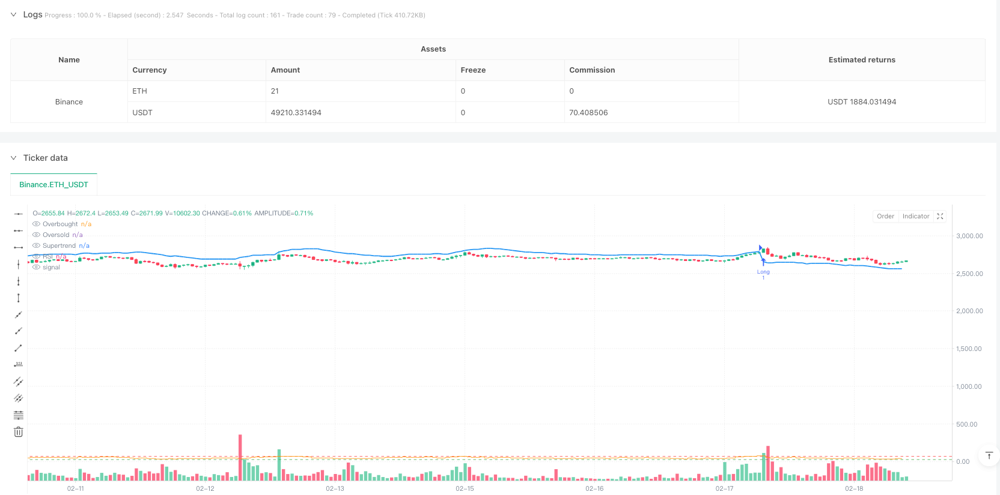
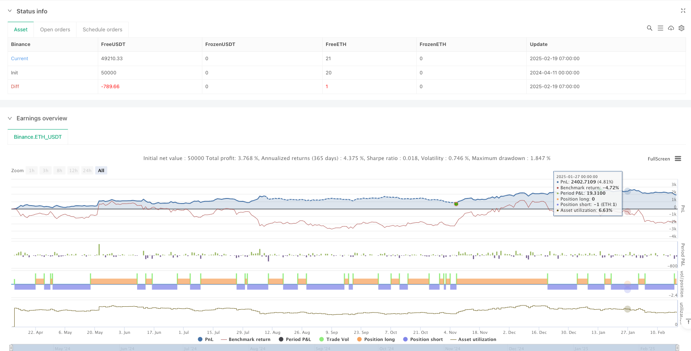

> Name

Dynamic Trend RSI Crossover Momentum Enhancement Strategy-Dynamic-Trend-RSI-Crossover-Momentum-Enhancement-Strategy
> Author

ianzeng123

> Strategy Description





[trans]
#### Overview
This strategy is a trading system that combines the Supertrend trend indicator and the RSI (relative strength indicator). The strategy combines trend following with momentum indicators to trade when the market trend is clear and has good momentum. The system uses ATR (Average True Range) to calculate dynamic support and resistance levels, combined with RSI overbought and oversold signals to determine entry timing.
#### Strategy Principle
The core logic of the strategy is based on the following key elements:
1. The Supertrend indicator is calculated based on ATR and SMA and is used to determine the current market trend. The upper band is calculated by multiplying the factor by ATR and adding it to the SMA, while the lower band is obtained by subtracting the same value from the SMA.
2. A buy signal is generated when the price is above the Supertrend line, and a sell signal is generated when it is below.
3. The RSI indicator is used to confirm market momentum and filter trading signals by setting overbought and oversold levels (default 70 and 30).
4. The long conditions require Supertrend to display a buy signal and RSI to break upward from the oversold area.
5. Short selling conditions require Supertrend to display a sell signal and RSI to break downward from the overbought area.
6. Set the stop loss at the Supertrend line and the take profit at 2 times the ATR distance.
#### Strategic Advantages
1. Combine trend and momentum double confirmation to reduce the probability of false signals.
2. Use dynamic ATR to set stop loss and take profit to adapt to different market environments.
3. The Supertrend indicator can effectively track the trend and reduce invalid transactions in the volatile range.
4. RSI filters help avoid entering into overextended markets.
5. The system has a complete risk management mechanism, including dynamic stop loss and fixed risk ratio take profit.
#### Strategy Risk
1. Frequent false breakthrough signals may occur in sideways markets.
2. RSI’s overbought and oversold limits may not be flexible enough under certain market conditions.
3. Fixed ATR multiples may not be suitable for all market environments.
4. In a rapidly reversing market, the stop loss position may be far away, resulting in larger losses.
5. Strategies may face slippage risk during periods of high volatility.
#### Strategy optimization direction
1. Introduce an adaptive RSI threshold and dynamically adjust overbought and oversold levels according to market volatility.
2. Add a transaction volume confirmation mechanism to improve signal reliability.
3. Realize dynamic adjustment of ATR multiples to make stop-loss and take-profit more in line with current market characteristics.
4. Add a time filter to avoid trading during highly volatile time periods such as market opening and closing.
5. Consider adding a market environment filter with different parameter settings for different trend strengths.
#### Summary
This strategy builds a complete trend following trading system by combining Supertrend and RSI indicators. The strategy performs better in markets with clear trends and controls risks through dynamic stop loss and reasonable take profit settings. Although there are some limitations, the stability and adaptability of the strategy can be further improved through the proposed optimization direction. The strategy is suitable for tracking mid- to long-term trends and can better control risks while maintaining a certain level of profitability.
||

#### Overview
This strategy combines the Supertrend trend indicator with the RSI (Relative Strength Index) to create a trading system. It integrates trend following with momentum indicators to execute trades when market trends are clear and show good momentum. The system uses ATR (Average True Range) to calculate dynamic support and resistance levels, combined with RSI overbought/oversold signals for entry timing.

#### Strategy Principles
The core logic of the strategy is based on several key elements:
1. Supertrend indicator calculation is based on ATR and SMA, used to determine current market trend. The upper band is calculated by adding the factor multiplied by ATR to SMA, while the lower band subtracts the same value.
2. Buy signals are generated when price is above the Supertrend line, sell signals when below.
3. RSI indicator confirms market momentum, filtering trade signals through overbought/oversold levels (default 70 and 30).
4. Long conditions require Supertrend showing buy signal and RSI crossing upward from oversold zone.
5. Short conditions need Supertrend showing sell signal and RSI crossing downward from overbought zone.
6. Stop loss is set at the Supertrend line, take profit at 2x ATR distance.

#### Strategy Advantages
1. Combines trend and momentum confirmation, reducing false signal probability.
2. Uses dynamic ATR for stop loss and take profit, adapting to different market conditions.
3. Supertrend indicator effectively tracks trends, reducing ineffective trades in ranging markets.
4. RSI filter helps avoid entries in overextended markets.
5. System includes comprehensive risk management with dynamic stops and fixed risk ratio profit targets.

#### Strategy Risks
1. May generate frequent false breakout signals in sideways markets.
2. RSI overbought/oversold boundaries may not be flexible enough for certain market conditions.
3. Fixed ATR multiplier may not suit all market environments.
4. Stop loss placement may result in larger losses during quick reversals.
5. Strategy may face slippage risks during high volatility periods.

#### Strategy Optimization Directions
1. Introduce adaptive RSI thresholds, dynamically adjusting overbought/oversold levels based on market volatility.
2. Add volume confirmation mechanism to improve signal reliability.
3. Implement dynamic ATR multiplier adjustment to better match current market characteristics.
4. Include time filters to avoid trading during high volatility periods like market open/close.
5. Consider adding market environment filters, using different parameters based on trend strength.

#### Summary
The strategy combines Supertrend and RSI indicators to build a complete trend-following trading system. It performs well in trending markets, controlling risk through dynamic stops and reasonable profit targets. While it has some limitations, the proposed optimization directions can further enhance strategy stability and adaptability. The strategy is suitable for tracking medium to long-term trends while maintaining profitability with good risk control.[/trans]


> Source (PineScript)

``` pinescript
/*backtest
start: 2024-04-11 00:00:00
end: 2025-02-19 08:00:00
period: 1h
basePeriod: 1h
exchanges: [{"eid":"Binance","currency":"ETH_USDT"}]
*/

//@version=5
strategy("Supertrend + RSI Strategy", overlay=true)

// Input Parameters
atrLength = input.int(10, title="ATR Length", minval=1)
factor = input.float(3.0, title="Supertrend Factor", step=0.1)
rsiLength = input.int(14, title="RSI Length", minval=1)
rsiOverbought = input.int(70, title="RSI Overbought Level")
rsiOversold = input.int(30, title="RSI Oversold Level")

// Supertrend Calculation
atr = ta.atr(atrLength)
upperBand = ta.sma(close, atrLength) + (factor * atr)
lowerBand = ta.sma(close, atrLength) - (factor * atr)
supertrend = 0.0
supertrend := close > nz(supertrend[1], close) ? lowerBand : upperBand
supertrendSignal = close > supertrend ? "Buy" : "Sell"

// RSI Calculation
rsi = ta.rsi(close, rsiLength)

// Trading Logic
longCondition = (supertrendSignal == "Buy") and (rsi > rsiOversold)
shortCondition = (supertrendSignal == "Sell") and (rsi < rsiOverbought)

// Entry and Exit Conditions
if longCondition
    strategy.entry("Long", strategy.long)

if shortCondition
    strategy.entry("Short", strategy.short)

// Plot Supertrend
plot(supertrend, title="Supertrend", color=color.new(color.blue, 0), linewidth=2, style=plot.style_line)

// Plot RSI Levels
hline(rsiOverbought, "Overbought", color=color.red)
hline(rsiOversold, "Oversold", color=color.green)
plot(rsi, title="RSI", color=color.orange, style=plot.style_stepline)

// Alerts
alertcondition(longCondition, title="Buy Alert", message="Supertrend + RSI Buy Signal")
alertcondition(shortCondition, title="Sell Alert", message="Supertrend + RSI Sell Signal")

```

> Detail

https://www.fmz.com/strategy/483027

> Last Modified

2025-02-21 10:00:53
