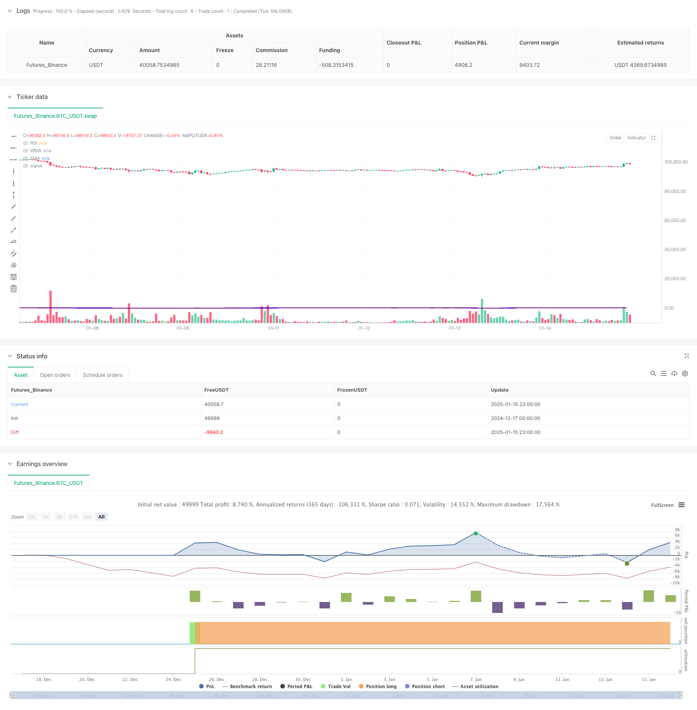

> Name

Dynamic trend determination RSI indicator crossing strategy-Dynamic-Trend-RSI-Indicator-Crossing-Strategy
> Author

ChaoZhang

> Strategy Description



[trans]
#### Overview
This strategy is a trend following trading system that combines the Relative Strength Index (RSI), Weighted Moving Average (WMA), and Exponential Moving Average (EMA). The strategy identifies market trend changes by monitoring the position of the RSI value and the intersection of the WMA and EMA, thereby generating buy and sell signals. This combination method not only takes into account the overbought and oversold status of the market, but also combines the trend judgment of moving averages of different periods, which can more accurately capture market turning points.
#### Strategy Principle
The core logic of the strategy is based on the following key elements:
1. Use the 14-period RSI indicator to calculate the overbought and oversold status of the market.
2. Calculate the 45-period WMA and the 89-period EMA
3. Admission conditions:
   - Long signal: when RSI is below 50 and WMA crosses EMA upwards
   - Short signal: when RSI is above 50 and WMA crosses EMA downwards
4. The strategy uses the ta.rma function to smooth the RSI calculation and improve the stability of the signal.
5. Use the plotshape function to mark buying and selling points on the chart to facilitate traders’ intuitive judgment.
#### Strategic Advantages
1. High signal reliability: Combining momentum indicator (RSI) and trend indicator (moving average), it can effectively filter out false signals
2. Excellent risk control: The 50 dividing line of RSI is used as trend confirmation, which reduces the risk of counter-trend trading.
3. Strong adaptability: The strategy parameters are highly adjustable and can adapt to different market environments.
4. Clear visualization: trading signals are clearly visible on the chart, which facilitates analysis and backtesting
5. High calculation efficiency: using the native functions of Pine Script, the calculation speed is fast
#### Strategy Risk
1. Volatile market risk: Frequent false signals may occur in a volatile market.
2. Lagging risk: The moving average itself has a certain lag, which may lead to a slight delay in entry timing.
3. Parameter sensitivity: Parameter settings in different time periods will significantly affect strategy performance
4. Market environment dependence: The strategy performs better in markets with obvious trends, but may not be effective in volatile markets.
5. Retracement risk: You may face a larger retracement during periods of severe volatility.
#### Strategy optimization direction
1. Introduce volatility filtering: ATR indicator can be added to filter trading signals in low volatility environment
2. Optimize stop loss settings: It is recommended to dynamically set stop loss positions based on ATR to improve risk management capabilities.
3. Increase trend strength confirmation: trend strength indicators such as ADX can be introduced to improve the reliability of trading signals
4. Improve position management: It is recommended to dynamically adjust the position size based on volatility and risk measurement
5. Add market environment judgment: you can add market environment classification logic and use different parameter settings under different market conditions.
#### Summary
This strategy builds a relatively complete trend tracking system by combining three technical indicators: RSI, WMA and EMA. The core advantage of the strategy lies in the reliability of its signals and risk control capabilities, but at the same time, attention must be paid to the risk of false signals in volatile markets. By adding optimization measures such as volatility filtering and trend strength confirmation, the stability and profitability of the strategy can be further improved. Overall, this is a trading strategy with practical value, especially suitable for medium and long-term trend traders. ||
#### Overview
This strategy is a trend-following trading system that combines the Relative Strength Index (RSI), Weighted Moving Average (WMA), and Exponential Moving Average (EMA). The strategy identifies market trend changes by monitoring RSI levels and the crossover between WMA and EMA to generate buy and sell signals. This combination method considers both market overbought/oversold conditions and trend judgments from different period moving averages, enabling more accurate capture of market turning points.

#### Strategy Principles
The core logic of the strategy is based on the following key elements:
1. Uses 14-period RSI to calculate market overbought/oversold conditions
2. Calculates 45-period WMA and 89-period EMA
3. Entry conditions:
   - Long signal: When RSI is below 50 and WMA crosses above EMA
   - Short signal: When RSI is above 50 and WMA crosses below EMA
4. Strategy uses ta.rma function to smooth RSI calculation, improving signal stability
5. Uses plotshape functionality to mark buy/sell points on the chart for intuitive judgment

#### Strategy Advantages
1. High signal reliability: Combines momentum indicator (RSI) and trend indicators (moving averages) to effectively filter false signals
2. Excellent risk control: Uses RSI 50 level as trend confirmation to reduce counter-trend trading risk
3. Strong adaptability: Strategy parameters are highly adjustable to adapt to different market conditions
4. Clear visualization: Trading signals are clearly visible on the chart for analysis and backtesting
5. High computational efficiency: Uses Pine Script native functions for fast calculation

#### Strategy Risks
1. Choppy market risk: May generate frequent false signals in sideways markets
2. Lag risk: Moving averages inherently have some lag, which may lead to slightly delayed entry timing
3. Parameter sensitivity: Different timeframe parameter settings significantly affect strategy performance
4. Market environment dependence: Strategy performs better in trending markets but may underperform in ranging markets
5. Drawdown risk: May face significant drawdowns during periods of intense volatility

#### Strategy Optimization Directions
1. Incorporate volatility filtering: Add ATR indicator to filter trading signals in low volatility environments
2. Optimize stop-loss settings: Suggest setting dynamic stop-loss levels based on ATR to improve risk management
3. Add trend strength confirmation: Consider incorporating ADX or other trend strength indicators to improve signal reliability
4. Enhance position management: Suggest dynamic position sizing based on volatility and risk metrics
5. Add market environment classification: Consider adding market condition logic to use different parameter settings in different market conditions

#### Summary
The strategy constructs a relatively complete trend-following system by combining RSI, WMA, and EMA indicators. Its core advantages lie in signal reliability and risk control capabilities, while attention must be paid to false signal risks in ranging markets. Through optimization measures such as adding volatility filtering and trend strength confirmation, the strategy's stability and profitability can be further improved. Overall, this is a trading strategy with practical value, particularly suitable for medium to long-term trend traders.[/trans]


> Source (PineScript)

``` pinescript
/*backtest
start: 2024-12-17 00:00:00
end: 2025-01-16 00:00:00
period: 1h
basePeriod: 1h
exchanges: [{"eid":"Futures_Binance","currency":"BTC_USDT","balance":49999}]
*/

//@version=5
strategy(title="RSI + WMA + EMA Strategy", shorttitle="RSI Strategy", overlay=true)

// RSI Settings
rsiLengthInput = input.int(14, minval=1, title="RSI Length", group="RSI Settings")
rsiSourceInput = input.source(close, "Source", group="RSI Settings")

// WMA and EMA Settings
wmaLengthInput = input.int(45, minval=1, title="WMA Length", group="WMA Settings")
wmaColorInput = input.color(color.blue, title="WMA Color", group="WMA Settings")
emaLengthInput = input.int(89, minval=1, title="EMA Length", group="EMA Settings")
emaColorInput = input.color(color.purple, title="EMA Color", group="EMA Settings")

// RSI Calculation
change = ta.change(rsiSourceInput)
up = ta.rma(math.max(change, 0), rsiLengthInput)
down = ta.rma(-math.min(change, 0), rsiLengthInput)
rsi = down == 0 ? 100 : up == 0 ? 0 : 100 - (100 / (1 + up / down))

// WMA and EMA Calculation
wma = ta.wma(rsi, wmaLengthInput)
ema = ta.ema(rsi, emaLengthInput)

// Plot RSI, WMA, and EMA
plot(rsi, "RSI", color=#7E57C2)
plot(wma, title="WMA", color=wmaColorInput, linewidth=2)
plot(ema, title="EMA", color=emaColorInput, linewidth=2)

// Entry and Exit Conditions
longCondition = ta.crossover(wma, ema) and rsi < 50
shortCondition = ta.crossunder(wma, ema) and rsi > 50

if (longCondition)
    strategy.entry("Long", strategy.long)

if (shortCondition)
    strategy.entry("Short", strategy.short)

// Optional: Plot Buy/Sell Signals on Chart
plotshape(series=longCondition, style=shape.labelup, location=location.belowbar, color=color.green, size=size.small, title="Buy Signal")
plotshape(series=shortCondition, style=shape.labeldown, location=location.abovebar, color=color.red, size=size.small, title="Sell Signal")

```

> Detail

https://www.fmz.com/strategy/478733

> Last Modified

2025-01-17 16:12:08
