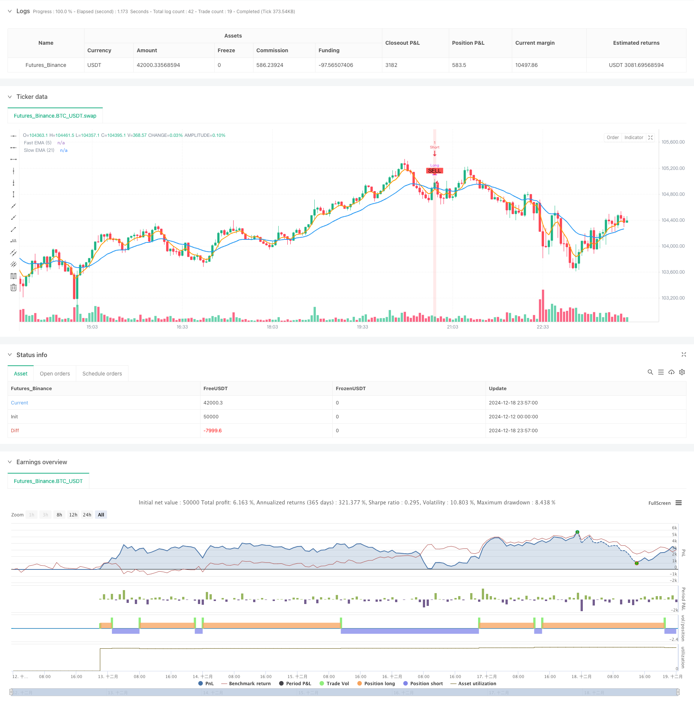

> Name

Multi-Indicator Volatility Trading RSI-EMA-ATR Strategy-Multi-Indicator-Volatility-Trading-RSI-EMA-ATR-Strategy
> Author

ChaoZhang

> Strategy Description



[trans]
#### Overview
This strategy is a short-term trading system that combines multiple technical indicators, mainly based on RSI (relative strength index), EMA (exponential moving average) and ATR (average true range) to generate trading signals. Through the combined use of multiple indicators, the strategy not only considers price trends but also pays attention to market volatility. At the same time, it can also selectively add volume filtering, thus building a relatively complete trading decision-making system.
#### Strategy Principle
The strategy uses a triple filtering mechanism to ensure the reliability of trading signals:
1. Trend judgment: Determine the current market trend through the cross relationship between fast EMA (5 periods) and slow EMA (21 periods)
2. Overbought and Oversold: Use the RSI indicator (14 period) to perform reversal trades in the range of 45 and 55
3. Volatility confirmation: Use the ATR indicator to determine whether the current market fluctuation is suitable for trading. The ATR value is required to be greater than 0.8 times its moving average.
4. You can optionally add trading volume filter conditions, requiring trading volume to be greater than its 20-period moving average.
The specific triggering conditions for long and short signals are as follows:
- Long conditions: Fast EMA is above slow EMA + RSI is below 45 + Volatility conditions are met
- Short selling conditions: Fast EMA is below slow EMA + RSI is above 55 + Volatility conditions are met
#### Strategic Advantages
1. The multiple confirmation mechanism improves the reliability of transactions and effectively reduces false signals.
2. It combines the characteristics of trend following and reversal trading, which can not only capture the general trend, but also make profits within the range.
3. Control volatility through the ATR indicator to avoid frequent trading when the volatility is too small.
4. The strategy has good adaptability and can be adapted to different market environments through parameter adjustment.
5. Optional volume filtering mechanism further improves trading accuracy
#### Strategy Risk
1. Slippage may occur in violently volatile markets, affecting actual execution results.
2. Parameter optimization has the risk of over-fitting and needs to be fully tested in different time periods.
3. Fast EMA and slow EMA may produce too many crossovers in sideways markets, leading to false signals.
4. The fixed threshold of RSI may need to be adjusted in different market environments.
5. Transaction costs (0.1% handling fee) may significantly affect strategy returns
#### Strategy optimization direction
1. You can consider adding more time frame confirmations, such as adding trend filtering in a larger time period.
2. It is recommended to add a stop-loss and stop-profit mechanism, which can be set based on the multiple of ATR.
3. Consider joining a position management system to dynamically adjust the position size based on volatility
4. Market sentiment indicators can be introduced to adjust trading parameters in extreme market environments.
5. It is recommended to add trading time filtering to avoid trading during low liquidity periods
#### Summary
This is a well-designed multi-indicator trading system that improves the reliability of transactions through multiple confirmation mechanisms. The core advantage of the strategy is that it combines trend and volatility analysis while taking into account multiple dimensions of the market. Although there is some room for optimization, overall it is a trading strategy worthy of further improvement and practice. ||
#### Overview
This strategy is a short-term trading system that combines multiple technical indicators, primarily based on RSI (Relative Strength Index), EMA (Exponential Moving Average), and ATR (Average True Range) for generating trading signals. By utilizing multiple indicators together, the strategy considers both price trends and market volatility, with an optional volume filter, creating a relatively complete trading decision system.

#### Strategy Principle
The strategy employs a triple-filtering mechanism to ensure signal reliability:
1. Trend Determination: Using the crossover relationship between Fast EMA (5-period) and Slow EMA (21-period) to judge current market trend
2. Overbought/Oversold: Using RSI indicator (14-period) for reversal trading within the 45-55 range
3. Volatility Confirmation: Using ATR indicator to determine if current market volatility is suitable for trading, requiring ATR value to be greater than 0.8 times its moving average
4. Optional volume filter requiring volume to be above its 20-period moving average

Specific trigger conditions for long and short signals are:
- Long Condition: Fast EMA above Slow EMA + RSI below 45 + Volatility condition met
- Short Condition: Fast EMA below Slow EMA + RSI above 55 + Volatility condition met

#### Strategy Advantages
1. Multiple confirmation mechanisms improve trading reliability and effectively reduce false signals
2. Combines trend-following and reversal trading characteristics, capable of capturing major trends while profiting from range-bound markets
3. Controls volatility through ATR indicator, avoiding frequent trading during low volatility periods
4. Strategy has good adaptability and can be adjusted through parameters to suit different market environments
5. Optional volume filtering mechanism further improves trading accuracy

#### Strategy Risks
1. May experience slippage in volatile markets, affecting actual execution
2. Parameter optimization faces overfitting risk, requiring thorough testing across different time periods
3. Fast and Slow EMAs may produce excessive crossovers in sideways markets, leading to false signals
4. Fixed RSI thresholds may need adjustment in different market environments
5. Trading costs (0.1% commission) may significantly impact strategy returns

#### Strategy Optimization Directions
1. Consider adding multiple timeframe confirmation, such as adding trend filters on larger timeframes
2. Recommend adding stop-loss and take-profit mechanisms, potentially based on ATR multiples
3. Consider implementing a position management system with dynamic position sizing based on volatility
4. Consider introducing market sentiment indicators to adjust trading parameters in extreme market conditions
5. Recommend adding trading time filters to avoid trading during low liquidity periods

#### Summary
This is a well-designed multi-indicator trading system that improves trading reliability through multiple confirmation mechanisms. The strategy's core advantage lies in combining trend and volatility analysis while considering multiple market dimensions. While there is room for optimization, it is overall a trading strategy worth further refinement and implementation.[/trans]


> Source (PineScript)

``` pinescript
/*backtest
start: 2024-12-12 00:00:00
end: 2024-12-19 00:00:00
period: 3m
basePeriod: 3m
exchanges: [{"eid":"Futures_Binance","currency":"BTC_USDT"}]
*/

//@version=5
strategy("Scalp Master BTCUSDT Strategy", overlay=true, max_labels_count=500, initial_capital=10000, commission_type=strategy.commission.percent, commission_value=0.1)

//=== Kullanıcı Parametreleri ===
rsi_length         = input.int(14, "RSI Length")
rsi_lower_band     = input.float(45, "RSI Lower Band")  
rsi_upper_band     = input.float(55, "RSI Upper Band")  

ema_fast_length    = input.int(5, "Fast EMA")
ema_slow_length    = input.int(21, "Slow EMA")

atr_period         = input.int(14, "ATR Period")
atr_mult           = input.float(0.8, "ATR Multiplier")

volume_filter      = input.bool(false, "Enable Volume Filter")
volume_period      = input.int(20, "Volume SMA Period")
volume_mult        = input.float(1.0, "Volume Threshold Multiplier")

//=== Hesaplamalar ===

// RSI Hesabı
rsi_val = ta.rsi(close, rsi_length)

// ATR Tabanlı Volatilite Kontrolü
atr_val = ta.atr(atr_period)
volatility_ok = atr_val > (ta.sma(atr_val, atr_period) * atr_mult)

// EMA Trend
ema_fast_val = ta.ema(close, ema_fast_length)
ema_slow_val = ta.ema(close, ema_slow_length)
trend_up = ema_fast_val > ema_slow_val
trend_down = ema_fast_val < ema_slow_val

// Hacim Filtresi
volume_sma = ta.sma(volume, volume_period)
high_volume = volume > (volume_sma * volume_mult)

// Sinyal Koşulları (Aynı Alarm Koşulları)
long_signal = trend_up and rsi_val < rsi_lower_band and volatility_ok and (volume_filter ? high_volume : true)
short_signal = trend_down and rsi_val > rsi_upper_band and volatility_ok and (volume_filter ? high_volume : true)

//=== Strateji Mantığı ===
// Basit bir yaklaşım: 
// - Long sinyali gelince önce Short pozisyonu kapat, sonra Long pozisyona gir.
// - Short sinyali gelince önce Long pozisyonu kapat, sonra Short pozisyona gir.

if (long_signal)
    strategy.close("Short") // Eğer varsa Short pozisyonu kapat
    strategy.entry("Long", strategy.long)
    
if (short_signal)
    strategy.close("Long") // Eğer varsa Long pozisyonu kapat
    strategy.entry("Short", strategy.short)

// EMA Çizimleri
plot(ema_fast_val, title="Fast EMA (5)", color=color.new(color.orange, 0), linewidth=2)
plot(ema_slow_val, title="Slow EMA (21)", color=color.new(color.blue, 0), linewidth=2)

// Sinyal İşaretleri
plotshape(long_signal, title="BUY Signal", location=location.belowbar, 
     color=color.new(color.green, 0), style=shape.labelup, text="BUY")

plotshape(short_signal, title="SELL Signal", location=location.abovebar, 
     color=color.new(color.red, 0), style=shape.labeldown, text="SELL")

// Arka plan renklendirmesi
bgcolor(long_signal ? color.new(color.green, 85) : short_signal ? color.new(color.red, 85) : na)

// Alarm Koşulları (İndikatör ile aynı koşullar)
alertcondition(long_signal, title="Buy Alert", message="BTCUSDT Scalp Master: Buy Signal Triggered")
alertcondition(short_signal, title="Sell Alert", message="BTCUSDT Scalp Master: Sell Alert Triggered")

```

> Detail

https://www.fmz.com/strategy/475601

> Last Modified

2024-12-20 14:47:41
