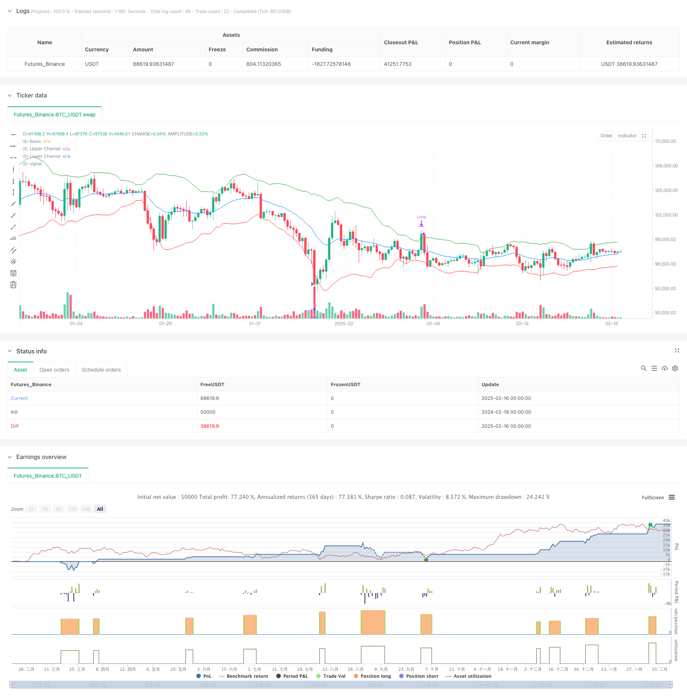

> Name

Gaussian-Channel-and-Stochastic-RSI-Based-Market-Trend-Capture-Strategy
> Author

ChaoZhang

> Strategy Description



[trans]
#### Overview
This strategy is a technical analysis trading system that combines Gaussian Channel and Stochastic RSI. Gaussian channels form upper and lower channels by multiplying the exponential moving average (EMA) and the standard deviation, providing dynamic support and resistance levels for price fluctuations. Stochastic RSI smoothes the RSI values ​​to generate %K and %D lines to confirm potential reversal signals. This strategy is suitable for any time period and provides traders with a systematic trading method.
#### Strategy Principle
The core logic of the strategy is based on the following key elements:
1. Construction of Gaussian channel: Use EMA as the baseline and create upper and lower channel bands through the standard deviation multiplier. The upper channel serves as a dynamic resistance level, and the lower channel serves as a dynamic support level.
2. Stochastic RSI signal: After calculating the traditional RSI, perform stochastic indicator processing on it to generate smoother %K and %D lines.
3. Trading signal generation: When the price falls below the lower channel and the %K line of the stochastic RSI crosses the %D line, the system generates a long signal; when the price breaks through the upper channel, the position is closed and exited.
4. Time filter: The strategy includes customizable date range filters, allowing backtesting or trading within a specific time period.
#### Strategic Advantages
1. Multiple confirmation mechanism: It combines two trading ideas: trend following (Gaussian channel) and momentum reversal (stochastic RSI) to improve signal reliability.
2. Dynamic adaptability: Gaussian channel will automatically adjust the bandwidth according to market volatility, and has good market adaptability.
3. Risk management integration: Using the upper channel breakthrough as a stop loss signal, a risk control mechanism is built in.
4. Parameter flexibility: All key parameters can be optimized and adjusted according to different market conditions.
#### Strategy Risk
1. False breakthrough risk: In a volatile market, more false signals may be generated, leading to frequent trading.
2. Lagging risk: Due to the use of multiple moving average calculations, the signal may lag behind.
3. Parameter sensitivity: Strategy performance is more sensitive to parameter selection, and different market environments may require different parameter settings.
4. Dependence on the market environment: In a market where the trend is not obvious, the strategy effect may not be ideal.
#### Strategy optimization direction
1. Signal filtering enhancement: You can add auxiliary indicators such as trading volume and volatility to improve signal quality.
2. Dynamic parameter optimization: Introduce an adaptive parameter adjustment mechanism to dynamically adjust parameters according to market conditions.
3. Improved stop loss mechanism: trailing stop loss or dynamic stop loss based on volatility can be added.
4. Market environment identification: Add a market environment judgment module to adopt different strategy parameters or trading rules under different market conditions.
#### Summary
This strategy combines Gaussian channel and stochastic RSI to build a trading system with both trend following and reversal capturing capabilities. The strategy design takes into account multiple technical analysis dimensions and has a good theoretical foundation and practical feasibility. Through reasonable parameter optimization and risk management, this strategy is expected to achieve stable performance in various market environments. However, users need to fully understand the advantages and limitations of the strategy and make targeted adjustments according to the actual trading environment. ||
#### Overview
This strategy is a technical analysis trading system that combines the Gaussian Channel and Stochastic RSI indicators. The Gaussian Channel forms dynamic support and resistance levels using exponential moving average (EMA) and standard deviation multiplier, while the Stochastic RSI smooths RSI values to generate %K and %D lines for confirming potential reversals. The strategy is applicable to any timeframe and provides traders with a systematic trading approach.

#### Strategy Principles
The core logic of the strategy is based on the following key elements:
1. Gaussian Channel Construction: Uses EMA as the basis line and creates upper and lower channels through standard deviation multiplier. The upper channel serves as dynamic resistance while the lower channel acts as dynamic support.
2. Stochastic RSI Signals: Calculates traditional RSI and then applies stochastic treatment to generate smoother %K and %D lines.
3. Trade Signal Generation: Long signals are generated when price breaks below the lower channel and the Stochastic RSI %K line crosses above the %D line; positions are closed when price breaks above the upper channel.
4. Time Filtering: Strategy includes a customizable date range filter allowing backtesting or trading within specific time periods.

#### Strategy Advantages
1. Multiple Confirmation Mechanism: Combines trend following (Gaussian Channel) and momentum reversal (Stochastic RSI) approaches to improve signal reliability.
2. Dynamic Adaptability: Gaussian Channel automatically adjusts bandwidth based on market volatility, providing good market adaptability.
3. Integrated Risk Management: Incorporates risk control mechanism using upper channel breakout as stop-loss signal.
4. Parameter Flexibility: All key parameters can be optimized and adjusted for different market conditions.

#### Strategy Risks
1. False Breakout Risk: May generate numerous false signals in ranging markets, leading to frequent trading.
2. Lag Risk: Signal generation may experience some delay due to multiple moving average calculations.
3. Parameter Sensitivity: Strategy performance is sensitive to parameter selection, different market environments may require different parameter settings.
4. Market Environment Dependency: Strategy may not perform ideally in markets without clear trends.

#### Strategy Optimization Directions
1. Signal Filter Enhancement: Can add volume, volatility, and other auxiliary indicators to improve signal quality.
2. Dynamic Parameter Optimization: Introduce adaptive parameter adjustment mechanism to dynamically adjust parameters based on market conditions.
3. Stop-Loss Mechanism Improvement: Can add trailing stop-loss or volatility-based dynamic stop-loss.
4. Market Environment Recognition: Add market condition identification module to adopt different strategy parameters or trading rules under different market conditions.

#### Summary
This strategy builds a trading system combining trend following and reversal capture capabilities through the integration of Gaussian Channel and Stochastic RSI. The strategy design considers multiple technical analysis dimensions, with solid theoretical foundation and practical feasibility. Through proper parameter optimization and risk management, the strategy has the potential to achieve stable performance across various market environments. However, users need to fully understand the strategy's advantages and limitations, making targeted adjustments based on actual trading conditions.[/trans]


> Source (PineScript)

``` pinescript
/*backtest
start: 2024-02-18 00:00:00
end: 2025-02-16 08:00:00
period: 3h
basePeriod: 3h
exchanges: [{"eid":"Futures_Binance","currency":"BTC_USDT"}]
*/

// This Pine Script™ code is subject to the terms of the Mozilla Public License 2.0 at https://mozilla.org/MPL/2.0/
// © fgkkaraca

//@version=5
strategy("Alienseeker GC and RSI Strategy", overlay=true, commission_type=strategy.commission.percent, commission_value=0.1, slippage=0, default_qty_type=strategy.percent_of_equity, default_qty_value=200, process_orders_on_close=true)

// Gaussian Channel Inputs
lengthGC = input.int(20, "Gaussian Channel Length", minval=1)
multiplier = input.float(2.0, "Standard Deviation Multiplier", minval=0.1)

// Calculate Gaussian Channel
basis = ta.ema(close, lengthGC)
deviation = multiplier * ta.stdev(close, lengthGC)
upperChannel = basis + deviation
lowerChannel = basis - deviation

// Plot Gaussian Channel
plot(basis, "Basis", color=color.blue)
plot(upperChannel, "Upper Channel", color=color.green)
plot(lowerChannel, "Lower Channel", color=color.red)

// Stochastic RSI Inputs
rsiLength = input.int(14, "RSI Length", minval=1)
stochLength = input.int(14, "Stochastic Length", minval=1)
smoothK = input.int(3, "Smooth K", minval=1)
smoothD = input.int(3, "Smooth D", minval=1)

// Calculate RSI
rsi = ta.rsi(close, rsiLength)

// Calculate Stochastic RSI
lowestRSI = ta.lowest(rsi, stochLength)
highestRSI = ta.highest(rsi, stochLength)
stochRSI = (rsi - lowestRSI) / (highestRSI - lowestRSI) * 100
k = ta.sma(stochRSI, smoothK)
d = ta.sma(k, smoothD)

// Trading Conditions
stochUp = k > d
priceAboveUpper = ta.crossover(close, upperChannel)
priceBelowUpper = ta.crossunder(close, lowerChannel)

// Date Range Filter
startDate = input(timestamp("2018-01-01"), "Start Date")
endDate = input(timestamp("2069-01-01"), "End Date")
timeInRange = true

// Strategy Execution
if timeInRange
    strategy.entry("Long", strategy.long, when=priceBelowUpper and stochUp)
    strategy.close("Long", when=priceAboveUpper ) 


```

> Detail

https://www.fmz.com/strategy/482471

> Last Modified

2025-02-18 15:36:16
