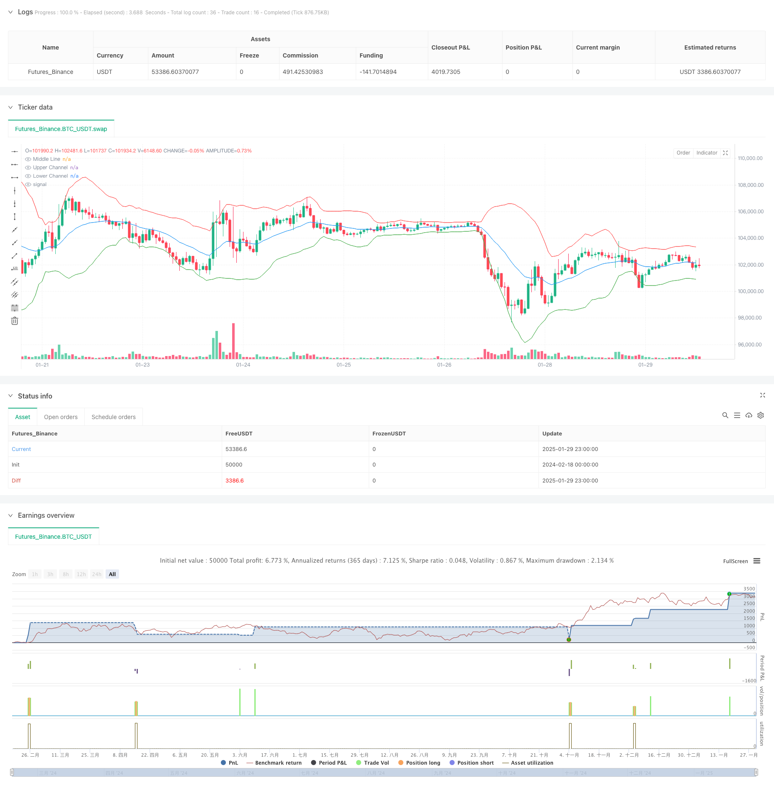

> Name

Quantitative-Trading-Strategy-Optimization-System based on Gaussian-Channel-with-Stochastic-RSI-Quantitative-Trading-Strategy-Optimization-System
> Author

ChaoZhang

> Strategy Description



[trans]
#### Overview
This strategy is a quantitative trading system based on Gaussian Channel and Stochastic RSI. By combining the mean reversion and momentum principles in technical analysis, the strategy enters the market to go long when the price touches the lower track of the channel and the stochastic RSI indicator shows an oversold signal, and exits when the price touches the upper track of the channel or the stochastic RSI indicator shows an overbought signal. This strategy is only used for long transactions, not short sales.
#### Strategy Principle
The core logic of the strategy is based on the following key calculations:
1. Construction of Gaussian channel: use EMA as the middle rail, and use 2 times the standard deviation as the channel width to calculate the upper and lower rails.
2. Calculation of random RSI: first calculate the RSI of 14 periods, then calculate the highest and lowest values ​​of RSI within 14 periods, and finally calculate the relative position of the current RSI within this range.
3. Entry signal: When the price breaks through the lower track of the channel, the stochastic RSI indicator breaks upward from below 20.
4. Exit signal: The price breaks through the upper track of the channel or the stochastic RSI indicator breaks down from above 80.
#### Strategic Advantages
1. Double confirmation mechanism: By combining price channels and momentum indicators, the impact of false signals is reduced.
2. Improved risk control: Use percentage position management, and consider transaction costs and slippage factors.
3. Mean reversion characteristics: Gaussian channel can effectively capture the price fluctuation range and improve the accuracy of trading.
4. Strong dynamic adaptability: strategy parameters can be optimized and adjusted according to different market conditions.
#### Strategy Risk
1. Trending market risk: In a strong trending market, positions may be closed prematurely, resulting in missing the big market trend.
2. Parameter sensitivity: The settings of channel multiplier and RSI parameters have a greater impact on strategy performance.
3. Market environment dependence: The strategy performs better in volatile markets, but may not perform well in unilateral markets.
4. Calculation delay risk: There is a certain delay in the calculation of technical indicators, which may affect trading timing.
#### Strategy optimization direction
1. Introducing adaptive parameters: the channel multiplier can be dynamically adjusted according to market volatility.
2. Add market environment identification: add trend strength indicators and use different parameter settings in different market environments.
3. Optimize fund management: the position ratio can be dynamically adjusted according to signal strength.
4. Improve the stop loss mechanism: add a trailing stop loss function to better protect profits.
#### Summary
This strategy builds a relatively robust trading system by combining Gaussian Channel and Stochastic RSI indicators. The advantage of the strategy lies in the double confirmation mechanism and complete risk control, but it also needs to pay attention to the adaptability of different market environments. By introducing optimization directions such as adaptive parameters and market environment identification, the stability and profitability of the strategy can be further improved. ||
#### Overview
This strategy is a quantitative trading system based on the Gaussian Channel and Stochastic RSI indicator. It combines mean reversion and momentum principles from technical analysis, entering long positions when price touches the lower channel and Stochastic RSI shows oversold signals, and exiting when price touches the upper channel or Stochastic RSI shows overbought signals. The strategy is designed for long-only trading.

#### Strategy Principles
The core logic is based on the following key calculations:
1. Gaussian Channel construction: Using EMA as the middle line, with channel width calculated as 2 times the standard deviation.
2. Stochastic RSI calculation: First calculating 14-period RSI, then computing RSI's highest and lowest values within 14 periods, finally determining current RSI's relative position within this range.
3. Entry signals: Price breaks above the lower channel while Stochastic RSI breaks above 20.
4. Exit signals: Price breaks above the upper channel or Stochastic RSI breaks below 80.

#### Strategy Advantages
1. Dual confirmation mechanism: Combining price channel and momentum indicators reduces false signals.
2. Comprehensive risk control: Implements percentage-based position management and considers transaction costs and slippage.
3. Mean reversion characteristics: Gaussian Channel effectively captures price volatility range, improving trading accuracy.
4. Strong dynamic adaptability: Strategy parameters can be optimized for different market conditions.

#### Strategy Risks
1. Trend market risk: May exit positions too early in strong trend markets, missing major moves.
2. Parameter sensitivity: Channel multiplier and RSI parameters significantly impact strategy performance.
3. Market environment dependency: Strategy performs better in ranging markets but may underperform in trending markets.
4. Calculation delay risk: Technical indicators have inherent calculation delays that may affect trading timing.

#### Strategy Optimization Directions
1. Introduce adaptive parameters: Dynamically adjust channel multiplier based on market volatility.
2. Add market environment recognition: Include trend strength indicators to use different parameter settings in different market conditions.
3. Optimize money management: Adjust position size dynamically based on signal strength.
4. Improve stop-loss mechanism: Add trailing stop-loss functionality to better protect profits.

#### Summary
The strategy combines Gaussian Channel and Stochastic RSI indicators to create a relatively robust trading system. Its strengths lie in the dual confirmation mechanism and comprehensive risk control, though attention must be paid to adaptability in different market environments. Strategy performance can be further enhanced through the introduction of adaptive parameters and market environment recognition.[/trans]


> Source (PineScript)

``` pinescript
/*backtest
start: 2024-02-18 00:00:00
end: 2025-01-30 00:00:00
period: 1h
basePeriod: 1h
exchanges: [{"eid":"Futures_Binance","currency":"BTC_USDT"}]
*/

//@version=5
strategy("Gaussian Channel with Stochastic RSI", overlay=true, initial_capital=10000, default_qty_type=strategy.percent_of_equity, default_qty_value=200, commission_type=strategy.commission.percent, commission_value=0.1, slippage=0)

// Gaussian Channel Parameters
gc_length = input.int(20, "Gaussian Channel Length", minval=1)
gc_mult = input.float(2.0, "Gaussian Channel Multiplier", minval=0.1)

middle = ta.ema(close, gc_length)
stdev = ta.stdev(close, gc_length)
upper = middle + gc_mult * stdev
lower = middle - gc_mult * stdev

// Plot Channels
plot(middle, "Middle Line", color=color.blue)
plot(upper, "Upper Channel", color=color.red)
plot(lower, "Lower Channel", color=color.green)

// Stochastic RSI Parameters
rsi_length = input.int(14, "RSI Length", minval=1)
stoch_length = input.int(14, "Stochastic Length", minval=1)
smooth_k = input.int(3, "Smooth %K", minval=1)
oversold = input.int(20, "Oversold Level", minval=0, maxval=100)
overbought = input.int(80, "Overbought Level", minval=0, maxval=100)

// Calculate Stochastic RSI
rsi = ta.rsi(close, rsi_length)
lowest_rsi = ta.lowest(rsi, stoch_length)
highest_rsi = ta.highest(rsi, stoch_length)
stoch_rsi = highest_rsi != lowest_rsi ? (rsi - lowest_rsi) / (highest_rsi - lowest_rsi) * 100 : 0
k = ta.sma(stoch_rsi, smooth_k)

// Entry/Exit Conditions
enterLong = ta.crossover(close, lower) and ta.crossover(k, oversold)
exitLong = ta.crossover(close, upper) or ta.crossunder(k, overbought)

// Strategy Execution
if (time >= timestamp(2018, 01, 01, 0, 0) and time < timestamp(2069, 01, 01, 0, 0))
    if enterLong
        strategy.entry("Long", strategy.long)
    if exitLong
        strategy.close("Long")

```

> Detail

https://www.fmz.com/strategy/482451

> Last Modified

2025-02-18 15:00:11
