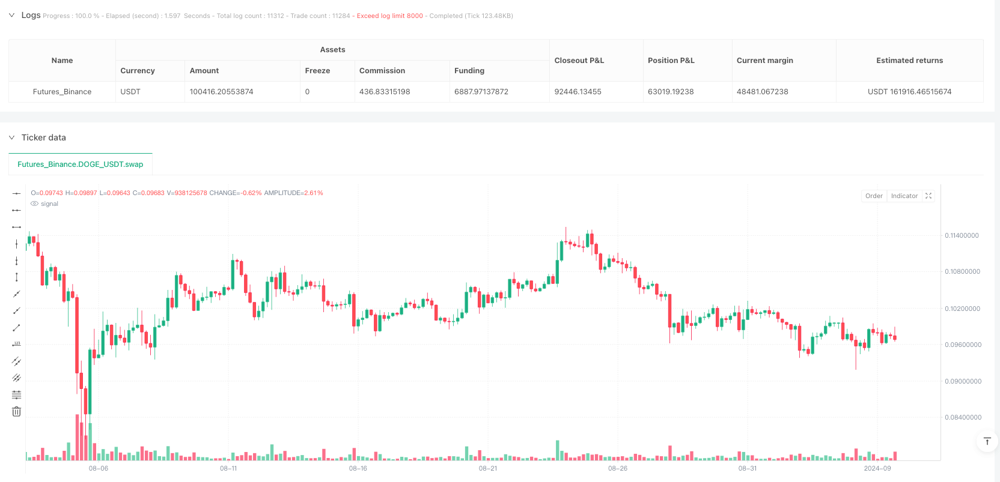
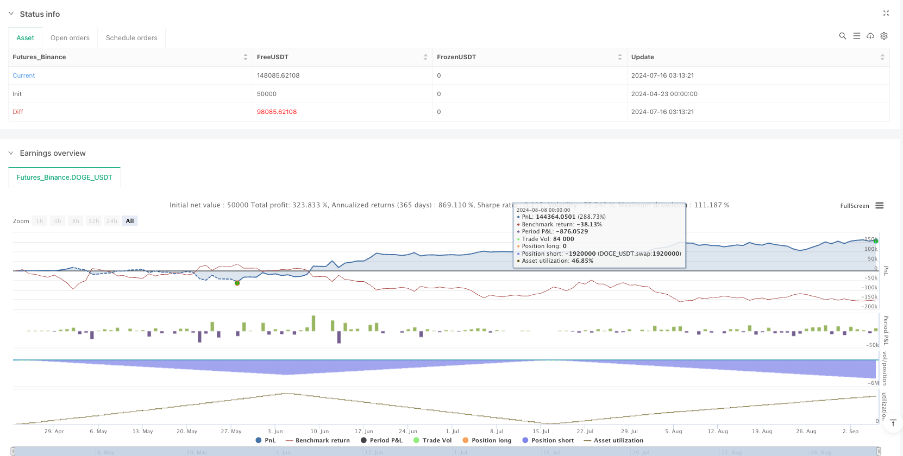

> Name

RSI-MA-Crossover-Swing-Trading-Strategy-with-Trailing-Stop-System-RSI-MA-Crossover-Swing-Trading-Strategy-with-Trailing-Stop-System
> Author

ianzeng123

> Strategy Description





[trans]
#### Overview
This strategy is a swing trading strategy based on the RSI (relative strength index) crossing its moving average (MA) and is designed for the 4-hour chart. The strategy generates trading signals through the golden cross and dead cross of RSI and MA, and combines a variety of risk management tools, including fixed stop loss/take profit, trailing stop loss and reversal exit mechanism. The strategy also sets a continuous loss limit. When there are more than two consecutive losses, trading will be suspended until reset the next day.
#### Strategy Principles
1. **Time frame restriction**: The strategy only runs on the 4-hour chart to ensure that the trading signals are consistent with the designed time period.  
2. **Indicator Calculation**: Generate signals using RSI (default length 14) and its moving average (SMA or EMA, default length 14).  
   - Golden Cross (RSI crosses above MA) triggers a buy signal (long).  
   - A dead cross (RSI crossing below the MA) triggers a sell signal (short).  
3. **Position Management**: Calculate position size based on capital allocation and current price for each trade.  
4. **Exit mechanism**:
   - **Fixed Stop Loss/Take Profit**: Set stop loss (default 1.5%) and take profit (default 2.5%) based on percentage.  
   - **Trailing Stop**: Exit is triggered when the price retraces a specified number of points (default 10 points) from the highest point.  
   - **Reversal Exit**: Close the position when the reverse signal appears.  
5. **Risk Control**:
   - Trading will be suspended after two consecutive losses, and the loss count will be reset at 9:15 every day.
#### Advantage Analysis
1. **Multi-dimensional signal verification**: Combined with double filtering of RSI and MA to reduce false signals.  
2. **Dynamic Risk Management**: Trailing stop loss locks in profits, fixed stop loss limits losses.  
3. **Strict Fund Management**: Allocate positions based on capital and avoid excessive leverage.  
4. **Disciplinary Control**: The continuous loss suspension mechanism prevents emotional trading.  
5. **Visual Markers**: Clear chart markers help quickly identify signals and exit points.
#### Risk Analysis
1. **Parameter sensitivity**: RSI and MA length have a great impact on signal quality and need to be optimized to adapt to market fluctuations.  
2. **Trend Market Performance**: In a strong trend, the RSI may be overbought/oversold for long periods of time, causing signals to lag.  
3. **Time frame restriction**: only applicable to 4-hour chart, other periods need to be re-verified.  
4. **Continuous Loss Risk**: Potential profit opportunities may be missed before the loss count is reset.  
**Solution**:
- Optimize parameters through historical backtesting.  
- Filter signals in conjunction with trend indicators such as ADX.  
- Set dynamic loss count threshold.
#### Optimization direction
1. **Multi-indicator fusion**: Introduce MACD or Bollinger Bands to enhance signal confirmation.  
2. **Dynamic parameter adjustment**: Adaptively adjust the RSI length and stop loss ratio according to market volatility.  
3. **Time frame expansion**: Test the performance of the strategy in higher or lower periods (such as daily/1 hour).  
4. **Machine Learning Optimization**: Use historical data to train models to optimize entry and exit conditions.  
5. **Fund Management Upgrade**: Dynamically adjust the capital ratio of each transaction according to the net value of the account.
#### Summary
This strategy implements swing trading through RSI and MA cross signals, combined with multi-level risk management tools, balancing profit potential and risk control. Its advantages lie in clear logic and strict discipline, but it needs further optimization to adapt to different market environments. In the future, robustness can be improved through multi-index fusion and dynamic parameters.
||  

#### Overview  
This strategy is a swing trading approach based on the crossover between RSI (Relative Strength Index) and its moving average (MA), designed for 4-hour charts. It generates trading signals through RSI-MA crossovers and incorporates multiple risk management tools, including fixed stop-loss/take-profit, trailing stop-loss, and reversal exit mechanisms. The strategy also imposes a consecutive loss limit, pausing trading after two consecutive losses until a daily reset.  

#### Strategy Logic  
1. **Timeframe Enforcement**: The strategy operates exclusively on 4-hour charts to ensure signal alignment with the designed period.  
2. **Indicator Calculation**: Uses RSI (default length 14) and its MA (SMA or EMA, default length 14) for signals.  
   - Golden cross (RSI above MA) triggers long entries.  
   - Death cross (RSI below MA) triggers short entries.  
3. **Position Sizing**: Calculates position size based on allocated capital per trade and current price.  
4. **Exit Mechanisms**:  
   - **Fixed SL/TP**: Percentage-based stop-loss (default 1.5%) and take-profit (default 2.5%).  
   - **Trailing Stop-Loss**: Exits when price retracts by a specified points (default 10) from the peak.  
   - **Reversal Exit**: Closes positions on opposing signals.  
5. **Risk Control**:  
   - Pauses trading after two consecutive losses, with a daily reset at 9:15 AM.  

#### Advantages  
1. **Multi-Layered Signal Validation**: Combines RSI and MA for reduced false signals.  
2. **Dynamic Risk Management**: Trailing stop-locks profits, fixed SL limits losses.  
3. **Strict Capital Allocation**: Position sizing prevents over-leverage.  
4. **Disciplinary Control**: Loss count mechanism avoids emotional trading.  
5. **Visual Markers**: Clear chart annotations for quick signal identification.  

#### Risks  
1. **Parameter Sensitivity**: RSI and MA lengths significantly impact signal quality.  
2. **Trend Market Performance**: RSI may lag in strong trends due to prolonged overbought/oversold conditions.  
3. **Timeframe Limitation**: Requires revalidation for other periods.  
4. **Consecutive Loss Risk**: May miss opportunities during pause periods.  
**Solutions**:  
- Optimize parameters via backtesting.  
- Add trend filters (e.g., ADX).  
- Implement dynamic loss count thresholds.  

#### Optimization Directions  
1. **Multi-Indicator Confirmation**: Integrate MACD or Bollinger Bands.  
2. **Dynamic Parameters**: Adjust RSI length and SL ratios based on market volatility.  
3. **Timeframe Expansion**: Test performance on higher/lower timeframes (e.g., daily/1-hour).  
4. **Machine Learning**: Train models to optimize entry/exit conditions.  
5. **Advanced Capital Management**: Dynamically adjust capital allocation based on equity.  

#### Conclusion  
The strategy leverages RSI-MA crossovers for swing trading, balancing profitability and risk through multi-tiered management tools. Its strengths lie in clear logic and discipline, though further optimizations (e.g., multi-indicator integration) could enhance adaptability. Future improvements should focus on dynamic adjustments and broader market validation.  
[/trans]


> Source (PineScript)

``` pinescript
/*backtest
start: 2024-04-23 00:00:00
end: 2024-09-06 00:00:00
period: 4h
basePeriod: 4h
exchanges: [{"eid":"Futures_Binance","currency":"DOGE_USDT"}]
*/

//@version=5
strategy("? RX Swing ", overlay=true, default_qty_type=strategy.percent_of_equity, default_qty_value=1)


// === INPUTS ===
rsiLength     = input.int(14, title="RSI Length")
maLength      = input.int(14, title="RSI MA Length")
maType        = input.string("SMA", options=["SMA", "EMA"], title="MA Type for RSI")
sl_pct        = input.float(1.5, title="Stop Loss %", minval=0.0)
tp_pct        = input.float(2.5, title="Take Profit %", minval=0.0)
capitalPerTrade = input.float(15000, title="Capital Per Trade (INR)", minval=1)
lotSize       = input.int(50, title="Lot Size (Nifty Options Lot)", minval=1)
trail_points  = input.float(10, title="Trailing SL Points", minval=0.1)

// === CALCULATIONS ===
rsi    = ta.rsi(close, rsiLength)
rsiMA  = maType == "SMA" ? ta.sma(rsi, maLength) : ta.ema(rsi, maLength)

longSignal  = ta.crossover(rsi, rsiMA)
shortSignal = ta.crossunder(rsi, rsiMA)

// === TRADING WINDOW ===
canTrade = true
exitTime = false

// === STATE VARIABLES ===
var float entryPrice = na
var bool inTrade = false
var string tradeDir = ""
var int lossCount = 0
var float trailHigh = na
var float trailLow = na

// === EXIT TRIGGER ===
exitNow = false
exitReason = ""

// === POSITION SIZE BASED ON CAPITAL ===
positionSize = (capitalPerTrade / close) * lotSize

// === ENTRY LOGIC (AFTER CLOSE OF CANDLE) ===
if (canTrade and lossCount < 2)
    if (longSignal and not inTrade and barstate.isconfirmed)  // Ensure the signal happens after candle close
        strategy.entry("Buy Call", strategy.long, qty=positionSize)
        entryPrice := close
        trailHigh := close
        inTrade := true
        tradeDir := "CALL"

    else if (shortSignal and not inTrade and barstate.isconfirmed)  // Ensure the signal happens after candle close
        strategy.entry("Buy Put", strategy.short, qty=positionSize)
        entryPrice := close
        trailLow := close
        inTrade := true
        tradeDir := "PUT"

// === TRAILING STOP-LOSS LOGIC ===
if (inTrade)
    if (tradeDir == "CALL")
        trailHigh := math.max(trailHigh, close)
        if (close <= trailHigh - trail_points)
            strategy.close("Buy Call", comment="CALL Trailing SL Hit")
            exitNow := true
            exitReason := "Trail SL"
            inTrade := false
            lossCount := lossCount + 1

    if (tradeDir == "PUT")
        trailLow := math.min(trailLow, close)
        if (close >= trailLow + trail_points)
            strategy.close("Buy Put", comment="PUT Trailing SL Hit")
            exitNow := true
            exitReason := "Trail SL"
            inTrade := false
            lossCount := lossCount + 1

// === REVERSAL EXIT LOGIC ===
if (inTrade)
    if (tradeDir == "CALL" and shortSignal)
        strategy.close("Buy Call", comment="CALL Exit on Reversal")
        exitNow := true
        exitReason := "Reversal"
        inTrade := false
        if (strategy.position_size < 0)
            lossCount := lossCount + 1

    if (tradeDir == "PUT" and longSignal)
        strategy.close("Buy Put", comment="PUT Exit on Reversal")
        exitNow := true
        exitReason := "Reversal"
        inTrade := false
        if (strategy.position_size > 0)
            lossCount := lossCount + 1

// === TP/SL EXIT LOGIC ===
if (inTrade)
    tpLevel = entryPrice * (1 + tp_pct / 100)
    slLevel = entryPrice * (1 - sl_pct / 100)

    if (strategy.position_size > 0)
        if (close >= tpLevel)
            strategy.close("Buy Call", comment="CALL TP Hit")
            exitNow := true
            exitReason := "TP"
            inTrade := false
        else if (close <= slLevel)
            strategy.close("Buy Call", comment="CALL SL Hit")
            exitNow := true
            exitReason := "SL"
            inTrade := false
            lossCount := lossCount + 1

    if (strategy.position_size < 0)
        tpLevel = entryPrice * (1 - tp_pct / 100)
        slLevel = entryPrice * (1 + sl_pct / 100)

        if (close <= tpLevel)
            strategy.close("Buy Put", comment="PUT TP Hit")
            exitNow := true
            exitReason := "TP"
            inTrade := false
        else if (close >= slLevel)
            strategy.close("Buy Put", comment="PUT SL Hit")
            exitNow := true
            exitReason := "SL"
            inTrade := false
            lossCount := lossCount + 1

// === RESET LOSS COUNT ON NEW DAY ===
if (hour == 9 and minute == 15)
    lossCount := 0

// === MARKUPS ===
plotshape(longSignal and canTrade and lossCount < 2 and barstate.isconfirmed, title="? CALL Entry", location=location.belowbar, style=shape.triangleup, color=color.green, size=size.small, text="CALL")
plotshape(shortSignal and canTrade and lossCount < 2 and barstate.isconfirmed, title="? PUT Entry", location=location.abovebar, style=shape.triangledown, color=color.red, size=size.small, text="PUT")
plotshape(exitNow and exitReason == "TP", location=location.belowbar, style=shape.xcross, color=color.green, size=size.tiny, title="✅ TP Exit", text="TP")
plotshape(exitNow and exitReason == "SL", location=location.abovebar, style=shape.xcross, color=color.red, size=size.tiny, title="❌ SL Exit", text="SL")
plotshape(exitNow and exitReason == "Reversal", location=location.abovebar, style=shape.circle, color=color.fuchsia, size=size.tiny, title="? Reversal Exit", text="REV")
plotshape(exitNow and exitReason == "Trail SL", location=location.abovebar, style=shape.square, color=color.yellow, size=size.tiny, title="? Trailing SL Exit", text="Trail")
```

> Detail

https://www.fmz.com/strategy/491890

> Last Modified

2025-04-24 16:51:14
