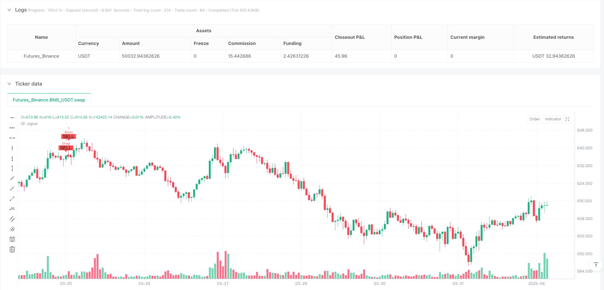
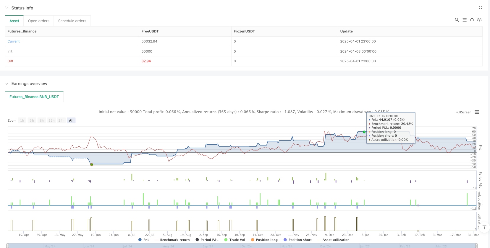

> Name

Multi-Indicator-Trend-Momentum-Fusion-Strategy-RSI-MACD-Dual-Supertrend-Tracking-System
> Author

ianzeng123

> Strategy Description





[trans]

#### Overview
This strategy is a comprehensive trading system that integrates multiple technical indicators. It mainly combines the relative strength index (RSI), the moving average convergence and divergence indicator (MACD), the dual supertrend indicator (Supertrend) and the risk management mechanism based on the true fluctuation range (ATR). Through multi-level indicator confirmation, this strategy builds a trading framework that can both track trends and capture momentum conversions, effectively filtering market noise and reducing the risk of false signals. The core logic is to first confirm the market's dominant trend through double supertrends (factors 2 and 7), then confirm the trend direction through MACD crossover and momentum changes, and finally use the RSI overbought/oversold area to find the optimal entry point, while using ATR-based stop loss, capital preservation and trailing stop loss mechanisms for all-round risk control.
#### Strategy Principle
The strategy's working mechanism is based on four key components: trend identification, momentum confirmation, entry conditions and risk management.
1. **Trend Identification**: Use dual supertrend indicators (factors 2 and 7) as trend filters. Supertrend indicators are designed to track the dominant market trend and filter out market noise. By using two supertrend indicators with different parameters, the strategy requires both indicators to confirm the same direction at the same time, greatly improving the reliability of trend signals.
2. **Momentum Confirmation**: Use MACD(5,13,9) to detect early trend reversals. The strategy requires the intersection of the MACD line and the signal line as the first level of confirmation, and requires the continuous trend of MACD (up or down) as the second level of confirmation, ensuring that real momentum changes are captured rather than short-term fluctuations.
3. **Admission Conditions**:
   - Long conditions: RSI is below 35 (oversold area), MACD line crosses the signal line and continues to rise, both super-trend indicators show an upward trend (direction1 and direction2 are both 1)
   - Short selling conditions: RSI is above 65 (overbought area), MACD line crosses the signal line and continues to decline, both super-trend indicators show a downward trend (direction1 and direction2 are both -1)
4. **Risk Management**:
   - Stop loss setting: Dynamic stop loss based on ATR, located below the entry price (long) or above (short) 1 times ATR
   - Trailing stop loss to the breakeven point: When the price moves 1 times ATR in a favorable direction, the stop loss moves to the entry price
   - Profit target: Set 2.5 times ATR above (long) or below (short) the entry price
   - Trailing Stop: Use a trailing stop of 1x ATR and adjust it as the price moves in a favorable direction to lock in profits.
The core code of the strategy implements a custom super-trend function, which is used to calculate the super-trend level and direction, and is combined with the dynamic calculation of RSI and MACD to form a complete signal system. When executing a trade, the strategy simultaneously sets stop loss, profit target and trailing stop loss to achieve comprehensive risk management.
#### Strategic Advantages
1. **Multi-layer confirmation mechanism**: By requiring multiple indicators to be confirmed simultaneously, false signals are significantly reduced. Dual supertrends, MACD trend confirmation and RSI overbought/oversold filters work together to ensure only high-probability opportunities to enter the market.
2. **Adaptive Risk Management**: All stop loss and profit targets are dynamically adjusted based on ATR, allowing the strategy to automatically adapt to different market environments and volatility. Automatically widen the stop loss distance when volatility increases and narrow the stop loss distance when volatility decreases.
3. **Balanced risk-reward ratio**: The strategy sets a profit target of 2.5 times ATR and a stop loss of 1 times ATR, providing a basic risk-return ratio of 2.5:1, which complies with professional risk management standards.
4. **Multi-market adaptability**: Since the indicator combination targets price trends and fluctuation characteristics rather than specific market patterns, this strategy can be applied to a variety of trading varieties and time periods.
5. **Continuous Profit Locking**: Through the ATR trailing stop loss mechanism, the strategy can gradually lock in realized profits while keeping transactions open to capture the continuation of the trend, balancing the risks of premature profits and over-holding.
6. **Avoid over-trading**: Strict entry conditions can effectively avoid over-trading in sideways markets or when fluctuations are unclear, maintain efficient use of funds and reduce transaction costs.
#### Strategy Risk
1. **Trend Reversal Risk**: Despite multiple layers of confirmation, in a rapid market reversal or extreme volatility environment, the strategy may not be able to exit existing positions in a timely manner. The solution is to add market environment filters to reduce position sizes or suspend trading when volatility exceeds historical thresholds.
2. **Parameter optimization risk**: Strategy performance is highly dependent on the parameter settings of RSI, MACD and super trend. Over-optimization can lead to reduced curve fit and future performance. It is recommended to use rolling window testing and robustness testing under different market environments to verify parameter reliability.
3. **Liquidity Risk**: In low-liquidity markets, ATR-based stop loss may lead to increased slippage or unsatisfactory execution prices. The solution is to appropriately extend the stop loss distance or add additional buffer in low liquidity markets.
4. **Continuous Loss Risk**: Even with strict entry conditions, the market may continuously generate false signals in certain periods, resulting in a series of small losses. This problem can be mitigated by implementing a maximum consecutive loss limit and dynamically adjusting position sizing.
5. **Over-Reliance on Technical Indicators**: This strategy is entirely based on technical indicators and ignores fundamental and market sentiment factors. Purely technical methods may fail during major news events or changes in market structure. It is recommended to integrate a fundamental filter or a calendar of important events to avoid this type of risk.
#### Strategy optimization direction
1. **Indicator Parameter Adaptation**: The current strategy uses indicators with fixed parameters. A dynamic parameter adjustment mechanism based on market volatility or trend strength can be implemented, such as increasing the overbought and oversold thresholds of RSI when volatility increases, and tightening overtrend parameters when trend strength weakens. This will significantly improve the strategy's adaptability to different market cycles.
2. **Market pattern classification**: Add a market pattern recognition module to distinguish trend markets, oscillating markets and transitional markets, and apply different parameter sets and risk management rules for different market states. For example, the entry conditions are relaxed in clear trending markets and the filtering mechanism is strengthened in volatile markets.
3. **Time filter**: Introduce a time filtering mechanism based on market activity to avoid known low liquidity periods and high volatility opening/closing periods to improve signal quality and execution efficiency.
4. **Dynamic Risk Adjustment**: Realize dynamic risk adjustment based on account performance and continuous profit/loss status, reduce position size after continuous losses, gradually increase risk exposure after continuous profits, and optimize fund management efficiency.
5. **Multiple indicator weight system**: Establish an indicator weight scoring system to allocate weights to different indicators according to different market environments to improve decision-making accuracy. For example, increase the weight of RSI in a high-volatility environment and increase the weight of super-trend indicators in strong trending markets.
6. **Volume and price combination**: Integrate the trading volume confirmation mechanism, requiring price breakthroughs to be accompanied by an increase in trading volume, further improving signal reliability and reducing the risk of false breakthroughs.
#### Summarize
The multi-indicator trend momentum fusion strategy builds a balanced and efficient trading system by integrating RSI, MACD and dual super-trend indicators. The key advantage of this strategy is its multi-level confirmation mechanism and volatility-based adaptive risk management system, which effectively reduces false signals and provides reasonable risk-return characteristics. Through strict entry conditions and dynamic exit management, strategies are able to balance the opportunity to capture trends with the need to control downside risk.
This strategy is best suited for medium to long-term traders, especially those investors who focus on risk management and seek high-probability trades in clear trends. By implementing the suggested optimization directions, especially indicator parameter adaptation and market pattern classification, the robustness and adaptability of the strategy can be further improved, allowing it to remain competitive in various market environments. Ultimately, this strategy represents a systematic and disciplined trading approach that provides traders with a sustainable profit framework through an intelligent combination of technical indicators and strict risk control. ||
#### Overview

This strategy is a comprehensive trading system that integrates multiple technical indicators, primarily combining the Relative Strength Index (RSI), Moving Average Convergence Divergence (MACD), dual Supertrend indicators, and an Average True Range (ATR)-based risk management mechanism. Through multi-level indicator confirmation, the strategy builds a trading framework that both tracks trends and captures momentum shifts, effectively filtering market noise and reducing the risk of false signals. The core logic is to first confirm the market's dominant trend using dual Supertrends (factors 2 and 7), then verify trend direction through MACD crossovers and momentum changes, and finally identify optimal entry points using RSI overbought/oversold zones, while implementing comprehensive risk control through ATR-based stop-loss, breakeven, and trailing stop mechanisms.

#### Strategy Principles

The operation mechanism of this strategy is based on four key components: trend identification, momentum confirmation, entry conditions, and risk management.

1. **Trend Identification**: Employs dual Supertrend indicators (factors 2 and 7) as trend filters. The Supertrend indicator is designed to track the market's dominant trend and filter out market noise. By using two Supertrend indicators with different parameters, the strategy requires both indicators to simultaneously confirm the same direction, greatly enhancing the reliability of trend signals.

2. **Momentum Confirmation**: Uses MACD (5,13,9) to detect early trend reversals. The strategy requires the crossover of the MACD line and signal line as the first layer of confirmation, and demands continuous MACD movement (rising or falling) as the second layer of confirmation, ensuring the capture of genuine momentum shifts rather than short-term fluctuations.

3. **Entry Conditions**:
   - Long Conditions: RSI below 35 (oversold zone), MACD line crosses above the signal line and continues to rise, both Supertrend indicators show an uptrend (direction1 and direction2 both equal 1)
   - Short Conditions: RSI above 65 (overbought zone), MACD line crosses below the signal line and continues to fall, both Supertrend indicators show a downtrend (direction1 and direction2 both equal -1)

4. **Risk Management**:
   - Stop Loss Setting: Dynamic stop loss based on ATR, positioned 1x ATR below (for longs) or above (for shorts) the entry price
   - Moving Stop Loss to Breakeven: When price moves 1x ATR in the favorable direction, stop loss is moved to the entry price
   - Profit Target: Set at 2.5x ATR above (for longs) or below (for shorts) the entry price
   - Trailing Stop: Uses a 1x ATR trailing stop that adjusts as price moves in the favorable direction, locking in profits

The core code implements a custom Supertrend function for calculating Supertrend levels and direction, and combines it with dynamic calculations of RSI and MACD to form a complete signal system. When executing trades, the strategy simultaneously sets stop-loss, profit targets, and trailing stops to achieve comprehensive risk management.

#### Strategy Advantages

1. **Multi-layer Confirmation Mechanism**: By requiring multiple indicators to confirm simultaneously, false signals are significantly reduced. The dual Supertrend, MACD trend confirmation, and RSI overbought/oversold filters work together to ensure entries only occur at high-probability moments.

2. **Adaptive Risk Management**: All stop-losses and profit targets are dynamically adjusted based on ATR, allowing the strategy to automatically adapt to different market environments and volatility. Stop distances automatically widen when volatility increases and narrow when volatility decreases.

3. **Balanced Risk-Reward Ratio**: The strategy sets a 2.5x ATR profit target and a 1x ATR stop loss, providing a 2.5:1 basic risk-reward ratio, which complies with professional risk management standards.

4. **Multi-market Adaptability**: Since the indicator combination targets price movements and volatility characteristics rather than specific market patterns, this strategy can be applied to various trading instruments and timeframes.

5. **Continuous Profit Locking**: Through the ATR trailing stop mechanism, the strategy can gradually lock in realized profits while keeping trades open to capture trend continuation, balancing the risks of taking profits too early and holding positions too long.

6. **Avoidance of Overtrading**: Strict entry conditions effectively prevent overtrading in ranging markets or during unclear volatility, maintaining efficient capital utilization and reducing trading costs.

#### Strategy Risks

1. **Trend Reversal Risk**: Despite multiple confirmation layers, in rapidly reversing markets or extreme volatility environments, the strategy may not exit existing positions in a timely manner. The solution is to add market environment filters that reduce position size or pause trading when volatility exceeds historical thresholds.

2. **Parameter Optimization Risk**: Strategy performance heavily depends on the parameter settings for RSI, MACD, and Supertrend. Excessive optimization may lead to curve-fitting and declining future performance. Rolling window testing and robustness testing across different market environments are recommended to verify parameter reliability.

3. **Liquidity Risk**: In low-liquidity markets, ATR-based stops may result in increased slippage or unfavorable execution prices. The solution is to appropriately widen stop distances or add additional buffers in low-liquidity markets.

4. **Consecutive Loss Risk**: Even with strict entry conditions, the market may generate consecutive false signals during certain periods, leading to a series of small losses. This can be mitigated by implementing maximum consecutive loss limits and dynamically adjusting position sizes.

5. **Over-reliance on Technical Indicators**: This strategy is entirely based on technical indicators, ignoring fundamental and market sentiment factors. During major news events or market structure changes, purely technical approaches may fail. It is advisable to integrate fundamental filters or important event calendars to mitigate such risks.

#### Strategy Optimization Directions

1. **Indicator Parameter Adaptation**: The current strategy uses fixed parameters for indicators. A dynamic parameter adjustment mechanism based on market volatility or trend strength could be implemented, such as increasing RSI overbought/oversold thresholds when volatility increases, or tightening Supertrend parameters when trend strength weakens. This would significantly enhance the strategy's adaptability to different market cycles.

2. **Market Pattern Classification**: Add a market pattern recognition module to distinguish between trending markets, oscillating markets, and transitional markets, applying different parameter sets and risk management rules for different market states. For example, relax entry conditions in clear trending markets and strengthen filtering mechanisms in oscillating markets.

3. **Time Filters**: Introduce time filtering mechanisms based on market activity to avoid known low-liquidity periods and high-volatility opening/closing periods, improving signal quality and execution efficiency.

4. **Dynamic Risk Adjustment**: Implement dynamic risk adjustment based on account performance and consecutive profit/loss status, reducing position size after consecutive losses and gradually increasing risk exposure after consecutive wins to optimize capital management efficiency.

5. **Multi-indicator Weighting System**: Establish an indicator weighting scoring system that assigns weights to different indicators based on various market environments, improving decision accuracy. For example, increase RSI weighting in high-volatility environments and enhance Supertrend indicator weighting in strong trending markets.

6. **Volume-Price Integration**: Integrate volume confirmation mechanisms, requiring price breakouts to be accompanied by increased trading volume, further improving signal reliability and reducing false breakout risks.

#### Summary

The Multi-Indicator Trend-Momentum Fusion Strategy integrates RSI, MACD, and dual Supertrend indicators to build a balanced and efficient trading system. The key advantages of this strategy lie in its multi-level confirmation mechanism and volatility-based adaptive risk management system, effectively reducing false signals and providing reasonable risk-reward characteristics. Through strict entry conditions and dynamic exit management, the strategy balances the opportunity to capture trends with the need to control downside risk.

This strategy is most suitable for medium to long-term traders, especially those who prioritize risk management and seek high-probability trades in clear trends. By implementing the suggested optimization directions, particularly indicator parameter adaptation and market pattern classification, the strategy's robustness and adaptability can be further enhanced, maintaining its competitiveness across various market environments. Ultimately, this strategy represents a systematic, disciplined trading approach that provides traders with a sustainable profit framework through intelligent combination of technical indicators and strict risk control.[/trans]


> Source (PineScript)

``` pinescript
/*backtest
start: 2024-04-03 00:00:00
end: 2025-04-02 00:00:00
period: 1h
basePeriod: 1h
exchanges: [{"eid":"Futures_Binance","currency":"BNB_USDT"}]
*/

//@version=6
strategy("Enhanced RSI-MACD-Supertrend Strategy", overlay=true)

// ? User Inputs
rsiLength = input.int(14, title="RSI Length")
macdFast = input.int(5, title="MACD Fast Length")       // Updated
macdSlow = input.int(13, title="MACD Slow Length")      // Updated
macdSignal = input.int(9, title="MACD Signal Length")   // Updated
atrLength = input.int(14, title="ATR Length")
atrSLMultiplier = input.float(1, title="ATR Multiplier for Stop Loss")  // Updated
atrBETrigger = input.float(1, title="Move SL to Breakeven at X ATR")    // Updated
atrTPMultiplier = input.float(2.5, title="Take Profit at X ATR")  
atrTrailMultiplier = input.float(1, title="Trailing Stop ATR Multiplier") // Updated
supertrendFactor1 = input.float(2, title="Supertrend Factor 1")  // Updated
supertrendFactor2 = input.float(7, title="Supertrend Factor 2")  // Updated
supertrendLength = input.int(9, title="Supertrend Length")  

// ? Indicator Calculations
rsi = ta.rsi(close, rsiLength)
[macdLine, signalLine, _] = ta.macd(close, macdFast, macdSlow, macdSignal)
atr = ta.atr(atrLength)

// ? Custom Supertrend Function
supertrend(_factor, _length) =>
    atr_ = ta.atr(_length)
    src = hl2
    up = src - _factor * atr_
    down = src + _factor * atr_
    var trend = 0.0
    trend := na(trend[1]) ? up : (trend[1] > up ? math.max(up, trend[1]) : math.min(down, trend[1]))
    direction = trend == up ? 1 : -1
    [trend, direction]

// ? Apply Dual Supertrend
[supertrend1, direction1] = supertrend(supertrendFactor1, supertrendLength)
[supertrend2, direction2] = supertrend(supertrendFactor2, supertrendLength)

// ? MACD Momentum Confirmation
isMacdRising = macdLine > macdLine[1] and macdLine[1] > macdLine[2]
isMacdFalling = macdLine < macdLine[1] and macdLine[1] < macdLine[2]

// ? Entry Conditions (Both Supertrends Must Confirm)
longCondition = rsi < 35 and macdLine > signalLine and isMacdRising and direction1 == 1 and direction2 == 1
shortCondition = rsi > 65 and macdLine < signalLine and isMacdFalling and direction1 == -1 and direction2 == -1

// ? ATR-Based Exit Conditions
longStopLoss = close - (atrSLMultiplier * atr)
shortStopLoss = close + (atrSLMultiplier * atr)

longTakeProfit = close + (atrTPMultiplier * atr)
shortTakeProfit = close - (atrTPMultiplier * atr)

// Move SL to Breakeven
longBreakEven = close + (atrBETrigger * atr)
shortBreakEven = close - (atrBETrigger * atr)

// Trailing Stop Loss (Convert to Points)
longTrailingStop = atrTrailMultiplier * atr
shortTrailingStop = atrTrailMultiplier * atr

// ? Execute Trades
if longCondition
    strategy.entry("Long", strategy.long)
if shortCondition
    strategy.entry("Short", strategy.short)

strategy.exit("Long Exit", from_entry="Long", stop=longStopLoss, limit=longTakeProfit, trail_points=longTrailingStop)
strategy.exit("Short Exit", from_entry="Short", stop=shortStopLoss, limit=shortTakeProfit, trail_points=shortTrailingStop)

// ? Plot Buy/Sell Signals
plotshape(series=longCondition, location=location.belowbar, color=color.green, style=shape.labelup, title="BUY", text="BUY")
plotshape(series=shortCondition, location=location.abovebar, color=color.red, style=shape.labeldown, title="SELL", text="SELL")

// ? Alerts for Automation
alertcondition(longCondition, title="BUY Alert", message="BUY Signal for Delta Exchange")
alertcondition(shortCondition, title="SELL Alert", message="SELL Signal for Delta Exchange")

```

> Detail

https://www.fmz.com/strategy/489294

> Last Modified

2025-04-03 11:03:20
